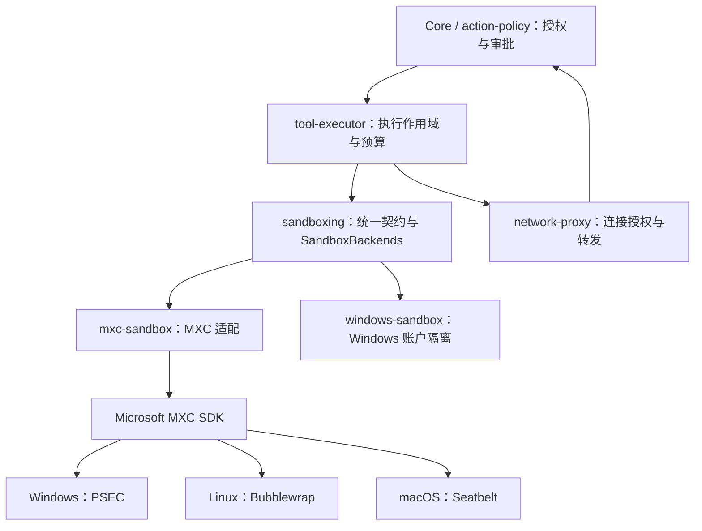

# 沙箱架构

Zeta 的 `sandboxing` 拥有统一权限契约和执行前的后端选择。`mxc-sandbox` 是 Microsoft MXC 的薄适配器，平台实现可以独立替换。MXC 主后端与 Windows 回退的具体方案见 [`zeta-rs/docs/mxc-sandbox-windows-fallback.md`](../zeta-rs/docs/mxc-sandbox-windows-fallback.md)。

## 调用与所有权

产品在 Windows 上注册 MXC 和独立的 `windows-sandbox` 账户候选，其他平台保留 MXC。账户后端已接入安装身份、授权、运行器和打包，并在本机 23H2 通过 PowerShell、目录、网络及进程回收用例。它实施显式选择的 WindowsAccount 模型，不提供 Strict 所要求的宿主整体只读保证。

| Owner | 职责 |
| --- | --- |
| `action-policy` / Core | 操作及网络授权、审查、持久审批、重试决定 |
| `sandboxing` | 策略、目录范围、候选选择、准备与进程契约 |
| `tool-executor` | 输入输出、环境、预算、超时、取消和代理作用域 |
| `network-proxy` | 检查真实连接目标，执行授权结果并转发 |
| `mxc-sandbox` | 请求、错误和进程句柄的机械转换 |
| 具体后端 | 系统能力检查、进程创建、隔离与清理 |
| App Server 装配 | 注册候选后端；不维护 Windows 版本或令牌分支 |

后端 crate 依赖统一契约，统一契约不依赖 MXC 或 Codex。平台 crate 用于能力和依赖隔离，不按转发层数拆 crate。
授权语义见 [permissions.md](permissions.md)，审查语义见 [auto-review.md](auto-review.md)。

## 选择与执行

1. Executor 为已授权请求建立代理，Manager 验证并解析工作目录。
2. `SandboxBackends` 按注册顺序准备候选；每个候选收到完整且相同的策略和目录范围。
3. 只有 `UnsupportedPolicy` 表示能力不支持，可以考虑下一候选。此结果必须发生在命令启动和宿主配置变更之前。
4. 无效请求、运行时损坏、读取错误和其他运行故障直接返回，不能用换后端掩盖。
5. 准备成功后固定后端。任何启动错误都不触发重新选择或自动重跑。
6. 被选中的后端随 `PreparedCommand` 移交给 `ProcessHandle`，由它解释该进程的拒绝证据；不保存全局“当前后端”。
7. 结束时终止并等待进程树，排空输出，再释放隔离资源和代理。

注册的候选必须完整实施请求。准备出普通进程不能满足受限请求；只有显式 `FullAccess + Allowed` 且单目录、无隐藏范围时使用普通进程。
当前可用性检查不等于生产安全资格，发布前仍需完成承诺支持的策略与平台验收。

## 权限契约

- `ReadOnly` 将授权目录设为只读；`DirectoryWrite` 开放授予的可写目录，并保护已存在的目录元数据。
- `FileSystemIsolation::Strict` 另要求授权目录外不可写，是构造策略的默认值；`WindowsAccount` 显式接受账户、ACL 和有预算限制的审计模型。账户后端拒绝 Strict，不在准备阶段改变策略。
- `FullAccess` 扩大文件权限，但不清除明确的隐藏、只读或网络要求。
- `Denied` 禁止外部网络；`Managed` 只允许通过本次执行的代理；`Allowed` 允许网络。
- `SandboxScope` 隐藏共享存储并开放本次 Grant，拒绝重复、重叠或跨 Environment 的目录集合。
- `HostAclChanges::Scoped` 只授权 Grant 与隐藏目录内的 ACL 配置；`ScopedWithTraversal` 另允许必要祖先目录的非继承属性查询与遍历权限（0xa0），不允许枚举目录或读取其文件内容。Windows 本地工具显式使用后者。
- 祖先属性 ACL 的写入和恢复只作用于当前目录，保留原始继承标记；不使用会重算整个子树的写回接口。
- 账户、服务、持久网络规则与设备 ACL 的安装授权必须独立处理，不能隐含在普通命令准备中。
- 子进程输出只是可能已有副作用的诊断，不能据此声称用户代码没有执行。

## MXC 接入边界

- 保留固定 revision 的 SDK、独立 ACL 授权、文件对象身份检查、目录例外及进程生命周期补丁。
- Windows 的 Zeta 请求只走能够实施完整策略的 PSEC；缺少能力返回 `UnsupportedPolicy`。不会在 MXC 内转入账户实现、AppContainer/DACL 或普通进程。
- 按运行时能力检查 PSEC，不能用“24H2 以上”代替检查。
- Linux 与 macOS 继续通过同一适配器接入 Bubblewrap 和 Seatbelt。
- 本轮自写 `mxc-user` 账户运行器已退出源码、编译、打包、签名和 CI 配置；不再安装它。

补丁来源与校验见 [MXC 依赖](../zeta-rs/vendor/mxc/README.md)。原型源码与校验清单保存在本机 `.build/acceptance/mxc-local/prototype-source`，历史测试与系统清理结果保留在 [Windows 验收手册](windows-sandbox-acceptance-runbook.md)。

## Windows 候选评估

Codex 的 Windows 实现是候选基线，不能未经核对直接注册：

- 固定的账户名、服务名、管道名和配置位置需要独立于用户现有 Codex 安装。
- 当前 crate 依赖 Codex 协议、网络代理、PTY 工具及遥测；适配必须限制依赖和类型的传播范围。
- 自动安装、刷新 ACL、重试及较弱模式切换必须符合 Zeta 的独立授权和不自动重跑契约。
- NUL 设备权限、可写目录扫描、隐藏父目录下的授权例外、PowerShell/PTY 和异常恢复需要同一套端到端测试。

已核对本地 Codex `da20788df913189878ebca7f4963d8a363ee6bf2` 的实际调用链。接入范围包括执行器、安装程序和代理；仅复制命令运行器不能满足 Zeta 的契约。

| Codex 源码 | 已确认的行为 | Zeta 接入要求 |
| --- | --- | --- |
| `windows-sandbox-rs/src/setup.rs`、`provisioning_protocol.rs`、`wfp.rs` | 固定账户、管道和 WFP 对象身份 | 安装身份统一生成并记录，不能复用 Codex 的账户、管道或 GUID；卸载只处理本安装记录的对象 |
| `windows-sandbox-service/src/package_identity.rs`、`ipc/authentication.rs` | 校验客户端包身份、服务包身份及请求者用户 SID | 发布安装提供 Zeta 自己的包身份与调用方校验；开发包不能借用 Codex 身份或关闭校验 |
| `windows-sandbox-rs/src/identity.rs` | 请求账户时可能启动提升权限的安装；每次执行前刷新 ACL | 安装、修复与命令执行分开；准备阶段只读检查；账户或规则失效时返回安装错误 |
| `windows-sandbox-rs/src/elevated/runner_client.rs` | 部分账户、权限错误触发刷新与一次重试 | 启动失败原样返回，由上层决定是否重新授权；适配器不自动重跑 |
| `windows-sandbox-rs/src/token.rs`、`audit.rs`、`acl.rs` | 限制 SID 包含账户、登录 SID 和 Everyone；执行前扫描可写路径，并可能修改 NUL 权限 | 不能只移植令牌来宣称宿主只读；设备与 Grant 外的变更需要独立安装授权，扫描遗漏与读取失败不能视为符合策略 |
| `windows-sandbox-rs/src/deny_read_state.rs` | 部分拒绝读取 ACL 跨命令保留，再按主体更新 | 命令拥有自己的 ACL 变更记录，进程树回收后恢复；安装状态与执行状态分别恢复 |
| `network-proxy/src/windows_proxy_ingress.rs`、`windows_tcp_attribution.rs` | 由 TCP 连接查找进程的限制 SID，再选择对应代理路由 | 代理、子进程令牌与执行身份绑定；覆盖并发任务互用代理、连接身份不可读取及无路由时的拒绝 |

这里的宿主安装授权与 `HostAclChanges::Scoped` 不同：后者仍只覆盖 Grant 与隐藏目录，不能批准账户创建、持久网络规则、NUL 或其他宿主路径的修改。接入后也必须保留这一区别。

独立实现位于 [`windows-sandbox`](../zeta-rs/windows-sandbox/README.md)，不复用 Codex 的账户、服务、管道或包身份。它从冻结的 InstallContext 获取 Zeta helper，使用路径和文件摘要绑定已授权的安装；安装和修复不进入普通执行路径。

2026-09-11 实机追踪确认：移除限制 SID 中的 Everyone 后，Windows PowerShell 的 CLR 调用 `NtCreatePrivateNamespace` 返回 `STATUS_ACCESS_DENIED`。该调用的边界描述符包含 Everyone。增加 `BaseNamedObjects` 目录权限不能替代这项检查；相关试验权限已撤销，产品安装清单不保留这些目录授权。

用户随后明确采用 Codex 的 Windows 安全模型。令牌保留文件 SID、登录 SID 和 Everyone；可信登录进程使用默认登录桌面，退出后才恢复私有桌面上的受限命令。普通执行不再配置设备或命名对象目录权限。

WindowsAccount 在执行前检查工作目录、Grant、临时目录、用户目录、PATH 和系统目录的候选路径及直接子项。每目录最多 1000 项，总计最多 50000 项、2 秒；重解析路径不纳入这项审计，读取失败和截断会报告。审计发现授权 ACL 范围外的 Everyone 可写路径时，拒绝启动并列出需要另行处理的路径；范围内的只读和隐藏项使用明确拒绝 ACE。该扫描不证明整个宿主只读。

每次执行独占账户租约，ACL 日志位于安装根下按账户隔离的私有目录，不放进子进程可写的运行目录。结束后先回收进程树，再恢复 ACL；未完成的执行阻止账户复用，显式删除安装时恢复遗留日志。FullAccess 与受限网络的组合仍不由此账户后端提供。

## 当前验证范围

| 项目 | 状态 |
| --- | --- |
| 执行前选择、故障停止、启动不重跑、每进程拒绝判定 | 有本机单测与 Executor 调用链回归 |
| macOS MXC 执行、目录与代理隔离 | 保留真实进程回归入口 |
| Linux MXC 受管网络 | 保留实机入口；依赖相应内核与隔离工具 |
| Windows MXC PSEC | 当前 23H2 本机不具备相应能力，不能据此宣布端到端通过 |
| 已退出的账户原型 | 曾完成 2 项完整用例、4 项失败；测试账户、网络对象和运行时目录已清理 |
| 独立 Windows 账户后端 | 23H2 本机 21 项单测与 9 项完整执行用例通过 |
| IPv6 断网、双账户并发 | 实机通过 |
| 崩溃恢复 | 已验证准备期间进程被终止后的日志恢复；运行中全部崩溃组合未穷尽 |
| WSL、其他 Windows 系统 | 本轮未验证 |

固定 MXC 版本仍为早期预览。统一接口、编译和部分测试不能替代系统隔离验收。
