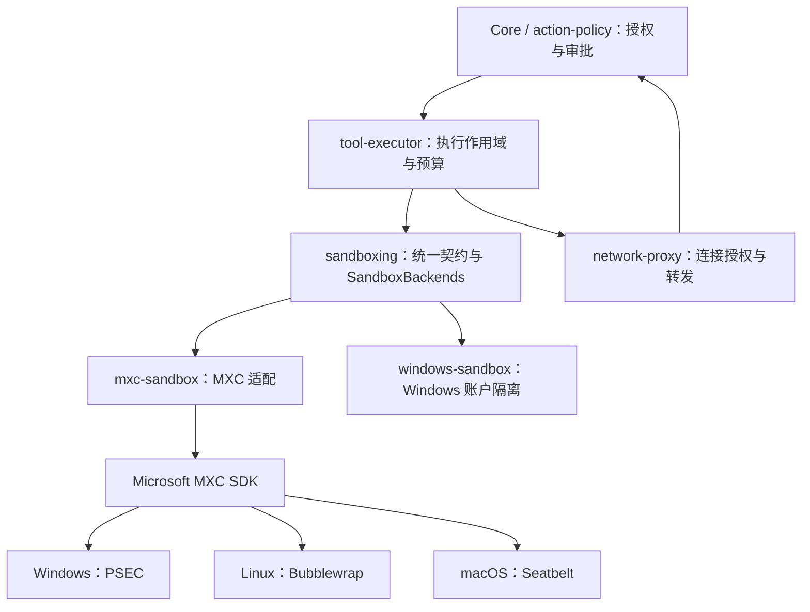

# 沙箱架构

Ash 的 `sandboxing` 拥有统一权限契约和执行前的后端选择。请求先确定最低隔离要求，再选择能实施该请求的后端；选择过程不得改变隔离模型。目标覆盖 Codex 的本地命令、交互终端、持续执行会话、文件权限及受管网络能力。本文维护长期契约与实现边界，MXC 文档依据、平台差异、实施与验收见 [Codex 本地执行对齐方案](../ash-rs/docs/mxc-sandbox-windows-fallback.md)。

## 调用与所有权

产品在 Windows 上按 `mxc`、`windows` 顺序注册两个候选；Linux/macOS 只注册 MXC。Windows 本地工具目前选择 `WindowsAccount` 作为最低隔离要求，能力足够时仍优先使用 PSEC。账户后端已接入安装身份、授权、运行器和打包，并取得本机 23H2 的部分验收证据；它不能满足 `Strict`，完整平台及组合验收尚未完成。

| Owner | 职责 |
| --- | --- |
| `action-policy` / Core | 操作及网络授权、审查、持久审批、重试决定 |
| `sandboxing` | 策略、目录范围、候选选择、准备与进程契约 |
| `tool-executor` | 命令及持续执行会话、输入输出、环境、预算、超时、取消和代理作用域 |
| `utils/pty` | PTY、管道、尺寸、信号与已有进程驱动；不负责授权和后端选择 |
| `network-proxy` | 检查真实连接目标，执行授权结果并转发 |
| `mxc-sandbox` | 请求、错误和进程句柄的机械转换 |
| 具体后端 | 系统能力检查、进程创建、隔离与清理 |
| App Server 装配 | 确定产品的最低隔离要求并注册候选；不维护系统版本或令牌分支 |

后端 crate 依赖统一契约，统一契约不依赖 MXC 或 Codex。平台 crate 用于能力和依赖隔离，不按转发层数拆 crate。`windows-sandbox` 当前还直接使用固定 MXC 版本的 `wxc_common` 策略类型与 ACL 日志；这项共享依赖保留在后端内部，其变更必须同时验证两个消费者，不能宣称两个后端在实现依赖上完全独立。
授权语义见 [permissions.md](permissions.md)，审查语义见 [auto-review.md](auto-review.md)。

## 选择与执行

以下是执行契约。当前 SDK 的能力探测仍存在错误分类缺口，修复要求和完成状态见 [能力检查与错误分类](../ash-rs/docs/mxc-sandbox-windows-fallback.md#能力检查与错误分类)。

1. Executor 为已授权请求建立代理，Manager 验证并解析工作目录。
2. `SandboxBackends` 按注册顺序准备候选；每个候选收到完整且相同的策略和目录范围。
3. 只有明确的能力或策略不支持可以产生 `UnsupportedPolicy` 并考虑下一候选。此结果必须发生在命令启动和宿主配置变更之前；下一候选仍须满足同一最低隔离要求。
4. 无效请求、运行时损坏、读取错误和其他运行故障直接返回，不能用换后端掩盖。
5. 准备成功后固定后端。任何启动错误都不触发重新选择或自动重跑。
6. 被选中的后端随 `PreparedCommand` 移交给 `ProcessHandle`，由它解释该进程的拒绝证据；不保存全局“当前后端”。
7. 结束时终止并等待进程树，排空输出，再释放隔离资源和代理。

注册的候选必须完整实施请求。准备出普通进程不能满足受限请求；只有显式 `FullAccess + Allowed` 且单目录、无隐藏范围时使用普通进程。
能力检查可以创建并释放临时 PSEC 环境，但不能启动用户命令、配置账户或修改持久 ACL/WFP 规则。失败和清理错误都需要保留。发布资格与运行时能力是两项独立要求，见方案的 [发布条件](../ash-rs/docs/mxc-sandbox-windows-fallback.md#发布条件)。

## 权限契约

以下第一组规则描述现有类型；后续目标契约尚未完整进入实现，不应从文档中的字段概念推断代码已支持。

- `ReadOnly` 将授权目录设为只读；`DirectoryWrite` 开放授予的可写目录，并保护已存在的目录元数据。
- `FileSystemIsolation::Strict` 另要求授权目录外不可写，是构造策略的默认值；`WindowsAccount` 接受账户、ACL 和有预算限制的审计模型。两者表示请求接受的最低保证，不是指定后端的开关。
- 账户后端拒绝 `Strict`，也不提供 `FullAccess` 与受限网络的组合。缺少 PSEC 时不能把这些请求改成 `WindowsAccount` 或普通进程。
- Windows 本地工具在 `local_tools.rs::local_isolation()` 中明确选择 `WindowsAccount`；Linux/macOS 选择 `Strict`。这是产品在授权请求形成前确定的规则，不是在探测失败后修改策略，也不意味着三平台具有相同强度的宿主写隔离。
- `FullAccess` 扩大文件权限，但不清除明确的隐藏、只读或网络要求。
- `Denied` 禁止连接外部与宿主 IP 网络，包括宿主回环，并阻止来自这些网络的入站；`Managed` 只开放本次执行的代理端点，代理再检查真实目标；`Allowed` 允许网络。具体系统机制和验证范围见平台方案。
- `SandboxScope` 隐藏共享存储并开放本次 Grant，拒绝重复、重叠或跨 Environment 的目录集合。
- `HostAclChanges::Scoped` 只授权 Grant 与隐藏目录内的 ACL 配置；`ScopedWithTraversal` 另允许必要祖先目录的非继承属性查询与遍历权限（0xa0），不允许枚举目录或读取其文件内容。Windows 本地工具显式使用后者。
- 祖先属性 ACL 的写入和恢复只作用于当前目录，保留原始继承标记；不使用会重算整个子树的写回接口。
- 账户、服务、持久网络规则与设备 ACL 的安装授权必须独立处理，不能隐含在普通命令准备中。
- 子进程输出只是可能已有副作用的诊断，不能据此声称用户代码没有执行。

### 文件权限目标

- 保留目录 Grant 的来源与 Environment 归属，在同一授权请求中补充单文件/目录的读、写、拒绝规则、可读基线及路径例外。当前 `SandboxScope` 仅有目录 Grant 和隐藏目录，不能直接表达工作区内任意 `.env` 拒绝规则。
- 宿主可读与最小工具链可读分别表达。当前 `set_host_filesystem(ReadOnly)` 打开宿主读取基线，不能把它称为 MXC 的默认最小可读集合。最小模式只加入实际工具链、运行库及本次授权的数据路径。
- 策略统一解析路径、大小写、符号链接、文件对象身份和规则交叠。同一路径的明确拒绝优先；更具体路径例外必须保留授权来源，并检查后端是否能够实施，不由各后端自行解释冲突。
- 隐藏共享存储中重新开放已授权工作目录，是存储隔离范围的例外；不能机械转换为 MXC 的“拒绝整个父目录，再允许子目录”。明确 `deniedPaths` 在部分后端最终覆盖允许规则，必须保留现有例外补丁或生成等价策略并验证。
- 拒绝模式匹配需要区分执行前快照与执行期间新建的匹配文件。有限遍历不能被描述成持续匹配保证；后端不支持请求要求时明确拒绝，不能遗漏规则后启动。
- 文件读取、搜索和补丁工具也必须实施同一授权结果，通过现有 `file-access` 校验入口落地；不能只约束 shell。`file-access` 不反向依赖 `sandboxing` 或供应商类型。

### 网络与本地进程通信目标

- 保留 `Denied`、`Managed`、`Allowed` 作为产品的常用选择；完整请求分别表达外连、入站、宿主回环及本地进程通信。后端能力耦合不能成为修改授权的理由。
- `Managed` 的目标授权由 Ash 代理实施。MXC 负责使代理可达并限制其他出口，不会替外部代理安装域名规则，也不会把任意 TCP/UDP 客户端透明转换成 HTTP 代理客户端。
- Windows PSEC 的代理身份、私有网络双向能力与 Ash 默认禁止入站存在接入约束；当前 Windows 补丁生成的回环 IP 允许规则不等于 MXC 的代理模式。具体处理与未完成项见 [Windows 代理接入](../ash-rs/docs/mxc-sandbox-windows-fallback.md#windows-代理接入)。
- Unix socket 是独立的 IPC 权限，不再用 IP 网络是否受限决定全部禁止。目标是在本次执行的私有临时目录中允许构建工具需要的 socket，并显式拒绝 Docker、SSH/GPG agent 及其他任务的 socket；不得通过授予整个共享临时目录来取得兼容性。
- macOS 没有私有 TCP 回环；Seatbelt 的宿主回环限制也会影响同一任务的 TCP 服务。后台开发服务器须带明确监听授权，或采用可实施的 IPC/转发方案；不支持的入站组合应拒绝。

### 桌面资源与工具环境目标

- Windows 命令兼容性包含 Win32k、桌面句柄、原子表及控制台需求，不能只看命令有没有可见界面。PowerShell 的启动策略必须明确指定并验证，同时保持剪贴板、输入注入和系统设置限制。
- 文件授权、桌面资源、令牌限制 SID 与网络分别实施；某一类拒绝不能靠扩大另一类权限解决。PSEC 的默认 UI 初始化失败与账户原型的 CLR 私有命名空间失败分别诊断。
- 环境由执行器明确构造，过滤凭据和宿主代理变量；PATH、HOME、TMP/TEMP 必须与授权的工具链及执行私有目录一致。只设置 PATH 不授予工具安装目录的读取/执行权限。

## 持续执行与终端目标

当前 `tool-executor` 是等待单次命令结束的入口，`sandboxing::SandboxProcess` 提供管道、等待和关闭。`utils/pty` 已有 PTY、resize 与外部驱动能力，但它们还未完整接入这条沙箱链。

- `tool-executor` 拥有持续执行的进程记录、输出游标、等待预算、硬超时、输入和终止；同步执行是同一生命周期上的等待操作，不维护第二条创建路径。
- 后端在准备阶段检查管道或 PTY 能力，创建时一并施加隔离。`utils/pty` 适配已被沙箱创建的进程；不能另开一个普通 shell 来实现交互。
- 会话标识绑定调用方、Thread、Environment 和不可变授权快照；后续输入/读取不能跨任务或扩大权限。等待返回不关闭仍在运行的进程，硬超时、显式终止及所属任务销毁才回收资源。
- 输入关闭、前台中断和整个进程树终止分别表达。输出需要有界缓存及明确的截断/缺口信息；PTY 的 stdout/stderr 合并，管道保持分离。终态在回收进程树及排空尾部输出后确定。
- 复用执行进程的生命周期，不引入 MXC 命名容器来模拟会话。进程退出后本次隔离资源结束；不承诺 App Server 重启后仍可重新接入已退出或已回收的进程。

目标能力与准确的 MXC Rust SDK 接入要求见 [执行会话与 PTY](../ash-rs/docs/mxc-sandbox-windows-fallback.md#执行会话与-pty)。

## MXC 接入边界

- 保留固定 revision 的 SDK、独立 ACL 授权、文件对象身份检查、目录例外及进程生命周期补丁。
- Windows 的 Ash 请求要求 MXC 只使用 PSEC；内部其他 ProcessContainer 实现不能代替它。准备阶段必须区分确定的能力不足与运行故障，不能把任意探测错误转换成 `UnsupportedPolicy`。
- 按运行时能力检查 PSEC，不能用“24H2 以上”代替检查。
- Linux 与 macOS 继续通过同一适配器接入 Bubblewrap 和 Seatbelt。
- 本轮自写 `mxc-user` 账户运行器已退出源码、编译、打包、签名和 CI 配置；不再安装它。

补丁来源与校验见 [MXC 依赖](../ash-rs/vendor/mxc/README.md)。原型源码与校验清单保存在本机 `.build/acceptance/mxc-local/prototype-source`，历史测试与系统清理结果保留在 [Windows 验收手册](windows-sandbox-acceptance-runbook.md)。

固定 MXC `6cd3d58f05d3447e67109cfb75e042803b843ca4` 的 [上游说明](https://github.com/microsoft/mxc/blob/6cd3d58f05d3447e67109cfb75e042803b843ca4/README.md) 明确指出存在生成策略过于宽松的已知情况，当前 MXC profiles 不能被当作安全边界。Ash 的补丁和已有测试不自动消除该限制；产品只可声明经过审查和实机验证的具体保证，不能用 Seatbelt、Bubblewrap 或 PSEC 的名称代替策略验证。

2026-09-12 另核对本地 MXC `567570084f1ebaca539b0a3186aeb68bca77788a` 的 SDK、平台及诊断文档。它用于发现接入限制和升级差异，不代表 Ash 已升级。文档中的 JSON、Rust SDK、命令行和设计提案分别核对，不能把某个入口的能力当作所有入口已实现；依据与失败原因见 [MXC 文档复核](../ash-rs/docs/mxc-sandbox-windows-fallback.md#mxc-文档复核与接入纠正)。

## Windows 候选评估

Codex 的专用账户实现是行为参考。Ash 不直接注册其产品 crate：

- 固定的账户名、服务名、管道名和配置位置需要独立于用户现有 Codex 安装。
- Codex Windows crate 依赖其协议、PTY 工具及遥测，并与产品网络代理协作；这些产品依赖和类型不进入 Ash 的统一契约。
- 自动安装、刷新 ACL、重试及较弱模式切换必须符合 Ash 的独立授权和不自动重跑契约。
- NUL 设备权限、可写目录扫描、隐藏父目录下的授权例外、PowerShell/PTY 和异常恢复需要同一套端到端测试。

已核对本地 Codex `da20788df913189878ebca7f4963d8a363ee6bf2` 的实际调用链。接入范围包括执行器、安装程序和代理；仅复制命令运行器不能满足 Ash 的契约。

该提交已包含 PSEC 请求与启动实现，但默认 Windows 平台选择仍是 `WindowsRestrictedToken`；`sandboxing/src/windows_mxc.rs` 只记录 PSEC 可用性，未见默认执行路径调用 MXC 启动器。因此不能把它作为“Codex 已在默认路径完成 PSEC 与账户选择验收”的证据。Codex 不提升权限的限制令牌路径不能实施同样的读限制，不能与专用账户路径合并评价。源码依据见 [默认选择](https://github.com/openai/codex/blob/da20788df913189878ebca7f4963d8a363ee6bf2/codex-rs/sandboxing/src/manager.rs)、[可用性记录](https://github.com/openai/codex/blob/da20788df913189878ebca7f4963d8a363ee6bf2/codex-rs/sandboxing/src/windows_mxc.rs) 和 [Windows 策略限制](https://github.com/openai/codex/blob/da20788df913189878ebca7f4963d8a363ee6bf2/codex-rs/sandboxing/src/windows.rs)。

| Codex 源码 | 已确认的行为 | Ash 接入要求 |
| --- | --- | --- |
| `windows-sandbox-rs/src/setup.rs`、`provisioning_protocol.rs`、`wfp.rs` | 固定账户、管道和 WFP 对象身份 | 安装身份统一生成并记录，不能复用 Codex 的账户、管道或 GUID；卸载只处理本安装记录的对象 |
| `windows-sandbox-service/src/package_identity.rs`、`ipc/authentication.rs` | 校验客户端包身份、服务包身份及请求者用户 SID | 若采用服务式安装，必须建立 Ash 自己的调用方认证；现有 helper 不因此引入 Codex 服务 |
| `windows-sandbox-rs/src/identity.rs` | 请求账户时可能启动提升权限的安装；每次执行前刷新 ACL | 安装、修复与命令执行分开；准备阶段只读检查；账户或规则失效时返回安装错误 |
| `windows-sandbox-rs/src/elevated/runner_client.rs` | 部分账户、权限错误触发刷新与一次重试 | 启动失败原样返回，由上层决定是否重新授权；适配器不自动重跑 |
| `windows-sandbox-rs/src/token.rs`、`audit.rs`、`acl.rs` | 限制 SID 包含账户、登录 SID 和 Everyone；执行前扫描可写路径，并可能修改 NUL 权限 | 明确采用账户模型；扫描遗漏不能证明 Strict，设备与 Grant 外的变更需要独立授权 |
| `windows-sandbox-rs/src/deny_read_state.rs` | 部分拒绝读取 ACL 跨命令保留，再按主体更新 | 命令拥有自己的 ACL 变更记录，进程树回收后恢复；安装状态与执行状态分别恢复 |
| `network-proxy/src/windows_proxy_ingress.rs`、`windows_tcp_attribution.rs` | 由 TCP 连接查找进程的限制 SID，再选择对应代理路由 | 代理、子进程令牌与执行身份绑定；覆盖并发任务互用代理、连接身份不可读取及无路由时的拒绝 |

这里的宿主安装授权与 `HostAclChanges::Scoped` 不同：后者仍只覆盖 Grant 与隐藏目录，不能批准账户创建、持久网络规则、NUL 或其他宿主路径的修改。接入后也必须保留这一区别。

独立实现位于 [`windows-sandbox`](../ash-rs/windows-sandbox/README.md)，不复用 Codex 的账户、服务、管道或包身份。它从冻结的 InstallContext 获取 Ash helper，使用路径和文件摘要绑定已授权的安装；安装和修复不进入普通执行路径。

2026-09-11 实机追踪确认：移除限制 SID 中的 Everyone 后，Windows PowerShell 的 CLR 调用 `NtCreatePrivateNamespace` 返回 `STATUS_ACCESS_DENIED`。该调用的边界描述符包含 Everyone。增加 `BaseNamedObjects` 目录权限不能替代这项检查；相关试验权限已撤销，产品安装清单不保留这些目录授权。

产品已明确采用 Codex 的 Windows 账户安全模型。令牌保留文件 SID、登录 SID 和 Everyone；可信登录进程使用默认登录桌面，退出后才恢复私有桌面上的受限命令。普通执行不再配置设备或命名对象目录权限。

WindowsAccount 在执行前检查工作目录、Grant、临时目录、用户目录、PATH 和系统目录的候选路径及直接子项。每目录最多 1000 项，总计最多 50000 项、2 秒；重解析路径不纳入这项审计，读取失败和截断会报告。审计发现授权 ACL 范围外的 Everyone 可写路径时，拒绝启动并列出需要另行处理的路径；范围内的只读和隐藏项使用明确拒绝 ACE。该扫描不证明整个宿主只读。

每次执行独占账户租约，ACL 日志位于安装根下按账户隔离的私有目录，不放进子进程可写的运行目录。结束后先回收进程树，再恢复 ACL；未完成的执行阻止账户复用，显式删除安装时恢复遗留日志。FullAccess 与受限网络的组合仍不由此账户后端提供。

这些能力已有本机账户模型证据，但不能扩大为所有 Windows 版本均受支持、PSEC 已验收或整个宿主不可写。缺少合格且支持完整请求的实现时，受限执行必须拒绝。

## 当前验证范围

下表引用 2026-09-11 的 [验收记录](windows-sandbox-acceptance-runbook.md#2026-09-11-windowsaccount-模型验收) 和 2026-09-12 的源码核对，不表示本次文档修订重新执行了产品测试。

| 项目 | 状态 |
| --- | --- |
| 执行前选择、故障停止、启动不重跑、每进程拒绝判定 | 有本机单测与 Executor 调用链回归 |
| PSEC 探测错误分类 | 已完成准备链修复；明确能力缺失才允许检查下一候选，运行故障保留操作和系统错误码并停止 |
| PSEC 受管代理与 Windows UI 策略 | UI 请求已显式配置但待 PSEC 实机验证；无法保持默认禁止入站的 PSEC Managed 组合会在准备阶段拒绝，正式代理身份仍未完成 |
| MXC 与 Windows 账户后端的组合选择 | 已接线；两个隔离模型的真实组合验证待补 |
| 路径级规则、最小读取基线、受控 IPC | 对齐目标；现有目录作用域及全禁 Unix socket 策略不足以覆盖 |
| 沙箱内 PTY、持续输入与会话管理 | 尚未完整接线；已有 `utils/pty` 不能代替沙箱链验收 |
| macOS MXC 执行、目录与代理隔离 | 保留真实进程回归入口 |
| Linux MXC 受管网络 | 保留实机入口；依赖相应内核与隔离工具 |
| Windows MXC PSEC | 当前 23H2 本机不具备相应能力，不能据此宣布端到端通过 |
| 已退出的账户原型 | 曾完成 2 项完整用例、4 项失败；测试账户、网络对象和运行时目录已清理 |
| 独立 Windows 账户后端 | 23H2 本机 21 项单测与 9 项完整执行用例通过 |
| IPv6 断网、双账户并发 | 实机通过 |
| 崩溃恢复 | 已验证准备期间进程被终止后的日志恢复；运行中全部崩溃组合未穷尽 |
| WSL、其他 Windows 系统 | 本轮未验证 |

发布依据必须包含具体平台、系统 build、请求模型、依赖和补丁版本、实际执行及跳过的用例。统一接口、编译和部分测试不能替代系统隔离验收。
