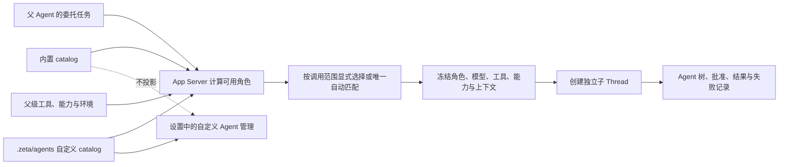

# 子代理：内置专化代理与自定义代理

> 状态：Proposed。本文件拥有 Zeta 内置专化子代理的产品边界、定义契约、完整清单和维护规则；现有多代理运行时见 [`core-multi-agent.md`](core-multi-agent.md)，自定义 Agent artifact 见 [`agent-customizations.md`](agent-customizations.md) 与 [`zeta-agents`](../zeta-rs/agents/README.md)，`/develop` 的阶段、产物和失效流程见 [`develop.md`](develop.md)。

内置专化子代理是随 Zeta 发布、由产品维护的执行角色；`.zeta/agents` 只存放用户或项目自定义 Agent。两者可以使用同一套冻结后的运行时契约，但不能共享来源、覆盖关系、设置入口或更新周期。

## 快速理解

Zeta 需要把“产品自带的专化能力”和“用户自己定义的角色”分开：内置定义由后端打包并自动参与委托，自定义定义从 `.zeta/agents/*.md` 读取。内置定义不出现在设置页，但其实际执行过程必须可观察。

| 常见问题 | 决定 |
| --- | --- |
| 内置专化子代理放在哪里？ | 放入计划新增的 `zeta-subagents` crate，不能写入、生成到或同步到 `.zeta`。 |
| `.zeta/agents` 放什么？ | 只放用户或项目自定义 Agent definition。 |
| 设置里能看到内置专化子代理吗？ | 看不到，也不能在设置中编辑、覆盖或禁用单个内置定义；设置只管理自定义来源。 |
| 内置专化子代理怎么使用？ | 主 Agent 通过 `spawn_agent` 显式选择，或由 App Server 根据短描述和当前可用能力选择。 |
| `/develop` 的阶段 Agent 也在这里维护吗？ | 是。角色定义、提示词、工具和调用范围在本文维护；`develop.md` 只维护阶段流程、输入产物和验收门。 |
| 会继承父 Agent 的全部对话吗？ | 默认不会。始终收到独立任务和自身提示词，只接收该角色默认允许且在创建时冻结的上下文。 |
| 会继承主模型吗？ | 默认继承父 Agent 当前解析后的模型、推理等级和服务等级；某个定义只有显式声明时才能覆盖。覆盖模型不可用时创建失败，不静默换模型。 |
| 会继承父 Agent 的全部工具吗？ | 不会。有效工具是“该角色工具清单、父 Agent 当前工具和执行环境实际工具”的交集。 |
| 会继承父 Agent 的权限吗？ | 只继承上限，不能扩大。有效能力是系统策略、父级授权、角色能力上限和环境能力的交集。 |
| 内置定义不可见是否意味着执行也隐藏？ | 不是。子 Thread、所用角色、工具调用、批准、结果、失败和取消仍须出现在运行记录与 Agent 树中。 |

## 1. 对象与边界

| 对象 | 来源 | 谁维护 | 是否进入设置 | 是否可以执行 |
| --- | --- | --- | --- | --- |
| 内置专化定义 | Zeta 安装包内的只读资源 | Zeta 产品代码 | 否 | 是 |
| 自定义定义 | `.zeta/agents/*.md` | 用户或项目 | 是，只显示自定义项 | 是 |
| 子 Agent 实例 | App Server 创建的子 Thread | 运行时 | 不作为设置项 | 是，并持久记录 |

定义不是正在运行的 Agent。每次委托仍创建拥有独立 `ThreadId`、Turn、上下文和取消域的子 Thread；定义只决定该子 Thread 的角色提示词、专长、工具、能力、模型策略和上下文策略。

内置与自定义定义必须使用带来源的稳定身份，例如 `BuiltIn(explorer)` 与 `Directory(dir_id, explorer)`。内部不能再只用裸 `name` 标识定义；自定义同名项不能覆盖或伪装成内置定义，显式选择出现歧义时必须要求准确来源。

## 2. 需要独立 crate，拥有统一定义契约与内置资源

计划新增 `zeta-rs/subagents/`，crate 名为 `zeta-subagents`。它用于隔离角色定义能力、内置产品资源与校验依赖，并向所有来源提供同一份归一化定义契约；它不接管多代理运行时。

```text
zeta-rs/subagents/
├── Cargo.toml
├── README.md
├── assets/
│   ├── explorer/
│   │   ├── agent.toml
│   │   └── prompt.md
│   └── <agent>/
│       ├── agent.toml
│       └── prompt.md
└── src/
    ├── catalog.rs
    ├── definition.rs
    └── lib.rs
```

| Owner | 长期职责 | 明确不负责 |
| --- | --- | --- |
| `zeta-subagents`（计划新增） | 拥有 `SubagentDefinition`、带来源身份和调用范围；打包内置定义与各自提示词；校验并发布不可变内置 catalog | Thread、模型调用、工具执行、设置 UI、自定义文件扫描 |
| `zeta-agents` | 扫描和校验 `.zeta/agents/*.md`，把自定义文件转换为统一的 `SubagentDefinition` | 内置资源、第二套定义类型、运行时、权限授予 |
| `zeta-prompts` | 提供共享提示词 artifact 与冻结机制 | 集中保存每个内置角色的专用提示词 |
| App Server | 合并归一化 catalog、按调用方筛选角色、解析模型/工具/能力并创建冻结快照 | 维护来源专属选择分支、把定义变成设置项、保存前端状态 |
| `zeta-core` | 子 Thread 生命周期、上下文物化、消息、等待、取消和执行时能力收窄 | 扫描定义、选择产品角色 |
| `zeta-protocol` | 定义来源身份、冻结快照、上下文模式和能力上限的跨边界结构 | 角色内容和选择策略 |
| Desktop、TUI | 展示运行中的 Agent 树、状态、批准和结果；自定义设置只投影自定义 catalog | 解析或修改内置定义 |

不能新建一个同时装下定义、调度、Thread、模型和 UI 的大 crate；这些能力已经有清晰 owner。`zeta-subagents` 的边界止于“角色是什么、来自哪里、声明了什么上限”；“是否能在当前父角色和环境里运行”仍由 App Server 解析，“如何运行”仍由 Core 负责。

## 3. 统一定义契约与内置格式

每个内置子代理必须有独立目录、独立清单和独立 `prompt.md`。提示词与角色同版本发布，不拼进一个所有角色共享的大提示词，也不允许通过设置修改。

统一领域类型至少包含带来源的 `SubagentDefinitionId`、选择 metadata、提示词、模型策略、工具与 Skill 上限、上下文策略、调用范围和带作用范围的执行能力上限。来源由 catalog loader 注入，不能由 `agent.toml` 或 `.zeta/agents/*.md` 自报。当前 `zeta-agents::AgentDefinition` 的扁平 `model/tools/skills/instructions/body` 只是目录格式解析结果；接入内置 catalog 前必须显式转换为该统一类型，App Server 不再直接消费来源专属结构。

下面是计划格式，用于固定字段语义，不表示当前已经存在该 API：

```toml
schema_version = 1
id = "explorer"
version = 1
description = "定位代码、调用链和实现证据，不修改文件。"
prompt = "prompt.md"
specialties = ["code.explore", "code.trace"]

[tools]
allowed = ["read_file", "grep", "glob", "search_code"]
required = ["read_file", "grep", "glob"]

[skills]
allowed = []
required = []

[model]
strategy = "inherit"

[context]
default = "selected"
allowed = ["fresh", "selected"]

[invocation]
scope = "orchestrator"

[[capabilities]]
kind = "file_read"
scope = "thread_dirs"
```

字段边界如下：

- `description` 只用于选择，必须短、具体，并写清何时使用；完整行为规则放在 `prompt.md`。
- 内置格式的 `version` 是角色内容版本；提示词、工具、Skill、模型、上下文、调用范围或能力上限变化都必须提升，并与完整内容摘要一起冻结。自定义来源继续使用 catalog generation 与内容摘要表达版本身份。
- `specialties` 描述角色擅长解决的问题，用于路由和评测，不产生执行权限。
- `tools.allowed` 是该角色的精确工具上限，`tools.required` 是每次创建都必须存在的最小集合；工作契约可以从上限中声明本次额外必需工具，缺少任何必需项时不创建。
- `skills.allowed` 与 `skills.required` 对 Skill 做同样的上限和必需项约束；父级已激活不代表子级自动继承。
- `capabilities` 是带作用范围的执行能力上限，使用现有 `CapabilityKind` 语义；它不能因为提示词或工具引用而扩大。
- `model` 决定继承父模型还是使用明确模型。初始内置角色全部使用 `inherit`。
- `context` 同时限制默认上下文和调用方可请求的模式；调用方不能越过角色允许范围。
- `invocation` 决定角色属于普通协调层、指定工作流还是某个父角色的私有能力面；私有角色使用 `allowed_parents` 声明唯一允许的父来源身份。父角色可见的子角色集合由这些子定义反向计算，不再在父子两端重复保存同一条边。

| 调用范围 | 谁能看到并创建 | 额外绑定 |
| --- | --- | --- |
| `orchestrator` | 普通主 Agent 的协调层 | 不接受父角色私有调用，也不参与工作流内部选择。 |
| `workflow` | 指定的确定性工作流 | 必须绑定工作流 ID 和阶段；用户或普通 Agent 不能绕过流程直接创建。 |
| `private` | `allowed_parents` 列出的准确来源身份 | 调用方必须是正在运行的允许父角色；同名自定义角色不匹配。 |

创建子 Thread 前，App Server 必须冻结定义来源、定义版本、内容摘要、提示词摘要、最终模型、工具集合、Skill 集合、能力上限、上下文种子和选择原因。恢复旧 Thread 时继续使用冻结值，不能因应用升级或定义变化改写历史执行身份。

## 4. 继承规则

子 Agent 不是父 Agent 的上下文副本。它拥有独立模型会话，只消费创建时明确物化的输入；父级之后发生的变化只能通过有来源的 Agent 消息传递。

| 内容 | 默认行为 | 例外与限制 |
| --- | --- | --- |
| 委托任务 | 始终传递 | 必须是完整、可独立执行的任务，不能只传一句角色名。 |
| 专用提示词 | 始终使用该角色自己的 `prompt.md` | 不能由父级对话或设置替换；系统安全规则优先级更高。 |
| 产品安全与基础规则 | 重新应用并冻结适用于子 Thread 的规则 | 不是复制父级整段系统提示词，角色提示词不能覆盖它们。当前协调器仍复制父 Turn 的 `TurnInstructions`，接入内置角色前必须改正。 |
| 工作区 Instructions | 按子 Thread 的准确目录和作用范围重新解析后冻结 | 同一环境且目录作用范围完全一致时可以复用已冻结基线；环境或目录变化时必须重新解析，不能复制无关父级规则。 |
| 父级完整对话 | 默认不传递 | `full` 只允许显式请求，且角色必须声明允许；内置初始角色均不默认允许。 |
| 选定消息、检查点和产物 | 按角色默认策略传递 | 创建时复制为不可变种子；不建立实时共享上下文。 |
| 隐藏推理过程 | 不传递 | 传递结论、证据、计划或检查点，不依赖另一 Agent 的未公开推理。 |
| 模型 | 默认继承父级已解析模型 | 定义显式覆盖时使用覆盖值；不可用就失败，不自动替换。 |
| 推理等级与服务等级 | 默认随模型调用配置继承 | 定义显式覆盖后也受父级预算和产品策略限制。 |
| 工具 | 不整体继承 | 取角色白名单、父级可见集合和环境可用集合的交集；缺少必需项就不创建。 |
| Skills | 只加载角色明确声明且当前已授权的 Skill | 不自动复制父级全部已激活 Skill。 |
| 能力与批准 | 只继承更窄的上限 | 父级批准不是子级永久批准；具体动作仍按策略审查。 |
| Environment 与目录 | 默认使用父 Thread 的执行环境和已授权目录快照 | 切换环境必须显式选择并重新授权，不能通过角色定义暗中切换。 |
| 预算与取消 | 使用独立子级预算和取消域，同时受父级总上限约束 | 取消父级时按既定树策略处理子级；子级不能增加总预算。 |

现有上下文模式继续作为统一执行契约：`fresh` 只包含任务、角色和基础规则；`selected` 只物化明确来源；`lastTurns`、`checkpointAndTail` 与 `full` 只在定义允许并由调用方明确请求时使用。所有模式都在创建时冻结，不共享父 Thread 的可变历史。

## 5. 内置专化子代理清单

通用主 Agent 和没有专化定义的普通子 Thread 不属于本清单。所有内置角色默认继承父级已经解析的模型调用配置；表格只列不同于通用规则的任务、上下文、工具和能力边界。

### 5.1 普通协调层角色

这些角色可以由主 Agent 显式调用或参与普通自动选择，但仍不进入设置页。

| ID | 专长与自己的提示词重点 | 默认上下文 | 工具白名单 | 执行能力上限 | 明确不做 |
| --- | --- | --- | --- | --- | --- |
| `explorer` | 回答范围明确的代码问题；沿真实符号和调用链给出文件、行号、测试与不确定点 | `selected` | `read_file`、`grep`、`glob`、`search_code` | 授权目录只读 | 修改文件、运行长任务、泛泛设计 |
| `implementer` | 在明确文件或模块责任内完成代码修改；保留他人改动，运行最小验证并报告改动与测试 | `checkpointAndTail` | `read_file`、`grep`、`glob`、`search_code`、`process_start`、`process_wait`、`process_terminate`、`apply_patch`、`edit`、`write_file` | 授权目录读写、受沙箱约束的进程 | 外部服务修改、凭据使用、超出分配范围的重构 |
| `reviewer` | 独立审查目标、最终 diff 与验证证据；先报可操作问题、严重度和证据，再给摘要 | `fresh`，由父级显式附上目标与证据 | `read_file`、`grep`、`glob`、`search_code`、`process_start`、`process_wait`、`process_terminate` | 源码只读、只读进程检查 | 修改代码、接受工作 Agent 的总结代替证据 |
| `test-runner` | 运行指定测试或检查；区分首个根因与连带失败，返回命令、退出状态和关键输出 | `selected` | `read_file`、`grep`、`glob`、`search_code`、`process_start`、`process_wait`、`process_terminate` | 源码只读、受沙箱约束的进程、仅构建产物目录可写 | 修复代码、无界运行、把失败误报为完成 |
| `researcher` | 优先使用官方一手资料；核对发布日期、版本和适用范围，区分来源事实与推断 | `fresh` | `read_file`、`grep`、`glob`、`web_search`、`browser_open`、`browser_observe`、`browser_navigate`、`browser_close` | 授权目录只读、网络读取、浏览器只读交互 | 修改本地文件、登录账户、提交表单、把本地文档当最终事实 |
| `ui-validator` | 用真实浏览器或 Electron 流程复现并验证 UI；记录步骤、语义状态和可复查证据 | `selected` | `read_file`、`grep`、`glob`、`process_start`、`process_wait`、`process_terminate`、`browser_open`、`browser_observe`、`browser_navigate`、`browser_click`、`browser_type`、`browser_scroll`、`browser_back`、`browser_reload`、`browser_screenshot`、`browser_close` | 源码只读、受沙箱约束的进程、网络与 UI 交互 | 修改源码、使用截图代替调试结论、执行不可逆外部操作 |

每个表格行都必须对应一个真实 `assets/<id>/prompt.md`，文档只维护提示词契约，不复制完整正文。这样提示词只有一个可执行 owner，修改时不会出现文档与实际资源两份正文漂移。

`process_start`、`process_wait` 与 `process_terminate` 表示计划中的显式进程资源契约。当前 App Server 的 `shell-command` 默认 30 秒超时，不能可靠承载长测试，也不能单靠工具名证明“只读”。专化角色上线前必须让进程动作产生准确的文件、进程和网络能力需求，以角色能力上限执行检查，并支持等待、取消、超时和未知结果；不能用反复调用短时 shell 维持长任务。

### 5.2 `/develop` 阶段角色

`/develop` 的阶段状态机根据已接受产物创建这些角色。它们不参与普通任务的自动选择，也不能由用户绕过流程直接调用。阶段角色只消费该阶段不可变上下文包，不继承当前聊天的实时完整历史。

| ID | 自己的提示词重点 | 默认上下文 | 自己的工具集 | 执行能力上限 | 产物与停止条件 |
| --- | --- | --- | --- | --- | --- |
| `develop-intent` | 从用户原话和有来源证据中提炼问题、期望、约束、非目标与未决判断，不把方案伪装成意图 | `selected`：命令锚点、用户决定和调查证据 | `write_intent_candidate`、`spawn_agent`、`send_agent_message`、`wait_agent` | 只能写当前工作 Intent 候选并调用三个私有角色 | 产出可追溯候选；缺产品判断时返回 `NeedsUserDecision` 并停止，由工作流向用户提问 |
| `develop-spec` | 把已接受 Intent 转换成可观察行为、系统边界、失败语义、风险和验收标准 | `selected`：已接受 Intent、项目事实和领域文档 | `read_file`、`grep`、`glob`、`search_code`、`write_spec_candidate` | 项目只读，只能写当前工作 Spec 候选 | 产出 Spec 候选；不能改变 Intent 或实施代码 |
| `develop-plan` | 根据已接受 Spec 和固定代码基线形成有顺序、可验证的工作契约与执行方式 | `selected`：已接受 Intent/Spec、代码基线、测试入口 | `read_file`、`grep`、`glob`、`search_code`、`process_start`、`process_wait`、`process_terminate`、`write_plan_candidate` | 源码只读、只读进程检查，只能写当前工作 Plan 候选 | 产出 Plan 候选；不能降低验收标准 |
| `develop-implementer` | 严格按已接受工作契约修改分配范围，保留他人改动并产生可封存 ChangeSet | `selected`：已接受 Intent/Spec/Plan、工作契约和代码检查点 | `read_file`、`grep`、`glob`、`search_code`、`process_start`、`process_wait`、`process_terminate`、`apply_patch`、`edit`、`write_file` | 只读写分配的代码范围并运行获准验证 | 工作完成、失败或工作契约失效时停止；不能改写上游产物和验收规则 |
| `develop-acceptance` | 独立对照原始意图、固定 Spec、最终差异和真实证据判断是否满足验收标准 | `fresh` 加显式选择的固定验收包 | `read_file`、`grep`、`glob`、`search_code`、`process_start`、`process_wait`、`process_terminate`、获准的 `browser_*` 验证工具、`write_acceptance_candidate` | 源码与控制资源只读，只能运行已定义验证并写验收候选 | 返回逐项证据和未满足项；不能修改候选代码或接受自己的工作 |

`write_intent_candidate`、`write_spec_candidate`、`write_plan_candidate` 与 `write_acceptance_candidate` 是计划中的开发流程领域工具。它们只能操作当前开发工作的对应候选对象，不能用通用 `write_file` 代替，否则无法保证单写者、版本绑定和上游失效语义。

`develop-acceptance` 的浏览器工具不是每次全部加载。工作流从已接受 Spec 的验证方法推导本次必需工具，并在创建时冻结实际子集；任何必需工具不可用时验收阻塞，不能删掉该验收项继续通过。

表格中的 `browser_*` 是阅读缩写，实际 `agent.toml` 必须逐项列出允许的浏览器工具。当前 `ToolDefinition` 没有来源可信、可签名的“只读/修改”动作 metadata，因此初始角色不动态接入 Connector；只有工具来源能够发布权威动作能力、并在创建时解析成准确工具名、定义摘要与能力集合后，才可为具体角色开放。

### 5.3 Intent 私有角色

以下角色只注册到 `develop-intent` 的私有能力面：不进入设置、不进入普通协调层 catalog、不接受用户直接选择，也不能被其他阶段 Agent 调用。每次委托只回答一个可验证问题并返回有来源的证据，不写任何阶段产物。

| ID | 自己的提示词重点 | 默认上下文 | 自己的工具集 | 执行能力上限 | 唯一允许的父角色 |
| --- | --- | --- | --- | --- | --- |
| `intent-project-investigator` | 调查一个明确的本地事实，返回源码、Git、测试证据、代码基线与不确定性 | `fresh` 或 `selected` | `read_file`、`grep`、`glob`、`search_code`、`process_start`、`process_wait`、`process_terminate` | 项目只读、只读 Git/构建/测试进程、仅构建产物目录可写 | `develop-intent` |
| `intent-researcher` | 调查一个明确的外部事实，优先一手来源并说明时间、版本、适用范围和不确定性 | `fresh` 或 `selected` | `web_search`、`browser_open`、`browser_observe`、`browser_navigate`、`browser_close` | 网络和外部来源只读；不得登录、提交或修改外部状态 | `develop-intent` |
| `intent-conflict-reviewer` | 比较指定的用户原话、项目事实、外部来源和候选产物，列出冲突双方、影响与可确定优先级 | `selected` | `read_file`、`grep` | 只读明确提供的来源 | `develop-intent` |

三个私有角色的 `invocation.allowed_parents` 都只包含内置 `develop-intent` 的来源身份。App Server 为 `develop-intent` 计算可用角色时反向得到这三个目标，并把 `spawn_agent` 的可选范围冻结到该集合；仅靠提示词要求“不要调用其他 Agent”不构成隔离。

### 5.4 与 `/develop` 的责任联动

| 契约 | Canonical owner |
| --- | --- |
| 角色 ID、提示词、工具、能力、模型与调用范围 | 本文件和 `zeta-subagents` |
| 阶段顺序、接受门、产物版本、上游失效、恢复与用户等待 | [`develop.md`](develop.md) |
| 子 Thread、上下文种子、消息、取消、等待和持久结果 | [`core-multi-agent.md`](core-multi-agent.md) |
| Team 的工作拆分、隔离、证据和集成门 | [`multi-agent-development.md`](multi-agent-development.md) |

阶段协调必须由确定性工作流完成，不能把 `develop.md` 整篇作为提示词交给根 Agent。工作流创建阶段 Agent 时提交固定阶段身份、已接受上游版本、代码基线、工具范围、预算、时间和停止条件；阶段 Agent 只返回候选或证据，不能自行推进、接受或重写工作流状态。

## 6. 选择、可见性与执行流程



选择规则：

1. 先按角色所需工具、能力、模型和上下文模式计算可用集合，不可执行的角色不能参与匹配。
2. 再按 `invocation` 限定候选：普通角色只给协调层，工作流角色只给对应工作流，私有角色只给允许的父角色。
3. 显式选择必须解析到唯一的来源身份；显式名称也不能绕过调用范围，内置名称不能被自定义定义覆盖。
4. 自动选择只使用简短 `description` 和 `specialties` 做候选匹配；分数并列或证据不足时不创建专化子代理，由主 Agent 继续处理或重新给出明确委托。
5. 选择成功后冻结全部输入，再创建子 Thread；不能先创建再补工具、权限或提示词。
6. 内置 catalog 只投影给获准的协调层、工作流或父角色以及运行观测，不进入设置服务、设置 schema 或自定义 Agent picker。

“不进入设置”只限制配置面。运行时必须展示内置角色 ID、来源、状态、工具调用、批准请求、结果和失败原因，用户可以停止正在运行的子 Agent。

## 7. 安全与失败语义

- **失败即关闭**：提示词缺失、摘要不一致、模型不可用、必需工具缺失、能力越权、上下文来源无效或定义版本未知时，不创建子 Thread。
- **权限只收窄**：角色清单不是授权凭证；即使清单声明某项能力，也必须处于父级和系统授权之内。
- **无同名覆盖**：自定义定义不能替换内置定义；迁移旧的裸名称前必须先增加来源身份。
- **无隐式递归**：默认角色没有 `spawn_agent`、`send_agent_message` 或 `wait_agent`；只有 `develop-intent` 获得这三个工具，且目标被结构化限制为它的三个私有角色。
- **控制资源隔离**：Intent、Spec、Plan、验收记录、测试入口、项目指令、权限和验证配置不能通过普通文件写工具越权修改；修改控制资源的角色不能用修改后的规则批准自己的结果。
- **无实时上下文共享**：子 Agent 只读冻结种子和有来源的后续消息；不能读取父级实时草稿、未提交推理或其他子 Agent 的内存。
- **批准保持可见**：内置定义不可配置不代表可以绕过批准、沙箱、网络规则、凭据边界或外部修改审查。
- **本地文档不是最终事实**：设计与实现状态必须由源码、测试和一手外部文档交叉验证；发现冲突时在文档中明确 Current 与 Proposed，不能选择更方便的一份作为事实。

## 8. 当前实现与缺口

| 能力 | 状态 | 证据或缺口 |
| --- | --- | --- |
| `.zeta/agents/*.md` 自定义定义 catalog | 已实现 | `zeta-agents` 扫描、校验并发布不可变 snapshot。 |
| 显式/唯一 metadata 自动选择 | 已实现 | App Server 的 `agent_selection.rs` 当前只消费目录 catalog。 |
| 独立子 Thread、消息、等待、取消与持久结果 | 已实现 | `zeta-core` 多代理运行时。 |
| `fresh`、`selected`、`lastTurns`、`checkpointAndTail`、`full` | 已实现 | `spawn_agent` 当前默认 `fresh`，其他模式显式传入。 |
| 子级工具只能从父级当前集合中收窄 | 已实现 | `DelegatedCapabilityScope` 当前冻结工具与 Skill。 |
| 子级继承完整模型调用配置 | 尚未完成 | 当前 Agent definition 选择明确冻结 `ModelRef`；推理等级和服务等级还需要作为同一模型策略核对并冻结。 |
| 统一定义契约 | 尚未完成 | 需要新增 `zeta-subagents`，让内置资源和 `zeta-agents` 的自定义解析结果统一产出 `SubagentDefinition`；App Server 不能继续直接消费来源专属结构。 |
| 内置专化 catalog 与本文角色资源 | 尚未完成 | 需要加入清单、逐角色提示词、稳定摘要、路由评测和发布校验。 |
| `/develop` 阶段与 Intent 私有角色调用范围 | 尚未完成 | 需要 `AgentInvocationScope`、调用方身份、允许父来源、阶段候选领域工具和上下文包绑定，不能依赖提示词隔离。 |
| 带来源的定义身份 | 尚未完成 | 当前 `FrozenAgentDefinitionRef` 只有裸 `name`、catalog generation 和 digest，合并 catalog 前必须补齐。 |
| 每个角色的带作用范围执行能力上限 | 尚未完成 | 当前 `DelegatedCapabilityScope` 只有工具和 Skill，需要冻结并执行检查 `Capability` 上限。 |
| 子 Thread Instructions 解析 | 尚未完成 | 当前协调器把父 Turn 的 `TurnInstructions` 直接带入子 Turn；目标是按子级准确目录和作用范围解析并冻结，只有作用范围完全一致时才能复用父级基线。 |
| 长时进程资源 | 尚未完成 | 当前 `shell-command` 默认 30 秒超时；需要可等待、可取消、可终止并能表达结果未知的进程资源，以及准确的构建产物写入范围。 |
| 动态外部工具的动作 metadata | 尚未完成 | 当前 `ToolDefinition` 没有权威只读/修改分类；在来源签名、动作能力和摘要冻结完成前，专化角色不动态接入 Connector。 |
| `/develop` 用户判断交互 | 尚未完成 | 阶段 Agent 应返回 `NeedsUserDecision`，由确定性工作流发起 server request 并恢复下一阶段运行；`request_user_input` 不是当前模型工具。 |
| 内置不进设置、运行时仍可观察 | 尚未完成 | 需要分别测试设置投影和 Agent 树投影，不能共用一个“是否可见”字段代替两个行为。 |
| 内置角色选择与评测 | 尚未完成 | 需要在 App Server 合并 catalog，并建立正例、反例和权限不足用例。 |

当前代码里“子级模型未声明时继承当前模型”和“未传上下文时使用 `fresh`”已经存在，但这不等于内置角色定义已经实现。新增内置 catalog 时应复用既有子 Thread、上下文种子和工具/Skill 冻结契约，补齐来源身份、调用范围、Instructions 解析和执行能力，不建立第二套子 Agent 运行时。

## 9. 维护与验收

每次新增或修改内置专化子代理，必须同时完成：

1. 更新唯一的 `agent.toml` 与 `prompt.md`，提升定义版本并生成稳定摘要。
2. 校验 ID、提示词非空与大小上限、工具引用、能力作用范围、模型策略、上下文策略和禁止递归规则。
3. 增加路由正例与反例，证明该角色在该用时被选、不该用时不会抢任务。
4. 增加行为评测，覆盖结果格式、证据质量、禁止动作和工具最小化；只读角色必须有“不能修改”的执行测试。
5. 增加权限交集、缺工具、模型不可用、上下文泄漏、恢复后摘要一致和取消传播测试。
6. 验证设置页不出现内置定义，同时 Agent 树和运行记录能够显示真实执行身份。
7. 工作流或私有角色还要验证普通协调层和错误父角色无法发现、选择或调用它们。
8. 对照源码与测试更新本文件的状态表；不能只依据其他本地 Markdown 宣布完成。

## 10. 外部参考与取舍

- [OpenAI Codex 子代理文档](https://learn.chatgpt.com/docs/agent-configuration/subagents) 将内置角色与用户/项目自定义角色分开，并允许角色拥有描述、提示词、模型、工具与其他运行配置。Zeta 采用“描述用于路由、完整规则放在角色提示词、每个角色收窄工具”的原则。
- [Claude Code 子代理文档](https://code.claude.com/docs/en/sub-agents) 强调每个子代理拥有自己的系统提示词、工具、模型和独立上下文，并通过描述自动委托。Zeta 采用独立上下文和最小工具集，但不采用“自定义同名定义覆盖内置定义”，因为隐藏于设置的产品角色不能被项目文件悄悄替换。

外部产品的文件格式和优先级只作为设计输入，不是 Zeta 的兼容契约。Zeta 的最终行为以本文件明确的长期不变量、实际源码和通过的测试为准。
