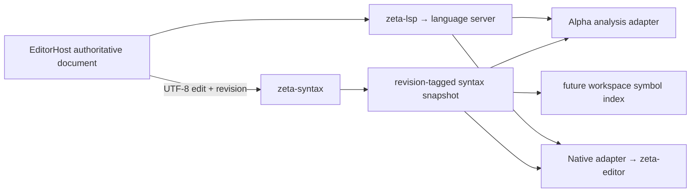

# 源码结构分析系统

> 状态：Rust/JSON/JSONC 增量分析内核与 Desktop Alpha syntax-token 接入已实现；Native 与 workspace
> index 接入尚未完成。
> 本文拥有跨 crate、进程和编辑器的语言分析所有权与演进阶段；当前 crate API、内部调用图和
> 修改路径见 [`zeta-syntax` README](../zeta-rs/syntax/README.md)。

## 快速理解

Zeta 把可跨编辑器复用的语法分析放入 Rust，同时保留 Alpha 和 Native editor 各自的输入、
布局与绘制职责。tree-sitter 提供快速结构事实，LSP/compiler 提供类型与跨文件语义；两者不能
互相冒充。

| 使用场景 | 当前结果 | 最终 owner |
| --- | --- | --- |
| 对 Rust/JSON/JSONC 文本进行增量 parse | ✅ `zeta-syntax` 已实现 UTF-8 edit、revision binding 与 tree reuse | `zeta-syntax` |
| 取得 syntax token、fold、document outline 和 parse error | 部分具备：Rust/JSON/JSONC syntax token 已投影到 Alpha；其他 snapshot 尚未投影 | `zeta-syntax` + 产品宿主 |
| Alpha 输入、光标、DOM、layout、accessibility | ✅ 由 Alpha 拥有 | Desktop Renderer |
| Monaco 工具能力 | 保持现有过渡实现；不拥有后端 syntax 接入 | Monaco adapter |
| Native code surface 绘制 | 部分具备：`zeta-editor` 已有 syntax projection，adapter 尚未接线 | `zeta-editor` + Native host |
| completion、type、definition/reference、rename | 部分具备：低层 LSP runtime 已实现，产品接线尚未完成 | `zeta-lsp` + language server |
| workspace symbol search | 尚未完成 | 后续 workspace index；不属于 parser document |

继续阅读：[一次编辑](#1-一次编辑)、[所有权](#2-所有权边界)、
[性能边界](#3-性能与进程边界)、[当前状态](#4-当前实现与演进)。



## 1. 一次编辑

1. EditorHost 保存 authoritative text、document identity 和单调 revision。
2. Host adapter 把一次变更转换为当前 revision 上的 UTF-8 byte replacement；Desktop adapter
   必须先从 UTF-16 position 显式转换。
3. `SyntaxDocument` 校验 revision、range、UTF-8 boundary 和文档大小，在旧 tree clone 上应用
   `InputEdit`，再以旧 tree 为 hint 增量 parse 新文本。
4. 解析成功后原子提交 text、line index、tree 和新 revision，并派生同 revision 的 token、
   fold、document symbol 和 parse diagnostic snapshot。
5. 产品宿主只在 snapshot revision 仍等于当前 EditorHost revision 时投影结果；迟到结果直接丢弃。
6. LSP 同步独立消费 authoritative document。语法 snapshot 不能替代 LSP document version，
   LSP 结果也不能绕过宿主 freshness gate。

Parser 接受包含语法错误的中间文本；error/missing node 是正常 snapshot 数据。只有无效 edit、
超限、grammar/query 初始化失败或 parser cancellation 才使操作失败。

## 2. 所有权边界

| 能力 | `zeta-syntax` | 产品宿主 / EditorHost | Alpha / Native view | `zeta-lsp` |
| --- | --- | --- | --- | --- |
| tree-sitter grammar、query 与增量 tree | ✅ | ❌ | ❌ | ❌ |
| authoritative text、URI、language、revision | 消费 snapshot | ✅ | 协调 | 消费 snapshot |
| syntax token category、fold、document symbol | ✅ | freshness/调度 | 展示 | ❌ |
| workspace 扫描、watch、open-buffer-over-disk policy | ❌ | 后续 index composition | ❌ | ❌ |
| type、completion、definition/reference、rename | ❌ | 协调 | 展示/交互 | transport/runtime |
| theme color、DOM/native geometry、fold state | ❌ | 协调 | ✅ | ❌ |
| 文件读写、dirty state、保存冲突 | ❌ | ✅ | 视图投影 | ❌ |

tree-sitter 的输出是语言 grammar 定义的 concrete syntax tree，不是统一语义 AST。公共 contract
不暴露 `tree_sitter::Tree`、`Node` 或 grammar node-kind 字符串，只暴露产品可稳定消费的范围、
category 和声明。语言特有 query 保持 crate private。

单文档 symbol 是 parse snapshot 的派生事实；workspace symbol index 则需要文件扫描、watcher、
unsaved buffer 优先级、更新原子性、缓存和可能的持久化。两者生命周期不同。首阶段不创建
`zeta-symbol-index`；真实 workspace consumer 和独立 typed port 稳定后再提取。

## 3. 性能与进程边界

把 parser 放进 Rust 不会自动优化 Alpha 的 DOM、glyph measurement 或 layout。收益来自减少
Renderer 的语言 worker/JS heap 工作、共享 Native 实现，以及让大文件结构分析离开 UI thread。
Alpha 的 Rust/JSON/JSONC token lane 优先使用后端，避免正常路径重复 tokenization。后端失败时委托
既有 worker provider chain；JSON/JSONC 可回退 TextMate，Rust 当前没有 TextMate grammar。

Desktop 通过版本化 App Server API 使用 Rust。当前 Alpha 接入使用长生命周期、按
connection/model 拥有的 analysis session：

```text
document/syntax/open(model ID, URI, full text, revision)
  → document/syntax/change(model ID, previous revision, next revision, bounded UTF-16 edits)
  → compact LSP-compatible token snapshot tagged with next revision
  → close
```

不能把每次按键实现为“发送全文、返回完整 AST”的独立 RPC。当前 Desktop adapter 已定义：

- Alpha UTF-16 absolute offset 到 Rust UTF-8 byte range 的后端转换；
- 一个 Alpha model transaction 到一个原子、非重叠 edit batch；
- 串行 model queue、provider cancellation 检查和 stale revision 丢弃；
- App Server 文档丢失或重启后的当前全文 reopen；
- 4 MiB document、1024 edit 和 50,000 token 上限；
- compact token data 到 Alpha `LanguageToken`/viewport presentation 的投影；
- 后端不可用时委托既有 fallback chain，diagnostic lane 与其他语言 token lane 不改变。

尚未实现 token delta、主动 debounce 和有界跨进程队列 backpressure；当前返回每个 revision 的
完整紧凑 token 数组。wire 使用 LSP-compatible relative token 形状，但内容仍是
tree-sitter syntax category，不能描述成 compiler/LSP semantic facts。

Native host 与 Rust 运行在同一进程，可直接依赖 `zeta-syntax`，但仍由 EditorHost 持有文档与
revision，并把语言中立 token category 映射为 `zeta-editor` presentation color。

## 4. 当前实现与演进

### 当前实现

- 独立 `zeta-syntax` Cargo/Bazel crate；
- Rust grammar/highlights/tags，以及 JSON/JSONC grammar/highlights；
- host-owned monotonic `DocumentRevision`；
- UTF-8 replace/insert/delete 与 tree-sitter `InputEdit`；
- incremental line index、old-tree reuse 和 parse cancellation rollback；
- 有界 token、fold、document symbol 与 parse diagnostic snapshot；
- grammar/tree 类型不泄漏到 public API；
- 单独测试文件覆盖增量编辑、Unicode boundary、revision 和 limits。
- App Server `document/syntax/open|change|close`、connection/model ownership、UTF-16 batch 转换与
  Alpha Rust/JSON/JSONC token provider adapter。

### 近期计划

1. 建立 authoritative EditorHost/document service，统一 URI、language 和 revision。
2. 为 Native 增加 snapshot-to-`CodeEditorSyntaxToken` adapter，并按 revision 投影。
3. 为 token snapshot 增加 result-ID delta 与有界 backpressure，并以 profile 数据决定 debounce。
4. 在 Alpha 接入 document outline/folding，再按语言逐项替换重复 syntax provider。
5. 以真实 Files/Search consumer 验证 open buffer 覆盖 disk snapshot 后，再建立 workspace index。

### 潜在方向

- 按实际产品语言逐个注册 grammar 和 fixture，不开放任意 native grammar loading；
- 超大文档 profiling 证明 `String` mutation 成为瓶颈后，改为 rope/chunked tree-sitter input；
- workspace index 需要第二个进程或远程 authority 时，再决定 App Server durability 与缓存格式；
- semantic token 与 tree-sitter token 同时存在时，由宿主定义明确 precedence，不让 presentation
  猜测来源。

长期不变量是：EditorHost 拥有文档，`zeta-syntax` 拥有结构分析，LSP/compiler 拥有语义事实，
Alpha/Native view 拥有 presentation；Monaco 只保留过渡工具实现。任何异步结果都必须绑定并验证
document revision。
