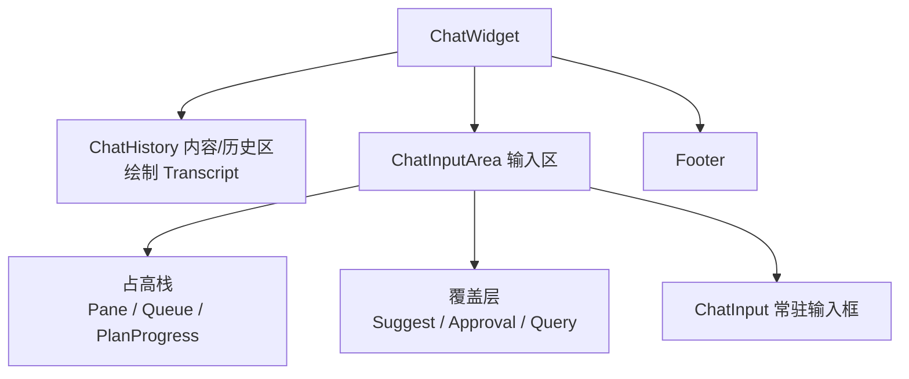

# Zeta Code 聊天输入区架构

> 类型：架构。状态：核心结构已实施，`Steer` 等待 TUI 产生明确的 steer 进行中状态后接入。
> 本文定义 `ChatWidget`、`ChatInputArea`、`Suggest`、`Pane` 与 `View` 在 Zeta Code TUI 聊天界面中的长期职责和演进边界。
> 本文是输入区的职责和结构准绳；整体 TUI 现状见 [`tui.md`](tui.md) 和 [`zeta-code/tui/README.md`](../zeta-code/tui/README.md)。

## 快速理解

Zeta Code 的整个聊天界面由 `ChatWidget` 按上中下分成 `ChatHistory` 内容/历史区、`ChatInputArea` 输入区和 Footer。`ChatInputArea` 不是又一个可见弹层，也不是 `Pane` 的另一个名字；它只是统一保存输入区状态、分配高度和路由输入的组合组件。`ChatInput` 才是底部常驻的输入框，`Pane`、`Queue` 和 `PlanProgress` 在它上方占高，`Suggest`、`Approval` 和 `Query` 从它上沿向上覆盖。`Transcript` 是 `ChatHistory` 展示的持久内容，不是区域本身。

四个名字只对应四个层次：

| 名字 | 是什么 | 是否长期保存 | 是否自己代表一块可见 UI |
| --- | --- | --- | --- |
| `ChatInputArea` | 输入区的状态、布局与输入调度者 | 是 | 否，它组合下面三类内容 |
| `ChatInput` | 底部常驻输入框 | 是 | 是 |
| `Pane<T>` | 可入栈的完整页面状态 | 是，直到出栈 | 是 |
| `*View<'_>` | 某组件在当前一帧的只读借用 | 否，绘制后立即丢弃 | 否，它是绘制输入，不是另一层 UI |

| 用户正在做什么 | 显示内容 | 布局方式 | 谁持有输入焦点 | 是否进入页面栈 |
| --- | --- | --- | --- | --- |
| 编写普通消息 | `ChatInput` | 输入区底部常驻，占据高度 | `ChatInput` | 否 |
| 输入 `/`、`@` 或 `$` | `Suggest` | 覆盖插槽，不占据高度 | `ChatInput` | 否 |
| 确认 File、Plugin 或 Skill 候选 | 将精确对象插入当前草稿 | 不改变布局 | `ChatInput` | 否 |
| 确认直接执行的 Slash Command | 关闭候选并产生命令动作 | 不改变布局 | 由命令结果决定 | 否 |
| Slash Command 打开管理或配置流程 | 完整 `Pane` | 在输入框上方占据高度 | 页面栈顶部 | 是 |
| Agent 请求动作批准 | `Approval` | 覆盖插槽，不占据高度 | 当前选择，完成后恢复原焦点所有者 | 否 |
| Agent 请求回答一个或多个问题 | `Query` | 覆盖插槽，不占据高度 | 当前选择；自定义答案临时借用 `ChatInput` | 否 |
| Turn 中有排队内容 | `Queue` | 独立占高类型，与其他类型叠加 | 不主动抢占焦点 | 否 |
| Turn 正在接收 steer | `Steer`（待接入） | 将作为独立占高类型 | 不主动抢占焦点 | 否 |
| Agent 更新 Plan | `PlanProgress` 的 `1/3` 和可折叠步骤 | 独立占高类型，折叠与展开各自计算高度 | 不改变当前焦点 | 否 |
| 从子页面返回 | 上一层 `Pane`，最后回到常驻输入框 | 栈顶 Pane 重新计算高度 | 返回后的可见内容 | 按层退出 |



## 1. 已确认的设计决策

| 概念 | 代码名称 | 决策 |
| --- | --- | --- |
| 整个聊天组件 | `ChatWidget` | 分配 `ChatHistory`、`ChatInputArea` 和 Footer 三段区域 |
| 内容/历史区 | `ChatHistory` | 填满剩余高度，绘制 Transcript 及其滚动状态 |
| 输入区调度 | `ChatInputArea` | 保存常驻输入框、占高条目和当前覆盖交互，统一分配高度、焦点和输入路由；它本身不是一个 Pane |
| 聊天输入状态与输入框 | `ChatInput` | 常驻在输入区底部，拥有草稿、附件、输入历史、候选协调和提交组装，并可切换到独立的 Query 回答草稿 |
| 轻量候选层 | `Suggest` | 统一承载 Slash Command、`@` Mention 和 Skill 候选，只提供绑定当前输入位置的单层选择 |
| 占高叠加类型 | `ChatInputAreaHeightEntryView` | 栈顶 `Pane`、`Queue` 和 `PlanProgress` 可同时存在，各自计算高度；`Steer` 在有明确状态来源后按同样边界接入 |
| 覆盖插槽 | `ChatInputAreaOverlayView` | 显示一个 `Suggest`、`Approval` 或 `Query`，在明确覆盖边界内绘制且不改变 `ChatInputArea` 高度 |
| 页面创建说明 | `PaneSpec<T>` | 取代 `PaneViewModel<T>`，只携带创建页面所需的正文数据和按键提示 |
| 存活页面 | `Pane<T>` | 进入页面栈并拥有正文状态和生命周期 |
| 只读绘制数据 | `*View` | 只向绘制和命中测试暴露当前状态，不提供修改或页面生命周期方法 |
| 页面身份 | `PaneId` | 每次入栈产生稳定身份，页面更新、产品动作绑定和结果分派都按身份关联，不依赖两个数组的相同下标 |
| 页面栈 | `Vec<PaneEntry>` | 取代 `Vec<InteractionView>`，保留入栈、替换、出栈和焦点恢复语义 |

聊天输入相关结果类型同步改名为 `ChatInputOutcome`、`ChatSubmission` 和 `ChatInputItem`。页面栈内部枚举确定为 `PaneEntry`，输入交互区对外结果确定为 `ChatInputAreaOutcome`，并保留聊天输入结果与页面结果两层边界。

## 2. 目标结构

`ChatInputArea` 是聊天输入区的组合组件，不是“弹层基座”或某个可见页面。它底部始终保存 `ChatInput`，上方保存可叠加的占高条目，并保存一个锚定输入框上沿的非占高交互。它把这些状态转成布局数据交给 `frame`，但不需要再造一个 `ChatInputAreaView` 容器。

```text
ChatWidget
├── ChatHistory · 内容/历史区，填满剩余高度
│   └── Transcript · 持久内容
├── ChatInputArea · 输入区
│   ├── Height stack · 输入框上方，可同时叠加
│   │   ├── PaneEntry 页面栈顶部
│   │   ├── Queue
│   │   └── PlanProgress
│   ├── Overlay slot · 锚定输入框上沿，不占据高度
│   │   ├── Suggest → Slash Command / Mention / Skill
│   │   ├── Approval
│   │   └── Query
│   └── ChatInput · 底部常驻
└── Footer · 底部状态与快捷提示
```

### 2.1 `ChatInputArea`

`ChatInputArea` 负责：

- 始终保留并绘制 `ChatInput`，完整页面只出现在它上方；
- 在普通草稿、Query 自定义回答、覆盖层和占高条目之间路由键盘、粘贴和鼠标动作；
- 对完整页面执行入栈、替换和出栈；
- 在常驻输入框之上按出现顺序压入栈顶 `Pane`、`Queue` 和 `PlanProgress` 占高条目，不把它们合并成一个状态所有者；
- 在 `Suggest`、`Approval` 和 `Query` 中只选择一个当前覆盖类型，并优先显示等待用户回复的 Agent 交互；
- 在批准或提问完成后销毁对应覆盖状态，把输入焦点交还给原来的所有者；
- 把 `ChatInput` 与每个占高类型的期望高度相加，再用覆盖类型从输入框上沿向上计算实际覆盖区域；
- 向 App 和 `frame` 暴露当前的占高条目、覆盖交互和共享几何计算。

`ChatInputArea` 不负责：

- Session、Thread、Skill 或 Plugin 的产品状态；
- 调用 App Server 或执行命令副作用；
- 解析 Slash Command、搜索文件或验证 `SkillRef`；
- 决定某个产品动作应该打开哪个页面。

### 2.2 `ChatInput`

`ChatInput` 负责草稿、Unicode 光标、附件、粘贴绑定、输入历史、`Suggest` 协调、Slash Command 提交识别，以及把当前草稿组装成 `ChatSubmission`。它也是 Query 自定义答案的可见输入框，但两种输入目标使用独立草稿；Query 模式下不启用附件、输入历史或 `Suggest`。`ChatInput` 只产生 `ChatInputOutcome`，不执行命令、Turn 请求或产品副作用。

### 2.3 `Suggest`

`Suggest` 是锚定常驻输入框的局部候选，生命周期绑定当前文本、光标和触发片段。它只能同时显示一种候选，并固定支持输入过滤、上下选择、确认、鼠标命中和关闭。内部使用封闭枚举保存唯一活动来源，不能同时持有多个可见候选。

`Suggest` 的三种来源保留自己的状态：

| 来源 | 自己拥有 | 确认结果 |
| --- | --- | --- |
| Slash Command | 命令语法、参数范围、匹配和命令身份 | 补全或产生命令动作 |
| Mention | `@` 片段、File 与 Plugin 混合结果、异步结果版本和命中高亮 | 原子插入 workspace-relative File 路径或 `@plugin-id` 文本 |
| Skill | `$` 片段、目录匹配和精确 `SkillRef` 绑定 | 插入原子 `$name` 并绑定 Skill |

`Suggest` 不提供 Tab 页面、显式搜索模式、预览区或子页面。Slash Command 确认后可以由产品动作打开 `Pane`，但 `Suggest` 自己不操作页面栈。

异步候选结果必须携带来源、查询文本和查询身份。查询身份绑定触发片段范围、该片段在草稿中的稳定位置以及草稿版本；文本、光标、原子引用或活动来源变化后，旧结果不能写回当前 `Suggest`。单纯比较查询字符串不足以区分草稿中两个相同的 `@name` 或 `$name` 片段。

### 2.4 `Pane` 与 `View`

`PaneSpec<T>` 是创建说明，产品功能用它提交正文数据和按键提示；它不进入页面栈，也不接收输入。`ChatInputArea` 根据创建说明建立 `Pane<T>`，分配 `PaneId` 并返回该身份；`Pane<T>` 是页面栈中的存活页面，拥有可变正文状态、按键提示和页面生命周期。页面栈同时只把栈顶 `Pane` 接入占高栈，子页面会替换该可见条目，不会把所有父页面同时绘制出来。`ChatInput` 始终保留在下方。

`Pane` 和 `View` 需要同时保留，但它们不是两层并列 UI。`Pane` 是持久状态，`PaneView<'a, T>` 只是绘制时从 `Pane` 借出的 `&T` 和按键提示。每一帧执行 `pane.view()`，绘制完后这个 `View` 就结束；它不会被保存、入栈、接收输入或拥有生命周期。

因此这不是“`ChatInputArea` 里同时放了 `Pane` 和 `View`”，而是：

```text
PaneSpec<T> --push--> Pane<T> --每帧只读借用--> PaneView<'_, T> --draw--> 终端
                      │
                      └── 按键和鼠标结果回到 Pane<T> 修改状态
```

完整选择页面按以下边界转换：

1. 产品功能用 `PaneSpec<ListSelectionModel>` 描述待打开页面。
2. `ChatInputArea` 创建并保存带 `PaneId` 的 `Pane<ListSelectionState>`。
3. 绘制时调用 `pane.view()`，得到 `PaneView<'_, ListSelectionState>`。
4. `list_selection::view` 只读使用该状态完成绘制和鼠标命中。

产品候选项到命令、副作用或功能状态的绑定继续由 App 保存，但必须按 `PaneId` 建立映射，不能再使用与页面栈平行的 `Vec<SelectionActions>`。页面激活或关闭结果携带 `PaneId`，App 据此查找或删除绑定；`ChatInputArea` 不保存也不解释产品动作。

`list_selection` 已收窄为真正的列表选择组件。`ListSelectionModel` 保存产品功能提供的标题、候选组和展示数据；`ListSelectionState` 保存当前查询、选中项和搜索状态。`ListSelection` 必须存在“确认某个候选”的用户语义；只读状态页、单纯文本输入和按键录制已分别使用 `DetailList`、`TextPrompt` 和 `KeyCapture`。`Query` 不是 Pane 正文，问题推进与答案状态由自己保存。

`ListSelection` 表示通用的列表选择机制，`selection` 在该名称中描述选择过程和状态。`Picker` 只用于用户能够直接识别的具体产品流程，例如 `ModelPicker`、`ThemePicker` 或 `SessionPicker`；通用组件不使用单独的 `Picker` 名称。

### 2.5 固定插槽与类型接入

插槽先固定布局行为，具体交互再以封闭类型接入。调用方不能把任意组件标记成覆盖层，也不能用能力开关改变某个类型是否占据高度。

| 固定位置 | 是否占据高度 | 允许的类型 |
| --- | --- | --- |
| `ChatInputArea` 常驻输入框 | 是 | 一个 `ChatInput` |
| `ChatInputArea` 占高栈 | 是 | 可选栈顶 `Pane`、`Queue` 和 `PlanProgress`，可同时存在 |
| `ChatInputArea` 覆盖层 | 否 | `Suggest`、`Approval` 或 `Query`，同时最多一个 |
| `Pane` 内部 | 已包含在自身条目高度中 | 一个具体正文和对应按键提示 |
| `ListSelection` 内部 | 由所属 `Pane` 计算 | 候选组、可选搜索、列表和可选预览 |

```rust
pub(crate) enum ChatInputAreaOverlayView<'a> {
    Suggest(SuggestView<'a>),
    Approval(ApprovalView<'a>),
    Query(QueryView<'a>),
}

pub(crate) enum ChatInputAreaHeightEntryView<'a> {
    Pane(PaneEntryView<'a>),
    PlanProgress(PlanProgressView<'a>),
    Queue(QueueView<'a>),
}

pub(crate) enum PaneEntry {
    ListSelection { id: PaneId, pane: Pane<ListSelectionState> },
    DetailList { id: PaneId, pane: Pane<DetailList> },
    TextPrompt { id: PaneId, pane: Pane<TextPrompt> },
    KeyCapture { id: PaneId, pane: Pane<KeyCapture> },
}
```

这里故意没有 `ChatInputAreaView`。`ChatInputArea` 直接提供 `height_entries()`、`overlay()` 和输入框状态，`chat_input_area::view` 只输出 `ChatInputAreaAreas` 几何结果；`frame` 依次调用具体组件的绘制函数。这样不会再出现一个与 `PaneView` 难以区分的“大 View”。

这三个覆盖类型可以共用单层候选的滚动、选中、绘制和鼠标命中机制，但不能合并成一个业务类型：`Suggest` 由光标处的触发片段产生，确认后插入引用或执行命令；`Approval` 和 `Query` 由 Agent 请求产生，确认后构造对应回复。布局机制相同，生命周期来源和结果类型不同。

覆盖层的优先级固定为等待用户回复的 `Approval` 或 `Query` 高于文本触发的 `Suggest`。Agent 交互存在时暂停并隐藏 `Suggest`；交互完成或被外部解决后重新根据当前草稿和光标计算，而不是恢复一份可能已经过期的候选状态。

`Pane`、`Queue` 和 `PlanProgress` 是已接入的独立占高类型。它们可以同时出现，每个类型自己返回 `desired_height(width)`，`ChatInputArea` 从常驻 `ChatInput` 开始按出现顺序向上分配区域并累加高度。例如 `PlanProgress` 已经存在时新增 `Queue`，`Queue` 会直接出现在 `PlanProgress` 上方。某个类型完成时只移除自己，不影响其他条目。`Steer` 不预先建空组件；等 TUI 拥有可观测的 steer 提交和进行中状态后，再以第四个明确分支接入。其中 `Pane` 的产品页面顺序仍由内部页面栈管理，占高栈只看到当前栈顶页面。

`PaneSpec<T>` 只能携带正文模型和按键提示，不能增加 `tabs`、`search`、`preview`、`children` 或 `keep_chat_focus` 等能力字段。Tab、搜索和预览属于 `ListSelection` 自己的内部结构，不能反向进入 `Pane` 或 `ChatInputArea`。`PaneEntry` 也只列出真正进入页面栈的正文；一次性的批准和提问不进入该枚举。

能力按以下规则表达：

- 真正相互独立的可选子组件使用 `Option<View>`，例如可选搜索框和当前候选的可选预览；
- 会改变交互语义的选择使用明确枚举，例如 Enter 或 Enter/Space 确认、是否允许取消；
- 能从结构推导的展示不增加开关，例如只有一个候选组时不显示 Tab；
- 不使用 `show_tabs`、`selection_enabled`、`keep_chat_focus`、`occupies_height` 或 `overlay` 这类能力布尔值；
- 新页面的正文结构不同时，增加具体 `PaneEntry` 分支；新的一次性交互出现时，增加具体覆盖类型，不扩充万能配置对象。

### 2.6 Agent 交互、进行中状态与 Plan

`Approval` 和 `Query` 是一次性覆盖交互；`Queue` 和 `PlanProgress` 是可同时存在的占高条目。两者的生命周期都可以是临时的，但布局行为完全不同，因此不用“临时或持久”决定插槽。

| 内容 | 接入类型 | 完成后 | 产品与协议所有者 |
| --- | --- | --- | --- |
| 动作批准请求 | `ChatInputAreaOverlayView::Approval` | 服务端确认回复后销毁，恢复原焦点所有者 | `features/interactions/approval.rs` 绑定 Turn、Request 和批准响应 |
| 一个或多个结构化问题 | `ChatInputAreaOverlayView::Query` | 单题完成后翻到下一题；最后一题回复成功后销毁 | `features/interactions/request_user_input.rs` 把协议 `RequestUserInput` 适配为 `Query` |
| 排队内容 | `ChatInputAreaHeightEntryView::Queue` | 出队、取消或 Turn 结束时只移除该条目 | Queue 功能保存内容和状态 |
| steer 状态（待接入） | 未创建空分支 | 等 TUI 拥有明确进行中状态后按占高条目接入 | Turn 功能保存 steer 状态 |
| Plan 完成度与步骤 | `ChatInputAreaHeightEntryView::PlanProgress` | Plan 完成或 Turn 结束后移除，最终结果留在 Transcript | `features/thread` 保存 Plan 事实，`PlanProgress` 只保存折叠与滚动状态 |

`Query` 的每页包含一个问题和固定选项。允许自定义回答时，最后一项是“自己输入”：选中它后覆盖层保留当前问题，焦点临时转到 `ChatInput`；Enter 提交该答案后不把文本作为普通聊天消息，而是写入当前 `Query`，然后焦点回到覆盖层并翻到下一页。最后一页完成后构造整个 Query 回复，最终结果写入 `Transcript`，再由 `ChatHistory` 绘制到终端。

`Query` 借用 `ChatInput` 时必须建立独立的回答草稿，不覆盖原聊天草稿，也不启用 Slash、Mention 或 Skill 候选。Esc 从自定义输入返回当前问题；Enter 提交自定义答案。

`Approval` 使用固定回复集，例如 Yes、No 或协议明确允许的其他决策。请求文案由固定模板和结构化占位值构成，例如 `Allow <command> to access <scope>?`；`<command>` 和 `<scope>` 按受控样式、换行和宽度规则绘制，不把服务端传入的任意字符串当成 UI 模板解析。Esc 不能静默丢弃等待响应的批准，Ctrl-C 是否中断 Turn 由 App 的全局输入规则决定。

`Approval` 或 `Query` 确认后先进入 `Submitting`，不再接收重复确认；底层主体可以恢复焦点。服务端确认后销毁覆盖状态，发送失败则恢复为可操作状态并显示错误。

Agent 交互的协议身份不进入通用绘制数据。`features/interactions` 持有等待中的 `turn_id`、`request_id`、交互种类和排队顺序，只把当前请求对应的覆盖状态交给 `ChatInputArea`。覆盖结果带稳定的本地交互身份，功能层据此构造准确的 `AgentResponse`；请求被其他客户端解决、过期或 Turn 结束时，功能层清理对应请求。这个绑定不使用 `PaneId`，因为覆盖交互不进入页面栈。

`PlanProgress` 折叠时显示摘要和完成度，例如 `1/3`；展开时显示当前步骤列表并独立计算更大高度。展开和折叠只改变 `PlanProgress` 自己的高度；位于它上方的 `Queue` 只整体上移，不重建状态。Plan 需要用户回答时另行产生 `Query` 或 `Approval` 覆盖类型，不新增 Plan 专用 Pane、Picker 或覆盖插槽。

## 3. 目标目录

目录按真实职责收敛。`ChatInputArea` 的状态路由与 UI 组合是两项独立职责，因此保留目录；Slash、Mention、Skill 三套候选 `View` 不再平铺在聊天输入绘制代码下。

```text
zeta-code/tui/src/components/
├── chat_widget.rs
├── chat_widget/
│   ├── view.rs
│   └── view_tests.rs
├── chat_history.rs
├── chat_history/
│   ├── markdown.rs
│   ├── markdown_tests.rs
│   ├── model.rs
│   ├── row.rs
│   ├── row_tests.rs
│   ├── state.rs
│   ├── state_tests.rs
│   ├── view.rs
│   └── view_tests.rs
├── chat_input.rs
├── chat_input/
│   ├── attachments.rs
│   ├── attachments_tests.rs
│   ├── editor.rs
│   ├── editor_tests.rs
│   ├── pending_pastes.rs
│   ├── slash_commands.rs
│   ├── slash_commands_tests.rs
│   ├── state.rs
│   ├── state_tests.rs
│   ├── suggest.rs
│   ├── suggest/
│   │   ├── mention.rs
│   │   ├── mention/
│   │   │   ├── input.rs
│   │   │   ├── mention_tests.rs
│   │   │   └── popup.rs
│   │   ├── skill.rs
│   │   ├── skill_tests.rs
│   │   ├── view.rs
│   │   └── view/
│   │       ├── mention.rs
│   │       ├── skill.rs
│   │       └── slash.rs
│   ├── view.rs
│   ├── wrap.rs
│   └── wrap_tests.rs
├── chat_input_area.rs
├── chat_input_area/
│   ├── state.rs
│   ├── state_tests.rs
│   ├── view.rs
│   └── view_tests.rs
├── pane.rs
├── pane/
│   ├── state.rs
│   ├── view.rs
│   └── view_tests.rs
├── list_selection.rs
├── list_selection/
│   ├── matcher.rs
│   ├── matcher_tests.rs
│   ├── preview.rs
│   ├── state.rs
│   ├── state_tests.rs
│   └── view.rs
├── detail_list.rs
├── detail_list/
│   ├── state.rs
│   ├── state_tests.rs
│   └── view.rs
├── text_prompt.rs
├── text_prompt/
│   ├── state.rs
│   ├── state_tests.rs
│   └── view.rs
├── key_capture.rs
├── key_capture/
│   ├── state.rs
│   └── view.rs
├── approval.rs
├── approval/
│   ├── state.rs
│   ├── state_tests.rs
│   └── view.rs
├── query.rs
├── query/
│   ├── state.rs
│   ├── state_tests.rs
│   └── view.rs
├── queue.rs
├── queue/
│   ├── state.rs
│   ├── state_tests.rs
│   └── view.rs
├── plan_progress.rs
├── plan_progress/
│   ├── state.rs
│   ├── state_tests.rs
│   └── view.rs
├── search_box.rs
├── search_box/
│   ├── state.rs
│   ├── state_tests.rs
│   ├── view.rs
│   └── view_tests.rs
├── tab_list.rs
└── ...
```

Agent 交互的产品适配按交互种类拆分，不能继续集中在一个同时持有批准和提问状态的 `view.rs`：

```text
zeta-code/tui/src/features/
├── interactions.rs
└── interactions/
│   ├── approval.rs
│   ├── approval_tests.rs
│   ├── request_user_input.rs
│   └── request_user_input_tests.rs
```

Rust 多文件组件统一使用“同名 `.rs` 模块根 + 同名目录”：模块根只声明子模块并导出调用方需要的类型，状态、绘制和测试放在目录内。单文件职责继续使用一个 `.rs` 文件；不为了视觉上的纯目录结构引入 `mod.rs` 或 `#[path]` 绕行。TypeScript 可以使用目录入口文件，但两端统一的是组件名称、所有权和依赖方向，不要求物理模块语法相同。

`chat_widget/view.rs` 只负责把整帧分成 `ChatHistory`、`ChatInputArea` 和 Footer，不重新绘制三者的内部内容。旧 `components/transcript` 已收束到 `components/chat_history`：`Transcript` 继续是历史数据模型，`ChatHistoryView` 负责区域、滚动和可见行绘制。

`chat_input.rs` 是 `ChatInput` 的模块根，只导出调用方需要的类型；`chat_input/state.rs` 保存聊天输入状态；`chat_input/view.rs` 只绘制聊天输入主体。`chat_input/suggest.rs` 保存唯一活动候选并提供公共操作，`suggest/mention.rs`、`suggest/skill.rs` 分别保存 `@` Mention 和 Skill 特有状态，`suggest/view.rs` 统一候选区域、可见范围、行绘制和鼠标命中。Slash Command 的通用状态继续来自 `zeta-slash-commands`，TUI 自己的命令注册仍放在 `chat_input/slash_commands.rs`。

`mention.rs` 按触发入口组织，而不是按 File 结果类型组织。`MentionMatchKind` 区分 File 和 Plugin；File 来自带 query 校验的异步路径快照，Plugin 来自 `plugin/list` 的 effective package catalog。两者共用 `@` 过滤、选择、确认和原子插入，不增加 `file.rs` 与 `plugin.rs` 两套并行选择器。

`chat_input_area.rs` 是模块根，只导出调用方需要的状态、结果和几何数据；`chat_input_area/state.rs` 保存常驻 `ChatInput`、`PaneEntry` 页面栈、占高条目顺序和输入路由；`chat_input_area/view.rs` 只计算 `ChatInputAreaAreas`，不定义或保存一个总的 `ChatInputAreaView`。状态测试和 UI 区域测试分别放在相邻测试文件中。

`pane.rs` 是模块根，TUI 不再使用 `pane/mod.rs`；`pane/state.rs` 定义 `PaneSpec<T>` 和 `Pane<T>`；`pane/view.rs` 定义只读 `PaneView`，并负责正文与按键提示的区域计算。`Pane` 不绘制具体正文，具体页面仍调用自己的 `View`。

`detail_list` 承载状态页等不可确认的键值或详情行；`text_prompt` 承载页面内的普通文本与密码输入；`key_capture` 承载快捷键录制状态机。`approval` 和 `query` 是接入 `ChatInputArea` 覆盖插槽的一次性组件，不是 Pane 正文；`queue` 和 `plan_progress` 分别接入占高栈，没有共享的可变容器。

### 3.1 依赖方向

```text
App / features
├── 产品状态、命令、副作用和请求绑定
├── interactions → Approval / Query
├── thread → Transcript / PlanProgress / Queue
└── ChatWidget
    ├── ChatHistory → Transcript
    ├── ChatInputArea
    │   ├── ChatInput · 常驻
    │   ├── Height stack → Pane / Queue / PlanProgress
    │   └── Overlay slot → Suggest / Approval / Query
    └── Footer

ChatInputArea → Pane → Pane 正文模型
                        ├── ListSelection
                        ├── DetailList
                        ├── TextPrompt
                        └── KeyCapture
```

App 和产品功能可以创建正文模型并处理结果；`ChatInputArea` 只能依赖聊天输入、页面外壳和明确的正文组件。`components` 不能反向依赖 `features`，App 的 `frame` 和事件循环也不能绕过输入交互区直接读取或绘制 `Suggest`、`Pane` 或具体正文。

### 3.2 文件迁移映射

| 当前路径 | 目标路径 | 处理方式 |
| --- | --- | --- |
| `components/composer.rs` | `components/chat_input.rs` | 模块根改名，导出 `ChatInput`、`ChatInputOutcome`、`ChatSubmission`、`ChatInputItem` 和 `SuggestView` |
| `components/composer/state.rs` | `components/chat_input/state.rs` | `ChatComposer` 及相关结果类型改名，候选公共协调迁出到 `suggest.rs` |
| `components/composer/view.rs` + `view/composer.rs` | `components/chat_input/view.rs` | 合并为聊天输入主体的单一绘制入口 |
| `components/composer/attachments*` | `components/chat_input/attachments*` | 保持职责，只移动模块路径 |
| `components/composer/editor*` | `components/chat_input/editor*` | 保持职责，只移动模块路径 |
| `components/composer/pending_pastes.rs` | `components/chat_input/pending_pastes.rs` | 保持职责，只移动模块路径 |
| `components/composer/slash_commands*` | `components/chat_input/slash_commands*` | 保持 TUI 命令注册职责，只移动模块路径 |
| `components/composer/wrap*` | `components/chat_input/wrap*` | 保持纯换行计算职责，只移动模块路径 |
| `components/composer/mentions.rs` + `mentions/input.rs` + `mentions/popup.rs` | `components/chat_input/suggest/mention.rs` | 合并 `@` 片段、File/Plugin 混合结果和选择状态，删除多余目录层级，并由 `MentionMatchKind` 明确区分候选来源 |
| `components/composer/mentions/mentions_tests.rs` | `components/chat_input/suggest/mention_tests.rs` | 保留异步旧结果、混合结果选择和原子插入覆盖 |
| `components/composer/skills.rs` | `components/chat_input/suggest/skill.rs` | 保留 `$` 匹配和精确 `SkillRef` 绑定 |
| `components/composer/skills_tests.rs` | `components/chat_input/suggest/skill_tests.rs` | 保留 Skill 选择和前缀隔离覆盖 |
| `components/composer/view/*_popup.rs` | `components/chat_input/suggest/view.rs` | 合并公共布局、滚动和命中；来源差异只保留为行内容分支 |
| 新文件 | `components/chat_input/suggest.rs` | 统一活动来源、键盘选择、激活结果和 `SuggestView` |
| `components/interaction/mod.rs` | `components/chat_input_area.rs` | 模块根改名，只保留模块声明与必要导出，让 `mod.rs` 退场 |
| `components/interaction/state.rs` | `components/chat_input_area/state.rs` | 类型改名为 `ChatInputArea`，页面栈条目改名为 `PaneEntry` |
| `components/interaction/state_tests.rs` | `components/chat_input_area/state_tests.rs` | 保留草稿、页面栈、焦点和逐层 Esc 覆盖 |
| `app/frame.rs` 中的整帧分配 | `components/chat_widget/view.rs` | 收回 `ChatHistory`、`ChatInputArea` 和 Footer 的上中下区域分配 |
| `app/frame.rs` 中的输入区域切换 | `components/chat_input_area/view.rs` | 收回常驻输入框、占高栈、覆盖区域和统一命中入口 |
| `app/frame/frame_tests.rs` 中的输入区域 UI 测试 | `components/chat_input_area/view_tests.rs` 及各子组件测试 | 页面替换、输入框增长和候选布局分别归还对应组件 |
| `components/transcript/mod.rs` 与 `components/transcript/*` | `components/chat_history.rs` 与 `components/chat_history/*` | 让 `mod.rs` 退场，保留 Transcript 数据模型，把区域、滚动和绘制收到 `ChatHistory` |
| `components/pane/mod.rs` | `components/pane.rs` | 保留必要导出，让 `mod.rs` 退场 |
| `components/pane/state.rs` | `components/pane/state.rs` | `PaneViewModel<T>` 改为 `PaneSpec<T>`，可变的 `PaneView<T>` 改为 `Pane<T>` |
| `components/pane/view.rs` | `components/pane/view.rs` | 保留正文与按键提示区域计算，新增真正只读的 `PaneView` |
| `components/selection.rs` | `components/list_selection.rs` | 模块改名，只导出列表选择类型 |
| `components/selection/*` | `components/list_selection/*` | `SelectionViewModel`、`SelectionViewState`、`SelectionItem`、`SelectionTab` 和相关结果类型分别改为 `ListSelectionModel`、`ListSelectionState`、`ListSelectionItem`、`ListSelectionGroup` 和 `ListSelection*Outcome`；只保留列表选择流程 |
| `features/interactions/view.rs` 的批准流程 | `features/interactions/approval.rs` + `components/approval/` | 功能层保存协议身份和响应映射，组件以 `Approval` 类型接入覆盖插槽 |
| `features/interactions/view.rs` 的提问流程 | `features/interactions/request_user_input.rs` + `components/query/` | 功能层把协议 `RequestUserInput` 适配为 UI `Query`，组件接入覆盖插槽 |
| `components/search_box/mod.rs` | `components/search_box.rs` | 保留模块声明与必要导出，让 `mod.rs` 退场 |

`components/pane`、目标 `components/list_selection`、`components/search_box` 和 `components/tab_list.rs` 继续位于通用组件层，不迁入 `chat_input`。其中 `selection` 按真实交互语义改名并收窄为 `list_selection`，`pane` 和 `search_box` 的模块根从 `mod.rs` 移到同名 `.rs` 文件。

### 3.3 调用方影响

App 的状态、命令、分派、事件、请求完成处理和事件循环已一次性切换到新类型与模块路径；真正的列表选择流程使用 `PaneSpec<ListSelectionModel>`，只读展示、单纯文本输入和按键录制使用各自的 Pane 正文，批准和用户提问使用覆盖类型。绘制和鼠标事件只读取 `ChatInputArea` 暴露的当前条目和 `ChatInputAreaAreas`，不存在额外的 `ChatInputAreaView` 容器。

迁移不重新导出旧模块，也不保留旧类型别名。TUI 的调用方都在同一仓库，可以在同一变更中完整更新；保留旧入口只会让两套状态持有关系长期并存。

## 4. 对外边界

当前接口已把 Slash、Mention 和 Skill 候选收到一个 `SuggestView`，并把输入区结果收到 `ChatInputAreaOutcome`。下面仅展示稳定边界：

```rust
pub(crate) enum SuggestView<'a> {
    Slash(SlashCommandsView<'a>),
    Mention(MentionView<'a>),
    Skill(SkillView<'a>),
}

pub(crate) enum ChatInputAreaOutcome {
    ActivateSelectionItem { pane_id: PaneId, item_id: ListSelectionItemId },
    TextPromptSubmitted { pane_id: PaneId, value: String },
    Command(SlashCommandInvocation),
    ApprovalResponse { interaction_id: ChatInputAreaInteractionId, decision: ApprovalDecision },
    QueryResponse { interaction_id: ChatInputAreaInteractionId, answers: Vec<QueryAnswer> },
    Submit(ChatSubmission),
    PaneDismissed(PaneId),
    Consumed,
    Unhandled,
}

impl ChatInput {
    pub(crate) fn suggest(&self) -> Option<SuggestView<'_>>;
    pub(crate) fn select_suggest(&mut self, index: usize) -> bool;
    pub(crate) fn activate_suggest(&mut self, index: usize) -> ChatInputOutcome;
}
```

`ChatInputArea` 始终保存一个 `ChatInput`，同时暴露按布局顺序排列的 `ChatInputAreaHeightEntryView` 和可选 `ChatInputAreaOverlayView`。占高栈可包含栈顶 `PaneView`、`QueueView` 和 `PlanProgressView`；覆盖层是 `SuggestView`、`ApprovalView` 或 `QueryView`。绘制只读借用这些状态，选择和激活动作回到各自组件修改状态。

完整页面通过 `PaneSpec<T>` 请求创建，再以带 `PaneId` 的 `Pane<T>` 进入页面栈；只有栈顶页面作为一个占高条目绘制在 `ChatInput` 上方。`ChatInputAreaOutcome` 保留每个输入类型的明确来源；产品功能把 Approval 和 Query 响应映射回当前 Agent 请求，不为它们分配 `PaneId`。

页面操作使用明确语义：`push` 创建新 `PaneId`，`update` 只更新指定身份的页面，`replace_top` 明确结束旧页面并创建新页面，`pop` 返回被移除的身份。找不到指定页面时返回失败，`update` 或 `replace_top` 都不能自动退化为 `push`。

## 5. 输入和焦点规则

| 当前内容 | 输入事件 | 结果 |
| --- | --- | --- |
| 聊天输入，无候选 | 普通字符、编辑键、粘贴 | 修改草稿 |
| `Suggest` 可见 | 普通字符、删除、移动光标 | 先修改草稿，再按新片段刷新候选 |
| `Suggest` 可见 | 上下键 | 循环选择候选，不进入历史记录 |
| `Suggest` 可见 | Esc | 只关闭当前候选，不清空草稿 |
| `Suggest` 可见 | Tab 或 Enter | 按来源完成插入或产生命令动作 |
| `Pane` 获得焦点 | 键盘或粘贴 | 只交给页面栈顶部，下方 `ChatInput` 仍然可见且聊天草稿不变 |
| `Approval` 可见 | 上下键、确认键 | 选择固定批准结果并进入 `Submitting`，成功后销毁，恢复原焦点所有者 |
| `Approval` 可见 | Esc | 保持覆盖层和等待状态，不丢弃请求 |
| `Query` 可见 | 上下键、确认键 | 记录当前答案并翻到下一页 |
| `Query` 选中“自己输入” | 文字、粘贴、Enter | 焦点转给常驻 `ChatInput` 的 Query 草稿；Enter 提交后回到 Query 并翻页 |
| `Query` 完成最后一页 | 确认键 | 进入 `Submitting`，成功后销毁，把结果追加到 `Transcript` 并由 `ChatHistory` 绘制 |
| `PlanProgress` 收到更新 | 任意 | 更新进度和自身高度，不改变当前焦点或其他占高条目 |
| Plan 请求用户选择 | 上下键、确认键 | 另行打开 `Query` 覆盖层，不打开 Plan 专用页面 |
| 子 `Pane` 可见 | Esc | 只弹出一层，不连续关闭父页面 |
| 页面栈清空 | 后续输入 | 焦点回到始终可见的 `ChatInput` 和原草稿 |

Slash Command 的 Enter 行为可以与 Mention、Skill 不同：命令可以在确认后立即产生动作，Mention 和 Skill 只完成插入。统一 `Suggest` 不改变各来源的确认语义。

## 6. UI 组合、绘制和鼠标命中

UI 由对应组件自己绘制，上一层只分配区域并调用下一层，不读取子组件状态重新实现展示。

| UI 部分 | 绘制职责 | 不负责 |
| --- | --- | --- |
| `ChatWidgetView` | 分配 `ChatHistory`、`ChatInputArea` 和 Footer 三段区域 | 三个子区域的内部绘制 |
| `ChatHistoryView` | 绘制 Transcript、可见范围和滚动位置 | 输入区内部布局 |
| `chat_input_area::view` | 根据输入框和占高条目产生 `ChatInputAreaAreas` | 不保存状态，不代表可见组件 |
| `ChatInputView` | 编辑器、附件和光标 | 覆盖类型选择、页面栈 |
| `SuggestView` | 候选区域、可见范围、滚动、空状态、选中行和鼠标命中 | Slash、Mention、Skill 的匹配与确认语义 |
| `ApprovalView` | 批准说明、选项、选中行和鼠标命中 | 协议身份和响应发送 |
| `QueryView` | 当前问题、页码、选项、选中行和提交状态 | Agent 请求排队和响应发送 |
| `PaneView` | 正文区域、间距和按键提示区域 | 具体正文的布局和交互 |
| `QueueView` / `PlanProgressView` | 各自的期望高度、内容、折叠或命中 | 其他占高条目的顺序与高度 |
| `list_selection::view` | 标题、候选组、可选搜索、列表和预览 | Pane 入栈、出栈和聊天草稿 |

`ChatInputArea` 始终在底部显示 `ChatInput`。占高栈使用封闭 `ChatInputAreaHeightEntryView` 按顺序把栈顶 `Pane`、`Queue` 或 `PlanProgress` 放到输入框上方；覆盖层使用 `ChatInputAreaOverlayView` 把 `Suggest`、`Approval` 或 `Query` 锚定到输入框上沿。这些是由枚举分支固定的组合关系，不是由调用方传入回调或能力开关的通用插槽。

`chat_widget::view` 先为 Footer 分配固定底部区域，再按 `chat_input_area::desired_height(...)` 分配输入区，剩余高度全部交给 `ChatHistory`。`ChatInputArea` 的期望高度等于 `ChatInput` 高度加上所有占高条目高度；任何 `ChatInputAreaOverlayView` 都不进入该总和。

绘制顺序固定为 `ChatHistory`、占高栈、`ChatInput`、Footer，最后绘制当前覆盖类型，保证覆盖层不被正常布局重画。覆盖层关闭后，下一帧由 `ChatHistory` 和占高条目重绘被覆盖区域。绘制和鼠标命中都使用同一个 `ChatInputAreaAreas` 结果，其中包含 `input`、`height_entries` 和可选 `overlay`。

### 6.1 覆盖类型展示

`SuggestView`、`ApprovalView` 和 `QueryView` 统一遵守以下规则：

- 从常驻 `ChatInput` 上沿向上展开；
- 不改变 `ChatInputArea` 高度，可覆盖占高条目或 `ChatHistory` 底部；
- 可见行数有界，选择移动时保持当前项可见；
- 各自的空结果、等待或说明状态使用明确文案；
- 绘制和鼠标命中共享同一份区域与可见范围计算；
- 只有存在可执行候选时才请求 UI 鼠标模式；
- `Suggest` 只在 `ChatInput` 处于普通草稿模式且拥有焦点时可见；`Approval` 和 `Query` 可以临时覆盖当前占高条目。

各覆盖类型可以提供不同的行内容与高亮方式，但不能分别重新实现区域高度、滚动起点和坐标命中算法。`Suggest` 额外拥有异步匹配和触发片段校验；`Approval` 和 `Query` 不继承这些输入补全行为。

### 6.2 共享区域计算

每个组件的 `view.rs` 同时拥有自身布局和坐标命中计算。绘制与鼠标事件必须使用同一个区域结果；事件循环只能接收“哪个组件的第几项被命中”这类明确结果，不能重复计算高度、滚动起点或坐标偏移。

绘制代码只读借用 `ChatInputArea` 当前状态，因此绘制期间不能改变页面栈、草稿、选中项或搜索内容。键盘和鼠标动作返回状态操作结果，再由对应组件的方法完成修改。

## 7. 不采用的设计

### 7.1 单个万能弹层配置

不建立包含 `tabs`、`search`、`children`、`keep_chat_focus` 等开关的配置对象。这种设计允许互相矛盾的组合，也会迫使一个状态机同时处理片段补全和完整页面导航。

### 7.2 把 `Suggest` 改造成 `ListSelectionState`

不直接复用完整列表选择页面承载输入候选。`ListSelectionState` 的标题、候选组、搜索模式、预览和页面焦点不属于轻量候选；强行复用会让简单的 `$`、`@`、`/` 输入承担不需要的状态。

### 7.3 把来源状态搬进 `ChatInputArea`

不让 `ChatInputArea` 保存第二份 Slash 查询、文件搜索结果或 Skill 绑定。它只协调当前可见内容和输入去向，来源状态继续留在各自所有者。

### 7.4 动态页面接口和页面内回调

不使用 `Vec<Box<dyn PaneView>>` 让任意页面进入输入交互区，也不把产品动作作为闭包放入通用列表行。动态接口会不断增加可选生命周期方法，闭包则会把命令副作用藏进 UI 模型。Zeta 的实际 Pane 正文集合有限，使用封闭 `PaneEntry`、明确的 `PaneBodyOutcome` 和 App 按 `PaneId` 保存的动作绑定。

## 8. 实施状态

| 范围 | 状态 | 当前结果 |
| --- | --- | --- |
| `ChatWidget` 三段分区 | 已实施 | `ChatHistory + ChatInputArea + Footer`，输入区高度改变时历史区使用剩余高度 |
| `ChatInputArea` | 已实施 | `ChatInput` 常驻，统一保存 Pane 栈、占高条目顺序和一个覆盖交互 |
| `Pane` / `View` 边界 | 已实施 | `Pane<T>` 持有状态，`PaneView<'_, T>` 仅为当前一帧提供只读借用 |
| Pane 正文 | 已实施 | `ListSelection`、`DetailList`、`TextPrompt` 和 `KeyCapture` 是四种明确分支 |
| `Suggest` | 已实施 | `/`、`@`、`$` 对外只暴露一个当前候选，`/commit` 保留为 Slash Command |
| Agent 交互 | 已实施 | Approval 与多页 Query 是一次性覆盖交互，自定义答案使用独立输入草稿 |
| 占高叠加 | 已实施 | 栈顶 Pane、Queue 和可折叠 PlanProgress 可同时存在，各自计算高度和移除 |
| `ChatHistory` 与目录收敛 | 已实施 | 旧 transcript/composer/interaction/selection 目录已收束到明确组件，TUI 不使用 `mod.rs` |
| `Steer` 进行中展示 | 尚未接入 | TUI 尚无可用的 steer 提交/进行中状态，不预先建空组件 |

之后如果增加新的 Pane 正文或占高条目，直接更新封闭枚举、输入结果、绘制分派和对应测试；不保留旧模块转发、类型别名或能力布尔开关。

## 9. 验收条件

实现完成至少需要验证：

- `chat_widget::view` 只把整帧分为 `ChatHistory`、`ChatInputArea` 和 Footer，`Transcript` 只是历史区内容；
- `ChatInput` 始终在输入区底部可见，打开 `Pane`、`Queue` 或 `PlanProgress` 都不替换它；
- 栈顶 `Pane`、`Queue` 和 `PlanProgress` 可同时存在，每个占高条目独立计算高度；
- 新占高条目出现在现有条目上方；移除任一条目不会重建或清空其他条目；
- 页面栈只把栈顶 `Pane` 显示为一个占高条目，父子 Pane 不同时累加高度；
- `/`、`@`、`$` 同时最多显示一个 `Suggest`；
- Slash Command、Mention 和 Skill 的键盘确认语义保持不变；
- `ChatInputAreaOverlayView` 只有 `Suggest`、`Approval` 和 `Query` 分支，三者都不改变 `ChatInputArea` 高度；
- 同时最多显示一个覆盖类型，等待用户回复的 Agent 交互优先于 `Suggest`；
- 覆盖层锚定 `ChatInput` 上沿且最后绘制，可覆盖占高条目或 `ChatHistory` 底部；
- 批准请求只能产生明确批准、拒绝、外部解决、过期或 Turn 中断结果，Esc 不会静默丢弃请求；
- `Approval` 使用固定回复集和结构化文案占位值，不解析服务端传入的任意 UI 模板；
- 批准和用户提问不进入 `PaneEntry` 或页面栈，也不分配 `PaneId`；
- Agent 交互功能层能用当前请求绑定找回准确的 Turn 和 Request，组件层不保存协议身份；
- Query 选择“自己输入”后使用常驻 `ChatInput` 的独立回答草稿，不污染聊天草稿且不触发 `Suggest`；
- Query 自定义答案 Enter 后回到覆盖层并翻页，最后一页成功回复后销毁，把结果写入 `Transcript` 并由 `ChatHistory` 绘制；
- `Approval` 和 `Query` 确认后进入 `Submitting`；成功时销毁，失败时恢复交互状态。
- `PlanProgress` 折叠时显示完成度，展开时独立增加自身高度，完成后移除并把最终结果留在 Transcript；
- Plan 提问使用 UI `Query`，不建立 Plan 专用 Picker、Pane 或覆盖插槽；
- 页面入栈、替换、出栈和逐层 Esc 保持现有行为；
- 页面更新和替换按 `PaneId` 校验，找不到目标时不会自动入栈；
- App 不保存与页面栈按下标对应的平行动作数组，而是按 `PaneId` 保存 `PaneActions`；
- 页面关闭后聊天草稿、附件和原子引用保持不变；
- 候选滚动后的绘制行与鼠标命中一致；
- 占高栈由 `chat_input_area::view` 生成共享几何，覆盖区域锚定 `ChatInput` 上沿，App 不把历史区矩形传给具体组件；
- `PaneView`、`ChatInputView` 和 `SuggestView` 都不能修改对应状态；
- App 的 `frame` 不再判断输入区内部显示的是具体 Pane 或哪一种覆盖类型；
- 空候选、异步搜索中、异步旧结果和窄终端都有状态测试；
- App、`frame` 和事件循环不再出现按 Slash、Mention、Skill 重复分派的候选接口；
- 源码不再引用 `components::composer`、`components::interaction`、`components::selection`、`ChatComposer`、`ComposerOutcome`、`ComposerSubmission`、`ComposerInput`、`InteractionPane`、`InteractionView` 或 `PaneViewModel`；
- `ListSelection` 不提供 `without_selection()`，也不承载只读展示、单纯文本输入或按键录制；
- 多问题用户提问的进度、焦点和答案状态不进入 `ListSelectionState`；
- `features/interactions/view.rs` 及合并的 `InteractionSelectionState` 退场，批准和用户提问各有一个功能适配 owner；
- 调用方不能通过 `occupies_height`、`overlay` 或同类布尔字段改变类型所属插槽；
- 全仓搜索不再发现旧所有者名称或已经退场的文件引用。

## 10. 长期不变量

- `ChatWidget` 只组合 `ChatHistory`、`ChatInputArea` 和 Footer；`Transcript` 是历史数据，不代表整个内容区域。
- `ChatInputArea` 只有一个写入者，不保存产品领域事实，也不执行外部副作用。
- `ChatInput` 是输入区底部常驻输入框，`Pane` 和其他占高类型永远不替换或隐藏它。
- `ChatInput` 是聊天草稿、Query 回答草稿、附件、输入历史、`Suggest` 和 `ChatSubmission` 的唯一所有者，两种草稿不得互相覆盖。
- 聊天草稿在页面栈或 Query 打开期间始终保留。
- `Suggest` 绑定当前输入位置，文本或光标变化必须重新验证候选。
- `Suggest` 永远是单层选择；完整导航进入 `Pane` 和页面栈。
- `Suggest`、`Approval` 和 `Query` 是同一覆盖插槽中的三种明确类型；它们共用单列交互机制，不共用触发来源和结果语义。
- 批准和 Query 是一次性覆盖交互，回复成功后销毁并恢复原焦点所有者；它们永远不进入页面栈。
- 栈顶 `Pane`、`Queue` 和 `PlanProgress` 是可同时存在的占高条目；各自拥有高度和生命周期，完成时只移除自己。
- Plan 进行时由 `PlanProgress` 展示，完成后最终内容留在 Transcript；Plan 中需要回答的问题使用 `Query`。
- `Pane` 是可入栈、可接收输入的存活页面；`View` 只是当前一帧的只读数据，永远不能进入页面栈。
- 页面栈是页面顺序的唯一所有者；产品动作按 `PaneId` 绑定，不存在第二个平行栈。
- 每个组件自己拥有状态、UI 布局和鼠标命中，不通过回调把产品动作藏进通用组件。
- 绘制只读取明确状态，鼠标命中与绘制共享同一份几何计算。
- 任何覆盖类型都不改变 `ChatInputArea` 高度，它们从常驻 `ChatInput` 上沿向上覆盖并最后绘制。
