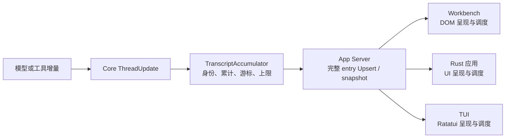

# `zeta code` TUI 架构与产品支持边界

> 修改 `zeta-code` 时同时遵守 scoped [`tui.instructions.md`](../.github/instructions/tui.instructions.md)；该 instruction 只保留任务期规则，完整产品架构和当前状态仍由本文拥有。

> 物理位置：`zeta-code/tui/`；ANSI/Ratatui adapter：`zeta-code/ansi-escape/`
> 宿主：`zeta-code/cli/`
> 文档所有权：本文是 TUI 跨 crate ownership、长期不变量、产品支持边界与已接受架构迁移顺序的 canonical 文档。
> 当前实现接口与事件循环：[`zeta-code/tui/README.md`](../zeta-code/tui/README.md)
> 聊天输入区当前架构：[`tui-chat-composer.md`](tui-chat-composer.md)
> Session/Thread/正文单元/布局决定：[`tui-chat-architecture-discussion-v15.md`](tui-chat-architecture-discussion-v15.md)
> 产品接口基线：[`zeta-app-server-api.md`](zeta-app-server-api.md)  
> App Server 启动与连接基线：[`app-server-client.md`](app-server-client.md)  
> Rust 后端边界基线：[`zeta-rs-architecture.md`](zeta-rs-architecture.md)
> 产品线归属基线：[`product-lines.md`](product-lines.md)

## 快速理解

`zeta code` 的 TUI 把 App Server 的权威状态转换成终端中的可交互呈现；它拥有单写者的界面状态和事件循环，
不拥有产品事实或后台执行。

| 发生的事情 | TUI 负责 | 不负责 |
| --- | --- | --- |
| 用户按键或提交命令 | 转成类型化界面命令并发给客户端 | 直接修改 Session 或 Thread |
| 服务端产生更新 | 归约为单写者 presentation state 并请求重绘 | 重新解释领域事件 |
| 高频流式文本到达 | 通过专用临时数据面更新显示 | 把每个片段伪装成持久事实 |
| 检测到序列缺口 | 暂停推断并请求权威快照 | 用本地状态填补缺口 |
| 请求完成、过期或取消 | 按关联身份丢弃过期结果并更新交互 | 决定工具重试或 Agent 恢复 |
| 渲染一帧 | 纯读取当前呈现状态 | 在绘制过程中触发业务副作用 |
| 加载主题 | 消费共享 snapshot 的明确子集并按终端能力降级 | 复制 Desktop 的全部主题能力或默认色目录 |
| 外部 Agent 来源已经进入统一 Skill catalog | 浏览、启用或禁用已有条目 | 导入外部 Agent 配置、选择目录或扫描用户主目录 |

## 1. 结论

TUI 正式采用以下长期稳态架构基准：

> **窄而稳定的终端基础设施 + 单写者的 presentation state + 分域 event/command +
> 垂直功能切片 + 高频流式事件专用数据面 + 无业务副作用的渲染。**

这套基准约束新功能和迁移方案，但不是对 Codex TUI 目录、feature catalog 或领域状态的复制。
Zeta 的产品 authority、typed contract 和 crate dependency direction 仍由本仓库现有架构决定。

状态必须按下表阅读：

| 内容 | 状态 | Canonical owner |
| --- | --- | --- |
| 当前 wakeable event loop、typed Thread subscription、snapshot/transient resync 与交互 | Current | [`zeta-code/tui/README.md`](../zeta-code/tui/README.md) |
| 本文的 ownership 与长期不变量 | Accepted architecture baseline | 本文 |
| independent request driver、wakeable event pump | Current | [`app-server-client.md`](app-server-client.md) 与 crate README |
| 非阻塞 request completion dispatch、后端有界 transient data plane、Session/Thread/Approval/Query 垂直切片 | Current | [`zeta-code/tui/README.md`](../zeta-code/tui/README.md) |
| TUI 流式更新批处理、重绘合并与基于 revision 的渲染缓存 | Proposed | 本文 13.2.2 |
| 有序正文单元、命令输出边界、展开/详情、全屏字符框选与必要鼠标命中 | Current product support boundary | 本文与 crate README |
| active-Turn follow-up Queue、多行 `ChatInput`、copy/export、分页历史与 suspend/resume | Current | [`zeta-code/tui/README.md`](../zeta-code/tui/README.md) |
| `ChatInput` 的 Standard/Vim 编辑模式 | Current | `components/chat_input/` 与本地 terminal settings |
| `inline_visualization` 终端 fallback | Accepted；等待 canonical artifact/fallback contract | Core/App Server protocol 与本文 |
| 尚无 `zeta code` 产品要求或 canonical contract 的 feature | 非目标或 Potential；不构成实现承诺 | 对应产品线、领域与 App Server API 文档 |

本文只为已经接受的 `zeta code` 能力规定架构与迁移顺序。“某能力在 TUI 中不存在”不自动产生
产品 backlog。Native Agent Timeline 的 Markdown、table、selection、折叠与虚拟化由
[`app/docs/native-agent-console.md`](../app/docs/native-agent-console.md) 规划，具体 Native
Markdown 组件由 [`app/markdown`](../app/markdown/README.md) 拥有；TUI 不追求与其 feature
parity。remote selector/reconnect、通用 structured Mention 和 durable blob 只有在产品文档
接受需求并确定 canonical owner 后，才可能成为某条产品线的实施项。

Zeta 已经在 TUI 外部拥有：

- `zeta-core` 中权威的 `ThreadController`；Session tree 由 Thread 的 `session_id` 聚合；
- `zeta-app-server-protocol` 中唯一的 wire contract；
- `zeta-app-server-client` 中共享的 App Server 启动、初始化、请求/事件连接与关闭层；
- CLI 交付的启动配置与产品入口参数。
- `zeta-theme` 中与 Desktop/Native 共享的 manifest、用户主题解析和 device preference loader。
- `zeta-ansi-escape` 中独立的 ANSI SGR → Ratatui presentation adapter；它不拥有 PTY/terminal state。

主题边界是“部分接入”而不是“尚未复制完成”：TUI chrome 读取 accent、`ChatInput` chrome、错误、
成功、警告、弱化文字和选择高亮；Theme Pane preview 额外读取有限的 syntax/diff token。选择高亮由
`tui.highlightForeground` 独立表达，不借用编辑器关键字色。`render/theme.rs` 将透明色先合成到 terminal
background，再按 TrueColor、ANSI-256、ANSI-16、Monochrome 投影；其他 Desktop/Native token
不进入 TUI API。
主题选择保存在共享 profile `configuration.json` 的 `tui.colorTheme`，由 `zeta-theme` 严格读取并
原子写回；它不进入 App Server Config API。无参数 `/theme` 打开由 `features/theme` 拥有、不可搜索的固定
Zeta Code Theme Pane 以 `Theme` 为标题，顶部分隔线与标题、标题与第一个候选项之间各保留一行；固定选项为 Auto、Dark/Light、对应 colorblind-friendly 与 ANSI-only 模式，以及 Custom
color theme。候选行编号展示，cursor 选择色和 syntax/diff preview 随候选主题变化；Enter 原子保存、
即时切换并关闭整个 Theme flow 返回主界面；保存成功后 transcript 以独立的状态圆点显示实际执行的 `/theme <id>`，下一行通过 `└─` 结构连接符归属结果说明，两行正文保持同列对齐；保存失败时则保留当前 Pane 以显示错误。移动 cursor 时，Theme Pane 分隔线、上方 welcome banner
框线使用候选 highlight；独立 `Diff preview` 区域不画左右边框，只用候选 muted token 绘制上下
较高对比度的长节虚线。主题列表与 preview 间保留两行，palette 来源说明与操作提示间保留一行。preview 下方标明
GitHub、GitHub Colorblind、ANSI 16 colors 或 User-defined 配色来源。`/theme <id>` 保留直接切换。通用 `ListSelection` Pane 的搜索是独立、
可配置的底座；启用搜索的 feature 必须先按 Space 进入 search mode，页面 KeyHints 明示 `Space search`。
所有本地 command 都可使用同一个“命令 + 结果”正文单元：命令本身不带箭头符号，独立的状态圆点为 Running 显示 `◉`，为 Succeeded 显示 `●`；结果行使用与状态位结构相连的 `└─` 表达归属，正文与命令文字同列对齐并使用弱化色，之后才空行。正文单元按稳定 `TranscriptCellId` 展开，并可在 QuickView 中查看 TUI 拿到的完整保留表示；若上游已省略内容，详情必须保留该事实。
Auto 在终端 raw mode 建立后、输入事件线程启动前发出一次 OSC 11 背景色查询，并按实际 RGB
亮度选择 Light/Dark；120 ms 内没有有效响应时读取 `COLORFGBG`，仍无法识别才安全回退 Dark。
检测结果在当前 TUI 会话内缓存，主题面板与再次选择 Auto 不会重复查询；显式模式不受该判断影响。

因此 TUI 必须是可丢弃、可重新同步的 presentation shell，而不是第二个 Agent runtime 或
App Server facade。产品权威状态的依赖链固定为：

```text
zeta-cli
  → zeta-tui
    ├─ zeta-ansi-escape → ansi-to-tui / ratatui
    └─ zeta-app-server-client
       → App Server dispatcher
       → zeta-core
```

本地只读能力不必统一绕行 App Server：`ChatInput` 的当前目录路径 mention 直接调用
`zeta-file-search`；需要环境目录授权、跨进程一致性或 watcher revision 的 Git 状态通过
typed App Server Git contract。原则不是“所有数据经过一个 facade”，而是
“每个 feature 消费事实 owner 已提供的 public typed interface”。

进程内模式只是一种 transport 优化。TUI 仍然经过 initialize、typed request/response、
dispatcher 和 notification decode，不得直接依赖 Core、Storage、Exec、Sandbox 或 Model
Provider。

## 2. 基准采用与 Zeta 修正

长期基准中的通用结构按下表落到 Zeta：

| 基准概念 | Zeta 中的处理 |
| --- | --- |
| `app/` | 保留，但只拥有 TUI 状态、事件协调和退出流程 |
| `app_server/` | 不建立；typed RPC 已由 `zeta-app-server-client` 和 protocol crate 拥有 |
| `thread/` | 作为 `features/thread/` 保留；拥有 active Thread 的可重建展示状态和交互流程 |
| `chat/` | 不建立总括目录；Turn flow 与正文单元归 `features/thread/`，`ChatHistory`、`ChatComposer` 和 `ChatInput` 归 `components/`，整页几何归 `app/screen_layout.rs` |
| `render/` | 已建立为 `zeta-tui` 内唯一的通用渲染基础设施；拥有纯布局、不可变主题、只读上下文与测量/绘制契约 |
| `ui/` | 已退场；不能与 `render/` 并列保存布局、颜色或渲染 helper |
| `terminal/` | 保留，只负责真实终端生命周期和能力 |
| `features/` | 保留，但只添加 Zeta 已有或已接受产品契约支持的功能 |
| `platform/` | 不建立泛化 facade；窄 OS adapter 放入 `host/` 的明确子模块 |

尤其不能在 TUI 中定义第二个 `ThreadController`。`zeta-core::ThreadController` 是 Thread 执行、
持久化、顺序和恢复的 authority；TUI 的 Thread 数据只是由 snapshot 和 update 构成的
read model。

同样，TUI 内部不应出现另一个聚合 account、session、thread、turn、config 等 RPC 域的
facade。CLI 使用 `zeta-app-server-client` 建立并初始化 `AppServerSession`，再把该运行会话
的所有权交给 TUI；TUI 围绕其 cloneable request handle 与 event stream 补充交互客户端所需的
请求调度、订阅和错误映射。该 `AppServerSession` 是 connection/runtime owner，不是产品
`Session`。

## 3. 产品状态与 TUI 状态

权威产品模型与 sequence/cursor 语义统一见 [`protocol.md`](protocol.md)。TUI 只消费这些
canonical snapshot/update，不在本地重新定义产品实体。

TUI 可以在使用相应数据的 feature 中保存以下可重建状态：

- 当前选中的 Session、Thread、Turn 或 Item；
- 当前页面需要的 canonical Session/Thread snapshot；
- 每个 aggregate 最后确认的 durable sequence；
- 当前 runtime 的 transient stream cursor；
- `ChatInput` 草稿、光标、选择区和输入历史；
- scroll、折叠、tab、overlay 和 picker 状态；
- 正在发送的 typed command 及其稳定 `CommandId`；
- connection、subscription、resync 和可展示错误状态。

TUI 不得保存或推导：

- Session membership、fork lineage 或 lifecycle 的第二份权威状态机；
- Thread、Turn、ThreadItem 或 Tool Call 的执行状态机；
- writer lease、command receipt 或持久化恢复状态；
- approval、sandbox 或 tool execution policy；
- 从日志、stderr 或人类文本解析出的产品终态。

命名时必须区分三种生命周期：

- `ProductSession` 或 protocol 中的 `Session`：产品任务；
- `AppServerConnection`：RPC connection；
- `TerminalSession`：raw mode、alternate screen 等终端资源。

禁止用无修饰的本地 `SessionState` 同时表达上述多个概念。

## 长期架构不变量

以下约束是架构评审中的默认拒绝条件，而不是可选风格。若实现确实需要偏离，必须先在本文记录
原因、影响范围、恢复策略与退出条件。

### 单写者

TUI semantic/presentation state 只能由主事件循环写入。后台 task、transport callback、host
adapter 和 renderer 只能产生 event 或完成结果，不能直接修改共享 feature state。

单写者不表示所有工作都在主线程同步执行。RPC、文件搜索、大型 transcript projection 和其他昂贵工作应
异步执行，但其结果必须重新进入有序 event loop，并由当前 state owner 判断是否仍然有效。

### 状态分类

| 类别 | 示例 | Owner 与约束 |
| --- | --- | --- |
| 可重建 presentation state | active Thread snapshot、pending command、connection/resync、可展示错误 | 对应 feature 或 `app/`；可由 typed input 重建 |
| 局部交互状态 | draft、cursor、selection、scroll、overlay 展开 | 明确生命周期的 component；不提升为全局 store |
| runtime resource | terminal handle、channel、task、clock、client、cache | driver/client/terminal；不得进入可 replay state |
| 产品权威状态 | Thread/Turn reducer、writer lease、approval policy、durable recovery | TUI 外的 canonical owner；TUI 不复制 |

### 纯渲染

`view`、layout 和 Ratatui renderer 只能读取 state 与只读环境信息。禁止在 draw path 中：

- 发起 RPC、读取文件或写配置；
- spawn task 或改变 subscription；
- 推进 Turn、animation 或 paste 等语义状态；
- 根据 frame 次数决定业务结果；
- 查询 Git、usage 或其他可能阻塞的接口。

时间驱动变化由明确的 timer event 推进；render cache 属于 runtime resource，并使用稳定
identity、revision、width、theme/capability revision 等显式 key 失效。

### 显式副作用与局部协议

跨边界行为必须先成为 typed command/intent，再由 driver、feature request module 或窄 host
adapter 执行，完成结果重新成为 event。顶层 `AppEvent`/`AppCommand` 只负责领域路由；具体
变体留在 feature 内，不能重新形成覆盖所有 RPC 的大枚举。

不建立高度泛型的 `Feature` trait、全局 `Services` facade 或任意闭包 callback 总线。普通
Rust struct/enum/function 和一致约定是默认方案；只有多个真实调用方证明语义相同时才提取
共享抽象。

### 请求关联与过期结果

任何可能乱序完成的读取或计算必须携带 generation、目标 scope 和必要的 request identity。
写操作还必须遵守 canonical `CommandId` 与 expected sequence 语义。旧 generation、错误 scope
或已取消请求的结果不得覆盖当前 state。

### 控制面、数据面与恢复

用户意图、退出、interrupt、写请求结果、committed update、错误和 subscription lifecycle
属于有序控制面；token delta、process output 和 tool progress 等高频事件进入按 aggregate
隔离的 bounded 数据面。所有 lag、overflow、cursor gap、identity mismatch 和已经实现的
connection recovery 路径必须定义 resync contract，不能只记录 warning 后继续猜测状态。

### 内部优先

目标边界先在 `zeta-tui` crate 内通过 private module 和 `pub(crate)` 验证。只有 runtime 或
component 被至少两个真实消费者使用、API 变化频率下降且抽取能减少依赖时，才评估独立 crate
或公共插件 API。窄的第三方类型适配层可以按依赖隔离提前成为产品内 crate，但必须保持单向、
无产品状态且有明确 failure semantics；`zeta-ansi-escape` 是当前唯一此类例外。

## 4. 目标目录

目标结构如下：

```text
zeta-code/tui/
├── src/
│   ├── app.rs
│   ├── app/                    # state, event, command, frame, event merge and loop
│   ├── client.rs / client/     # typed completion and App Server event adaptation
│   ├── features.rs / features/ # product-facing vertical features
│   ├── components.rs
│   ├── components/
│   │   ├── chat_history.rs / chat_history/
│   │   ├── chat_input.rs / chat_input/
│   │   ├── chat_composer.rs / chat_composer/
│   │   ├── pane.rs / pane/
│   │   ├── list_selection.rs / list_selection/
│   │   ├── approval.rs / approval/
│   │   ├── query.rs / query/
│   │   ├── quick_view.rs
│   │   ├── detail_list.rs / detail_list/
│   │   ├── text_prompt.rs / text_prompt/
│   │   ├── key_capture.rs / key_capture/
│   │   ├── search_box.rs / search_box/
│   │   └── tab_list.rs
│   ├── render.rs               # Renderable and RenderContext
│   ├── render/
│   │   ├── layout.rs           # area allocation, inset, clip and viewport
│   │   ├── text.rs             # owned lines, prefix, Unicode width and wrapping
│   │   ├── theme.rs            # immutable RenderTheme and terminal color mapping
│   │   └── cache.rs            # bounded revision-keyed derived render data
│   ├── terminal.rs / terminal/ # terminal lifecycle and input source
│   ├── host.rs / host/         # narrow OS and process adapters
│   └── lib.rs
├── Cargo.toml
└── README.md
```

上图只列当前已有能力和已确定的下一阶段 owner，不罗列尚无 contract 的未来 feature。每个
子目录都给出首批具体文件；实现初期不足以形成独立 owner 时继续使用单文件，不能只创建一个
空 `mod.rs` 或 slash-only 占位目录。文件名表达职责，不要求一次性生成整棵目录树。

## 5. `app/`：应用协调

`app/` 负责：

- 接收 terminal event、client result、server notification 和 background completion；
- 把输入转换为语义明确的 `AppCommand`；
- 协调 active feature、component、overlay 和请求结果；
- 管理焦点、顶层模式、退出与恢复终端；
- 决定何时请求重绘。

建议把可测试状态与副作用 driver 分开：

```rust
struct TuiApp {
    connection: ConnectionViewState,
    active_view: ActiveView,
    thread: ThreadFeatureState,
    sessions: SessionsFeatureState,
    status_line: StatusLineModel,
    overlays: OverlayStack,
    pending_commands: PendingCommands,
}

struct AppDriver<C> {
    app: TuiApp,
    client: C,
    terminal: TerminalSession,
}
```

`TuiApp` 处理事件并产生 command；`AppDriver` 执行 I/O，再把结果作为事件送回。这样 reducer
式状态测试不需要打开终端或 App Server。

`app/` 可以协调其他模块，但禁止：

- 实现具体 Ratatui widget；
- 拼接 JSON-RPC method string 或手写 wire JSON；
- 执行 Session/Thread 领域 reducer；
- 直接运行 shell、模型或 Agent tool；
- 成为每个 feature 私有状态的杂物桶。

`bootstrap.rs` 只负责 TUI 启动流程，例如打开 terminal、读取入口所需 snapshot、进入指定
Session。CLI 可以构造 start options，但 App Server composition、channel 建立、initialize、
schema gate 和 shutdown 属于 `zeta-app-server-client`，TUI 不复制这些步骤。

## 6. `client/`：TUI 到 typed 客户端的窄适配

`client/` 不是新的 App Server facade。它只负责交互客户端特有的：

- 持有 cloneable `AppServerClient` request handle 和 `AppServerEvents`；
- 驱动 pending typed request completion；
- 持续消费 `AppServerEvents`，将 `ServerNotification` 转换为内部事件；
- 维护 subscription transport lifecycle；
- 为一次逻辑写操作分配并保留稳定 `CommandId`；
- 将 stable server error 映射为可操作的 TUI 错误类别。

RPC Params、Result、Notification 和错误码仍由：

```text
zeta-app-server-protocol
zeta-app-server-client
```

唯一拥有。`client/` 不得复制 DTO、兼容旧 method、直接序列化 JSON-RPC 或暴露
`execute(method: &str, ...)`。

具体领域请求不汇总成 `ClientOperation` 大枚举。`features/thread/request.rs`、
`features/config/request.rs` 等模块直接调用 `AppServerClient` 的 typed method，并把完成结果
转换为自己的 feature event；Session/Thread/Turn mutation 统一使用 `request_session`，
`client/` 只提供执行与投递机制，不复制 App Server 的领域 contract。

一次逻辑写操作在超时或响应丢失后重试时必须复用原 `CommandId` 和 exact typed payload。
用户再次点击或再次提交是新命令，必须生成新 ID。`expectedSequence` 来自目标 Thread
在对应 feature 中最后确认的 canonical snapshot，不能使用 JSON-RPC request ID、stream
cursor 或另一个 aggregate 的 sequence。

这些 identity 不得互换：

| Identity | 解决的问题 | 生命周期与规则 |
| --- | --- | --- |
| JSON-RPC request ID | 匹配一次 transport request/response | 每次 transport attempt 独立；不表示产品幂等性 |
| `CommandId` | 标识一次逻辑写意图 | exact retry 必须复用；新的用户意图必须新建 |
| expected sequence | 防止基于过期 aggregate state 写入 | 来自目标 aggregate 最后确认的 durable sequence |
| request generation | 丢弃旧搜索、读取或计算结果 | scope 内单调；旧 generation 不改变当前 state |
| durable sequence | 排序 committed aggregate update | 按 Session/Thread 分别连续验证 |
| stream instance/cursor | 排序一次 transient stream | 不能作为 durable completion 或 expected sequence |

pending request 至少记录 result route、scope、generation、cancellation state 和 timeout policy。
取消只表示 TUI 不再接受结果；除非 typed contract 明确支持取消，不能假定远端副作用没有发生。
写请求在结果未知时不得自动生成新 `CommandId` 重放。

共享 client 使用 bounded request/event channel、per-request completion 与独立 wakeable
`AppServerEvents` 替换 TUI 的 `round_trip + drain_notifications` 路径。TUI 的
`client::RequestTask` 执行 typed request，`app::request_completion` 在单写者 loop 校验 scope 并
安装结果；用户 request intent 在单槽执行器前保序排队，Quit 和纯本地操作仍可立即处理。TUI
不能通过直连 Core、读取日志或私有 transport method 绕过。

## 7. `features/thread/`：active Thread 的唯一 TUI 所有者

Zeta 的主要交互对象是 Thread，因此不再建立通用 `projection/` 和 `conversation/` 两层。
`features/thread/` 是 active Thread 在 TUI 内的唯一状态 owner：

| 文件 | 职责 |
| --- | --- |
| `state.rs` | 保存当前 `ThreadId`、canonical snapshot、最后确认 sequence、transient items 和 view-local selection |
| `update.rs` | 校验并应用 typed snapshot/update，处理 committed/transient 替换和 resync intent |
| `command.rs` | 定义 start、interrupt、fork 等用户意图及 pending command 状态 |
| `request.rs` | 直接调用 `AppServerClient` 的 Thread/Turn typed methods |
| `presentation.rs` / `transcript.rs` | 把 `ThreadFeatureState` 映射为 `ChatHistory` 消费的持久内容 |
| `thread_tests.rs` | 覆盖 sequence、resync、Turn flow 和可见 item 顺序 |

这里保存的是可由 server snapshot 重建的客户端状态，不是第二个 `ThreadController`：

- 输入只允许 typed snapshot/update 和明确的本地 UI intent；
- 不执行业务校验、持久化或 Tool 副作用；
- 不补造缺失 event；
- 不从展示文本推断 Turn/Item 终态；
- 遇到未知 update、sequence 空洞或 identity 不一致时产生 resubscribe/resync intent。

Session 列表、唯一的总 Session Manager 和 Session 页面状态归 `features/sessions/`，不会进入一个跨领域
`ProjectionStore`。PR 工作属于该总 Manager 下的一种 Session 工作流，不建立第二个 PR Manager，也不从标题猜 PR 身份。其他 feature 同样只缓存自己页面真正需要的 typed result。

### 7.1 持久化序列

只有 Thread 拥有 durable sequence。Session 是由共同 `session_id` 聚合出来的读取视图；`session/changed` 只通知消费端重新读取，不携带序列。Thread 收到 committed update 时：

1. `durableSequence <= localSequence`：作为重复 delivery 忽略；
2. `durableSequence == localSequence + 1`：应用到 active Thread state；
3. `durableSequence > localSequence + 1`：停止增量合并并重新 subscribe；
4. update identity 与当前 aggregate 不一致：视为协议错误，不路由到当前视图。

subscribe result 必须作为一个完整的 resync package 处理：

1. 校验 snapshot identity，以及返回 gap 在 `afterSequence` 之后连续；
2. 直接把 snapshot 安装为当前 canonical 基线；
3. 不把已经包含在 snapshot 中的 gap event 再应用一次；
4. 丢弃已经排队且 sequence 不大于 snapshot sequence 的重复 notification；
5. 从 snapshot sequence 开始继续应用新的连续 live notification。

连续序列算法只处理 `ThreadId + sequence`，不能扩展成保存所有领域状态的 store。

### 7.2 临时流游标

transient update 由 `features/thread/update.rs` 处理，只影响低延迟显示：

- cursor 只在同一 `streamInstanceId` 内连续；
- `streamInstanceId` 改变时清空旧 transient buffer；
- cursor 出现空洞时丢弃不可信 transient 内容并重新同步；
- committed Item 到达后替换相同 Item 的 transient 版本；
- transient 文本永远不能决定 Turn completed、failed 或 interrupted。

## 8. `components/`：有局部状态的交互与呈现组件

`components/` 与 `render/` 的区别是：component 可以拥有局部交互状态，也可以理解少量产品展示
value；但不能调用领域接口或保存 canonical aggregate。

| Component | 拥有 | 不拥有 |
| --- | --- | --- |
| `chat_composer/` | 常驻 `ChatInput`、stacked Pane 与 Suggest 的局部 routing | Approval、Query、Queue、Goal、Plan、Session/Thread lifecycle |
| `chat_input/` | draft、Unicode cursor、attachments 和 paste bindings | Suggest、Turn start、config mutation、App Server client |
| `suggest/` | `/`、`@`、`$` 候选状态、选择、补全和鼠标命中 | ChatInput 草稿、Turn start、产品副作用 |
| `chat_history/` | plain-text visible row、wrapping 与 scroll | canonical Thread snapshot、sequence、transient cursor |
| `pane/` | `PaneSpec`、`PaneStack`、`PaneId`、封闭 `PaneBody`、统一 `PaneOutcome`、存活 `Pane` 和当前帧只读 `PaneView`；集中输入、高度、绘制、提示和命中分派 | 具体产品动作、RPC、QuickView、`ListSelection` 专属的 Tab/Search/Adjust 状态 |
| `quick_view.rs` | 不改变正常布局高度的通用只读覆盖层 | `/status` 等功能事实和产品动作 |
| `tab_list.rs` | tab 集合、当前项、键盘与鼠标横向切换、窄宽度换行和绘制 | pane 内容、搜索、产品 action |
| `list_selection/` | query、filtered indices、selection 和通用列表渲染，并组合 `tab_list` 切换每组候选项 | Session/Skill identity 的业务 action，非列表页面 |

`features/thread/update.rs` 完成 committed/transient item 合并并暴露有稳定 identity 的可见
items；`components/chat_history/` 只负责把这些 items 布局和渲染。`ChatInput` 提交时只产生
`ChatSubmission`，由 `features/thread/request.rs` 转成 Turn request。这样同一份 Thread
状态不会同时由 feature 和 component 保存。

component 可以依赖 `render/` 原语和必要的 canonical value type，但禁止：

- 直接调用任何 crate/App Server 领域接口；
- 保存 Session membership、Thread lineage 或 durable sequence；
- 决定 Tool 是否允许执行；
- 根据展示文本判断产品终态；
- 通过 callback/闭包把任意业务副作用藏进通用组件。

## 9. `render/`：通用 Ratatui 渲染基础设施

`render/` 是 `zeta-tui` 内部共享的渲染底座，不是三端共享 crate，也不是全局 UI 状态 owner。它统一 component 已经重复使用的 Ratatui 机械能力：

- `Renderable` 当前统一宽度测量与绘制 contract；滚动和光标仍由拥有局部交互状态的 component 处理，出现第二个相同需求后再扩展 contract；
- area、inset 与 bottom anchor 等当前已复用的纯布局；column/flex、clip 与 scroll viewport 只有出现真实重复调用方后再加入；
- line 的借用/持有转换、批量复制、首行/续行 prefix，以及直接复用 Ratatui wrapping 的高度计算；
- 有资源上限、使用当前 `RenderTheme` syntax token 且不保存第二套主题状态的代码高亮；
- 不可变 `RenderTheme`、color 与 spacing 的 Ratatui 映射；
- 后续由稳定 identity、content revision、width、theme revision 与 render mode 定位的有界派生缓存。

`render/` 不得出现：

- `SessionId`、`ThreadId`、`TurnId`；
- `AppServerClient`、RPC Params 或 `ServerNotification`；
- approval、model、plugin 等产品状态；
- 完整的 Session browser 或 Thread transcript；
- frame deadline、event queue、terminal I/O 或后台 task；
- 为所有 feature 定义统一的业务 view enum。

通用横向 tab 交互放在 `components/tab_list.rs`，过滤和选择状态放在 `components/list_selection/`；“恢复哪个 Session”的 row model、typed ID 和 action 属于 `features/sessions/`。`render/` 只提供这些上层模块共同需要的纯布局、绘制与缓存机制。

当前实现已经把 inset、bottom anchor 等纯 geometry 迁入 `render/layout.rs`；`render/text.rs` 统一行的借用/持有转换、复制、前缀和实际折行高度；`render/highlight.rs` 使用 bundled syntax 定义与 Zeta syntax token 完成有界高亮。颜色合成、终端色阶映射与不可变 `RenderTheme` 位于 `render/theme.rs`，主题目录读取、预览、选择和保存位于 `features/theme/resource.rs`。活动主题由 `App` presentation state 持有，并通过只读 `RenderContext` 从根 Frame 传给所有 renderer；draw path 不再读取全局锁，也没有独立 syntax-theme 全局状态。`ui.rs` 与 `ui/` 已删除且没有转发层。`app/frame.rs` 继续拥有整页 surface 装配，component 继续拥有自己的 view model 与具体 renderer；`render/` 不接管页面结构或 feature 文案。

依赖方向固定为：

```text
feature state → component view model → component renderer → render primitives
                                      ↘ app/frame composition
render primitives → ratatui
terminal/session → ratatui backend draw
```

`ChatHistoryView` 与 `ChatComposerSurface` 已是 `Renderable` 的首批真实消费者，同一实现同时提供宽度测量与绘制。`ChatHistoryView` 的多行正文、ANSI detail、首行/续行前缀、总高度、scroll 和 pointer row 现在都从同一组 `Line` 及 `Paragraph::wrap` 结果得出，不再保留另一套 Unicode 行数估算。Theme Pane 的 Rust diff preview 是高亮入口的首个真实调用方。其他 component 只有在需要同一测量 contract 时再迁入，不能为了统一外形一次性包装全部 `draw` function。后续 cache instance 由使用它的 component/runtime 持有；`render/` 只定义 key、容量和失效规则，不建立全局 cache service。

## 10. `terminal/`：真实终端基础设施

宿主终端身份、multiplexer、色彩等级与背景回退解释的 crate contract 见
[`zeta-terminal-detection`](../zeta-rs/terminal-detection/README.md)；本节只定义 TUI 对真实终端
I/O 和 crossterm 生命周期的所有权。

`terminal/` 负责：

- raw mode、alternate screen 和 bracketed paste；
- Crossterm event 读取；
- Ratatui backend 和 frame draw；
- terminal resize、reflow、cursor 和 scrollback；
- 在独占 input window 中执行 terminal response probe 和控制序列；host terminal 身份、色彩等级及
  background fallback 解释由 `zeta-terminal-detection` 提供；
- panic、错误和正常退出时恢复终端。

`TerminalSession` 必须使用 RAII 恢复 raw mode、alternate screen、paste mode 和 cursor。
启动中途任一步失败，也必须回滚之前成功启用的能力。

`terminal/` 不知道产品 Session、Thread、Turn、feature 或 App Server。它可以产生
`TerminalEvent`，但不能发送 Agent `session/request`、打开 approval popup 或根据 Agent 状态决定文案。

## 11. `features/`：Zeta 功能的垂直切片

一个完整 feature 可以包含：

```text
features/<name>/
├── ../<name>.rs
├── state.rs
├── command.rs
├── request.rs
├── pane.rs
└── <name>_tests.rs
```

不是每个 feature 都需要全部文件。`command.rs` 表达用户意图，`request.rs` 直接调用数据
owner 的公开 typed interface，`pane.rs` 组装打开 Pane 需要的 `PaneSpec` 和产品动作映射。没有请求的 feature 不创建空
`request.rs`，也不建立 `mod.rs`、`service.rs`、provider registry 或 feature-local facade。

目标树中已经确定的首批 feature：

| Feature | 职责 |
| --- | --- |
| `thread` | active Thread snapshot/update、Turn start/interrupt、transient merge 与页面组装 |
| `sessions` | Session list/create/resume/archive 与 Thread create/fork/rewind/switch |
| `interactions` | owner-directed approval 与 structured user-input view/response mapping |
| `config` | typed config read/update UI |
| `skills` | typed catalog、enablement intent 和 selection row model |
| `dirs` | 当前 Session 的目录列表、添加、移除和逐目录能力修改意图 |
| `file_search` | `zeta-file-search` mention completion |
| `status_line` | 汇集既有接口结果并执行 item 排列、降级与渲染 |

resources 等已经有 typed contract、但尚无 `zeta code` 用户场景的能力不提前出现在
目录树中，也不构成 TUI backlog。只有产品文档先接受具体场景后，才按同一文件契约
添加 feature。

approval、request-user-input 与 MCP 已在 canonical contract 完整后作为垂直切片接入；TUI 只声明
实际支持的 interaction kind，App Server 选择唯一 owner，deadline/cancellation 不由 view 决定。
以下能力仍不能仅因为其他产品存在就提前创建：

- plugins、connectors 和 account/login surface；
- hooks、goals、usage 和 review；
- feedback、updates 和 visualization；
- sub-agent 或 side conversation 导航。

这些能力必须先进入 Zeta canonical domain 和 App Server API，具备 typed
request/response/notification、顺序、取消、错误与恢复语义，然后 TUI 才添加对应垂直切片。
未来 interaction kind 也必须先扩展同一个 capability/owner/request/response/deadline contract；
TUI 不能靠检查 ToolCall 名称或 arguments JSON 自行弹窗并决定策略。

外部 Agent 配置导入是明确的 Desktop-only 产品边界，不属于上述“等待 canonical contract
后再进入 TUI”的潜在功能。TUI 不提供 `/import-agent`、导入目录选择器或等价的
配置 mutation，也不主动扫描 `~/.codex`、`~/.claude` 等目录。Desktop 已经导入的外部 Skill
仍可通过 App Server 统一 catalog 出现在 TUI `/skills` 中；这只是消费既有来源，不使 TUI
成为导入或文件访问授权 owner。Desktop 工作流见
[`zeta-desktop-architecture.md`](zeta-desktop-architecture.md#22-外部-agent-配置导入仅限-desktop)，
Skill 来源边界见 [`skills.md`](skills.md#151-外部-agent-skill-导入仅限-desktop)。

`/add-dir <path>` 是 Session tree 级目录授权流程。Config 页的 Add-dir 标签显示 Read files、Modify files、Run commands、Watch files、Browse files、Search files、Instructions、Config、Skills、MCP、Language services、Hooks、Plugins、Inspect repository 和 Mutate repository。TUI 通过 `session/dirs/add` 添加目录，通过 `session/dirs/permissions/set` 按 revision 替换 Permission；不带参数时列出目录，Enter 通过 `session/dirs/remove` 撤销。新增、移除和权限修改都会撤销旧 Authorization，依赖相关 Permission 的 Terminal、搜索任务和语言服务随之停止或失效。该流程不写入对话历史，也不改变 `cwd`。

Feature 之间不能依赖彼此的私有模块。跨功能结果由 `app/` 协调，交互复用通过
`components/`，纯布局与绘制机制复用通过 `render/`；只有重复已经出现且语义一致时才提取公开的小型 value
type。

### 11.1 `status_line/`：接口结果的展示模型

长期应把 status line 作为完整的 presentation subsystem，但“完整”只表示它独立拥有 item
选择、排列、宽度降级和渲染，不表示它接管数据来源。各项数据仍由相应领域 crate 或 App
Server contract 的公开接口拥有，TUI 在事件/更新阶段直接调用这些接口，再把结果映射为可丢弃
的 `StatusLineModel`。禁止建立通用 `StatusProvider`、`StatusStore`，也禁止在 draw 路径查询
Git、配置或 Thread。

| Item | 权威接口 | TUI 的职责 | 当前状态 |
| --- | --- | --- | --- |
| preferred model | `AppServerClient::read_config` | 把 `ConfigReadResult::preferred_model` 映射为长/短文案 | 已实现 |
| Welcome workspace | `TuiOptions::workspace_root` | `WelcomeModel` 在 App 构造阶段把用户主目录缩写为 `~`，供空会话和 Manager 顶部 Welcome Banner 显示 | 已实现；不属于 status line |
| Git branch | App Server `git/status` + `git/statusChanged`，其 owner 调用 `zeta-git` | startup/read 与 notification 映射 branch | 已实现 |
| Git changes | App Server `git/status` + `git/statusChanged`，其 owner 调用 `zeta-git` | 映射变更数量，干净时省略 | 已实现 |
| permission mode | App 保存下一次 Turn 要提交的 `ApprovalMode`；运行中 Turn 提供冻结值 | 只格式化 `current` / `next`，不修改 Session 或权限状态 | 已实现 |
| Thread/Turn/usage | App Server typed snapshot/update | 消费 contract 已提供的字段，不从 transcript 推导 | Thread usage contract 已提供；status line 尚未接入 |
| connection state | `client/` 本地状态 | 只在已接受的用户场景中映射 | Potential；embedded TUI 当前无独立 connection UI 需求 |

依赖方向固定为：

```text
owning crate interface / typed App Server result
                    │
                    ▼
            app update coordination
                    │
                    ▼
              StatusLineModel
                    │
                    ▼
          pure layout + Ratatui render
```

`status_line/` 定义稳定的 item identity、固定顺序、用户开关、separator 和 overflow policy；`StatusLineResource` 把四个产品显示开关保存到 CLI 显式提供的 `<profile>/zeta-code/statusline.json`，资源不进入 App Server，renderer 也不读取文件。昂贵或异步接口在后台完成后以 event 更新模型；失败只影响对应 item，并保留其明确的 unavailable/stale 语义。任何新 item 都应先回答“哪个 crate/interface 拥有这个事实”，再添加展示映射和宽度测试。

当前实现由 `features/status_line/model.rs` 组合 working/waiting、Plan、Queue 与当前 Session 的后台 Subagent 数量，以及按“权限、模型、Git 分支、Git 变更”排序的配置项。`features/status_line/view.rs` 最多绘制两行。总 Session Manager 改用一行选择/创建 KeyHints；SubagentPane 或 Chord 等表面需要明确按键时，固定一行 KeyHints 直接替换 StatusLine；StatusLine/KeyHints 与存在内容的 SubagentPane 之间保留一行。`features/status_line/resource.rs` 仍负责显示开关的有界读取、revision 校验和原子保存。

## 12. `host/`：窄宿主能力

`host/` 只放非终端 OS 或进程 adapter，例如 clipboard、external editor、desktop notification、IDE IPC 和 termination signal registration。每个模块必须暴露窄能力，不能形成一个统一的大型服务对象。

职责按“何时”与“如何”拆开：

```text
features/thread：何时通知用户 Turn 已结束
host/notification：如何调用某个 OS 通知后端

components/chat_input、components/chat_history：产生 copy/open-editor intent
host/clipboard、host/external_editor：如何访问宿主能力

app：何时结束当前 TUI session
host/termination：如何接收进程终止请求
```

宿主 adapter 不得反向依赖 component 或 feature workflow。终端 suspend 使用的 `SIGTSTP` 仍属于 `terminal/`，因为退出终端模式、暂停和重新接管必须作为一个事务完成。

## 13. 事件与命令流

顶层数据流固定为：

```text
TerminalEvent / ClientResult / ServerNotification / TerminationRequest
                      │
                      ▼
                   AppEvent
                      │
                      ▼
              TuiApp state transition
                │                 │
                ▼                 ▼
           AppCommand          redraw
                │
                ▼
        typed client / host adapter
                │
                └──────────────► AppEvent
```

建议区分：

- `AppEvent`：已经发生的事实；
- `AppCommand`：等待执行的副作用意图；
- feature event/command：feature 内部语义；
- `TerminalEvent`：原始 key、paste、resize、tick；
- `ServerNotification`：App Server typed notification。

不要把所有类型压成一个包含任意闭包、JSON 或字符串 method 的总线。原始 key event 应先由
当前焦点和 keymap 转换为用户意图，再进入业务 command。三端共享语法和 Zeta Code 的根级
Keymap 边界见 [`keybindings.md`](keybindings.md)。

单个 event-loop iteration 应有界，长请求、resource 读取和大型 transcript projection 不得阻塞
terminal event pump。重绘可以合并，但 committed update、输入和退出事件不能因为 frame
throttle 丢失。

### 13.1 输入、焦点与浮层

输入传播顺序固定为：

```text
system capture
      ↓
top overlay
      ↓
active feature
      ↓
focused component
      ↓
parent bubble
      ↓
application fallback
```

局部 handler 返回 `Handled`、`Propagate` 或 typed intent；不能通过默认空 hook 把 approval、
plugin 或 Session 等领域行为继续塞进通用 view trait。内置 overlay 优先使用可穷举的 enum 和
显式 stack，只有真实外部扩展场景才使用动态 view object。

Ctrl-C 等冲突键按当前交互层级解释：可取消 overlay 优先关闭 overlay，局部搜索优先取消搜索，
active Turn 转成 interrupt，只有空闲顶层状态才退出。相同语义必须由键盘、鼠标和 command
surface 复用同一 intent，不各自执行副作用。

### 13.2 控制面与流式数据面

普通控制总线不承担全部 streaming 流量：

```text
App Server streaming update
        ↓
typed protocol decode
        ↓
per-Thread bounded stream buffer
        ↓
batch / coalesce / fair scheduling
        ↓
features/thread semantic update
        ↓
coalesced frame request
```

| 事件类别 | Delivery class | 规则 |
| --- | --- | --- |
| 退出、用户提交、interrupt、approval response | Must deliver / ordered | 最高控制优先级，不被后台流量饿死 |
| committed update、command completion、fatal error | Ordered lossless | 进入控制面；不得被 frame throttle 合并掉 |
| assistant/process text delta | Ordered + recoverable gap | 正常路径连续应用；overflow 可丢 transient，但必须由 cursor gap 清除 projection 并 resync |
| tool/progress preview | Latest wins / coalescable | 允许保留最新 revision |
| draw request | Coalescable | 多次请求合并为一次 frame |
| resize | Latest wins | 保留最新尺寸并触发必要 reflow |
| 搜索建议等后台查询 | Latest generation wins | scope 或 generation 不匹配即丢弃 |
| telemetry | Best effort | 不得反压用户交互 |

每轮先处理高优先级控制事件，再按固定数量或时间预算消费数据面；一批数据只请求一次 frame。
completion 是控制面 barrier：应用 completion 前必须消费或明确作废属于该 Turn 的先前数据。
buffer overflow、receiver lag 或 cursor gap 立即把对应 projection 标为需要 resync，不能静默
丢弃 Must-deliver 语义。

当前实现的三层上限是 App Server 每 connection 4096 条 notification、共享 client 1024 条 event、TUI EventPump 1024 条 runtime event；App Server 满载时先清 transient，control-only overflow 关闭 connection。Thread projection 每个 transient row 限 256 KiB、最多 1024 个 identity。TUI 不拥有自动重连：连接关闭后交还持久化的 Session/Thread 身份，并丢弃本代 pending request 与 queued action；本地和 Remote CLI 宿主在 30 秒有界窗口内重建 transport，之后由新的 TUI generation 读取权威 snapshot。重连耗尽或遇到协议、服务端终止错误时，CLI 输出带原 Session/Thread 身份的可执行恢复命令；本地使用 `zeta resume`，Remote 使用绑定原 host、目录、已验证 runtime 和 SSH executable 的 `zeta remote connect --resume`。连接级恢复与 cursor-gap snapshot resync 是两个不同层级，不能在 TUI 内合并为一套状态机。

#### 13.2.1 三端共用语义流，分别拥有呈现流

三端流式能力采用明确的两层所有权：后端负责“发生了什么以及当前完整内容是什么”，Workbench、Rust 应用和 TUI 分别负责“何时、以什么布局画出来”。后端不能把端侧折行、样式或按帧切分的结果作为三端共同 contract；三端也不能各自拼接模型 token、判断完成顺序或推断缺失片段。

| 能力 | 唯一 owner | 原因 |
| --- | --- | --- |
| provider delta 接收、Turn/Item/ToolCall 身份、顺序与完成边界 | Core 与 `zeta-thread-transcript` | 三端必须看到同一语义，不能因前端实现不同而产生不同正文 |
| transient 累计、容量上限、stream instance/cursor、gap 清理与 snapshot | `zeta-thread-transcript` 与 App Server broker | 丢片段、重连和慢消费者需要一个可校正的权威边界 |
| `ThreadTranscriptEntry` 的稳定身份与完整当前值 | App Server protocol | 同一条目的后续 `Upsert` 可以替换旧值，客户端不必重放原始 token |
| 可见区域、Markdown/ANSI 映射、折行、表格宽度、滚动锚点 | 各端 renderer | DOM、GPU UI 和 Ratatui 的布局与生命周期不同 |
| 更新批处理、动画、frame deadline、重绘合并、渲染缓存 | 各端 presentation runtime | 前后台状态、刷新率、viewport 和交互延迟只在本端可知 |
| transient 到 committed 的最终校正 | 后端给出 canonical item；各端替换 transient view | 完成事件必须能纠正被限流、丢弃或未显示的中间更新 |

当前后端边界已经符合这项决定：`TranscriptAccumulator` 消费内部 `ItemDelta` 与 `ToolOutputDelta`，按稳定条目身份累计文本，每次向 App Server client 发完整的 `Upsert`，而不是要求客户端拼接 token；`ThreadTranscriptSnapshot` 则把持久 Thread 与仍有效的 transient 条目合成可重建快照。Workbench、Rust 应用和 TUI 都消费同一份 transcript contract，再建立各自的 presentation state。



这条边界也决定了反压规则。对于同一 transient `entry_id`，尚未进入 presentation state 的多个完整 `Upsert` 可以在客户端队列中保留最新值；不同身份之间仍保持到达顺序。committed update 是 barrier：应用完成值前先消费或作废它之前的 transient 值，最终始终以 canonical item 为准。任何客户端都不能因为少画了中间帧而少掉最终文字。

#### 13.2.2 为什么先建立通用 render

streaming 会持续改变正文高度、可见尾部和滚动锚点。如果没有统一的测量、revision 与 cache contract，`chat_history`、Markdown、tool output 和 frame coordinator 会分别计算宽度与失效条件，随后即使增加 frame scheduler，也只能减少 draw 次数，不能减少每帧重复布局。因此 TUI 已先建立 `render/`；下一项工作是在这个边界上实现 streaming batch、cache 与 redraw 调度。

| 层 | 负责 | 不负责 |
| --- | --- | --- |
| `render/` | 当前拥有 `Renderable`、`RenderContext`、纯布局、行操作、实际折行高度、有界代码高亮和不可变主题映射；下一步增加 cache key 与有界缓存 | event、deadline、主题文件读写、RPC、feature state |
| component renderer | 把自己的只读 view model 转成 renderable，并定义局部命中区域 | 修改 feature state、读取文件、调度 task |
| `app/frame.rs` | 装配整页 surface、overlay 顺序与最终 screen selection | 保存 component 内部缓存、解释 streaming delta |
| `app/redraw.rs` | dirty revision、frame deadline、请求合并与速率限制 | 测量文本、保存正文、丢弃控制事件 |
| `terminal/session.rs` | 执行 Ratatui draw、保存最后完成的 buffer、恢复终端 | 决定何时需要新 frame |

第一步已经完成：没有建立通用 Markdown renderer 或空 cache，而是让 `ChatHistoryView` 和 `ChatComposerSurface` 使用同一个 `Renderable` contract，补齐行操作、实际折行高度和主题驱动的有界代码高亮，并完成布局、主题资源拆分和旧目录删除。下一步为 transcript cell 引入 revision-bound cache，并让 `app/redraw.rs` 合并帧请求。

#### 13.2.3 Codex TUI 的 streaming/render 经验与 Zeta 取舍

Codex TUI 的重要经验不是把 token 直接画到终端，而是把“源文本累计、结构稳定、提交到历史、请求下一帧”拆成不同阶段。Zeta 采用这些不变量，但不复制 Codex 的 terminal scrollback 实现：Zeta TUI 当前使用 alternate screen 和完整 Ratatui frame，历史正文仍由 `TranscriptProjection` 与稳定 `TranscriptCellId` 拥有。

| Codex TUI 机制 | 解决的问题 | Zeta 决定 |
| --- | --- | --- |
| 保留完整 Markdown source，只在换行后推进增量解析 | 半行、未闭合 fence 和未完成结构会反复改写 | 端侧始终保留 backend `Upsert` 的完整当前文本；若后续产品要求接受结构化文本，renderer 从 source 派生，不保存 rendered text 作为事实 |
| stable region 与 mutable tail 分离 | 已显示历史不能被后续片段改写，最后一个结构块仍可变化 | 不复制 scrollback line commit；在 `TranscriptCellId + revision` 上区分稳定 cell 与活动 cell，只允许活动 cell 的派生布局失效 |
| table holdback | 新行可能改变全部列宽，不能过早固定旧行 | 只有产品要求接受相应结构后，表格、未闭合代码块和引用定义才由端侧 renderer 保持为活动尾部；后端不识别 Markdown 布局 |
| completion 时从完整 source 重新渲染并合并 | 中间片段可能丢失，增量渲染也可能与最终结构不同 | committed entry 替换 transient entry，并使对应 cell cache 失效；最终内容不从已画出的行反推 |
| resize 时从 source 重新折行 | 旧宽度产生的 rendered lines 不能复用 | cache key 至少包含 cell identity、revision、width、theme revision 与 render mode；resize 只失效布局，不改变正文 state |
| `FrameRequester` 合并请求并限制帧率 | 高频 delta 或动画不应触发等量 terminal draw | Zeta TUI 增加独立 frame scheduler；state transition 只标 dirty，请求最早 deadline，多次请求合成一帧 |
| backlog 时从逐行节奏切到 batch catch-up | 平滑动画不能让展示无限落后于真实输出 | Zeta 不要求逐行提交动画；同 identity 的累计 `Upsert` 优先 latest-wins，每轮按 event/time budget 归约一批，再只请求一帧 |

Zeta TUI 当前已经直接应用后端组装的完整 transcript `Upsert`，但 `event_loop` 仍在每个 `RuntimeEvent` 处理完后调用整帧 `draw_terminal`，`chat_history` 也会为当前窗口重新生成全部 message lines。下一步 render 工作必须先收掉这个耦合，再增加局部 cache；不能先把 Markdown parser 或 frame request 分散进各 feature。

目标调用路径固定为：

```text
RuntimeEvent batch
  → App/feature state transition
  → dirty presentation revision
  → FrameScheduler 合并 deadline
  → app::frame::draw 只读 snapshot
  → component renderer 按 identity/revision/width 复用或重算布局
  → TerminalSession::draw
```

`FrameScheduler` 只合并 draw request，不合并状态事实。输入、退出、approval、request completion 和 committed update 仍逐个进入单写者；transient `Upsert` 才能在同 scope、同 `entry_id` 且尚未跨过 completion barrier 时 latest-wins。绘制失败是 terminal failure，不能回滚已经应用的 presentation state；下一次成功 draw 直接读取最新 state。

这些 streaming/render 机制只固定流式正文与绘制边界，不自动把 Codex TUI 的 Markdown、table、terminal scrollback 或动画加入 Zeta 产品 backlog。

### 13.3 展示映射

TUI 不应长期保存原始 transport envelope。protocol crate 已经提供稳定 canonical
snapshot/update 时，feature 直接消费这些 typed value；只有满足以下至少一项时才增加
presentation mapping：

- wire object 字段庞大或变化频繁，而界面只需要稳定子集；
- Desktop/TUI 等多个前端确实共享同一种 presentation semantic；
- replay、脱敏 trace 或多种 render mode 需要稳定 identity/revision；
- server-originated agent request 需要转换成不会泄漏 transport 细节的交互模型。

不机械包装稳定 ID、简单 enum 或已经 canonical 的产品 value。mapping 只能降低耦合，不能
成为第二套领域模型或兼容私有 wire DTO 的长期层。

## 14. 公共 API 与 CLI 所有权

`zeta-tui` 的公开 API 应保持很小：

```rust
pub fn run(
    session: AppServerSession,
    options: TuiOptions,
) -> Result<TuiExit, TuiError>;
```

`run` 从已经初始化的 `AppServerSession` 获得 request handle 与 event stream，并在退出路径
显式调用 `shutdown()`、等待 background driver join。它不接受启动参数后自行选择 transport，
也不接受生命周期不明确的裸 transport/client。当前 Rust host 保持同步入口，connection
notification 与 terminal input 已由独立 source 唤醒；共享 typed method 保持同步返回，但 TUI
通过 `RequestTask → app::request_completion` 将等待和结果应用分开。

入口建议使用 enum 表达，避免含义不明的 bool 或 `Option`：

```rust
pub enum TuiEntry {
    CreateSession { title: String },
    OpenSession { session_id: SessionId },
    OpenThread {
        session_id: SessionId,
        thread_id: ThreadId,
    },
}
```

CLI 负责：

- 判断 stdin/stdout 是否为 TTY；
- 解析命令行和选择 interactive 模式；
- 加载 config 和 state root；
- 选择 in-process、daemon 或 remote transport；
- initialize 并校验 protocol major 与 required capability versions，记录 schema hash 诊断；
- 构造 `TuiOptions` 和已初始化 `AppServerSession`；
- 把 `TuiExit` 映射为进程退出码。

TUI 负责 terminal 打开后的交互，不应反向读取 CLI arguments 或自行打开本地 App Server。

## 15. 依赖规则

| 模块 | 可以依赖 | 禁止依赖 |
| --- | --- | --- |
| `app` | client、features、components、ui、terminal、host | Core、Storage、具体 widget 实现、JSON-RPC 字符串 |
| `client` | app-server-client、app-server-protocol、内部 value type | Ratatui、view、Core、私有 wire DTO |
| `features` | owner crate 的 public interface、typed App Server client、components、ui、canonical value | 其他 feature 私有模块、Core、手写 RPC |
| `components` | ui、Ratatui、必要的 canonical presentation value | client、领域请求、canonical aggregate authority |
| `ui` | Ratatui 和纯展示 value | 产品 ID、App Server、业务状态 |
| `terminal` | Crossterm、Ratatui backend、纯 terminal value | AppEvent、产品 ID、feature |
| `host` | 窄 OS library | app、components、feature workflow |

整体方向：

```text
app
├─ client ─────────────────────► zeta-app-server-client
├─ features ───────────────────► owning crate public interfaces
│  └─ components ──────────────► ui + Ratatui
├─ components ─────────────────► ui + Ratatui
├─ ui ─────────────────────────► Ratatui
├─ terminal ───────────────────► Crossterm + Ratatui backend
└─ host ───────────────────────► narrow OS libraries
```

feature 定义自己的 intent，并由同目录 `request.rs` 直接映射到 owner interface；`app` 只调度
intent 和 result event，不维护一份跨领域 operation enum。view 产生 Ratatui render data，
由 `app` 在 terminal frame 中装配；feature、component 和 render 都不依赖 terminal。

禁止新增含义模糊的 `runtime`、`service`、`common` 或 `platform` 聚合层。共享代码必须根据
其真正职责进入 feature、component、render、client、terminal 或某个窄 host module。

## 16. 当前实现与产品支持边界

当前 `zeta-code/tui/src/` 已完成第一阶段物理 ownership 重排，并迁到 owned session/event
contract：

```text
app.rs + app/
client.rs + client/
components.rs
components/
├── chat_history.rs + chat_history/
├── chat_input.rs + chat_input/
├── chat_composer.rs + chat_composer/
├── pane.rs + pane/
├── list_selection.rs + list_selection/
├── approval.rs + approval/
├── query.rs + query/
├── quick_view.rs
├── detail_list.rs + detail_list/
├── text_prompt.rs + text_prompt/
├── key_capture.rs + key_capture/
├── search_box.rs + search_box/
└── tab_list.rs
features.rs + features/
├── sessions/                    # Manager, root navigation and last viewed Thread
├── thread/                      # snapshot plus Thread-keyed draft/Queue/scroll
├── queue.rs + queue/            # stable Queue identity, inline rows and Pane
├── goal.rs / plan.rs            # one-row Thread-derived content
└── interactions.rs              # Agent interaction bindings and batch entry
host.rs + host/
terminal.rs + terminal/
render.rs + render/
keymap.rs + keymap/
lib.rs + lib_tests.rs
```

已经落地的边界：

- 通过 `zeta-app-server-client` 的 typed method 工作；
- 明确声明权威 Thread/Turn 状态留在 App Server 后面；
- `App` 不再持有 file-search worker/channel；`AppCommand` 描述待执行副作用，外部结果统一以
  `AppEvent` 进入 `App::update`，`FileSearchManager` 由 event loop 持有；
- `terminal/event_source.rs` 负责 Crossterm input 与 Tick，`client/notification_source.rs` 负责持续等待 `AppServerEvents`，`host/termination.rs` 负责进程终止信号；`app/event_pump.rs` 只把三种来源汇入单写者 loop。`client/notification.rs` 把共享 connection event 映射成 typed `ClientEvent`，保留 `agent/request`、`skills/changed`、Git、`ThreadUpdateEnvelope` 和 connection failure；event channel 有界，Tick 可丢弃而 input/control 不静默丢失；
- `client/RequestTask` 在 worker 执行 typed request，`app/request_completion.rs` 校验 scope 并把
  completion 安装到单写者 state；同一 request slot 前的用户 intent 保序排队，全部 product
  command、Turn mutation 与 subscription switch 均不在 draw/input 线程等待；
- `features/thread/ThreadSubscription` 在启动和 active Thread 切换时调用 typed
  `session/thread/subscribe`/`session/thread/unsubscribe`，验证 Session/Thread scope，并用最后确认的 snapshot
  sequence 丢弃重复或旧 scope update；stream instance/cursor 单独排序 transient，gap/runtime
  switch 清除不可信 row 并请求 snapshot；
- newer durable sequence（包括 gap）只触发 `session/thread/read` resync；TUI 不执行 `ThreadEvent`
  reducer。`refresh_turn` 不再二次 drain notification，因此不会吞掉订阅事件；
- `features/thread/ThreadFeatureState` 已成为 active Thread snapshot 与当前 transcript projection
  的唯一 TUI owner；本地 optimistic user message、notice 与 failure 也通过 feature event
  进入同一 owner，下一份 canonical snapshot 会替换 projection；
- `features/thread/transcript.rs` 用稳定 `TranscriptCellId` 维护有序 `TranscriptCell`；单条正文单元从 canonical entry identity 确定，ExecCell 从分组中的首个 `ToolCallId` 确定，分组增长不改变身份。live/final 生命周期与
  message/reasoning/exec/plan/error/notice 等种类分开；`exec_cell.rs` 按精确 `ToolCallId` 路由调用、输出和结果，孤立输出会形成独立执行单元，
  对 live 与最终输出分别施加 byte、line 和单行上限；`components/chat_history` 只负责可见行、命中和滚动；
- `components/chat_history` 已拥有 transcript row wrapping、role chrome、empty state 与只读
  Ratatui view，以及 component-facing `Message`/`MessageRole`；它不依赖 feature、`App` 或保存
  canonical Thread；
- `features/thread/request.rs` 只构造并执行 typed Thread/Turn request，返回 typed result；
  request module 不引用或更新 `App`。event loop 把结果转换为 `AppEvent`，presentation module
  只把 canonical Turn snapshot 分类为可展示 outcome；
- `features/sessions/ActiveConversation` 拥有当前 `session_id`、选中 Thread identity 与 Thread sequence，create/fork/rewind/resume/switch 返回 conversation change，archive 成功后请求退出，不直接写 `App`；新的 canonical snapshot 由后台 subscription completion 安装。`features/sessions/manager.rs` 消费 App Server 提供的 `SessionManagerInfo`，按 Pinned、Needs input、Working、Ready for review、Failed、Stopped、Completed、Idle 分组，并以图标、名称、当前操作/问题和状态时长绘制三列行；Working 动画只由 Tick 推进，Completed 显示完成至今的时间。`summary` 没有单独配置的摘要模型时保持空值；Session picker、总 Manager 与 Session 归档由同一 feature 拥有；
- `features/approval.rs` 与 `features/query.rs` 分别拥有请求绑定、选择、提交和错误状态，只返回准确的
  typed response；Query 的自定义文本由 Query 自己编辑，Approval 替换普通输入区域，owner selection、deadline 与 cancellation 留在 App Server；
- `features/config/request.rs` 与 `features/skills/request.rs` 分别拥有已有 typed config/model 与 Skill catalog/enablement 调用，App 只调度请求并把 feature result 转成 `AppEvent`；Config 页面读取服务端配置、Provider 和当前 Session 的目录权限，API key 保存后的重读链及带版本的权限修改也由 `features/config/request.rs` 完成。`ConfigResource` 有界读取、revision 校验并原子保存 `<profile>/zeta-code/terminal.json`，其中 Mouse interactions 决定整个 TUI 会话由 `TuiCapture` 处理拖动选择、自动复制和点击，还是由 `TerminalSelection` 把鼠标交还终端；Follow-up messages 决定 Running 时 Enter 进入 Queue 还是立即 Steer，Input mode 决定 `ChatInput` 使用 Standard 或 Vim；这些设置都不进入 App Server 配置；
- `components/tab_list.rs` 已拥有横向 tab 集合、当前项、Tab/Shift-Tab 循环切换、鼠标命中、窄宽度换行和 Ratatui 绘制；`components/list_selection` 组合它并只拥有 query/filter/selection state、输入 outcome 与列表 Ratatui view；Space 进入搜索，左右调整当前配置项，不切标签；只读详情、文本输入和按键录制已分别交给 `DetailList`、`TextPrompt` 和 `KeyCapture`；
- `render/layout.rs` 已拥有跨 presentation surface 复用的纯 geometry；`render/theme.rs` 只拥有共享主题
  snapshot 到终端色彩能力的窄映射，`features/theme/resource.rs` 负责目录读取、预览、选择和保存，完整 token catalog 留在 `zeta-theme`；`App` 持有活动主题并通过 `RenderContext` 向下传递，component 不反向依赖 frame coordinator；
- 根级 `keymap.rs` 已通过产品无关 `zeta-keybinding` 注册 Shift-Tab、根级 Esc 与 Ctrl-C/D/O/V/Z，并从同一静态声明生成 Resolver 规则和 `/shortcuts` 可配置项；Crossterm event 单向转换为标准 `KeyStroke`，修饰键精确匹配。运行时结构 `AppKeymap` 已拥有一至四段 Chord 的 pending、1 秒超时、上下文变化/Esc 取消、错误后续键透传和一行 KeyHints；当前内建表仍只声明单段组合。普通单键保持 component-first，只有 Chord prefix 在 component 前路由；`ChatInput` 编辑、`ListSelection` 导航与 `ChatHistory` 滚动继续由局部 component 拥有；
- `features/keymap` 已读取 CLI 显式提供的 active profile 下 `zeta-code/keybindings.json`，在 event-loop Tick 中有界热重载 User command/blocker、平台覆盖与 `when`；`/shortcuts` 打开 Keymap 设置界面，汇总固定操作键和可配置应用级绑定，并提供可搜索的 All/Customized/Diagnostics 列表、action 菜单、单键/两段 Chord 录制和资源路径。保存要求打开界面时的 revision 仍有效，完整编译和 TUI Chord 安全校验成功后才原子替换文件与 `AppKeymap`；坏更新或保存失败保留上一份有效映射。资源不进入 App Server，也不从远程目录读取客户端按键配置；
- `App` 处理 presentation coordination 与 Keymap action，并把普通输入委托给 `ChatComposer`；`app/screen_layout.rs` 为 Session 页面统一分配 `Transcript → Goal → Plan → Queue → Query → ChatInput/Approval → StatusLine/KeyHints → 空行 → SubagentPane`，为 Manager 页面分配 `Welcome → 分组 Session rows → ChatInput → KeyHints`；
- `ChatInput`、editor、attachment 和 paste 位于 `components/chat_input/`；`/`/`@`/`$` Suggest 独立位于 `components/suggest/`，与 ChatInput 一起由 ChatComposer 协调；`components/pane/` 以 `PaneStack + PaneBody + PaneOutcome` 统一页面身份、生命周期和正文分派；Queue、Goal、Plan、Approval、Query 和 SubagentPane 的状态留在对应 feature，区域留在 `app/screen_layout.rs`；
- update-driven snapshot resync 先应用完整 canonical Thread，再把
  completed/waiting/failed/interrupted 映射为 presentation lifecycle；active Turn 的定时
  snapshot polling 已移除，Turn completion 不再单独追加 agent 文本；
- `ChatComposer` 常驻 `ChatInput` 并协调 stacked Pane 和 Suggest；Approval、Query、Queue 与 Plan 均不由它保存。Turn 为 Running 时 Enter 按 Follow-up messages 设置把完整草稿放入 Queue 或通过 typed `SteerTurn` 发送。普通 Up 只访问输入历史；`/queue` Pane 负责恢复、删除、调序、立即发送和完整内容 QuickView。当前 Turn 结束后队首才调用 `StartTurn`，请求被拒绝时保留条目，服务端接受后才移除。`ListSelection` Pane 继续支持 Tab/Shift-Tab 切页、搜索、过滤、循环选择和逐层出栈。`$` Skill、`/` command 和 `@` Mention 在一个 `SuggestView` 中同时最多显示一种；`/help` 只提供命令列表，`/shortcuts` 提供统一快捷键目录，`/skills` 从 typed `skills/list` 提供
  All/Enabled/Disabled/Errors catalog tabs；
- `$name` 候选和 `/skills` 都只消费 App Server catalog snapshot，不读取 `zeta-skills` filesystem；候选选中后保留原子 `$name` 文本并绑定 exact pinned `SkillRef`；
  `Space` 将 exact `SkillId` 转成 revision-checked `skill/enablement/set`，成功后刷新页面；
  `skills/changed` 也会刷新前台页面。enablement 不等于正文 activation，TUI 当前没有
  Skill context injection；
- `app/frame.rs` 只装配 frame 并选择普通 status line 或临时操作提示；`components/chat_composer/view.rs` 拥有普通输入区内部的绘制与命中判断，各 component/feature view 拥有自己的 surface。Suggest 从输入框上沿覆盖；Query 使用输入框上方的独立区域，Approval 使用输入区域本身；
- `TerminalModeGuard` 在任一 mode 获取失败时按逆序恢复已经获取的 terminal mode，显式
  restore 和 Drop 共享幂等清理路径；
- `StatusLineModel` 映射运行事实与 typed config/Git result，`StatusLineResource` 保存四个本地显示开关，`features/status_line/view.rs` 在最多两行内按可用宽度降级；`WelcomeModel` 在 App 构造阶段把 workspace 路径缩写为 home-relative 文案，供空会话和 Manager 顶部复用；
- `/status` 使用 Session snapshot 的实际模型、`model/list` 的完整/可用 context capacity 与最新 Turn typed `contextUsage` 展示模型、上下文窗口和 Session/Thread identity；剩余窗口不从 transcript 或累计 Thread usage 推导；
- `ChatComposer` 协调 `ChatInput` 提交和 `Suggest` 补全应用；`Suggest` 拥有 popup keys、活动候选和 range completion，`zeta-slash-commands` 拥有 slash grammar、catalog、matches、selection 与
  dismiss，Ratatui popup renderer 根据自身 viewport 投影可见范围。`TextArea` 只拥有 UTF-8
  buffer、光标和原子元素；`components/chat_input/vim.rs` 在 `ChatInput` 内拥有 Insert/Normal/Visual、operator、count、selection 与 yank 状态。补全弹层优先处理按键，之后才进入 Vim 或普通编辑；Vim 状态不进入 `App`，也不改变 Pane/正文的应用级导航；
- bracketed paste 使用独立事件路径；超过 1000 个 Unicode scalar value 的内容由 `PendingPastes`
  绑定到 `TextArea` 原子占位符，并在提交前展开；
- 粘贴 PNG/JPEG/GIF/WEBP 本地文件路径会由 `Attachments` 立即读取并绑定为 `[Image #N]`
  原子占位符；提交保持 text/image 顺序并通过 typed `session/request` 进入 durable Thread history；
- `Ctrl-V` 产生独立 `AppCommand::ReadClipboardImage`，由 `host/clipboard.rs` 读取文件列表
  或 RGBA 位图、编码 PNG，并复用 `Attachments` 的校验、占位符与结构化提交；
- event loop 持有的 `FileSearchManager` 通过 `zeta-file-search::PathSearchHandle` 在后台增量
  遍历选定目录，并使用完整 `nucleo` engine 更新 `@token` File fuzzy results；snapshot 作为
  `AppEvent` 回到单写者。`Mentions` 把这些文件与 `plugin/list` 的 effective package 组成单个 File/Plugin 候选列表，并拥有 token/popup 状态、高亮、keyboard/mouse selection 和原子补全。旧 File query snapshot 会在 manager 和 popup 边界被丢弃；组件不读候选文件或 Plugin 文件系统；
- crate root `lib.rs` 只保留 public startup contract 与错误类型；事件循环、bootstrap、
  built-in dispatch、Thread request 和 frame coordination 都有明确的 private owner；
- 所有写请求通过 `client::new_command_id` 分配 typed `CommandId`，不再在 crate root 复制
  command ID 拼装逻辑。

当前产品支持边界与非目标：

- transcript 采用 bounded plain-text wrapping、分页键盘滚动、最后回复 copy 与当前已加载 history window 的 Markdown export。最外层 TUI 表面额外支持任意页面的可见字符框选：左键发生拖动后更新 Ratatui 字符网格范围，松手从最后完成的 frame 提取文字并自动复制；没有拖动才执行页面原有点击动作。该能力只复制屏幕上当前可见的字符，不提供 Markdown 结构或滚出屏幕内容的语义选择；
  Native Agent Timeline 的 Markdown/table、结构化内容选择、折叠与虚拟化属于 `app`，
  不是 TUI 的“尚未完成”；
- 鼠标捕获由 `App` 按 Mouse interactions 设置统一决定，不再由局部页面声明。开启时所有页面共享拖动选择、松手复制与点击/拖动分流，Slash/File/Plugin Suggest、`ListSelection`、Approval、Query 和正文标记继续只拥有各自的点击命中语义；关闭时全部鼠标输入和框选交还宿主终端；
- 当前入口通过 `AppServerSession` 消费 profile 和 Environment 目录授权，不提供 remote
  selector 或自动 reconnect。若未来接受
  远程产品需求，connection/recovery contract 必须先进入 `zeta-app-server-client`；
- File mention 插入当前目录的相对路径，Plugin mention 插入 effective package 的原子 `@plugin-id`。没有已接受 contract 的 login、compact、service tier、usage 和 review surface 不注册；
- 图片输入已形成“本地路径/系统 clipboard → 草稿 data URL → App Server 分块上传 →
  `ImageAttachmentRef` → durable `UserImageAttachment` → provider 临时 image block”纵切。TUI
  不建立私有 blob store；Thread history 与 command receipt 不持久化 data URL；
- status line 已按固定顺序显示可独立开关的权限模式、模型、Git 分支和 Git 变更；当前目录路径只在空会话和 Manager 顶部 Welcome Banner 显示，Turn 运行状态不进入该行，usage 也不从 transcript 推导；
- Config surface 包含 Config、Add-dir、Providers 与 Language servers 四个标签页。Mouse interactions、Follow-up messages、Input mode 和 Add-dir 的新增目录默认 Permission 由 `<profile>/zeta-code/terminal.json` 保存，不进入 App Server 配置；Input mode 用左右或 Enter 选择 Standard/Vim，只影响 `ChatInput`。Follow-up messages 默认 Queue，用左右明确选择 Queue/Steer，Enter 在两者间切换，Tab/Shift-Tab 切标签，Space 进入搜索。默认 Permission 只保存权限集合，不保存目录或 Session。Add-dir 同时管理当前 Session 每个目录的独立 Permission，目录授权不写入 profile 配置；发现类开关会显示当前找到的条目数，但不会绕过 MCP 连接或 Plugin 安装确认。Providers 通过 `provider/list` 展示后端注册表中的完整供应商目录，列表仅显示供应商名称；隐藏输入框通过 `provider/apiKey/set` 把 API key 写入 profile SecretStore，密钥不在列表中展示。`/mcp` 与 `/skills` 页面继续管理各自的运行状态和可用条目。

`inline_visualization` 已接受为普通 `TranscriptCell` 种类，但当前 protocol 尚未提供 canonical visualization artifact、结构化 fallback 或安全引用。TUI 在该契约出现前不解析任意 HTML，也不凭显示文本伪造图表；契约到位后由 Thread transcript 投影生成稳定 `TranscriptCellId`，小型 fallback 可展开，大型 fallback 进入现有 QuickView。

新增能力必须先证明是 `zeta code` 产品要求，再按 canonical contract 和垂直 feature 接入；不能
因为 Native 已有 richer component，或某能力技术上可实现，就把它复制成 TUI backlog。

## 17. 已接受的架构迁移顺序

当前阶段状态：

| 边界 | 状态 |
| --- | --- |
| terminal session RAII 与 partial-failure rollback | Current |
| `app/state.rs`、`app/event.rs`、`app/command.rs` | Current |
| runtime file-search worker 与 `App` state 分离 | Current |
| typed notification 适配、active Thread subscription 与 snapshot gap/resync | Current |
| independent request driver 与 wakeable notification pump | Current |
| request completion 的非阻塞 app command dispatch | Current |
| canonical `features/thread` snapshot 与 transcript 展示映射 owner | Current |
| `components/chat_history` 与 `render` layout/theme 原语 | Current |
| 通用 `render/`、`Renderable` 与 `ui/` 退场 | Current |
| `components/tab_list` 横向切换、换行与绘制边界 | Current |
| `components/list_selection` state/view 边界 | Current |
| `chat_input` / `chat_composer` / `pane` component 物理边界 | Current |
| 后端 Thread transient merge、cursor recovery 与 bounded notification data plane | Current |
| TUI transcript batch reduction、frame scheduler 与 render cache | Proposed |
| Session picker/archive 与 Thread 恢复 | Current |
| owner-directed approval / user input / deadline | Current |
| 多行 `ChatInput` 与 active-Turn follow-up Queue | Current |
| bounded Thread history window 与 Ctrl-Home 增量加载 | Current |
| command copy/export 与 Ctrl-Z suspend/resume | Current |

### 阶段零：固定行为与性能基线

在移动 owner 或改变 event loop 前：

1. 固定 terminal open/partial-failure/Drop restore、输入、submit/interrupt、resize 和 popup 的
   行为测试；
2. 记录 startup first frame、输入到 frame、snapshot/update 到 frame、render duration 和
   resize/reflow duration；
3. 清点 `lib.rs`、`App`、`ChatComposer` 的状态 owner、I/O 调用、task/channel 与 protocol
   type 引用；
4. 为 dependency direction 建立可在 CI 执行的检查；
5. 确认每个迁移切片只有一个 source of truth，旧层只允许单向转换。

退出条件：关键行为可自动验证，性能回退可比较，当前 implementation limitation 已在 crate
README 中记录。

### 阶段一：建立边界

1. 将 terminal RAII 移入 `terminal/session.rs`；（Current）
2. 将纯 TUI state/event/command 移入 `app/`；（Current）
3. 将 notification adapter、`CommandId` 与 subscription tracking 移入明确 owner；
   （wakeable event pump、notification adapter、`CommandId` 与 Thread subscription tracking
   以及 request completion 的 app-level 非阻塞调度均为 Current）
4. 建立 `features/thread/`，用 canonical Thread snapshot 替换扁平 message authority；
   （snapshot/展示映射 owner、typed request、durable sequence/gap snapshot resync 为 Current；
   transient merge 和完整 ThreadItem projection 也为 Current）
5. 把 bootstrap `toppane/` 与各 presentation surface 按职责迁入
   `components/chat_history/`、`components/chat_composer/`、`components/tab_list.rs`、`components/list_selection/` 和
   `components/chat_input/`；（Current）保留 `ChatComposer → ChatInput → TextArea` 的局部 ownership；新的通用 `render/` 只接收机械渲染能力，不重新接管这些 presentation surface；
6. 将 public `run` 收敛为接收 owned `AppServerSession`，并在所有正常/错误退出路径显式
   shutdown。（Current）

退出条件：terminal 不依赖产品状态；可测试 TUI state 不含 client、terminal、channel 或 task；
现有入口与用户可见行为不变。

### 阶段二：订阅与恢复

1. 使用 `session/subscribe` 和 `session/thread/subscribe`；（Current）
2. 实现 durable gap、duplicate、aggregate mismatch 和 resync；（active Thread snapshot
   resync 为 Current）
3. 实现 transient cursor、runtime switch、gap reset 和 committed snapshot 替换；（Current）
4. 把稳定 `CommandId` 生命周期集中到 `client/command_id.rs`；（Current）

退出条件：Turn 执行期间输入和 redraw 不被 request completion 阻塞；duplicate、gap、lag、
connection close 和 runtime 切换都有确定结果；当前 local authority client 不会把结果未知的写入当成
失败后新命令重放。Remote reconnect 不在本阶段范围内。

### 阶段三：核心交互

1. 在 `features/sessions/` 完成 Session list/resume/archive；（Current）
2. 完成 Thread create/fork/rewind/switch；（Current）
3. 让 Turn start/interrupt 全部经过 `features/thread/request.rs`；（Current）
4. 让 Thread projection 与 `components/chat_history/` 展示完整 ThreadItem；（Current）
5. 在对应 component 内完成当前产品要求的 scroll 与 `ChatInput` history；（Current）

退出条件：active Thread state 只有一个 TUI owner；完整 typed Item lifecycle 可呈现；transient
流量不会决定 durable terminal state；render 不推进 semantic state。

### 阶段四：垂直功能

按已接受的 App Server contract 逐个添加 config、resources、approval 等 feature。config、MCP、
Skill、directory file mention、Git status、approval 与 user input 已按该规则接入；每个后续 feature
同时交付 state、typed command、view、错误/恢复行为和测试，不采用先建一个全局
`services/` 再逐步塞逻辑的方式。

不进行一次性 `git mv` 大重排。每一步都应保持 crate 可编译、现有入口可运行，并让新 owner
和测试一起迁移。

每个新增 feature 的退出条件相同：功能主要修改集中在自己的目录，不向顶层大 enum 或
`App` 或 component 增加完整领域状态，所有异步结果携带 scope/generation，failure 与 resync
行为和 feature 一起交付。

### 下一实施阶段：流式渲染调度

1. 建立 file-based `render.rs`，定义 crate-private `Renderable` 的测量与绘制 contract；（Current）
2. 将纯布局迁入 `render/layout.rs`，把主题拆成 `render/theme.rs` 的纯颜色映射与 `features/theme/resource.rs` 的加载、预览、选择和保存，删除 `ui.rs` 与 `ui/`；（Current）
3. 让 `ChatHistoryView` 与 `ChatComposerSurface` 成为首批消费者，使同一实现同时给出 desired height 与实际 draw；（Current）
4. 为 transcript cell 增加稳定 content revision，并以 identity/revision/width/theme revision/render mode 作为有界 cache key；
5. 建立 `app/redraw.rs`，使 state transition 只标记 dirty，由独立 deadline 合并实际 frame；
6. 最后接入 transient `Upsert` 批量归约和活动尾部，committed barrier 继续逐个处理。

渲染基础退出条件已经满足：`ui/` 已删除且不存在转发层；`render/` 不依赖 app、feature、component、client 或 terminal；两个首批消费者的测量行为由测试锁定。下一阶段退出条件是连续 transient 更新可以少画中间帧，但最终 committed 内容、输入和退出事件不丢失。

### 潜在阶段：抽取公共能力

独立 runtime/component crate 或第三方 UI API 不是当前 roadmap。只有至少两个真实消费者已经
使用同一内部边界、API 稳定多个版本且抽取能减少依赖与转换时才重新评估；否则继续在单 crate
内使用 private module。当前 `zeta-ansi-escape` 是已经完成的窄 dependency adapter，不是可复用
component 或第三方 UI API，也不放宽其他 presentation state 的抽取门槛。

## 18. 测试

测试按 owner 放置：

- 新单元测试模块使用 sibling `*_tests.rs` 和显式 `#[path = "..._tests.rs"]`；
- `features/thread` 测试覆盖连续 update、重复 delivery、durable gap、runtime 切换、
  transient/committed 合并和 resync；
- feature request 测试使用 fake/mock typed client 验证 payload、稳定 CommandId 和错误映射；
- component 测试覆盖 Unicode width、plain-text wrapping、resize、局部交互和纯渲染；
- app 测试覆盖 event merge、request ordering 和单写者协调；client 测试覆盖 notification mapping、pending completion 和 subscription transport lifecycle；
- terminal 测试覆盖部分初始化失败与 Drop 恢复；
- feature 测试覆盖 key intent → command → result event → view state；
- crate 级 `tests/` 覆盖 create/resume/fork/interrupt 和 subscription recovery；
- Ratatui `TestBackend` 与 snapshot 只验证稳定布局，不替代状态断言。

测试支持代码也按 owner 拆分。只有确实跨多个模块且 API 稳定的 fixture 才进入 crate 级
`tests/support/`，不能建立全局 `test_utils.rs` 杂物箱。

Rust 模块目标保持在 500 行以内；文件接近 800 行时，新功能必须进入新模块。新增 public
trait 必须有 doc comment，说明其职责、实现约束和调用方预期。

目标测试矩阵（Proposed）：

| 层级 | 输入与断言 | 不应依赖 |
| --- | --- | --- |
| feature state/update | state + event → state + command + invalidation | terminal、真实网络、真实时间 |
| client contract | typed request/result/notification、identity 与 error mapping | Ratatui、Core private API |
| component | local intent、Unicode/grapheme、layout 与 view model | RPC、canonical reducer |
| render golden | 40/80/120 列、CJK/emoji、长 URL、capability、resize | 业务副作用 |
| terminal behavior | cursor、scroll region、clear、suspend/resume、partial open failure | 产品 feature |
| trace replay | 初始 presentation state + 脱敏 event trace → digest/key frames | 原始敏感 payload |
| end-to-end | create/resume/fork/interrupt、subscription recovery、shutdown | 私有 transport shortcut |

property test 优先覆盖 generation 单调、stale result 不改变状态、overlay stack 合法、
transcript revision/cache invalidation、cursor 保持在 viewport、shutdown 后无活动 task，以及
bounded buffer 不丢 Must-deliver event。

CI 应以简单、可解释的检查固定依赖方向：

- `terminal/` 不依赖 `app`、feature 或产品 ID；
- `render/` 不依赖 App Server 与产品状态；
- `components/` 不依赖 client 或领域请求；
- renderer/view 不调用 I/O 或 `tokio::spawn`；
- feature 不手写 JSON-RPC，不依赖其他 feature 的 private module；
- 只有 client/protocol boundary 解释 transport notification。

## 评估、可观测性与发布

架构迁移必须以行为与性能不回退为前提。至少跟踪：

- startup first-frame duration；
- terminal input 到 visible feedback 的 P50/P95；
- stream/update 到 frame 的 P50/P95；
- render 与 resize/reflow duration；
- frame request、实际 frame、coalesced frame 数量；
- control/data queue depth、batch size、overflow/lag；
- stale result 丢弃、request timeout/cancel 和 resync 原因；
- shutdown task drain/cancel 结果。

日志记录 event/command 名称、feature、request identity metadata、scope、duration 与结果类别，
不记录用户输入、模型输出、文件内容或 secret。可重放 trace 默认脱敏 payload，并明确区分
metadata-only 诊断与包含测试 fixture 的受控 trace。

每个迁移 PR 必须：

1. 只迁移一个明确 owner 或一条完整垂直切片；
2. 保持旧入口可用并可独立回滚；
3. 给出行为测试以及相关性能对比；
4. 删除旧 source of truth，或明确兼容 adapter 的单向性与删除条件；
5. 同步 crate README 的当前事实和本文的阶段状态。

## 主要风险与防线

| 风险 | 识别信号 | 防线 |
| --- | --- | --- |
| Action/command 形式化过度 | cursor movement 等局部操作也穿过全局总线 | 只有跨 component/feature、异步或需 trace 的行为进入顶层 |
| 重新形成巨型 `AppEvent`/`AppCommand` | 新 feature 必须持续修改全局变体 | 顶层只路由 feature-local enum |
| 机械 protocol mapping | 稳定 ID/enum 被逐一包装 | 只转换高变、展示语义不同或 replay 所需对象 |
| 控制面与数据面双状态源 | buffer 和 feature 都决定 active Turn | buffer 只存未合并事件，主循环仍是唯一 semantic writer |
| 迁移期双 owner | old presentation container 与新 feature 双向同步 | 每个切片明确唯一 source of truth，adapter 只能单向 |
| 过早拆 crate | public API 和类型转换快速增长 | 默认先用 private module；窄 dependency adapter 必须保持无产品状态并单独固定 failure contract |
| terminal 行为回退 | 架构重排同时改变 cursor/viewport | 先固定 behavior test，terminal 与 feature 分阶段迁移 |
| 数据面饿死输入 | delta backlog 提高按键延迟 | 控制优先级、每轮 budget、batch/coalesce 与 resync |

明确拒绝只拆文件、全面重写、每个组件一个 actor、全局响应式 signal、ECS，以及在产品 contract
稳定前开放第三方 UI API。这些方案不能改善 Zeta 当前最关键的 authority、顺序和恢复边界，
却会增加新的生命周期与同步成本。

## 19. 验收

- TUI crate 不直接依赖 Core、Storage、Exec、Sandbox 或 Model Provider；
- CLI 向 TUI 传入已初始化 typed client，TUI 不自行建立第二套 composition root；
- 每个 feature 的本地状态可以从相应 typed snapshot/result 完整重建；
- 不存在跨 Session/Thread/config 等领域的通用 `ProjectionStore`；
- active Thread snapshot、sequence 和 transient merge 只有 `features/thread` 一个 TUI owner；
- durable sequence 和 transient cursor 分开处理；
- sequence gap、runtime 切换和未知 update 会触发 resync，而不是猜测状态；
- `expectedSequence` 来自正确 Thread，逻辑重试复用原 `CommandId`；
- transcript 展示完整 typed Turn/ThreadItem lifecycle；
- Ctrl-C 在 Turn 运行时优先发出 `session/request` 的 `InterruptTurn`，空闲时才退出；
- terminal 在正常退出、错误、panic 和 Unix termination signal 路径均可恢复；
- feature 只通过 owner crate 的 public interface 或已接受的 App Server contract 工作；
- UI 原语、terminal 基础设施和 host adapter 不依赖产品状态；
- control plane 不被 streaming data plane 饿死，overflow/lag 会触发确定 resync；
- stale request result 不能覆盖新的 scope/generation；
- render 不执行 I/O、不 spawn、不推进 semantic state；
- migration 不保留双向同步的第二 source of truth；
- 单元、feature-state、transport、render 和端到端测试覆盖主要恢复路径。
