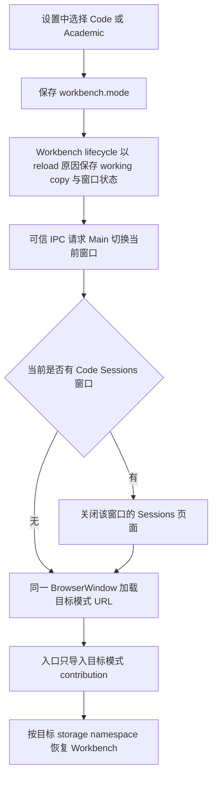

# `zeta` Electron Desktop Workbench 模式与切换边界

> 本文是 Electron Desktop 内部 `code` 与 `academic` Workbench 模式、窗口重载和能力装配的 canonical 说明。它们不等同于公开产品线；公开宿主边界见 [`product-lines.md`](product-lines.md)。

## 快速理解

Code 与 Academic 是同一个 Zeta Desktop 安装包中的两种内置 Workbench 模式。用户在“设置 → General → Workbench Mode”中选择模式，当前窗口完成状态保存后重载，并以目标模式重新装配 editor、Tasks、Testing、Debug 等 contribution；运行中的 Workbench 不热卸载或热替换 contribution。

| 用户操作 | 可观察结果 | 生效边界 | 其他窗口 |
| --- | --- | --- | --- |
| 选择 `Code` | 当前窗口重载为代码工作台 | 当前 Renderer 生命周期结束后 | 已打开窗口保持原模式 |
| 选择 `Academic` | 当前窗口重载为学术工作台 | 当前 Renderer 生命周期结束后 | 已打开窗口保持原模式 |
| 重新启动 Zeta | 使用最近成功保存的 `workbench.mode` | 应用启动 | 作为后续窗口的默认模式 |
| 开发或测试设置 `ZETA_WORKBENCH_MODE` | 覆盖该次启动的初始模式 | 仅非打包启动 | 不改变统一发布包结构 |

模式切换是运行时可选、窗口生命周期内固定：设置控件属于正在运行的应用，但一次 Workbench 实例只加载一组模式 contribution。这保留了内置切换体验，也避免动态注销命令、菜单、服务和编辑器状态。

## 当前模式

两个模式共享 Electron Main、Preload、Workbench runtime、布局 profile、Rust App Server、应用身份和用户数据根。发布构建同时包含两个模式的 Renderer chunk，统一输出到 `zeta-ts/dist/renderer/zeta`；模式仍使用独立的 renderer storage namespace，避免布局与视图状态互相覆盖。

| Workbench 模式 | 模式 ID | Editor 装配 | 模式能力 | Dedicated Sessions |
| --- | --- | --- | --- | --- |
| Code | `code` | `editor.code.all.ts` + `workbench/contrib/codeEditor` | Code/Diff、Tasks、Testing、Debug | `sessions-code` |
| Academic | `academic` | `editor.academic.all.ts` + `workbench/contrib/academic` | Document、Academic profile、embedded code factory | 尚未提供 |

同一 workspace 可以被不同模式的窗口打开，但它仍是共享文件场景，需要文件级协调。模式隔离不代表源文件复制，也不建立第二套 App Server 领域模型。

## 一次切换的流程



配置写入失败时不进入 shutdown；shutdown participant 失败时不请求 Main 重载。目标 Renderer 加载失败时，Main 恢复旧模式配置并重新加载旧入口，然后用原生错误对话框报告失败。

## 窗口、配置与状态所有权

| 状态 | Owner | 语义 |
| --- | --- | --- |
| 最近选择的默认模式 | 共享 profile `configuration.json` 中的 `workbench.mode` | 应用启动和后续新窗口的默认值 |
| 当前窗口模式 | Electron Main 的 Workbench window record 与 Renderer URL | 一个 Renderer 生命周期内 immutable |
| 模式定义 | `WorkbenchModeRegistry` | 唯一拥有模式 ID、显示名、存储命名空间和可选独立入口 |
| 模式能力 | `modes/code` 或 `modes/academic` | 只在入口启动时注册，不支持运行中卸载 |
| Workbench 布局与视图状态 | mode-specific `storageNamespace` | Code 与 Academic 分开恢复 |
| 应用身份与 Chromium 数据 | `ZetaDesktopApplication` | 两个模式共享同一个安装和用户数据根 |

URL 查询参数 `zeta-workbench-mode` 把 Main 已选择的窗口模式 ID 交给共享 Workbench 入口。入口根据它动态导入一个模式 bundle；查询参数不是用户配置的第二份 authority，持久默认值仍由配置服务拥有。

除 `WorkbenchModeRegistry` 外，各层只传递 `WorkbenchModeId`，不缓存或复制完整定义。Settings、构建输入、可信入口 URL 和可选 Sessions 页面从注册表派生；Browser 与 Electron 的模式 loader 使用以 `WorkbenchModeId` 为键的完整映射。新增 ID 但没有补齐任一模式定义或 loader 时，TypeScript 编译失败，而不是在运行时落入默认分支。

## Dedicated Sessions

Code Sessions 是独立页面，不是给 `workbench/browser/layout*` 增加模式分支。Code 的普通 Workbench 只注册一个 Titlebar action，Electron Main 创建 sibling Sessions 窗口，并把对应 HTML 加入可信 IPC allowlist。

```text
regular Code Workbench titlebar
        │ Open Code Sessions
        ▼
sessions-code page
        │ Return to Workbench
        ▼
regular Code Workbench
```

`sessions/` 可以依赖 `workbench/` 的可复用 Chat、Markdown 和 renderer capability；`workbench/` 不得反向导入 `sessions/`。从 Code 切换到 Academic 时，Main 先关闭当前 Workbench 所属的 Code Sessions 窗口。Academic 当前不得注册 Sessions action，也不得把未来研究工作台描述为现有能力。

Code Sessions 的 Renderer 实现、状态 owner、执行路径、失败语义和扩展点见 [`zeta-ts/src/zeta/sessions/README.md`](../zeta-ts/src/zeta/sessions/README.md)。Academic 若增加专用研究工作台，必须先新增明确的模式 capability 与独立 renderer 入口；PDF、文献库、Zotero 同步和引用索引等领域能力不得提前放进通用 Workbench layout 或 generic Session storage。

## 编辑器与默认 Workbench

普通 Workbench 使用唯一的 immutable `defaultWorkbenchSession`：两个模式具有相同初始区域、默认 view container 和可持久化布局语义。Dedicated Sessions 自己构造固定页面，不读取或更改 `WorkbenchLayout`。

Browser 与 Electron 各自只有一个 `workbench.ts` 入口。入口读取 Main 写入的窗口模式后加载 `modes/code` 或 `modes/academic`；模式 contribution 分别静态装配 `editor.code.all.ts` 与 `editor.academic.all.ts`，但不得拥有布局、Part topology 或第二套 Workbench runtime。两个 editor bundle 都来自同一个扁平的 `src/zeta/editor` 模块；Aster 是统一内核品牌，`TextModel` 与 `DocumentModel` 分别拥有 Text Engine 和 Document Engine 的同步语义。

## 构建与验证

日常开发和构建只使用统一命令；一次 Renderer 构建包含两个模式和 Code Sessions 入口。

```bash
corepack pnpm build:desktop
corepack pnpm dev:desktop
corepack pnpm dev:web
corepack pnpm dev:web:full
corepack pnpm test:desktop:app
```

`ZETA_WORKBENCH_MODE` 只覆盖非打包开发或测试进程的初始模式，不选择发布包内容或输出目录：

```bash
ZETA_WORKBENCH_MODE=code corepack pnpm dev:desktop
ZETA_WORKBENCH_MODE=academic corepack pnpm dev:desktop
```

每次构建必须产生共享命名的 Browser 与 Electron `workbench.html`、Code Sessions HTML，以及能够从运行时入口到达的 Code 和 Academic chunk。发布包只收录统一的 `renderer/zeta` 目录；Main 在创建窗口前验证 Workbench 与 Code Sessions 入口完整。

## 长期不变量

- Code 与 Academic 是 `zeta` Desktop 的内置模式，不是额外公开产品线或独立安装身份。
- `WorkbenchModeRegistry` 是模式定义的唯一 owner，运行层只保存和传递 `WorkbenchModeId`。
- 新增模式必须同时补齐中央定义以及 Browser/Electron 的穷尽 loader 映射；不得添加兜底分支吞掉未知 ID。
- 模式由应用内设置选择，但只在窗口重载边界改变。
- 一个 Renderer 生命周期只装配一个模式，不能热卸载 contribution。
- Workbench、布局和 App Server 契约保持共享，模式入口只拥有差异化能力装配。
- Aster 仍是唯一 editor runtime；模式不得复制 editor、model 或文件状态。
