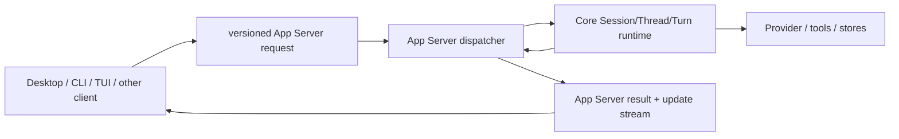

# Zeta App Server API

```yaml
title: Zeta App Server API
status: development
owner: zeta-rs
consumers:
  - desktop
  - cli
lastUpdated: 2026-08-23
```

本文描述当前开发期的唯一 App Server 契约。项目不保留旧 wire API、旧 DTO 或旧持久化格式
的兼容入口；Rust DTO、生成的 TypeScript 和 JSON Schema 必须始终一致。

当前 [`zeta-mcp-server`](mcp-server.md) stdio/Streamable HTTP 接口面是本 API 的外层
Agent-as-tool adapter；它通过 App Server client 复用这里定义的 Session/Thread/Turn contract，
不建立第二套 execution API。该 adapter 已将 Thread subscription/update 投影为 MCP progress，
将 approval/user-input 映射为 form elicitation，并在共享 profile SQLite 中持久化外部 invocation
receipt。Receipt 只拥有 MCP correlation/recovery，不改变本 API 的 durable authority。

具体 method registry、artifact generator 与 schema fixture 见
[`zeta-app-server-protocol` README](../zeta-rs/app-server-protocol/README.md)；JSON-RPC dispatch、
subscription broker、resource store 与 local composition 见
[`zeta-app-server` README](../zeta-rs/app-server/README.md)。本文拥有跨客户端 API 语义与演进方向，
两个 README 拥有当前实现接口与修改路径。

## 快速理解

App Server API 是 Desktop、CLI、TUI 和其他适配器访问 Zeta 产品能力的唯一版本化接口；它暴露
Session、Thread、Turn 和更新流，不建立第二套领域模型。

| 客户端需求 | 使用方式 | 关键保证 |
| --- | --- | --- |
| 创建一次工作 | 创建 Session，再创建 Thread 并启动 Turn | 产品身份与持久化语义来自统一协议 |
| 关闭一个 Session Tab | 前端通过 `session/request` 提交 `request.type = stop` | 持久化停止 Session，并中断其所有活动子 Turn；仅断开连接不会停止 Session |
| 持续显示执行进度 | 订阅 Thread 更新并按序列消费 | 发现缺口时重新读取快照，不猜测丢失状态 |
| 修改配置或资源 | 调用类型化方法并携带命令身份 | 重复命令可重放结果，冲突载荷会被拒绝 |
| 同步 Marketplace 安装状态 | 同一 profile daemon 写入，收到 generation 失效提示后重新 list | Desktop、Zeta Code 与 app 不建立第二份安装 authority |
| 响应批准或用户输入 | 回复等待中的类型化请求 | 回复绑定精确请求和当前 Thread |
| 让 Agent 操作 Desktop 浏览器 | Desktop 初始化时声明 browser host | Rust 保留批准和目标 owner，Electron Main 只执行语义动作 |
| 连接本地 App Server | 先初始化并校验能力和模式哈希 | 初始化前不能调用产品方法 |
| 协议发生不兼容变化 | 同步修改 Rust 类型、生成物和调用方 | 开发期不保留隐藏的旧 DTO 入口 |

### 唯一外部门禁

这条规则适用于所有 `Session`、`Thread`、`Turn`、`ThreadItem` 产品能力：App Server 同时是
客户端请求进入 Core 的唯一入口，也是 Core 更新离开系统的唯一出口。

| 参与者 | 允许路径 | 禁止路径 |
| --- | --- | --- |
| Desktop、CLI、TUI 和其他客户端 | 版本化 App Server 协议 → 分发器 | 直接链接 Core、Store、Provider 或读取私有运行时接口 |
| 进程内宿主 | 类型化客户端 → 同一个 App Server 分发器 | 为性能增加隐藏的进程内业务方法 |
| App Server | 校验、路由、订阅、DTO 编解码和事件投影 → Core | 复制领域归约器（reducer）、直接写 Store 或消费 Provider 内部流 |
| Core | 持有 Session/Thread/Turn/Item 权威状态并调用内部端口 | 依赖 App Server wire、客户端状态或 UI 生命周期 |



进程内 App Server、stdio/JSONL 和未来的远程 App Server 只是不同传输方式。它们必须保持相同的
请求、结果、错误和通知语义。`app` 当前的直接 Rust 终端/PTY 组合只覆盖
终端宿主；一旦该宿主承载 Agent 的 Session/Thread/Turn/Item 能力，也必须接入同一 App Server
门禁，不能新增 Core 旁路。

## 1. 产品模型

Canonical 产品实体和内部契约的详细定义见 [`protocol.md`](protocol.md)。本 API 直接暴露
其中的 readable Session/Thread/Turn/ThreadItem view，不维护第二份领域定义。

- App Server connection/session 只是传输生命周期，不能与产品 Session 混用。

Session 不嵌入 Thread 历史，只保存 membership、lineage 和 lifecycle。Fork 的 lineage 固定为 `parentThreadId + parentSequence`；Core 按这个锚点重放父 Thread，并把锚点内连续、已结束的 Turn 导入子 Thread，因此未完成的 Turn 和父 Thread 后续提交都不会进入已创建的分支。

## 2. 一致性模型

每个修改命令都使用：

- `commandId`：客户端生成的稳定命令身份；
- `expectedSequence`：客户端观察到的目标 aggregate sequence；
- typed command payload：参与重放与冲突判断。

同一 `commandId + typed payload` 重试返回原结果；同一 `commandId` 携带不同 payload 返回
`CommandConflict`。JSON-RPC request `id` 只做当前 connection 的 response pairing，不能替代
`commandId`。

Session 与每个 Thread 拥有独立 durable sequence：

- Session sequence 只排序 topology 与 lifecycle；
- Thread sequence 只排序该分支内的 Turn 与 Item；
- 修改一个 Thread 不会占用 Session 或其他 Thread 的 sequence；
- `expectedSequence` 始终针对 method 所修改的 aggregate。

## 3. 传输

当前外部 transport 是 UTF-8 JSONL/stdio：

- 每行一个完整 JSON-RPC 2.0 message；
- 单条 message 最大 1,048,576 bytes；
- stdout 只允许协议 message，stderr 只用于诊断；
- 同一 request 的 response 先于由它产生的 causal notifications；
- connection 断开后 request ID、subscription、Resource 与 Terminal ownership 全部失效。

In-process client 使用 protocol-owned typed request/event channel，可以省略 JSON string
编解码，但必须经过相同 initialize gate、method dispatcher、result/error envelope 与
notification contract，不能拥有隐藏业务接口。JSONL/stdio、WebSocket 等外部 transport 才在
边界执行 wire encoding。

## 4. 初始化

`initialize` 必须是 connection 的首个 request。

```json
{
  "jsonrpc": "2.0",
  "id": 1,
  "method": "initialize",
  "params": {
    "clientInfo": { "name": "zeta-desktop", "version": "0.1.0" },
    "capabilities": {
      "notifications": true,
      "browser": { "version": 1, "observe": true, "input": true }
    }
  }
}
```

返回值包含 `serverInfo`、`protocolVersion`、完整 schema 的 `schemaHash`、版本化 server capability，
以及 composition 边界冻结的 `slashCommands` snapshot：

```json
{
  "serverInfo": { "name": "zeta-app-server", "version": "0.1.0" },
  "protocolVersion": { "major": 1, "revision": 1 },
  "schemaHash": "sha256:...",
  "capabilities": {
    "sessions": true,
    "threads": true,
    "turns": true,
    "resources": true,
    "fileSystem": true,
    "workspaceSearch": true,
    "codeIndex": true,
    "cloudCodeIndex": false,
    "terminal": true,
    "mcp": true,
    "mcpOAuth": false,
    "typst": true,
    "updateReplay": true,
    "contracts": {
      "sessions": { "version": 1 },
      "threads": { "version": 1 },
      "turns": { "version": 1 }
    }
  },
  "slashCommands": [
    {
      "name": "compact",
      "description": "Compact older conversation context",
      "argumentMode": "optional"
    }
  ]
}
```

客户端必须拒绝不同 protocol major、缺失的 required capability 或不支持的 capability version。
schema hash 是 exact artifact 诊断信号，不单独决定运行时兼容性。
`slashCommands` 每项的 `name` 只能使用 lowercase ASCII letters、digits 与 interior hyphens，
description 不能为空，同一 snapshot 中 name 必须唯一。该 snapshot 负责 discoverability 与
inline argument parsing；客户端必须按命令契约分发。Skill 和 server prompt command 通过
`StartTurn.input` 保留 `/name`、text/image 顺序；内置 `/compact` 通过
`session/request::CompactContext` 执行，不发送普通聊天文本。
校验、local/server 合并与 Rust client 交互状态的 canonical owner 是
[`zeta-slash-commands`](../zeta-rs/slash-commands/README.md)；App Server 只组合并发布 server snapshot。
三种 client surface 的合并、执行与渲染边界见 [`slash-commands.md`](slash-commands.md)。

### 客户端-hosted 浏览器能力

Browser 是当前 Server → Client request capability。只有在 `initialize` 中提交 version 1 browser
capability 的连接才能成为宿主；`observe` 与 `input` 分别声明页面观察和语义输入支持。该声明是
短暂的 connection routing authority，不进入 Session、Thread 或持久化配置。

| Host method | Params | Result | 当前语义 |
| --- | --- | --- | --- |
| `browser/create` | `{ url }` | `{ targetId }` | 创建一个隔离、默认隐藏的新目标 |
| `browser/observe` | exact target + 三个 include flag | 页面状态 + 可选 AX/DOM/PNG | 不执行脚本，不返回 Electron 对象 |
| `browser/perform` | tagged semantic action | `{ targetId }` | 导航、node click/type、滚动、后退或刷新 |
| `browser/close` | `{ targetId }` | `null` | 关闭精确目标 |

请求 ID 使用保留的非空字符串，与 Client → Server 正整数 ID 隔离。App Server 把 create result 的
`targetId` 绑定到响应它的连接；此后不能由另一连接响应，也不能把观察或动作结果切换到另一个
目标。connection 退出后 target authority 立即失效，Desktop 同时回收由该 host connection 创建的
原生目标。

```json
{
  "jsonrpc": "2.0",
  "id": "browser-host:1:7",
  "method": "browser/perform",
  "params": {
    "action": {
      "type": "click",
      "targetId": "browser_target_123",
      "target": { "nodeId": "42" }
    }
  }
}
```

成功响应必须保留同一 ID 和 target：

```json
{
  "jsonrpc": "2.0",
  "id": "browser-host:1:7",
  "result": { "targetId": "browser_target_123" }
}
```

App Server deadline 为 30 秒。Turn 取消或 deadline 到达时，Server 发送
`$/cancelRequest { id }`；client 终止尚未开始的步骤，并用 `-32800` 返回已取消的在途请求。
已放弃请求的晚到 terminal response 可以丢弃，已完成请求的重复 response 仍是协议错误。
截图 payload 只允许 `image/png`，App Server 校验 decoded length、Base64 和 PNG signature 后才
创建 connection-owned Resource。

该契约从不接受任意 CDP method、JavaScript source、localhost 调试端口或 Node sidecar 配置。
完整 Browser Tool generation 同时要求可信工作区和至少一个同时声明 `observe + input` 的 live
version 1 宿主；Restricted、信任撤销或最后一个完整宿主断开都会移除该工具 port。恢复条件后
只影响后续 Tool generation，不恢复或重放旧调用。
Desktop 当前实现和 Playwright 后续边界见
[`zeta-desktop-architecture.md#7-浏览器能力`](zeta-desktop-architecture.md#7-浏览器能力)。

## 5. 方法清单

| Method | Aggregate | Effect |
| --- | --- | --- |
| `session/create` | new Session | 创建任务 |
| `session/read` | Session | 读取 canonical snapshot |
| `session/list` | global | 列出 Session |
| `session/subscribe` | connection | Session snapshot + `afterSequence` 之后的 durable gap + child Thread projections |
| `session/request` | Session | canonical typed mutation request；覆盖 Session、child Thread 与 Turn 操作 |
| `session/unsubscribe` | connection | 删除订阅 |
| `session/request` | Session | 通过 tagged request 完成 Session、child Thread 和 Turn mutation |
| `model/list` | global model catalog | 返回 Zeta 模型 identity、display name、access、完整/可用 context capacity、capabilities 与 defaults；不探测 provider 或 ChatGPT 账户 |
| `session/thread/read` | Session + Thread | 读取 canonical Thread snapshot |
| `session/thread/subscribe` | Session + Thread + connection | snapshot + `afterSequence` 之后的 durable gap |
| `session/thread/unsubscribe` | Session + Thread + connection | 删除 child Thread 订阅 |
| `config/read` | config | 读取配置 |
| `connector/list` | Connector authority | 读取不含 secret/reference 的外部账号连接投影 |
| `connector/connect/apiToken` | Connector authority + secret store | retry-safe 保存 API token 并发布 connected account |
| `connector/connect/oauth/start` / `complete` / `cancel` | Connector OAuth owner | 启动 exact PKCE flow，一次性消费 callback state/code，或显式结束 abandoned flow |
| `connector/disconnect` | Connector authority + secret store | 先撤销 runtime readiness，再报告 credential cleanup 状态 |
| `connector/credential/cleanup` | Connector credential owner | 重试 durable post-disconnect secret 删除义务 |
| `plugin/list` | Plugin authority | 分别投影 installed/enabled/granted/effective package 状态 |
| `plugin/enable` / `disable` / `grant` / `revokeGrant` / `uninstall` | Plugin authority | exact-package CAS lifecycle mutation |
| `marketplace/search` / `get` / `install` / `update` / `uninstall` | Marketplace Manager | 通用 package discovery 与唯一安装状态；不自动授权或激活 capability |
| `marketplace/listInstalled` / `acquireCapability` / `releaseCapability` / `openResource` | Marketplace Manager | 返回当前 profile generation 与唯一安装状态，并通过 lease + opaque resource 完成 path-free capability handoff；本地可信 runtime adapter 不经过 Renderer |
| `config/update` | config | typed command 更新配置 |
| `execPolicy/rule/upsert` / `execPolicy/rule/remove` | config + local policy runtime | revision-safe 持久化 User typed rule，并为未来 Tool safe point 重组 policy snapshot |
| `toolSearch/configure` | config + semantic model runtime | 选择词法模式，或探活 exact embedding 模型后启用混合 Tool Search |
| `workspace/additionalDirectories/list` / `add` / `remove` / `permissions/set` | Session Workspace access | 管理当前 Session 的附加目录与完整能力集合；权限替换使用 Workspace access revision，目录不会成为主 Workspace |
| `workspace/codeIndex/semantic/configure` / `authorize` / `revoke` | config + Workspace | 独立配置 semantic CodeIndex，并显式管理源码外发授权 |
| `workspace/codeIndex/semantic/cancel` / `retry` | semantic index job | 取消或重新调度 exact-generation 本地语义 projection；status 返回无内容进度计数 |
| `languageServer/configure` / `languageServer/remove` | config | revision-safe 修改或恢复 language-server mode/path preference |
| `provider/configure` / `provider/remove` | config | 修改 Provider declaration |
| `mcp/server/upsert` / `mcp/server/remove` / `mcp/server/enablement/set` | config | 修改 standalone MCP desired config |
| `mcp/server/connect` / `mcp/server/disconnect` | runtime | 设置 process-local lifecycle intent，不改变 Config revision |
| `mcp/server/status` | read | 读取 active Config/Plugin/Connector MCP runtime 的 redacted lifecycle 与 generation projection |
| `mcp/oauth/start` / `mcp/oauth/complete` | MCP OAuth owner | 为 exact standalone Config server 启动和一次性完成 PKCE flow |
| `mcp/oauth/refresh` / `mcp/oauth/revoke` | MCP OAuth owner + secret store | 轮换 runtime/lifecycle credential；或先断开 runtime、远端 revoke 后删除本地 secret |
| `skill/source/add` / `skill/source/remove` / `skill/source/enablement/set` | config | 修改 User Skill source |
| `plugin/request/upsert` / `plugin/request/remove` / `plugin/request/enablement/set` | config | 修改 exact Plugin request；不安装或激活 |
| `hook/upsert` / `hook/remove` / `hook/enablement/set` | config + `zeta-hooks` runtime | 修改 declarative Hook；App Server 在 trusted Workspace 中组合 runtime，后续 safe point 按 immutable snapshot 执行匹配的 sandbox process |
| `skills/list` | global Skill catalog | 读取 cached projection 或请求完整 refresh |
| `skill/enablement/set` | config + Skill catalog | revision-checked 启用/禁用 exact `SkillId` |
| `skill/resource/open` | Skill runtime + Resource | 将 digest-pinned package resource materialize 为 connection-owned resource |
| `resource/metadata` | Resource | 读取元数据 |
| `resource/read` | Resource | 分块读取 |
| `resource/release` | Resource | 释放 connection-owned resource |
| `fs/getMetadata` | workspace | 读取根相对路径的 metadata |
| `fs/readDirectory` | workspace | 枚举根相对目录的直接子项 |
| `fs/readFile` | workspace | 读取不超过 10 MiB 的 UTF-8 文件 |
| `fs/writeFile` | workspace | 原子替换或新建不超过 10 MiB 的 UTF-8 文件 |
| `syntax/analyze` | stateless syntax | 返回同一 revision 的 bounded token/fold/symbol/diagnostic facts |
| `syntax/selectionRanges` | stateless syntax | 只沿当前 UTF-16 selections 返回 bounded parser ancestor scopes |
| `git/status` | workspace | 读取 HEAD、upstream 和 index/worktree change snapshot |
| `git/textDiff` | workspace | 读取 status 及有界 UTF-8 HEAD/worktree text diff projection |
| `git/graph` | workspace | 以 `limit`/`cursor` 读取一页 history、local/remote-tracking refs 和 credential-free remote identity，并返回 `hasMore`/`nextCursor` |
| `git/branch/list` | workspace | 列出现有本地分支及 current/upstream 信息 |
| `git/branch/switch` | workspace | 切换到 host 重新解析确认存在的本地分支 |
| `git/stage` | workspace | stage 一组 workspace-relative path |
| `git/unstage` | workspace | 从 index 移除一组 path 的 staged change |
| `git/discardWorktree` | workspace | 恢复 tracked working-tree change，不删除 untracked 文件 |
| `git/commit` | workspace | 使用有界非空 message 创建 commit |
| `git/fetch` | workspace | non-interactive fetch all remotes 并 prune |
| `git/pull` | workspace | non-interactive fast-forward-only pull |
| `git/push` | workspace | 按当前 Git upstream/default 配置 push |
| `workspace/search/start` | connection + workspace | 启动有界内容搜索 |
| `workspace/search/read` | connection + search job | 按游标读取最多 200 条结果 |
| `workspace/search/cancel` | connection + search job | 取消并释放搜索 |
| `workspace/codeIndex/status` | workspace | 读取本地 index lifecycle 与 generation counters |
| `workspace/codeIndex/search` | workspace | 返回有界、revision-bound 的本地 lexical chunks |
| `workspace/symbolIndex/status` / `search` | workspace | 读取 declaration projection 状态并执行有界 local fuzzy symbol query |
| `workspace/codeIntelligence/document/synchronize` / `close` | workspace + editor document | 发布或释放 ephemeral dirty snapshot；不持久化 overlay |
| `workspace/codeIndex/retrieve` | workspace | 融合已启用召回源，返回复核、去重、受预算约束的 excerpts |
| `workspace/codeIndex/rebuild` | workspace | 同步执行一次 full reconcile |
| `workspace/codeIndex/cloud/status` | workspace | 读取 selected deployment、grant 与 local/remote generation state |
| `workspace/codeIndex/cloud/preview` | workspace | 本地计算 proposed scope 的 chunk 外发单位与 bytes，不授权、不触网 |
| `workspace/codeIndex/cloud/authorize` | workspace | 持久化 root-bound destination/scope/byte grant |
| `workspace/codeIndex/cloud/sync` | workspace | 按 grant 复核 source revision 后调用 provider publication |
| `workspace/codeIndex/cloud/revoke` | workspace | 先持久化 Revoking，再请求 provider 幂等删除 |
| `terminal/profile/list` | workspace | 列出 App Server 冻结的可信 Shell Profile |
| `terminal/create` | connection + workspace | 在可信 workspace root 启动 PTY |
| `terminal/write` | connection + Terminal | 写入有界 UTF-8 输入 batch |
| `terminal/resize` | connection + Terminal | 修改 PTY rows/cols |
| `terminal/read` | connection + Terminal | 按 sequence 拉取有界 Base64 输出 |
| `terminal/close` | connection + Terminal | 终止并释放 PTY |

Connector account 是 GitHub、Slack 等外部产品账号，不是第 11 节的 Zeta account/login control plane。

### Connector 外部账号连接

`initialize.capabilities.connectors` 只有在 host 注入 `ConnectorCredentialService` 时为 true；
`initialize.capabilities.plugins` 只有在 host 注入 live Plugin authority 时为 true。客户端收到
`connector/changed { generation }` 后重新调用 `connector/list`；notification 不携带 account body、
credential reference 或 secret。

connect/disconnect 都携带 `commandId` 与 `expectedGeneration`。API-token connect 还携带单调的
`connectionGeneration`、外部 account ID/display name 和 `apiToken`。Secret field 只存在于 inbound
request；App Server 把它移出通用 JSON value 后包装为 zeroizing `SecretValue`，任何 list/result/error
都不得回显。一次 successful connect 会因 Begin 和 Complete 两次 commit 推进两个 snapshot generation。

disconnect 先提交新的 disconnected generation，再删除 secret。结果中的 `credentialCleanup` 为
`deleted`、`alreadyAbsent` 或 `retryRequired`；后者不回滚 disconnect。客户端不得因为 cleanup 需要重试
而继续显示 tools ready。失败的删除会持久化为 `credentialCleanupPending`，并由
`connector/credential/cleanup` 收敛。`reauthorizationRequired` 同样不是 ready 状态，通常表示 Plugin package/runtime
authorization revision 已改变。

OAuth start 返回 browser navigation URL 与 opaque flow ID；callback state/code 只进入 inbound-only
complete DTO。PKCE verifier 留在 Connector OAuth service 内存，Desktop 的随机 loopback callback listener
由 Electron main 持有，Renderer 不接触 verifier 或 provider token。具体 provider adapter 必须由产品
composition 显式注入。

### 独立 MCP OAuth

`initialize.capabilities.mcp` 表示 host 安装了 Config-backed MCP runtime surface；
`initialize.capabilities.mcpOAuth` 只有在 host 注入至少一个 standalone MCP OAuth provider 时为 true。
这两个 capability 分开：有 MCP Config/状态 RPC 不代表任意 server 都有 OAuth adapter。

`mcp/oauth/start` 只接受 exact server ID 与 redirect URI，返回 browser navigation URL 和 process-local
flow ID。目标必须是带 credential reference 的 HTTPS Streamable HTTP server；redirect 只允许 HTTPS 或
本机 loopback HTTP。`mcp/oauth/complete` 的 state 与 authorization code 是 inbound-only zeroizing
field，不出现在 result/error/debug；flow 一次性消费，并在 exchange 前重新读取当前 Config target。

`mcp/oauth/refresh` 轮换 SecretStore 中分离的 runtime bearer 与 lifecycle secret，并触发 connect
reconcile。`mcp/oauth/revoke` 先设置 disconnect intent，等待 active Tool generation 移除该 server，
再调用 provider remote revoke；只有远端成功后才删除本地 secret。具体 discovery、client identity、
scope、token parsing、audience 和 provider
endpoint policy 属于 host 注入的 provider adapter，不属于 App Server protocol。

Plugin request 是 config intent；legacy Plugin lifecycle authority 是另一层事实。`plugin/list` 不把它们
压成一个布尔值，而是分别返回 enabled、granted 与 effective，只有 exact installed package 同时 enabled
且 granted 时才进入 activation。新的远端 package 只能通过 `marketplace/*` 方法进入
`MarketplaceManager`；Plugin authority 不再拥有 Marketplace catalog 或安装入口。

同一 profile 的 App Server daemon 是 Marketplace mutation 的 single writer。成功的
install/update/uninstall 在 consumer reconcile 后推进共享 generation，并向该 profile 的全部
Workspace connection 广播 `marketplace/changed { instanceId, generation }`。该通知只表示“本地安装投影可能
过期”；客户端必须重新调用 `marketplace/listInstalled`，并以返回的 instanceId + generation + packages 为事实。
`whenUnused` 卸载会先广播 pending-removal 状态；最后一个 capability lease 被释放或随连接关闭清理、删除
真正提交时再广播一次，避免其他端长期保留已经消失的 Skill、Connector 或 Extension 投影。
共享 profile runtime 为唯一 Manager 持有一个 committed-change watcher，所以内部运行时 lease 的异步释放
也走同一广播；standalone App Server 才自行持有 watcher。broker 对 Manager generation 去重，同一 profile
拒绝绑定第二个 Marketplace authority。
重连不要求回放旧通知：新连接直接 list 即可补到当前 generation。客户端应忽略不大于已观察
generation 的同 instance 重复或乱序通知；instanceId 变化表示 authority 已重启，新的低 generation
也必须接受。

Zeta account control plane 另见[第 11 节](#11-account-与登录)。其 Rust DTO、TypeScript 与 JSON Schema
由同一个 registry 生成并同步提交。

### 文件系统

Filesystem method 的 `path` 是配置 workspace root 下的相对路径；空字符串表示 root。
绝对路径、父目录逃逸和解析后越过 root 的 symlink 会在可信 Rust 边界被拒绝。Desktop 的
IPC 层会先做同形状校验以便快速失败，但不承担最终授权。

当前 contract 提供 `fs/getMetadata`、`fs/readDirectory`、`fs/readFile` 和 `fs/writeFile`，
用于单根 Folder 的 Explorer、文本文件打开和后端保存。读写均限制为不超过 10 MiB 的 UTF-8；
写入在目标同目录完成有界临时写、flush 和原子替换，保留现有文件权限，不隐式创建父目录。

App Server 对整个 workspace root 建立递归 watcher。普通变化经 75ms debounce 后发布
`fs/changed { type: "pathsChanged", paths }`，其中 path 全部是 workspace-relative；backend
可能丢失事件时发布 `fs/changed { type: "rescanRequired" }`。两种通知都是失效 hint，不是
durable event 或文件内容事实，客户端收到后必须重新读取自己拥有的视图。

Filesystem contract 仍不包含重命名、删除、多根 Workspace 或跨请求 snapshot 一致性。当前
Desktop 尚未调用 `fs/writeFile` 或消费 `fs/changed`；这些属于独立的前端接入阶段。

### 语法事实

`syntax/analyze` 接收最多 4 MiB 的完整 UTF-8 text、language 与 host revision，返回同一 revision 的
bounded tokens、folding ranges、document symbols、parse diagnostics 和 `hasErrors`。它是 stateless
projection，不建立 App Server-owned editor document，也不返回 Tree-sitter node。

`syntax/selectionRanges` 使用同一 document envelope，并额外接受最多 1,024 个 UTF-16 ranges；server
拒绝越界位置和 surrogate pair 中间位置，只沿每个 exact selection 的 named parser ancestors 返回
默认最多 64 层，去重后按 source order 投影。该 operation 与普通 analyze 分离，避免 token/diagnostic
请求携带整棵树的 selection nodes。Desktop 必须用 captured snapshot revision、request cancellation 与
当前 selection set 做 stale gate。

### Git SCM

`initialize.capabilities.git` 表示 server 已冻结可信 workspace root 并安装 Git backend。
`git/status` 不接受路径参数，返回 `GitStatusResult`：标识当前 Git runtime incarnation 的
`streamInstanceId`、在该实例内单调递增的 workspace status revision、
HEAD 的 branch/detached/unborn
状态、可选 upstream ahead/behind，以及每个 workspace-relative path 的 index/worktree status、
rename original path、conflict 和 submodule flags。Revision 表示 App Server 观察到的投影版本，
不是 durable CAS token，客户端不能把一次 snapshot 当作后续 mutation 的 compare-and-swap 前提。
当 workspace 是更大 repository 的子目录时，server 会过滤 workspace 外 change，并将保留路径
重新映射为 workspace-relative。

App Server 通过 `zeta-file-watcher` 接收 workspace、Git metadata 和相关 ancestor `.gitignore`
invalidation hint，100ms debounce 后重新读取 authoritative Git status。投影内容变化时 revision
递增并向支持 notification 的连接发送 `git/statusChanged { status }`；内容未变时不发送。
Watcher 初始化失败时显式 `git/status` 与 mutation 仍可用。客户端只在相同
`streamInstanceId` 内比较 revision 并忽略不大于当前 revision 的通知或响应；实例变化表示
App Server 已重启，客户端必须接受新 snapshot，并在连接重新 ready 时主动执行 `git/status`
恢复权威状态。

`git/textDiff` 返回同一 workspace 范围内的 `GitStatusResult`、每个可展示文本变化的 original/
modified UTF-8 source，以及文件级和聚合增删行统计。单侧文件上限为 2 MiB；binary、symlink、
非 UTF-8、不可读或超限内容仍保留在 status 中，但不进入 text diff。客户端可以用 source 构建
presentation diff，不得直接读取 Git revision 或复制 Git 统计规则。

`git/graph` 首次接受 `limit`（1–1000），后续请求携带服务端返回的不透明 `cursor`；服务端为一次
traversal 启动单个 bounded `git log --all --topo-order` 进程，并只在启动时读取 local branch refs、
本地已经 fetch 的 `refs/remotes/*` 以及 configured remote 的 `name` 和可选 credential-free identity
（`provider`、`host`、`owner`、`repository`）。返回 `hasMore` 和继续请求所需的 `nextCursor`；状态
变化、mutation 或连接关闭会使游标失效。symbolic remote refs（例如 `origin/HEAD`）不会作为 branch
ref 返回。协议不暴露 raw remote URL、token 或本地 `gh` 登录配置；因此该方法表示 local Git
repository snapshot，不是 GitHub API、PR、Checks 或 review 查询，也不会自动 fetch。Desktop SCM
负责自动消费后续页并合并全部 commit；它可据此显示不同 graph lane 颜色、local/remote ref labels
和 GitHub repository 摘要。

`git/commitChanges` 接受 graph 返回的完整 commit object ID，按第一父提交（root commit 使用空树）
返回 workspace-relative changed paths、rename original path、status 和 comparison parent object ID。
`git/commitFile` 接受同一个 commit object ID 与上述结果中的 path；server 会重新解析该 commit 的
changed paths 并确认 path 属于该提交和当前 workspace，然后按需返回 original/modified 两侧的
`text`、`binary` 或 `missing` 状态。每侧文本上限为 2 MiB。Desktop SCM 因而只在展开 history item
时读取路径，并只在用户点击具体文件时读取内容；modified/renamed 文件打开只读 diff，added/deleted
文件打开存在的一侧。

`git/branch/list` 返回当前仓库的现有本地分支。`git/branch/switch` 只接受有界非空 branch name；
server 会重新列出当前仓库分支并按 exact name 解析后才执行 mutation，因此客户端提交的字符串
不会直接成为未经确认的 Git argv。成功结果包含新的 status；脏工作树或 linked worktree 冲突由
Git 拒绝，server 不重试或丢弃用户内容。

Mutation contract 提供 `git/stage`、`git/unstage`、`git/discardWorktree`、`git/commit`、
`git/branch/switch`、`git/fetch`、`git/pull` 和 `git/push`。Path mutation 接受 1–5000 个 workspace-relative path；
Rust service 负责最终边界校验和 repository-relative 映射。Commit message 必须非空、无 NUL，
且不超过 64 KiB UTF-8。每个成功 mutation 都返回新的 status；commit 另外返回 object ID。

Remote operation 禁用 terminal/credential prompt，pull 固定使用 fast-forward only。Discard 只恢复
tracked working tree，不删除 untracked 文件。Operation 在单 workspace runtime 内串行执行；当前
没有可观测 queue、progress 或 caller cancellation。跨层 ownership、当前 UI 和演进顺序见
[`git.md`](git.md)。

### Workspace 搜索

`initialize.capabilities.workspaceSearch` 表示 server 已安装 workspace 内容搜索 backend。
客户端通过 `workspace/search/start` 获得 connection-owned `searchId`，用
`workspace/search/read` 的 `afterMatch` cursor 分批读取结果，最后调用
`workspace/search/cancel` 释放作业。每个结果包含 workspace-relative path、1-based line
number、单行 preview 和 UTF-16 match ranges。

查询、glob、batch 和总结果都有协议上限；Rust backend 重新校验 workspace 边界并直接启动
冻结的 ripgrep executable。未知 ID、跨 connection 访问和并发超限使用稳定的
`SearchNotFound`、`SearchNotOwner` 与 `SearchBusy` error name。执行失败作为 terminal
read result 的脱敏 `error` 返回。完整 ownership 与当前 UI 限制见
[`search.md`](search.md)。

### Workspace 代码索引

`initialize.capabilities.codeIndex` 表示 local composition 可以在当前 workspace authority 内建立
本地代码索引。`workspace/codeIndex/status` 返回 `empty/indexing/ready/stale/failed` 和 published
generation counters；`workspace/codeIndex/search` 接受最多 8 KiB query 与 1–100 个结果上限，
返回 root-relative path、language、source revision、chunk key/hash、UTF-8 byte/line span、当前
验证过的 content 与 lexical score。初始 generation 尚未发布时返回 `CodeIndexNotReady`。

`workspace/symbolIndex/status` 投影 `empty/indexing/ready/stale/failed` 与 source/symbol generation；
`workspace/symbolIndex/search` 对当前持久 projection 和 dirty overlay 做 Nucleo fuzzy query，返回 UTF-16
declaration/selection ranges、source revision、score 与 matched name indices。它不声称 reference 或 type
语义；LSP workspace symbols 由 Desktop provider aggregator 并发补充。

`workspace/codeIndex/retrieve` 使用相同 query/result 数量上限；内部始终按 Workspace excerpt identity
校验和去重，但返回面只投影 revision-bound excerpt、RRF score、
`localSymbol/localLexical/localSemantic/cloudSemantic` origins 和显式 degradations。未授权云能力时仍可
使用本地 symbol/FTS 与已配置 local semantic；已启用云能力时只查询 durable state 中 exact ready
remote generation。各来源失败会保留其他 local hits 并分别返回
`localSymbolQueryFailed`、`localSemanticQueryFailed` 或 `cloudQueryFailed`；复核失败或 content budget
丢弃也会返回计数，不把 provider candidate body 当作 source authority。

`workspace/codeIntelligence/document/synchronize` 接收 Editor-authoritative full snapshot；CodeIndex
首先校验 path、language、revision 与 text，再建立 canonical in-memory chunks，SymbolIndex 随后投影
declarations。同一 dirty path 的磁盘 symbol、FTS、vector 和 cloud candidates 全部被抑制；保存后只有
磁盘 generation 的 content hash 对齐才 handoff。`close`、Workspace replacement 或 host lifecycle
释放 overlay。响应只包含 generation 和 dirty document count，不泄露正文。

`workspace/codeIndex/rebuild` 是 global-exclusive、同步 manual reconcile；通常由 watcher-driven
runtime 自动维护，不应在每次查询前调用。该能力不创建 embedding/network 请求，也不等价于产品
文字/正则搜索。完整 chunking、持久化、stale gate 与隐私边界见
[`code-index.md`](code-index.md)。

`initialize.capabilities.cloudCodeIndex` 表示 host 已注入非空 provider registry；未激活或受限
Workspace 即使支持该方法，也没有 active cloud controller，调用会返回
`CloudCodeIndexUnavailable`。云端只有一种 publication contract：上传 Workspace 已切块并复核的
exact chunks；provider 不得读取完整 source 后重新切块。客户端必须先用
`workspace/codeIndex/cloud/preview` 展示 file/chunk/unit/byte shape，再用 authorize 固定
provider、tenant、collection、path scope 和 `maxEgressBytes`；该 ceiling 计算 source-content bytes，
不包含 transport metadata overhead，authorize 本身不上传。旧 `mode` 字段按未知字段拒绝，不能把
旧 `managed` consent 静默解释为新的 chunk-only grant。

同一 root 同时只允许一个 grant。destination、scope 或 byte ceiling 变化必须先 revoke；
每次 sync 都重检 byte ceiling 和 source revision。状态为
`localOnly/granted/syncing/ready/stale/revoking/failed`。revoke 在 provider call 前持久化
`revoking`，删除失败保留 pending grant供幂等重试；Workspace 信任撤销也会自动触发删除并移除
cloud runtime。默认 local composition 没有 concrete provider，所以示例 capability 为 false，当前
不会发起云网络请求。

### 集成终端

`initialize.capabilities.terminal` 表示 local composition 已提供可信 workspace root 和 PTY
runtime。`terminal/profile/list` 只返回稳定 `profileId`、显示标题与 default 标记，不暴露
program、args 或 environment。`terminal/create` 接受 rows/cols 和 `default | profileId`
tagged selection；Rust owner 把 ID 解析到冻结的本机 Shell Profile，并以显式 environment
allowlist 在 workspace root 启动。客户端不能提交任意 executable、environment 或绝对 cwd。
Terminal ID 绑定创建它的 App Server connection，跨 connection 操作返回 `TerminalNotOwner`。

Electron 与 Vite development host 只把 Shell 正常运行所需的用户目录、临时目录、locale、
`PATH`、Windows system/profile 或 Unix XDG 变量传入 App Server；token、API key 和其他未列出
变量会在 host 边界丢弃。Rust `TerminalEnvironment` 再按同一类别过滤，并覆盖
`TERM=xterm-256color`、`COLORTERM=truecolor` 与 `TERM_PROGRAM=zeta`。`zeta-utils-pty` 在
spawn 前执行 `env_clear`，所以 PTY 看不到最终 map 之外的 App Server 环境。Terminal request DTO
拒绝 unknown field；通过 `terminal/create.environment` 夹带变量会返回 `InvalidParams`。

当前 Terminal contract 选择有界 pull，而不是高频主动输出。客户端通过
`terminal/read { terminalId, afterSequence, maxChunks }` 拉取最多 128 个 raw-byte chunk；
每个 chunk 使用标准 Base64，并以单调 sequence 排序。Server 保留最多 1 MiB 输出，cursor
落后于 ring 时返回 `outputGap: true`，客户端必须显式显示截断而不能把缺口当作连续输出。
`exited` 只在 authoritative process exit 且尾部输出流关闭后为 true。

当前 terminal 不持久化、不跨 App Server 重启恢复，也不支持用户或 Workspace 环境变量修改、
`.env` 自动加载或远程 attach。
正常客户端在实例关闭后调用 `terminal/close`；connection 结束时 server 终止该 connection
拥有的剩余 PTY。App Server 重启后的显式 Relaunch 会创建新 PTY，不能冒充原进程恢复。

## 6. 会话命令

### 创建（Create）

```json
{
  "method": "session/create",
  "params": {
    "commandId": "command_session_1",
    "title": "Investigate repository"
  }
}
```

返回 `{ "session": Session }`。首次 durable event 为 `sessionCreated`，并在同一 atomic batch
保存 typed command receipt。

### 创建 Thread

```json
{
  "method": "session/request",
  "params": {
    "commandId": "command_thread_1",
    "sessionId": "session_1",
    "expectedSequence": 1,
    "request": { "type": "createThread", "title": "Main" }
  }
}
```

创建采用可恢复 saga：

1. Session 写入 `threadCreationPlanned`，membership 状态为 `creating`；
2. 创建带相同 `sessionId` 的 Thread stream；
3. Session 写入 `threadAttached`，membership 状态变为 `active`。

恢复时发现 `creating` membership 会继续完成后两步，而不是创建另一个 Thread。

### 分叉 Thread

`session/request` 的 `request.type = forkThread` 比 create 多一个 `parentThreadId`。Server 执行命令时读取父 Thread 的当前 sequence，并把它持久化进 `ThreadOrigin::Fork`。Core 只重放到这个 sequence：已结束的 Turn 逐条写成 `ForkTurnImported`；第一个正在进行的 Turn 保留已持久化内容、移除没有结果的 Tool Call，并在子 Thread 中标成 `Interrupted`；它之后尚未执行的 Turn 不导入。`ForkHistoryImportCompleted` 保存导入数量和父 Thread 的最新已验证上下文检查点。子 Thread 拥有独立历史和 sequence，父 Thread 的后续提交不会改变它。

### 生命周期

`session/request` 的所有 mutation 都要求 `commandId`、`sessionId` 与 `expectedSequence`。
`request.type` 明确选择 `complete`、`archive` 或 `stop`；Archived Session 不允许
再修改。停止请求会先 durable archive Session，再中断该 Session 下所有活动 child Turn。连接断开
只释放订阅、请求和资源 ownership，不隐式触发停止。

### 会话模型

`session/request::SetModel` 使用 `commandId`、`sessionId`、`expectedSequence` 和 provider-scoped
`ModelRef`。选择结果写入 Session event stream，只影响该 Session。`session/request::StartTurn` 将 Session
当前模型复制到新 Turn；后续 Session 或全局配置变化不会改变已经启动的 Turn。

`model/list` 的 direct provider seed、ChatGPT 订阅条目和 Kimi Code 订阅条目都派生自 `zeta-model-provider-config::STATIC_MODEL_CATALOG`。每个条目统一返回 provider-scoped identity、display name、`access`、完整 context window、automatic compaction threshold、`availableContextWindow`、capabilities、reasoning efforts 和默认 personality。`availableContextWindow` 使用与 Turn 执行相同的当前配置和预算规则，已经扣除 output reservation、safety margin 与 ordinary auto-compaction 边界；列目录不会调用 provider、`account/read` 或 upstream `model/list` 做健康检查。
`session/request::SetModel` 只校验精确 identity 属于产品目录，然后把选择持久化到 Session。Provider
配置、认证、账户 entitlement、rate limit、传输和模型端拒绝都由本地 `TurnExecutor` 调用的模型服务
验证，并以该 Turn 的稳定错误出现在对话中；它们不回写模型列表，也不阻止用户预先选择。`access = subscription` 只表示接入方式；静态 row 的 `runtime` 选择 provider-specific authenticated target。OpenAI 与 Kimi subscription rows 都使用本地 `TurnExecutor`。登录账户适配器内部的 `openai-chatgpt` identity 不进入 ModelRef，Kimi account/model provider identity 都是 `kimi`。登录状态不会隐式改变 Session model。

## 7. Thread 与 Turn

`session/thread/read` 返回：

```text
Thread {
  sessionId,
  threadId,
  title,
  status,
  sequence,
  turns: Turn[]
}
```

每个 Turn 始终包含完整的 `items: ThreadItem[]`、累计 `usage`、可选 `contextUsage`、可选 `pendingInteraction` metadata 与可选稳定错误。`contextUsage` 是最近一次模型调用完成后的当前 model-visible context token 数；优先使用 provider-reported input + output，缺字段时使用 Core 的 deterministic input estimate 并以 `source = estimated` 标识。`pendingInteraction` 不含 interaction payload；完整请求只能通过 owner-directed delivery 获得。客户端不得从日志文本或瞬态 delta 推断权威终态或当前上下文占用。

`session/request` 的 `StartTurn` 参数：

```json
{
  "commandId": "command_turn_1",
  "sessionId": "session_1",
  "expectedSequence": 1,
  "request": {
    "type": "startTurn",
    "threadId": "thread_1",
    "input": [
      { "type": "text", "text": "Describe this image" },
      {
        "type": "imageAttachment",
        "attachment": {
          "contentDigest": "sha256:...",
          "mediaType": "png",
          "encodedBytes": 12345,
          "width": 1024,
          "height": 768
        }
      }
    ]
  }
}
```

acceptance、user items 与 started facts 作为一个 atomic Thread batch 提交。最终 Agent item
与 completed fact 也作为一个 atomic batch 提交。Provider 失败时持久化稳定
`StableTurnError`；持久化失败时内存投影不得伪造终态。直接供应商首次返回上下文溢出时，Core 会把完整 terminal 旧历史压缩成 durable checkpoint，以新 Thread snapshot 重试一次；没有可压缩前缀或再次溢出才投影 `contextOverflow`。认证失败、无效请求和无效响应分别投影为 `providerAuth`、`invalidRequest` 和 `invalidResponse`；原始供应商错误体不进入 RPC、Thread snapshot 或 Desktop 状态。未细分的模型失败继续使用 `modelInvocationFailed`。

`input` 是保持顺序的非空 tagged union。文本项必须非空；新客户端应先调用
`attachment/upload/start`，按服务端返回的 `maxChunkBytes` 顺序调用
`attachment/upload/write`，然后调用 `attachment/upload/finish` 取得
`ImageAttachmentRef`。远程 HTTP(S) 图片使用 `attachment/importRemote`，由 host 执行 public-only
DNS/redirect/size/image 校验。上传 session 归 connection 所有，断连、取消或 idle timeout 会清理；
App Server 不接受本地路径。Core 持久化 `UserImageAttachment`，command receipt、Thread history 与
snapshot 均只保存 content digest 和验证后的媒体元数据。旧 `image` URL input 仅作为兼容入口，
在 durable Thread append 前同样会被归一化为 attachment reference。

`session/request` 的 `InterruptTurn` 同样携带 `commandId`、Session/Thread/Turn identity 与
`expectedSequence`，成功返回新的 Thread sequence。

`session/request` 的 `CompactContext` 创建独立压缩 Turn：

```json
{
  "commandId": "command_compact_1",
  "sessionId": "session_1",
  "expectedSequence": 8,
  "request": {
    "type": "compactContext",
    "threadId": "thread_1",
    "retentionPrompt": "保留当前迁移方案和未完成测试"
  }
}
```

retention prompt 可省略；提供时 trim 后上限为 8 KiB，并与所选模型一起冻结到 durable command
receipt。Thread 存在任何非终态 Turn 时请求被拒绝，压缩 Turn 不接受 steering。直接供应商路径只
吸收最新 checkpoint 之后由完整 terminal Turn 和完整 Tool Call/Result 组组成的最老前缀；每批模型
usage 和 verified checkpoint 都先持久化，再从新 snapshot 规划下一批。失败不会提交当前批次的
半成品 checkpoint，相同 command replay 不会重复模型或后端调用。订阅模型的无提示请求转发
upstream `thread/compact/start`；上游没有 retention prompt 字段，因此带提示的订阅请求明确失败。

`session/request` 的 `ResolveInteraction` 携带同样的 aggregate identity、`commandId`、`expectedSequence`，
以及 outstanding interaction 的 `requestId` 和 typed response。它只接受该 Turn 当前 pending
interaction 的同一 request kind；相同 `commandId + typed payload` 会重放原结果，错误的
`requestId` 或 response kind 会被拒绝。该 method 解决已 durable 的 interaction，不用于创建
新的 Agent request。

connection 在 initialize 时通过
`agentInteractions { version: 1, kinds: [...], dynamicTools?: [...] }` 声明实际支持的 interaction
kind；承载 dynamic tool 时还必须列出 exact hosted tool name。App Server 只在声明对应 capability
且订阅该 Session-owned Thread 的 connection 中确定性选择一个 owner，并通过 `agent/request`
主动投递 full `AgentRequestEnvelope`。approval/user-input 在 owner 断连或退订后可以重选；已经
投递的 dynamic tool 不会转交给另一连接，而是 durable 取消并按 unknown outcome 收口，避免不确定
副作用被重复执行。ownership 始终是短暂 delivery state，不写入 Thread snapshot/event。非 owner
resolve 返回 `AgentInteractionNotOwner`。

可选 `InteractionDeadline` 是 durable absolute Unix millisecond instant。App Server runtime 在
mutation gate 下重读 exact pending request，过期后持久化 `DeadlineElapsed` cancellation 并将 Turn
失败为可重试 `InteractionDeadlineElapsed`；过期响应返回 `AgentInteractionExpired`。Core reducer
只归约 durable fact，不运行 timer，TUI 也不拥有 deadline policy。

## 8. 更新流

与 Session/Thread 交互相关的 notification method 包括：

- `session/update`，payload 为 `SessionUpdateEnvelope`；
- `session/thread/update`，payload 为 Session subscription 的 `ThreadUpdateEnvelope`；
- `agent/request`，payload 为仅发送给 selected owner 的 full `AgentRequestEnvelope`；
- `config/changed`，payload 为已提交的 Config `revision` 与 `generation`；
- `skills/changed`，payload 为新的 catalog `generation`；
- `marketplace/changed`，payload 为 profile Marketplace 安装状态的 `instanceId` 与新 `generation`；
- `git/statusChanged`，payload 为新的 workspace Git status；
- `fs/changed`，payload 为相对路径变化或 scoped rescan hint。

durable update 使用 `durableSequence`。Thread 的低延迟非 durable update 可额外携带
`streamCursor { streamInstanceId, sequence }`，两者不能混为一个计数器：

- durable sequence 可用于恢复、重放和 optimistic concurrency；
- stream cursor 只用于检测当前 runtime 的瞬态 update 空洞；
- streamInstanceId 变化时客户端丢弃旧瞬态 cursor，并以 durable snapshot/gap 重新同步。

`session/request` 是产品 mutation 的 canonical aggregate port。请求固定携带 `commandId`、
`sessionId`、`expectedSequence` 和 tagged `request` operation；其中 `expectedSequence` 对 Session
操作指向 Session，对 child Thread/Turn 操作指向 request 选择的 child Thread。结果通过 tagged
`SessionRequestResult` 区分 Session、child Thread 和 Turn 返回值。旧的独立 Session/Thread/Turn
mutation 方法不在 registry 中；客户端不得重新引入平行入口。

Session subscription 和显式 `session/thread/subscribe` 都使用同一个 `session/thread/update`
notification；通知 payload 始终带有 Session/Thread scope。

`session/subscribe` 原子建立 Session subscription，并返回当前 Session snapshot、Session 的
committed update gap，以及每个 child Thread 的 `SessionThreadProjection` snapshot/gap；同一
connection 会接收这些 child Thread 的实时 update。产品宿主应先应用 aggregate snapshot/gap，再
接收实时 notification；发现 durable 空洞时重新执行 `session/subscribe`。
需要单独读取一个 Thread 的客户端使用 `session/thread/read` 和
`session/thread/subscribe`，并始终携带 `sessionId`；这保证了 Thread scope 在协议边界被验证。

## 9. 配置与资源

`config/update` 使用 `commandId`。Patch 字段三态语义为：

- 缺失：不修改；
- `null`：清除；
- value：替换。

`execPolicy/rule/upsert` 接收完整 typed rule：selector 支持 action digest/kind、trusted source、
tokenized command prefix、structured network target、capability scope 和显式 `all`；effect 支持
`continue`、`allowUnsandboxed`、`requireApproval`、`requireSandbox` 与带理由的 `deny`。
`execPolicy/rule/remove` 按 stable rule ID 删除。两者都使用 `commandId + expectedRevision`，并走
Config authority 的 exact receipt/atomic TOML contract。`config/read.execPolicyRules` 返回当前 User
rules；Workspace restrictions 不作为 User 配置回写。

Config authority 提交 consumer-visible change 后向所有 connection 发布 `config/changed`。
notification 是重新 `config/read` 的失效提示，不包含完整 desired document；no-op command 与
exact replay 不推进 revision/generation，也不发布 change。外部 TOML 编辑与同一 profile 的其他
SQLite connection 提交也会被观察并投影。

`config/read` 当前返回 Agent preference、Provider、standalone MCP、Skill source、exact Plugin
request、declarative Hook、language-server mode/path preference、semantic CodeIndex 配置和 Tool
Search 配置，以及 User `execPolicyRules`。`toolSearch.embeddingStatus` 明确区分 `disabled`、`ready` 和带脱敏原因的
`unavailable`；不能只根据 desired `mode` 推断 embedding 已可用。Plugin request 的 `enabled` 只表示期望参与未来 activation；
Hook 的 `enabled` 也不表示 process 已获准或已经执行。两者的 runtime/lifecycle projection 必须由
后续独立领域 API 返回，不能从 Config desired state 推断。

`toolSearch/configure` 的 `hybridEmbedding` 必须携带 exact `embeddingModel`。App Server 在 durable
commit 前从 Provider Config 解析模型并发送固定 readiness probe；失败返回
`ToolSearchUnavailable`，不会把混合模式写入配置。默认 `lexical` 完全本地运行。Tool Search 的模型
选择与 semantic CodeIndex 的模型和 Workspace source-egress grant 相互独立。外部配置或启动恢复的
hybrid 模型不可用时，`embeddingStatus` 为 `unavailable`，自然语言搜索明确失败而不回退 BM25；
显式 Regex 仍保持本地运行。

Provider DTO 的 `modelContext` 以模型 ID 映射 `contextWindow` 和可选
`autoCompactTokenLimit`，用于 Core context budget。它是非 secret declarative metadata；零值在
配置 mutation 时被拒绝，未知窗口不会在 App Server 内被替换成猜测值。

`skills/list` 返回 source-qualified `SkillId`、description、source kind、content digest、
compatibility、effective enablement 和 isolated diagnostics。`reload: "cached"` 可复用当前
projection；`reload: "refresh"` 要求 server 重扫受控 roots。`skill/enablement/set` 必须携带
config `expectedRevision` 与 exact discovered `SkillId`，结果使用标准 config command receipt。
enablement 或 filesystem/config invalidation 导致可见 projection 变化时发布
`skills/changed`；notification 是重新 list 的提示，不包含 catalog body，也不表示 Skill 已注入
正在运行的 Turn。

`session/request` 的 StartTurn input 可以携带 `Skill { skill: SkillRef }`。App Server 只接受当前
catalog 中 enabled 且 compatible 的 exact Skill，随后冻结 digest、catalog generation 与
activation reason；客户端 raw path 没有 wire 入口。正文不会出现在 `skills/list`，而是在执行
safe point 从受控 source 按 frozen digest 重载。

`skill/resource/open` 接受 exact `SkillId`、`skillContentDigest` 与 package-relative `path`。服务端
重新验证当前 enablement、compatibility、Skill digest、source containment 和文件 identity，再将有界
bytes 写入当前 connection 的 Resource store。图片/PDF MIME 只有在扩展名与文件签名匹配时发布；
HTML/SVG 等 active content 返回 `application/octet-stream`。后续读取和释放统一使用
`resource/read`、`resource/metadata` 与 `resource/release`。

Resource bytes 使用标准 RFC 4648 Base64；`decodedLength` 是原始 byte 数，单 chunk 最大
262,144 bytes。客户端用 `decodedLength` 推进 offset，并在结束后校验 size 与 SHA-256。

## 10. 稳定错误

标准 JSON-RPC errors 为 `ParseError`、`InvalidRequest`、`MethodNotFound` 和
`InvalidParams`。产品稳定错误包括：

- `NotInitialized`
- `AlreadyInitialized`
- `ServerOverloaded`
- `CommandConflict`
- `CoreOperationFailed`
- `ResourceNotFound`
- `ResourceNotOwner`
- `ResourceTooLarge`
- `InvalidResourceChunkSize`
- `InvalidResourceOffset`
- `TerminalUnavailable`
- `TerminalNotFound`
- `TerminalNotOwner`
- `TerminalBusy`
- `TerminalOperationFailed`
- `GitUnavailable`
- `GitNotRepository`
- `GitOperationFailed`
- `ConfigUnavailable`
- `WorkspaceAccessRevisionConflict`
- `McpServerNotFound`
- `McpRuntimeUnavailable`
- `McpOAuthUnavailable`
- `McpOAuthInvalidCallback`
- `McpOAuthExpired`
- `McpOAuthOperationFailed`
- `ConnectorsUnavailable`
- `ConnectorGenerationConflict`
- `ConnectorOperationFailed`
- `SkillsUnavailable`
- `SkillNotFound`
- `SkillOperationFailed`

当前 `error.data` 为 `null`。客户端必须匹配稳定 code/name，不能解析人类错误文本。

## 11. Account 与登录

Account 是 App Server 暴露给客户端的 redacted 控制面，不是 secret/token authority。当前 method：

```text
account/read
account/login/start
account/login/cancel
account/logout

account/login/completed
account/updated
```

当前交互登录 method：

```rust
pub enum AccountLoginMethod {
    OpenAiChatGptBrowser,
    OpenAiChatGptDeviceCode,
    KimiDeviceCode,
}
```

上述 RPC、revisioned `accounts[]` projection 和 `account/login/completed` / `account/updated` 主动通知已实现，并通过注入的 multi-driver `LoginService` 工作；未安装服务时返回稳定 `AccountUnavailable`。`account/logout` 必须携带 provider，避免同时登录 ChatGPT 与 Kimi 时误删另一账户。

本地默认组合安装 native `zeta-chatgpt` 与 `zeta-kimi` driver。`account/login/start` 直接向对应 authorization server 请求 device code，并在本机后台轮询。API key 继续属于对应模型凭据领域，不进入 account/login payload。

Provider 是否支持 interactive login、credential 的实际所有者和 refresh 语义由 [`zeta-login`](login.md) 的 exact driver 决定。ChatGPT 的 `zeta-chatgpt` 与 Kimi 的 `zeta-kimi` 都执行本地 device OAuth、SecretStore persistence 与 refresh。Zeta App Server 只编排和映射 redacted control plane：

```text
app-server-protocol/src/protocol/account.rs
  └─ login/account request、redacted result、notification DTO

app-server/src/server/account/
  ├─ mod.rs       ── start/cancel/read/logout dispatch 与 notification
  ├─ login.rs     ── LoginService composition 与 redacted RPC mapping
  └─ account_tests.rs

login/
  └─ user-visible login lifecycle 与 redacted account projection

chatgpt/
  └─ native device OAuth、token refresh、SecretStore owner 与 authenticated Responses target

kimi/
  └─ native device OAuth、token refresh、SecretStore owner 与 authenticated API target

zeta-secrets
  └─ direct-provider/API-key 或 exact OAuth-owner 的 opaque secret bytes
```

Browser 打开、URL 展示和 device code UI 属于 Desktop/CLI/TUI。Desktop 已提供 account IPC adapter 与 Models 设置页入口：Electron main 使用系统浏览器打开 Kimi 验证页并复制一次性 user code，Renderer 只接收 `loginId`、authorization URL、一次性 user code 和以下 redacted metadata：

- opaque account ID；
- email/display name（Provider 返回且 UI 需要时）；
- workspace/organization display metadata；
- plan/status；
- credential revision；
- reauthentication required 状态。

禁止进入 RPC/schema：

- access token、refresh token、API key；
- authorization/cookie header map；
- PKCE verifier、authorization code；
- secret-store key 的内部 namespace；
- raw token、cookie 或其他绕过 provider-owned OAuth lifecycle 的 login variant。

ChatGPT 订阅登录的顺序固定为：

1. App Server 调用 `LoginService::begin`；
2. `zeta-chatgpt` 向 OpenAI authorization server 请求 device code，返回 authorization URL 与一次性 user code；
3. client 打开 URL、展示并复制 code；
4. `zeta-chatgpt` 在可取消窗口内轮询 token endpoint，成功后把 opaque credential envelope 写入本机 `SecretStore`；
5. driver 向 `zeta-login` 提交 redacted completed/account-updated result；
6. `zeta-login` 发布 account revision，Zeta App Server 返回 completed 并通知客户端。

Zeta App Server 绝不接触 OAuth access/refresh token、authorization header 或 provider secret-store envelope。`account/login/cancel` 必须取消 exact provider login；logout 只删除 exact provider credential，并将失败映射为稳定的 redacted diagnostic。

Kimi 订阅登录使用 device-code flow，没有本地 callback listener：App Server 返回 verification URL 与 user code，`zeta-kimi` 按 server interval 轮询 token endpoint，成功后先将 envelope 写入本机 SecretStore，再发布 completed/account-updated。模型调用前若 token 接近过期，`zeta-kimi` 在同一 refresh lock 下轮换 envelope，再构造只存活于该调用 runtime 的 bearer headers。

## 12. 权威来源

- Rust DTO 与 registry：`zeta-rs/app-server-protocol/src/protocol/`
- JSON Schema：`zeta-rs/app-server-protocol/schema/json/schema.json`
- TypeScript：`zeta-rs/app-server-protocol/schema/typescript/types.ts`
- Desktop 生成产物：`zeta-ts/generated/app-server/types.ts`

修改契约后执行：

```bash
corepack pnpm run generate:protocol
```

生成产物、Rust contract tests 和 Desktop TypeScript 编译必须同时通过。

## 13. Typst 文档编译

`initialize.capabilities.typst` 表示支持 `document/typst/compile`。该方法接受
`{ "source": string }`，返回由当前连接拥有的 `application/pdf` 资源和警告，或者类型化源码
诊断。源码按 UTF-8 字节计算，最大 1 MiB。

当前编译器只暴露内存中的 `/main.typ`，不暴露宿主文件、网络访问、包下载、系统字体或当前
日期。PDF 字节沿用 `resource/metadata`、`resource/read` 和 `resource/release` 生命周期。
跨进程所有权和计划演进见 [`typst.md`](typst.md)。
