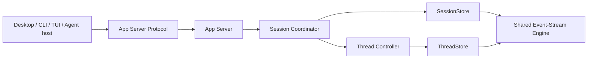

# Zeta 共享长期架构

> 日期：2026-07-25
> 状态：开发期目标架构
> 原则：按长期领域边界直接演进，不保留开发期旧 API 或旧持久化格式的兼容层。
> 产品线映射：`zeta code` 是 TUI，`zeta` 是 Electron Desktop，`zeterm` 是纯 Rust Desktop；
> 三者共享 Session-first Agent 产品契约。`zeterm` 的终端/PTY 宿主可以直接组合终端运行时，但
> 不得为 Agent 的 Session/Thread/Turn/Item 能力绕过 App Server。

## 快速理解

长期架构固定少数不会随实现替换而改变的边界：Session 管任务拓扑，Thread 管执行顺序，
共享协议只定义语义，Core 协调状态，存储只实现一套事件流。

| 长期问题 | 固定答案 | 主要边界 |
| --- | --- | --- |
| 产品根对象是什么？ | Session 是任务和 Thread 拓扑聚合，Thread 是独立执行聚合 | [聚合并发边界](#3-聚合并发边界) |
| 谁拥有状态迁移？ | Core 中的纯 reducer 与协调器 | [Session 协调器](#5-session-协调器)、[Thread 控制器](#6-thread-控制器) |
| 谁拥有持久化格式？ | 一个共享事件流引擎，Session/Thread 只保留类型化适配器 | [唯一物理事件流](#4-唯一物理-event-stream-引擎) |
| 客户端能否拥有另一套状态？ | 不能；Desktop、CLI、TUI 只消费统一 App Server API | [App Server](#8-app-server) |
| 外部请求从哪里进入？ | App Server 是 Session/Thread/Turn/Item 的唯一外部进入/输出门禁 | [App Server](#8-app-server) 与 [App Server API](zeta-app-server-api.md) |
| 开发期旧接口如何处理？ | 直接迁移权威契约和调用方，不建立隐藏兼容层 | 本文固定原则 |

## 1. 结论

Canonical 产品模型、契约分类与 sequence/ID 语义统一由
[`protocol.md`](protocol.md) 定义。系统架构只依赖一个关键结论：Session 是任务与 Thread
拓扑 aggregate，Thread 是执行 aggregate；二者有父子领域关系，但不是同一个并发与顺序边界。



长期必须同时满足：

- Core 不依赖 App Server wire 类型；
- protocol 只包含跨组件共享的领域契约；
- Session 与 Thread reducer 都是纯函数；
- Session 与 Thread 各自拥有逻辑 sequence；
- storage 的物理 framing、checksum、atomic append 和断尾恢复只有一套实现；
- App Server 是产品能力的唯一外部门禁，只做传输、路由、订阅和 DTO 编解码，
  不复制 Core reducer 或 Store authority；
- Desktop、CLI、TUI 与任何 Agent host 消费同一个 Session-first 产品 API；进程内嵌也必须经过
  同一个 dispatcher。

## 2. Crate 边界

```text
zeta-protocol
  └─ canonical shared semantic contract（详见 protocol.md）

zeta-session-store
  ├─ StoredSessionEvent
  ├─ SessionCommandReceipt
  └─ SessionStore

zeta-thread-store
  ├─ StoredEvent
  ├─ ThreadCommandReceipt
  └─ ThreadStore

zeta-core
  ├─ SessionCoordinator + Session reducer
  ├─ ThreadController + Thread reducer
  └─ ports / lifecycle policy / recovery

zeta-storage
  ├─ shared event-stream engine
  ├─ SessionStore typed adapter
  ├─ ThreadStore typed adapter
  ├─ writer lease
  └─ rebuildable query projection

zeta-rollout
  ├─ local Session + Thread rollout repository
  └─ durable recovery composition (Thread before Session)

zeta-rollout-trace
  └─ read-only, serializable Session rollout trace for export / diagnostics / evaluation

zeta-app-server-protocol
  ├─ JSON-RPC methods and envelopes
  ├─ stable external errors
  └─ JSON Schema / TypeScript generation

zeta-app-server
  ├─ connection lifecycle
  ├─ dispatcher and serialization scopes
  ├─ subscription/update delivery
  └─ local adapter composition
```

依赖方向：

```text
protocol
  ↑
  ├─ session-store
  ├─ thread-store
  ├─ core
  └─ app-server-protocol

session-store + thread-store + core
  ↑
storage

core + rollout + app-server-protocol
  ↑
app-server

core + storage + session-store + thread-store
  ↑
rollout

session-store + thread-store
  ↑
rollout-trace
```

禁止 `core → app-server-protocol`、`protocol → tokio/fs/database/JSON-RPC` 或
`storage → app-server`。

## 3. 聚合并发边界

Session/Thread sequence 的定义与必须独立的理由见
[`protocol.md` 的 Sequence、Cursor 与 ID](protocol.md#5-sequencecursor-与-id)。对系统实现
的直接约束是：两种 aggregate 使用独立 writer/serialization scope，但共享同一个物理
event-stream engine。

## 4. 唯一物理 event-stream 引擎

`zeta-storage::event_stream` 独占以下职责：

- JSONL batch framing；
- format version 与 stream kind discriminator；
- batch checksum；
- atomic append + `sync_data`；
- 未终止尾记录恢复；
- typed payload serde。

Session 与 Thread storage adapter 只负责：

- ID 到 stream path 的映射；
- 调用各自 store crate 的 batch validator；
- typed error 映射；
- list/load 接口。

不再提供第二种单文件 `RolloutLog` API，也不读取旧 kind/payload、旧 schema 或隐式 Session
数据。当前开发数据不符合新格式时明确失败或由开发者清空，不在领域代码中加入 upcast。

`zeta-rollout` 是这套权威历史的本地组合层：它同时打开 typed SessionStore、ThreadStore 与
writer lease，并且保证恢复顺序为 Thread 在前、Session 在后。它不复制 event framing 或 reducer。
`zeta-rollout-trace` 只依赖两个 store port，将某个 Session 的 topology stream 和其计划的各
Thread stream 导出为只读 artifact。trace 保留每个 aggregate 自己的 sequence，绝不发明全局
sequence，也不参与任何运行时写入或状态决策。

## 5. Session 协调器

SessionCoordinator 拥有：

- canonical Session projection；
- Session command receipt；
- membership 与 lineage reducer；
- create/fork/archive/complete lifecycle；
- Session writer lease；
- recovery。

创建与 fork Thread 跨越 Session/Thread 两个 aggregate，使用可恢复 saga：

```text
Session: ThreadCreationPlanned(creating)
    → Thread: ThreadCreated
    → Session: ThreadAttached(active)
```

每一步可幂等重放。恢复发现 `creating` membership 时继续完成已有计划，不能生成新 ID。
Fork plan 同时保存 `parentThreadId` 与当时的 `parentSequence`。

Session 不代理子 Thread 的执行，也不在每个 Thread event 上递增 Session sequence。

## 6. Thread 控制器

Thread 是独立执行与恢复 aggregate：

- `ThreadCreated` 固定不可变 `sessionId`；
- `turn/start` acceptance、user items 与 started facts 原子提交；
- final agent item 与 completed fact 原子提交；
- tool call 与 tool result 都是 durable ThreadItem；
- interrupt 与 failure 通过 typed event 收敛；
- live write 与 recovery 共用同一个 reducer。

Thread snapshot 是 rollout 的可重建投影，不是第二份权威状态。

## 7. 类型化命令回执

Command identity、冲突和重放语义统一见
[`protocol.md` 的 Command 契约](protocol.md#41-command请求改变状态)。Store 的系统级职责
仅是把 typed receipt 与首个业务 event 原子提交，并让 reducer recovery 恢复稳定结果；wire
method 与 serialized params 不得成为 Core 的幂等身份。

## 8. App Server

App Server 是 `Session → Thread → Turn → ThreadItem` 产品能力的唯一外部进入/输出门禁。
完整的参与者、允许路径和禁止旁路见 [Zeta App Server API](zeta-app-server-api.md#唯一外部门禁)；
本节只保留跨组件 ownership 和长期不变量。

它暴露：

- Session create/read/list/subscribe/lifecycle；
- Session-owned Thread create/fork/archive；
- Thread read/subscribe；
- Turn start/interrupt；
- Config 与 Resource；
- `session/update` / `thread/update`。

App Server connection state 只保存 request ID、subscription cursor、resource ownership 与
transport state；它不是产品 Session，也不能成为 Core 领域状态的第二份 authority。

订阅使用 snapshot + durable gap：

```text
subscribe(afterSequence)
  → capture current snapshot
  → return committed updates after cursor
  → continue live updates
```

durable sequence 用于恢复与并发控制；`StreamCursor` 只用于同一 stream incarnation 中可能丢失的瞬态
delta。客户端不得把二者压成一个 sequence。

## 9. Desktop、CLI、TUI 与 Native host

所有需要 Agent 产品能力的入口都先创建或读取 Session，再在 Session 内创建/选择 Thread。任何
入口都不得：

- 直接创建无 Session 的 Thread；
- 从 notification 文本推断权威状态；
- 用 JSON-RPC request ID 代替 CommandId；
- 在客户端维护第二份领域状态机；
- 依赖旧 `thread/start`、`thread/resume` 或 `thread/list`。

`zeterm` 当前直接组合终端/PTY 运行时的路径只服务终端宿主，不是 Agent 产品接口；如果未来
Native host 暴露 Session/Thread/Turn/Item，则必须使用同一 App Server protocol 和 dispatcher。

Desktop preload 只暴露自包含的 `ISandboxGlobals`，其中没有 Node API、Electron event 或不受约束
的频道；`createElectronRendererApi()` 是它的唯一产品适配器，为 Workbench 提供强类型 capability。
Electron Main 持有 JSON-RPC connection 和 trusted IPC validation，Workbench 不接触
Node/Electron primitive 或底层 sandbox bridge。

当前嵌入式浏览器同样遵守该边界：Electron Main 的 `BrowserViewMainService` 独占
`WebContentsView` 和临时 browser session，Workbench 只通过
`ZetaElectronRendererApi.browserView` 交换可序列化命令与状态。浏览器编辑器 UI 与
Rust/Agent browser capability 仍是后续工作，当前实现状态和安全策略以
[`zeta-desktop-architecture.md`](zeta-desktop-architecture.md#7-browser-capability) 为准。

Renderer 内受控 HTML 使用独立的 `WebviewElement` iframe boundary，而不是
`WebContentsView` 或 Electron `<webview>` 标签。当前 iframe 采用 opaque origin、固定 CSP
和 source/channel message validation；扩展宿主与独立 webview origin 尚未实现，精确状态见
[`zeta-desktop-architecture.md`](zeta-desktop-architecture.md#61-iframe-webview)。

Markdown 也不以解析器输出作为信任边界。当前 Workbench 短内容使用
`marked → DOMPurify → MarkdownElement`，完整预览使用
`markdown-it → DOMPurify → MarkdownPreview → WebviewElement`。两条路径共享严格的标签、
属性和 URL allowlist。DOMPurify 的直接适配只位于 `base/browser/domSanitize.ts`；
`workbench/contrib/markdown` 通过 `MarkdownDocumentView` 接入平台预览并拥有产品链接策略，
不复制安全边界。语法高亮、扩展插件及工作区资源映射仍未实现。具体所有权与当前限制见
[`zeta-desktop-architecture.md`](zeta-desktop-architecture.md#62-markdown)。

## 10. 演进规则

当前处于开发阶段：

- 领域语义错误时直接修正 canonical 类型和调用方；
- wire、schema、fixture、Desktop 和 CLI 必须在同一变更内更新；
- stored-event schema 不兼容时提升/重置当前 schema 并明确失败；
- 不保留 deprecated alias、旧 route、隐式转换或双写；
- 真正发布后再引入明确的版本政策与离线 migration 工具。

## 11. 验证门

```bash
cargo fmt --check
cargo clippy --workspace --all-targets -- -D warnings
cargo test --workspace
corepack pnpm --dir desktop test:main
corepack pnpm --dir desktop typecheck:renderer
```

协议变更还必须重新生成 JSON Schema/TypeScript，并由 fixture test 校验生成结果逐字一致。
