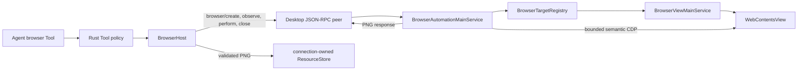

# `zeta` Electron Desktop 架构与协作边界

> 负责人：Desktop 开发者
> Rust 对接负责人：zeta-rs 开发者
> 当前开发基线：[`zeta-app-server-api.md`](zeta-app-server-api.md)
> Workbench 模式装配与切换边界：[`workbench-modes.md`](workbench-modes.md)
> Renderer 控件、Workbench Part 与 CSS 状态所有权：[`ui-styling-ownership.md`](ui-styling-ownership.md)
> Pane-like Part 的标题槽位、CompositeBar、命名与生命周期：[`workbench-pane-composite-design.md`](workbench-pane-composite-design.md)
> Renderer Command、MenuId 与 UI Action 组合系统：[`menu-system.md`](menu-system.md)
> Chat 内 Session Inspector 的信息架构与 Plan 演进：[`chat-session-inspector.md`](chat-session-inspector.md)
> 外部 Agent Skill 来源与加载边界：[`skills.md`](skills.md)
> Agent 自定义对象、`.zeta` 与外部导入边界：[`agent-customizations.md`](agent-customizations.md)
> TUI 明确不提供外部 Agent 导入入口：[`tui.md`](tui.md)
> 三条公开产品线与宿主边界：[`product-lines.md`](product-lines.md)
> 共享 Rust 进程入口实现：[`zeta-server-host`](../zeta-rs/server-host/README.md)

## 快速理解

`zeta` 是 Zeta 的 Electron 产品界面和平台宿主：它负责窗口、交互和系统能力，只投影后端状态，
不复制 Agent、权限或持久化规则。

| 用户或开发者需求 | Desktop 负责 | 必须交给后端 |
| --- | --- | --- |
| 显示对话、工具和批准状态 | Renderer 组件、交互状态和可访问性 | Session、Thread、Turn 的权威状态 |
| 启动桌面应用 | Electron Main、Preload、窗口和 App Server 监督 | Agent 生命周期与恢复 |
| 调用本地产品能力 | 通过类型化 Preload API 和 App Server 客户端 | 领域校验、授权和持久化 |
| 使用浏览器、终端或系统 UI | 平台桥接、用户可见控制和能力请求 | 是否允许执行的最终决定 |
| 增加新产品功能 | 界面拥有呈现，App Server 提供类型化能力 | 禁止在 Renderer 中补一套业务状态机 |
| 断线或后端重启 | 显示连接状态并重新取得快照 | 不根据旧 UI 状态猜测服务端事实 |

## 1. 目标

`zeta` 是 Zeta 的 Electron 富客户端，负责窗口、浏览器、系统能力和 UI，不拥有
Session、Thread、Turn、ThreadItem、审批策略或持久化状态机。

Desktop 只能通过版本化 App Server API 使用 zeta-rs：

```text
Renderer
  → typed Preload API
  → Electron Main
  → JSON-RPC / JSONL / stdio
  → zeta-server app-server
```

Desktop 禁止执行 `zeta ask ...` 后解析终端输出，也禁止直接链接 `zeta-core`。

跨客户端的唯一外部门禁、进程内嵌规则和 Core 旁路禁止项以
[`zeta-app-server-api.md#唯一外部门禁`](zeta-app-server-api.md#唯一外部门禁) 为准；本文件只补充
Electron 的 Renderer、Preload、Main 和可信 IPC 适配细节。

## 2. Desktop 所有权

Desktop 负责：

- Electron Main、Preload、Renderer；
- App Server 进程启动、初始化、监督、重启和关闭；
- 窗口、菜单、快捷键、命令面板；
- Browser View、Tab、BrowserSession、CDP 和下载；
- Renderer 纯 UI 状态与服务端状态投影；
- 宿主权限、导航策略、origin 策略；
- Desktop 端集成测试。

Desktop 不负责：

- Session、Thread、Turn、ThreadItem、Tool Call 的权威状态；
- Agent 规划和工具循环；
- 是否需要审批的业务策略；
- rollout、SQLite 投影和 Thread writer lease；
- 模型供应商与长期凭据持久化；
- Rust 协议 DTO 的定义。

### 2.1 新功能归属判断

不能因为功能从 UI 进入，就把整项功能都归给 Renderer。设计新功能时，按下面的顺序判断并
拆分职责：

1. 没有 Desktop 时，CLI、TUI 或远程客户端是否仍需要相同语义？如果需要，权威行为和共享
   contract 属于 Rust，并通过 App Server 暴露。
2. 功能是否修改权威状态、访问磁盘或网络、执行进程，或者承担权限与安全校验？如果是，它
   不能只在 Renderer 实现。跨客户端的产品语义归 Rust；Desktop 独有的宿主能力归 Electron
   Main，并通过窄的 typed Preload API 暴露。
3. 功能是否只决定如何显示、如何交互，或维护可丢弃且可重建的视图状态？如果是，它属于
   Renderer。
4. 如果以上答案跨越多层，就把它实现为纵向功能，不把后端语义复制到前端，也不把 UI 状态
   塞进 Rust。

前端可以为了即时反馈重复一部分格式校验，但这不替代权威 owner 在可信边界内重新校验。
Renderer 不能因为已经校验过输入，就获得直接使用 `fs`、网络或任意 IPC/RPC 的权限。

`Files` 按下表拆分所有权；“当前状态”用于区分本阶段实现和后续能力：
Rust primitive 与 model adapter 的实现细节分别见
[`zeta-rs/file-system/README.md`](../zeta-rs/file-system/README.md) 和
[`zeta-rs/file-system-tool/README.md`](../zeta-rs/file-system-tool/README.md)。跨平台 Rust
`file:` URI 的 canonical implementation contract 见
[`zeta-rs/utils/path-uri/README.md`](../zeta-rs/utils/path-uri/README.md)；该 crate 当前尚未接入
production consumer，因此下表的共享 URI 状态仍为“部分具备”。

| 能力 | Owner | 当前状态 |
| --- | --- | --- |
| 文件树渲染、展开、加载态 | Renderer | ✅ 单目录 Explorer 与 Seti 文件图标 |
| 选中、快捷键、文件打开与编辑 | Renderer | 部分具备：点击 UTF-8 文件进入编辑器；保存与键盘选择尚未完成 |
| 系统目录选择器 | Electron Main / Preload | ✅ Empty Explorer 选择单目录并重启绑定 workspace |
| 在原生文件管理器中显示 | Electron Main / Preload | 尚未完成 |
| 目录枚举、metadata、文件读写与 workspace 边界校验 | Rust / App Server | ✅ `fs/readDirectory`、`fs/getMetadata`、`fs/readFile`、`fs/writeFile` |
| 重命名、删除 | Rust / App Server | 尚未完成 |
| workspace 内容搜索执行、取消与结果限额 | Rust / App Server | ✅ connection-owned pull job |
| 搜索表单、增量结果分组与高亮 | Renderer | ✅ Search contrib |
| 搜索结果打开文件 | Files / Editor vertical | 尚未完成 |
| Explorer watcher invalidation 与文件树自动刷新 | Rust authority + Renderer projection | 部分具备：App Server 已发布 root-relative `fs/changed`；Renderer 尚未消费 |
| 文件位置 identity | 共享 URI contract；Renderer 只维护其视图投影 | 部分具备：单根 URI 映射 |
| 跨重启的领域 `FileId` 或 `DocumentId` | 拥有该生命周期的 Rust 领域模型 | 尚未完成 |
| Tab、Pane 等纯 UI 实例 ID | Renderer | 已有 Workbench 基础设施 |

集成终端同样按 UI 与进程 authority 拆分：

| 能力 | Owner | 当前状态 |
| --- | --- | --- |
| 每实例 xterm、Tab、输入、焦点和 panel actions | Renderer | ✅ `TerminalViewPane` / `TerminalInstanceWidget` |
| 实例列表、active instance、输入 batching 与 resize coalescing | Renderer `ITerminalService` | ✅ |
| Typed IPC 与 App Server DTO adapter | Preload / Electron Main | ✅ exact-shape validation |
| Terminal ID、workspace binding、输出 ring 与 connection cleanup | Rust / App Server | ✅ connection-owned |
| PTY/ConPTY spawn、raw bytes、resize 与进程终止 | `zeta-utils-pty` | ✅ |
| 可信 Shell Profile discovery 与 ID 解析 | Rust / App Server | ✅ 不暴露 executable |
| 宿主终端环境继承 | Electron Main + Rust / App Server | ✅ 双层 allowlist，凭据变量不进入 App Server 或 PTY |
| 任意 executable/environment 选择 | 无 | ❌ 当前客户端不能提交 |

文件图标的跨客户端数据契约由
[`zeta-file-icons`](../zeta-rs/file-icons/README.md) 拥有：crate 内保存 Seti manifest、WOFF
并提供 Rust resolver。Desktop 在构建前同步运行时资源、直接从 JSON 推导 TypeScript 所需
结构并负责 DOM glyph 渲染；App Server 不参与图标解析。Rust TUI 当前没有 terminal
Seti codepoint adapter；`zeta code` 的当前产品要求也不包含该呈现，因此不构成 TUI backlog。

因此，一项完整功能可以具有一条跨层执行路径：

```text
Renderer component
  → UI command
  → typed Preload API
  → Electron Main
  → typed App Server method
  → Rust authority
```

### 2.2 外部 Agent 配置导入（仅限 Desktop）

外部 Agent 配置导入是 Desktop 专属的用户工作流。当前
[`zeta-agent-import`](../zeta-rs/agent-import/README.md) 已实现 Codex/Claude 已知路径的
metadata-only 检查、canonical containment、symlink 拒绝、确定性 `AgentPathInspection` 和安全诊断；
它不读取候选正文。Desktop 的目录选择、内容预览、冲突确认、导入进度和撤销入口，以及 App
Server 的 apply orchestration 仍是计划设计。TUI 不提供对应命令、目录选择器或配置界面。

底层解析、来源身份、安全校验和持久化仍由各 Rust 领域 authority 与 App Server typed
contract 拥有，Renderer 不能直接扫描用户主目录或自行解释外部配置。
Zeta 原生 Instructions/Skills/Agents、`.zeta` 命名空间以及 Import 与 source registration 的区别
由 [`agent-customizations.md`](agent-customizations.md) 统一定义。

| 外部内容 | Desktop 导入行为 | 权威 owner 与安全边界 |
| --- | --- | --- |
| Codex 的 `~/.agents/skills` 与 Claude 的 `~/.claude/skills` | 用户明确选择后注册为窄的只读外部来源 | Config authority 保存来源；Skill manager 校验 containment、格式、摘要和来源身份 |
| 规则或 instruction 文件 | 预览并按明确映射导入；没有 canonical contract 时不可导入 | 对应 instruction/config 领域定义优先级，外部内容不能覆盖系统、开发者或产品策略 |
| Agent 定义 | 仅在 Agent definition authority 提供 typed import contract 后开放 | Agent/Multi-Agent authority 校验角色、工具请求和生命周期；Desktop 只呈现映射与诊断 |
| MCP 声明 | 单独展示并要求用户确认，不因导入自动连接或获得凭据 | MCP/config authority 保存声明；连接、网络和凭据继续走各自授权 |
| 认证文件、密钥、日志和历史记录 | ❌ 不导入 | Desktop 不读取 `~/.codex/auth.json`，也不把整个 `~/.codex` 或 `~/.claude` 注册为可浏览根 |

导入操作只授予已选择且经过规范化的内容根只读访问，并且必须可查询、禁用和移除。它不是
“以后同类工具都允许”的长期执行批准；导入 Skill 附带的脚本仍通过普通工具、权限与沙箱流程。
具体来源和激活语义由 [`skills.md`](skills.md) 定义，批准语义由
[`permissions.md`](permissions.md) 定义。

该功能即使首版很小，也不能整体放入 `zeta-rs/utils`。外部目录识别、格式映射、敏感内容排除和
配置 mutation 都属于产品领域语义；`zeta-agent-import` 拥有只读发现与计划模型，Desktop 只
拥有交互，App Server 负责协调，各目标领域负责校验和落库。只有不理解 Codex、Claude、Skill、
MCP 或 Agent definition 的路径规范化、目录 containment 和文件 identity 原语可以复用
`zeta-rs/utils/path-utils`、`zeta-rs/utils/path-uri` 等基础 crate。

## 3. 目录边界

```text
zeta-ts/
├── src/
│   ├── main.ts
│   ├── bootstrap.ts
│   └── zeta/
│       ├── base/
│       ├── code/
│       ├── editor/
│       ├── platform/
│       ├── product/
│       └── workbench/
├── generated/
│   └── app-server/
├── package.json
├── tsconfig.main.json
├── tsconfig.preload.json
└── tsconfig.renderer.json
```

`src/` 根目录属于宿主进程启动侧。`bootstrap.ts` 只配置必须在 Electron `ready`
之前生效的进程级策略，`main.ts` 在 bootstrap 完成后加载 Zeta 应用入口。
`src/zeta/` 是产品源码命名空间；其中 `code/electron-main/main.ts` 选择产品并创建
`ZetaApplication`，`code/electron-main/app.ts` 持有服务、窗口、IPC 与退出生命周期。
产品功能不得反向进入根 bootstrap。

产品主进程入口同步注册 Electron `ready` 监听器；异步启动链只能从该监听器触发，
不得在 ESM 顶层等待一个内部再调用 `app.whenReady()` 的 Promise。
`ZetaApplication.startupAfterReady()` 断言 Ready 前置条件，并在不创建业务窗口的状态下
完成 App Server gate。gate 成功后才创建 Workbench；主窗口在 `ready-to-show` 前保持隐藏，
启动过程不创建额外的 splash 窗口。gate 失败时，原生 Retry/Quit 对话框允许 supervisor
回到 stopped 后重新初始化，或按正常退出生命周期关闭应用。

`zeta-ts/generated/` 由 zeta-rs 协议生成命令更新，不手写 wire DTO。
生成的 `APP_SERVER_SCHEMA_HASH` 是 bundled Desktop 的 exact-schema 基线；Electron Main
必须比较 initialize response，hash 不一致时不得创建业务窗口或进入 Ready。

开发态与发布态共享 canonical Zeta package contract。Node 开发组装器
`build/desktop/prepareDevPackage.ts` 在 `.build/desktop/dev/zeta-package` 生成 debug
package；它读取 production builder 使用的同一份 runtime lock、校验 archive digest，并且
只有新 package 完整构建并通过 layout validation 后才替换上一代。它不安装或调用 Python；
Python builder 只属于显式 release packaging。`appServerExecutablePath()` 在开发态选择该
package root，在发布态选择 Electron `resourcesPath`，两者都只启动
`<package>/bin/zeta-server[.exe]`，并把同一 package 中
`<package>/bin/zeta-app-server-daemon[.exe]` 的绝对路径加入受控环境。两者都由开发与发布组装器
显式构建和校验。因此 ripgrep、sandbox helper 与 built-in Skills 不依赖开发机
`PATH`，缺失或 digest 不匹配会在 package preparation 阶段失败，而不是推迟到 App Server
initialize gate。

## 4. 主进程

Main 必须：

1. 从应用包内确定的绝对路径启动 `zeta-server app-server connect`；`server-host` 调用
   `zeta-app-server-daemon` crate 串行化 start、连接或选举 profile-scoped local authority，以
   connection prelude 选择 Workspace runtime，并在交付 stdio 前完成真实 initialize/schema
   readiness probe；显式诊断和恢复使用 `app-server daemon start|restart|stop|version` 的单行 JSON
   控制面；
2. 使用 `shell: false`，只传递环境变量 allowlist；
3. 在创建业务 UI 前完成 `initialize`；
4. 校验 protocol version、schema hash 和 server build；
5. 将 stdout 仅交给 JSONL 协议解析器；
6. 对 stderr 做大小限制和 secret 脱敏；
7. 为启动、初始化、请求和关闭设置 deadline；
8. 采用有上限的指数退避处理崩溃重启；
9. 校验每个 Renderer IPC 的 sender、frame URL、origin 和参数；
10. 持有 Browser Target 与 Resource 的宿主侧所有权。

Main 不把 `ipcRenderer`、`fs`、`child_process`、`webContents` 或任意 JSON-RPC method
直接暴露给 Renderer。

当前 `ChildProcessJsonlTransport` 将子进程 stream lifecycle 与 JSON-RPC pairing 分开。它在积累无限 buffer 前按原始 byte 拒绝超过 1 MiB 的 frame，只接受严格 LF 和有效 UTF-8；outbound write 同时等待 callback 与 drain，并限制 pending write 数。child/stdio 任一错误都会关闭 transport；stderr 只保留 64 KiB ring，诊断读取时脱敏 credential。`close()` 异步、幂等，并在 graceful deadline 后强制终止。`corepack pnpm --dir zeta-ts run test:main` 覆盖分片 UTF-8、超限 frame、非法 framing、backpressure、stderr 和 close。

`JsonRpcPeer` 在 transport 之上负责双向 JSON-RPC envelope、request ID pairing、remote
error、timeout/abort、late/unknown/duplicate response、入站 handler cancellation、pending
上限和 listener 隔离。协议生成器输出 `APP_SERVER_METHODS` 与
`APP_SERVER_NOTIFICATIONS` typed definitions，Electron Main 通过 `AppServerClient` 使用；
产品代码不能传任意 method string 或手写 result 泛型。

`AppServerSession` 独占一个 peer，只有 initialize response 同时通过 server identity、
protocol version 和 schema hash gate 后才进入 Ready，并保存协商后的 server
info/capabilities。

`AppServerSession` 是 connection lifecycle。它不是 canonical 产品 `Session`，不得保存
产品 Session membership、lineage 或权威业务状态；Renderer 只维护可丢弃并可 resync 的
Session/Thread projection。
`AppServerSupervisor` 只接受绝对 executable、显式 child environment allowlist，并管理
Stopped/Starting/Initializing/Ready/Stopping/Crashed/Restarting 状态、initialize deadline、
有界指数退避和 crash budget。崩溃会拒绝旧 Session 的 pending request；新 Session 不自动
重放结果未知的副作用操作。

结构化 IPC router 集中注册有限 channel，并在调用 validator/handler 前同时验证目标
webContents、main frame identity 和确切入口 URL。各能力在自己的
`platform/<capability>/electron-main/*IpcRoutes.ts` 中拥有 channel、exact-shape validator 与
App Server method 映射；`platform/app-server/electron-main` 只拥有连接状态、通用 Resource
route、Supervisor、Session 与 JSON-RPC transport。通用可信 router 和 exact-shape validation
primitive 位于 `platform/ipc/electron-main`，不反向依赖任何产品能力。`code/electron-main/app.ts`
是这些 route factory 的 composition root。unknown field、错误 enum、空 ID 或畸形 Turn input均
不会到达 App Server。协议生成 runtime validator 后，应替换这些同形显式 validator 的来源而
不改变 router 边界。

### 4.1 Workspace 身份与窗口策略

当前实现明确区分两个所有权边界：

- `platform/workspace`（单数）定义一个窗口当前工作区的模型、结构化标识、
  `WorkbenchState` 和 `IWorkspaceContextService`；
- `platform/workspaces`（复数）负责解析、识别和管理工作区。当前已实现启动目标解析，
  单根 Folder 的运行时 authority 切换，以及已解析 Remote Folder 的同 SSH host 重连；最近项目和
  Untitled Workspace 尚未实现。

Desktop 在创建窗口前由 `WorkspacesMainService.resolveStartupWorkspace()` 解析一次启动参数，
并产生不可变的 `IAnyWorkspaceIdentifier`：

- 无项目参数为 `Empty`；
- 目录参数或 `--folder <path>` 为 `Folder`；
- `.zeta-workspace` 文件或 `--workspace <path>` 为 `Workspace`。

`resolveWorkspaceOpenTarget()` 只在 Node/Electron Main 中规范化路径、判断文件类型并为
Folder/Workspace 产生稳定 ID。标识采用 `{ id }`、`{ id, uri }` 或
`{ id, configPath }` 的结构，不存储重复的 `WorkbenchState` 判别字段。窗口状态策略从标识
推导状态：`EMPTY` 映射到 `1200 × 800` 默认窗口，`FOLDER` 和 `WORKSPACE` 映射到
`1440 × 900` 默认窗口。`WindowsStateHandler` 在单个 `windowsState` 记录中持有
`lastActiveWindow` 和 `openedWindows`；每个窗口使用 `workspaceIdentifier`、`folder` 或
`backupPath` 绑定其 UI state。恢复时先匹配具体 Workspace/Folder/空窗口备份，再回退到
last-active state，最后才使用默认尺寸。旧的 `windowState` 与 `windowState.empty` 键不会迁移
或读取。

Renderer 通过受信 IPC route 和 `workspace.getWorkspace()` 读取该身份，并在
`parseWorkspaceIdentifier()` 校验和恢复 URI。`WorkspaceContextService` 根据该标识构造当前
`IWorkspace`，并从 `configuration` 或单根 `folders` 推导 `WorkbenchState`。Workbench
contribution 不得通过该服务直接访问文件系统。单根 Folder 启动时，Electron Main 将该根
配置给 App Server；Renderer 的 `BrowserFileService` 只把 workspace URI 映射成根相对路径，
目录枚举、metadata、有界原子写入、filesystem invalidation 与最终边界授权由 Rust / App Server
完成。Workspace 内容搜索通过独立的
`workspace/search/start|read|cancel` contract 接入；其 ownership 与限制见
[`search.md`](search.md)。Desktop 的保存命令、dirty state、watcher 消费、多根 Workspace 与
搜索结果打开仍未实现。

Profile 级 Session catalog 可包含多个 Workspace。`WorkbenchSessionService` 只持有可重建的
前端 projection；选中其他 Workspace 的 durable Session 时，它通过 native host 请求 Main 重连
App Server authority，等待 Workspace context 提交后重新 list/subscribe，并恢复精确的
Session/Thread。Local 路径重启 profile broker connection；SSH Remote 路径保留 host、凭据 owner
和 runtime policy，只替换远端 Workspace root。切换失败会回滚原 authority，Renderer 不直接读写
SQLite，也不能在旧 Workspace connection 上执行目标 Session。

当前限制：

- 运行时已支持单根 Folder authority 切换；关闭项目、多根 Workspace 内容切换和最近项目流程尚未实现；
- `.zeta-workspace` 当前只作为窗口身份，尚未定义或解析其内容；
- 普通单文件参数仍属于空窗口，文件编辑器尚未实现；
- Explorer 当前仅支持单根 Folder 的按需读取；后端已有 `fs/writeFile` 与 `fs/changed`，但
  Renderer 尚未接入保存、自动刷新、选择模型或键盘导航。Search contrib 已能展示单根
  workspace 内容结果，但尚不能打开文件；
- 当前 `WorkspacesMainService` 只负责启动目标解析，最近项目、多窗口创建和 workspace
  配置管理尚未实现；`windowsState` 已保留多窗口恢复数据形状，但当前只写入单个主窗口；
- 空窗口 backup service 尚未实现，因此当前启动路径没有可传给 `WindowsStateHandler` 的
  `backupPath`，无备份的空窗口只能使用 last-active fallback；
- 启动目标无效时记录错误并安全回退到空窗口。

## 5. 沙箱桥接与 Renderer API

Electron sandbox 边界分为两层。`ISandboxGlobals` 是 preload 唯一暴露到主世界的底层桥接：
它只包含只读进程元数据，以及受 `zeta:` 频道前缀约束的 `invoke` / `on`。preload 必须保持
自包含，运行时除 `electron` 外不得加载任何模块，也不得把 Electron event 对象传给 Renderer。
构建后的 preload 由 `build/desktop/verifySandboxPreload.ts` 检查这一约束。

`createElectronRendererApi()` 是该桥接的唯一产品适配器。它在普通 Renderer bundle 中引用频道
常量，并组装领域化、强类型、可枚举的 `ZetaElectronRendererApi`。跨宿主领域能力由其父接口
`IRendererHost` 定义，Electron 专属能力保持以下精确形状：

```ts
interface ZetaElectronRendererApi extends IRendererHost {
  readonly environment: IRuntimeEnvironment;
  readonly browserView: IBrowserViewApi;
  readonly configuration: IConfigurationApi;
  readonly keybindings: IKeybindingsResourceApi;
  readonly nativeContextMenu: INativeContextMenuApi;
  readonly nativeMenubar: INativeMenubarApi;
  readonly workspace: IWorkspaceContextApi;
}
```

Workbench composition root 是聚合 `IRendererHost` 的唯一产品消费者：它把每个 transport
capability 注入对应的领域 Service。Contribution 只能依赖 `IChatService`、`IGitService`、
`IWorkspaceSearchService`、`ITerminalService` 等前端契约和前端自有领域类型，不能取得整个
Renderer Host，也不能导入生成 DTO。所有产品代码禁止直接导入 sandbox globals，并禁止提供
绕过领域 capability 的通用 App Server 调用：

```ts
execute(method: string, params?: unknown): Promise<unknown>
```

### 5.1 平台服务与产品装配

平台目录按“契约、运行时适配、产品装配”分层，不按 VS Code 的目录名称机械对齐。当前稳定边界如下：

| 能力 | 前端契约 owner | 运行时或传输 owner | 产品装配责任 |
| --- | --- | --- | --- |
| 配置 | `configurationService.ts` | `configurationIpc.ts` 与 Electron adapters | Workbench 创建窗口级 service |
| 生命周期 | `ILifecycleService` | `BrowserLifecycleService` | Workbench 注册 backup、storage 等同步 joiner |
| 日志 | `ILogService` / `ILogSink` | Console 与 System Output sinks | composition root 选择 sinks |
| 外部 URL 与剪贴板 | `IOpenerService` / `IClipboardService` | Browser、Electron Main adapters | Connector host 注入适配器 |
| 编辑器打开 | `IEditorService` | `BrowserEditorService` | Workbench 把具体 `EditorPart` 封装在 service 后面 |
| 窗口宿主操作 | `IWorkbenchHostService` | `WorkbenchWindow` | Workbench 注册当前窗口实现 |
| Code 产品能力 | 各领域 `I*Service` | 对应 browser service implementation | `codeWorkbenchServices.ts` 静态选择并按依赖安装 |

`common/*Service.ts` 只能包含调用方使用的领域类型和 service identifier。IPC channel、生成 DTO、
context bridge API 与 host validation 留在 `*Ipc.ts` 或具体运行时实现中；UI contribution 不得负责
创建 service。`workbenchServiceContributions.ts` 只描述 service、依赖与安装函数，composition root
负责提供原始 capability，并在缺失依赖或依赖环时启动失败。

Zeta 当前没有 VS Code `externalServices` 中的 telemetry machine ID / Marketplace header 组合语义，
也没有构建时替换的 Copilot license endpoint，因此不建立同名空目录。Marketplace 请求继续由
`platform/marketplace` 拥有；不可把任意网络调用、外部 URL 或产品常量汇总进一个模糊的
`externalServices` 或 `endpoint` 包。运行时事实保留在 `base/common/environment.ts`，产品版本在
`product`，跨产品本地资料根在 `platform/profile`；只有出现需要注入、替换或拥有生命周期的真实
调用方时，才把这些不可变策略升级成 service。

## 6. Renderer

Renderer 负责 Command Registry、路由、组件、输入框、虚拟列表和状态投影。

```text
button / menu / shortcut
  → UI Command
  → typed renderer API
  → sandbox IPC bridge
  → trusted IPC route
  → domain RPC
```

Renderer 不复制 Rust 状态机。遇到 durable `sequence` 或 `streamCursor` 空洞时，停止合并
当前实体，并通过 `session/subscribe` 或带 Session scope 的 `session/thread/subscribe` 获取权威 snapshot + gap。

### 6.1 Editor 宿主

`EditorPart` 是 Workbench 中央编辑区域的唯一宿主。`EditorInput` 表示待打开资源；
`IEditorPane` 定义编辑器真正共享的创建、输入、取消、布局、可见性、聚焦与释放语义；
`EditorPaneRegistry` 负责默认匹配、候选枚举和显式编辑器选择。具体产品装配规则由
[`workbench-modes.md`](workbench-modes.md) 负责。

打开新输入时，旧 pane 保持可见，直到新 pane 的异步 `setInput()` 成功。失败不会破坏当前
编辑器；被后续打开或普通内容替代时，宿主中止 `AbortSignal` 并释放候选 pane。成功切换后由
宿主隐藏、清空并释放旧 pane。当前只实现单活动 pane，尚无 tab、文档模型、脏状态、保存、
备份或恢复协议。

### 6.2 iframe Webview

当前 `WebviewElement` 是 Renderer 内用于受控 HTML 的可释放组件，并暴露可由宿主挂载的
iframe 元素。它适合 Markdown Preview、产品内 HTML 面板和后续自定义编辑器，不负责完整
网页浏览、导航历史、Cookie、CDP 或 Agent Browser Target；后者属于第 7 节的
`WebContentsView` 能力。

`WebviewElement` 创建 `srcdoc` iframe，并固定以下边界：

```text
sandbox: allow-scripts
无 allow-same-origin / forms / popups / downloads / top-navigation
opaque origin + credentialless
固定 iframe CSP 与 document CSP
无 connect / nested frame / object / form action
无 Electron preload、Zeta renderer API 或 Node capability
```

内容通过 `acquireZetaWebviewApi().postMessage()` 发送 structured-clone 数据。宿主只接收
`event.source === iframe.contentWindow` 且实例 channel 匹配的 envelope；宿主向 iframe
发送消息时因为 opaque origin 必须使用 `targetOrigin: "*"`，iframe 内容因此有义务检查
`event.source === parent`。

当前实现只拥有 DOM sandbox、HTML replacement、focus、双向 message 与 deterministic
disposal。扩展宿主、独立 origin endpoint、远程/本地资源映射、端口映射、find widget、
state persistence 和权限扩展均尚未实现。引入这些能力时必须保留独立 origin，不能通过加入
`allow-same-origin` 来绕过资源加载问题。当前也尚未接管 iframe 自身的页面跳转；在加入链接
打开策略前，调用方只应提供产品控制的 HTML。

### 6.3 Markdown

当前 Renderer 有两条 Markdown 渲染路径，但共享同一个最终安全边界：

```text
Workbench 短内容
  → marked
  → DOMPurify allowlist
  → MarkdownElement（普通 DOM）

完整文档预览
  → markdown-it
  → DOMPurify allowlist
  → MarkdownPreview
  → WebviewElement（opaque-origin sandbox iframe）
```

`base/browser/domSanitize.ts` 是 DOMPurify 的唯一直接适配器，为目标 document 创建隔离的
sanitizer 实例，防止 hook 跨窗口或跨消费者泄漏。`base/browser/markdownRenderer.ts` 拥有
普通 Markdown 组件、Markdown 标签/属性 allowlist 和 URL policy。
`platform/markdown/browser/markdownPreview.ts` 负责完整文档解析、预览样式及 iframe 链接
消息桥接。`workbench/contrib/markdown/browser/markdownDocumentRenderer.ts` 再将平台预览
适配为 Editor Part 可持有的 `MarkdownDocumentView`，并拥有产品级链接打开回调。

`workbench/contrib/markdown/browser/markdown.contribution.ts` 是 Workbench 功能入口，由
`workbench.contribution.ts` 静态加载；该层只接入产品视图和样式，不重复解析器或 sanitizer。
解析器返回的 HTML 从不视为可信内容，也不得绕过 DOMPurify 直接写入 DOM 或
`WebviewElement.setHtml()`。

当前 allowlist 覆盖标题、段落、列表、表格、代码块、引用和任务复选框等标准 Markdown
结构，拒绝脚本、事件属性、内联样式、SVG/MathML 与未知元素。链接只保留 `http:`、
`https:` 和页内 fragment，并由宿主接管点击；图片只保留 base64 PNG、JPEG、GIF 和 WebP，
不会直接读取本地文件或请求远程资源。预览消息仍需通过 `WebviewElement` 的 source/channel
校验，并在 `MarkdownPreview` 中再次做 exact-shape validation。

当前没有语法高亮、Markdown 扩展插件、Mermaid、KaTeX、工作区相对资源 URI 映射、滚动同步
或预览状态持久化。这些属于后续能力，加入时必须继续保持“解析后统一 sanitize，再进入隔离
容器”的顺序。

### 6.4 Workbench 布局

`base/browser/ui/grid/GridView` 是不感知 Workbench 语义的索引路径布局引擎：它用
branch/leaf descriptor 创建嵌套 `SplitView`，拥有运行时拓扑、尺寸、显隐和隐藏 leaf
的 cached visible size，并通过 `GridLocation` 执行 add/remove/move。`Grid` 在其上提供
以 View identity 为参数的常用 API，Workbench 调用方不持有索引路径。`SerializableGrid`
通过底层 `GridView` 的 `toJSON()` 与显式 deserializer 生成和恢复完整拓扑快照；这些
base 能力不引用 Part、ViewContainer 或其他 Workbench domain。

`workbench/services/layout/browser/layoutService.ts` 拥有面向 contribution 的窗口级布局
契约、Part identity 和 service identifier。`workbench/browser/layout.ts` 是具体实现，
拥有合法的 Workbench 拓扑和初始化策略；产品入口通过
`workbench/browser/workbenchSession.ts` 提供初始 Sidebar、Auxiliary Bar、Agent Sidebar 和
Panel profile，Workbench 不反向导入产品 contribution。窗口变化由高优先级 Editor 区域吸收，
Part 即使隐藏也保持挂载，尺寸查询返回其可恢复尺寸。

当前可变尺寸和显隐快照是具体 `WorkbenchLayout` 的私有实现关注点，不是 Layout Service
契约，也不存在独立的 `layoutState` service。状态流为：

```text
Product session profile defaults
  → initialization state
  → Profile/Workspace scoped stored values
  → SerializableGrid runtime
  → resize / visibility event
  → onWillSaveState
  → scoped Storage Service
```

`platform/storage/common/storage.ts` 定义 Renderer 通用存储契约，包括 Application、
Profile、Workspace scope，User/Machine target，值变更事件和 will-save lifecycle。
`workbench/services/storage/browser/storageService.ts` 是浏览器适配器：以产品、profile 和
workspace identity 隔离 versioned `localStorage` 文档，提供周期 flush 与释放 fallback；
Workbench 的 `ILifecycleService` 在 `pagehide` 或显式关闭时统一等待 shutdown flush。存储不可用
或文档损坏时回退到内存 projection。

具体 Layout 内的私有 `WorkbenchLayoutStateModel` 负责把 domain state 映射为存储 key：
Sidebar、Auxiliary Bar 和 Panel 的尺寸使用 Profile/Machine，显隐使用
Workspace/Machine。Layout Service 契约和通用 Storage Service 都不包含这组 key 或状态
schema。Panel 换边、Sidebar 换边、任意 Part 移动和多窗口拓扑尚未实现，出现真实产品需求
时应扩展具体 Layout，而不是让 contribution 直接操作 Grid。

Renderer Part 的视觉所有权仍以
[`ui-styling-ownership.md`](ui-styling-ownership.md) 为准；Grid 只拥有几何和 sash，
不拥有 Part 内部样式。

### 6.5 Workbench View 与 Chat

Workbench 使用 `ViewContainerLocation` 区分 Sidebar、Auxiliary Bar、Agent Sidebar 和 Panel。
这些 pane-like Part 均由 `PaneCompositePart` 持有统一的标题槽位、`CompositeBar`、可选标题
toolbar 与 retained `PaneComposite` 生命周期；Editor 保留其专用 editor-group 架构。容器贡献只
负责声明位置、顺序和默认项，不直接操作 Workbench 布局。`IViewsService` 根据 view ID 解析所属
container，再委托对应 Part 显示并激活该 composite。Primary Sidebar 和 Panel 显示标准
`CompositeBar`；Auxiliary Bar 隐藏固定 Chat container 的冗余 bar 并投影 Chat 自有标题；Agent
Sidebar 保留统一标题和 CompositeBar host，但过滤唯一冗余 container item，并在标题右侧
`titleActions` 槽位投影收起动作。四者仍使用相同的 Composite 生命周期。该层级、命名和槽位契约以
[`workbench-pane-composite-design.md`](workbench-pane-composite-design.md) 为准。

Chat 是独立 contrib，而不是 Auxiliary Bar 的内建内容：

```text
Open Chat / New Chat
  → IViewsService
  → AuxiliarybarPart
  → Chat ViewContainer
  → ChatViewPane

IWorkbenchSessionService
  → 当前 session / root thread
  → IChatService
  → ChatService
  → thread.subscribe + thread/stream 事件
  → ChatPaneModel
  → ChatViewPane
```

`IWorkbenchSessionService` 负责恢复和切换当前 session/thread；`IChatService` 隔离 model、
thread、turn 和 App Server lifecycle transport，并把生成 DTO 映射为前端领域类型；`ChatPaneModel` 负责单个活动
thread 的可释放订阅、已提交 transcript 与临时 stream projection。活动 Turn 处于 running、
waitingForApproval 或 waitingForUserInput 时，普通文本 Send 调用 `session/request::SteerTurn`，不会新建
第二个 Turn；输入工具栏同时保留 Send 和 Stop，显式 Skill 只允许在新 Turn 接受边界选择。重新连接或 stream 序号
不连续时，以 `thread.read` 返回的权威状态重建展示。`ChatViewPane` 当前支持文本发送、中断、
审批、用户输入请求和经过统一 sanitizer 的 Markdown 展示。

当前尚未实现 session/thread picker、附件和图片输入、fork/history 导航、动态工具执行器。
由于 session 列表当前没有最近活动时间，启动时只能按服务端顺序选择首个活动 thread；
Browser 入口没有 App Server 连接时会明确显示不可用状态。`dev:web` 是不构建 Rust 的独立
前端开发入口，使用同一 disconnected API 保持 UI 可检查，但不声称拥有后端能力。当前本地
`dev:web:full` 是已实现的开发例外：Vite host 为每个 HMR WebSocket client 启动一个 stdio
App Server，并把 transport-neutral JSON-RPC 帧投影成同一份 `IRendererHost`。该 bridge 只监听
loopback、复用 Vite WebSocket
token 与同源检查，client 断开后回收其子进程；它不构成生产远程 Web transport。静态 Browser
构建仍使用 disconnected API，生产 HTTP/WebSocket listener、认证、origin policy 和部署服务
仍是当前限制。

### 6.6 集成终端

Terminal contribution 只依赖 Workbench service layer 的 `ITerminalService`。实例管理、输入
batching、resize coalescing 和 polling 由 `TerminalService` 负责；process contract 位于
platform layer 的 `ITerminalProcessService`。`IRendererHost` 直接提供该领域契约；Electron、
Vite development 和 disconnected runtime 分别实现它，wire DTO 只出现在对应 runtime
implementation 内。Contribution 和 xterm view 都不直接调用 `IRendererHost`：

```text
TerminalViewPane / xterm
  → ITerminalService
  → TerminalService (Renderer)
  → ITerminalProcessService
  → ElectronTerminalProcessService + IAppServerApi
  → trusted Electron IPC
  → platform/terminal/electron-main/terminalIpcRoutes
  → terminal/* App Server methods
  → TerminalService (Rust)
  → zeta-utils-pty
```

SCM 同样通过 `IGitService → GitService → IGitApi` 访问仓库，并由 Service 把 status notification
和 reconnect lifecycle 投影成前端事件；Search 通过
`IWorkspaceSearchService → BrowserWorkspaceSearchService → IWorkspaceSearchApi` 消费有界批次。
两者的 contrib 都不接触 App Server notification union 或生成 DTO。

Terminal title actions 通过 `MenuId.TerminalTitle`、Context Key 与
`MenuWorkbenchToolBar` 接入 MenuService；profile selector 仍由 Terminal 自定义 action view
item 呈现。Command/Menu/Toolbar 的分层以 [`menu-system.md`](menu-system.md) 为准。

当前输出采用 `terminal/read` bounded polling，而不是 `terminal/output` notification；这是 Terminal
protocol 的显式流控选择，不再是 JSONL request loop 的串行限制。前端 service 将 pull 转成
`onDidWriteData` 事件，因此 future transport 支持主动、有背压的 stream 后，Workbench caller
不需要改变。Renderer 对输入做 8 ms
batch，对 resize 做 microtask coalescing；Rust 仍重新校验输入 byte limit、rows/cols、owner 和
output cursor。

Terminal 当前只在单根 workspace composition 中可用；空窗口会显示 terminal service
unavailable。PTY
不跨 App Server crash 恢复。每个实例拥有独立 xterm widget，Tab 切换或 Panel 隐藏不会丢失
窗口生命周期内的 scrollback 与 ANSI parser 状态；Profile picker 只提交 App Server 已列出的
稳定 ID。Supervisor 离开 ready 后，运行实例进入 `disconnected`；恢复 ready 后用户可以显式
Relaunch，新 PTY 使用原 Profile，但不会重放未确认输入或冒充旧进程。当前尚无 shell
integration、跨进程 reconnection attach 或跨应用重启的持久 scrollback。

## 7. 浏览器能力

Electron Main 是 Browser Target 的唯一权威持有者。

### 7.1 当前实现

`BrowserViewMainService` 为每个目标创建一个 Electron `WebContentsView`，将其挂载到所属
`BrowserWindow.contentView`，并在目标关闭或窗口释放时移除并关闭 `webContents`。新目标默认
隐藏；Renderer 必须先通过 `browserView.layout()` 提交窗口内容坐标，再通过
`browserView.setVisibility()` 显示。

浏览器目标当前同时服务于界面操作和 Agent 语义工具，但两条入口共享同一个 Electron Main
目标权威源：

| 场景 | 入口 | 执行路径 | 权威边界 |
| --- | --- | --- | --- |
| Workbench 创建、布局和导航嵌入页面 | Renderer 的 `browserView` API | 可信 IPC → `BrowserViewMainService` | Electron Main 持有目标和原生对象 |
| Agent 观察页面或执行输入 | Rust 内置浏览器工具 | `BrowserHost` → 反向 JSON-RPC → `BrowserAutomationMainService` | Rust 决定批准；Electron Main 执行语义动作 |
| 截取页面 | `browser_screenshot` 或观察选项 | Electron `capturePage()` → App Server `ResourceStore` | 图片按连接隔离，响应只返回资源引用 |
| App Server 断开或重启 | Supervisor 状态迁移 | `BrowserAutomationMainService.reset()` | 只关闭该宿主能力创建的目标 |



`platform/browser/common/browserView.ts` 拥有可序列化 DTO、频道和输入 validator。
`browserViewIpcRoutes()` 只做受信 IPC 绑定，`BrowserViewMainService` 拥有 target map、原生 view、
session 安全策略、导航历史和事件投影。`WebContentsView`、`WebContents`、Electron event 与
session 对象均不得跨越 IPC。`BrowserTargetRegistry` 只在 Electron Main 中把精确
`targetId` 映射到仍存活的原生目标；它不选择活动标签，也不向 Renderer 暴露 CDP。

当前 URL policy 允许 HTTPS、loopback HTTP 与精确的 `about:blank`，拒绝 URL credentials、
`file:`、`javascript:` 和其他特权 scheme。每个目标使用独立临时 partition，并固定：

```text
nodeIntegration: false
contextIsolation: true
sandbox: true
webviewTag: false
无远程页面 preload
默认拒绝 permission / device permission / download / popup
```

popup 请求只以 `openRequested` 事件返回已验证 URL，不会由远程页面直接创建窗口。Renderer
可收到目标 state、加载失败、popup 请求、renderer 崩溃和关闭事件，但不能获得底层 Electron
对象。

Desktop 在 `initialize` 中声明浏览器宿主能力版本 1，并注册四个 Server → Client 请求：

- `browser/create` 创建隔离且默认隐藏的目标；
- `browser/observe` 返回 URL、标题、加载状态，以及可选的 accessibility tree、DOM snapshot 和
  PNG 截图；
- `browser/perform` 只接受导航、按后端 DOM node ID 点击/输入、滚动、后退和刷新；
- `browser/close` 只关闭请求中的精确目标。

Electron Main 直接使用 Electron 自带的 Node runtime 和 `webContents.debugger`；没有 Node sidecar，
也没有 localhost remote-debugging port。自动化层只发出固定的 Accessibility、DOM、Runtime 和
Input CDP 命令，不接受任意 CDP method。accessibility tree 与 DOM snapshot 各限制为 8 MiB，PNG
限制为 16 MiB；Debugger 操作按目标串行，并在每个可安全停止的边界观察取消。

Rust `BrowserHost` 使用独立的字符串 request ID 复用现有 JSONL 连接，把新目标绑定到实际响应的
Desktop connection。后续观察、动作和关闭只路由给这一 owner；非 owner 响应、目标身份变化和
重复响应均失败。请求在 30 秒后超时，取消或超时会发送 `$/cancelRequest`，安全忽略已放弃请求的
晚到终态。截图经 Base64 长度、PNG MIME/signature 校验后进入 5 分钟 TTL 的 connection-owned
`ResourceStore`。

内置工具为 `browser_open`、`browser_observe`、`browser_navigate`、`browser_click`、
`browser_type`、`browser_scroll`、`browser_back`、`browser_reload`、`browser_screenshot` 和
`browser_close`。Rust 重新执行 URL、目标与 node ID 校验，并把每次动作建模为
`BrowserInteraction` + `UserInterface` capability；当前策略要求一次性用户批准，Electron Main
不能自行放宽。完整浏览器工具面只有在工作区可信且至少一个 version 1 connection 同时声明
`observe + input` 时才进入当前 Tool generation；工作区进入 Restricted 状态、信任被撤销或最后
一个完整宿主断开时会原子移除。
反向 RPC handler 可以继续注册，但 Agent 无法从没有上述双重授权的工作区发起动作。

### 7.2 当前限制与计划演进

当前限制：

- 尚无浏览器编辑器、地址栏、标签页或 DOM 容器自动布局绑定；
- 尚未实现持久 BrowserSession、下载 UI、权限提示、证书信任或 PDF 导出；
- 当前观察结果是有界的原始 CDP JSON，还没有 Playwright locator、ARIA snapshot、trace、console
  或 network inspection；
- Electron Debugger 的单条在途命令不能被 Chromium 抢占；取消会阻止后续步骤并使 Rust 调用
  终止，但底层命令仍可能在目标关闭前完成；
- 目标只存在于当前 Desktop 窗口和 App Server 连接生命周期，不跨应用重启恢复。

下一阶段可以在 Electron Main 内增加 `CDPBrowserProxy`，通过 Playwright
`connectOverCDP` 的进程内 transport 驱动现有 `WebContentsView`。这一阶段仍不得新增 Node
sidecar、调试端口或把任意 CDP 暴露给 Rust。PDF、下载、trace、network、console 和高级 locator
属于后续独立契约，当前不能描述为已完成能力。

## 8. Desktop 提交 App Server 能力需求

Desktop 开发者在实现前提交一份符合
[`zeta-api-interface-requirements.md`](zeta-api-interface-requirements.md) 的产品接口需求。
Desktop 是需求提出方；zeta-rs 是已接受 App Server 契约的 owner。接口必须同时评估 CLI、
daemon 和远程客户端影响，不能定义为 Desktop 私有业务 API。

文档必须覆盖：

- Client → Server 方法；
- Server → Client 请求；
- Server → Client 通知；
- Resource RPC；
- Browser Target 生命周期；
- 错误码、超时、取消、幂等和顺序；
- 每个请求、成功响应和错误响应的 JSON fixture。

zeta-rs 开发者根据该文档实现 Rust DTO、dispatcher、typed client、handler、schema 和
TypeScript 生成。进程内 CLI client 与 Desktop stdio client 必须经过同一个 dispatcher。

当前已接受的方法、通知、错误码和前端可开发范围以
[`zeta-app-server-api.md`](zeta-app-server-api.md) 为准。

## 9. Rust 交付给 Desktop 的产物

每次协议交付至少包含：

- 可运行的 `zeta` 二进制；
- `zeta-server app-server connect`（共享 local authority）与 `--listen stdio://`（direct compatibility）；
- 独立的 `zeta-app-server-daemon` binary（profile authority、process-generation record、真实
  initialize readiness、协作停止、socket 与 idle lifecycle）；
- `zeta-rs/app-server-protocol/schema/types.ts`；
- `zeta-rs/app-server-protocol/schema/schema.json`；
- schema hash；
- 当前 schema fixtures；
- Rust contract tests；
- API 变更说明。

## 10. Desktop 验收

Desktop 完成的最低证据：

- TypeScript strict build 通过；
- initialize 成功并校验 schema hash；
- Session 创建、Thread 创建/fork、订阅恢复和 Turn 中断端到端通过；
- 通知能从 App Server 到 Renderer；
- 未生成或参数错误的 IPC 被拒绝；
- 不可信网页无法访问应用 IPC；
- Browser Target 关闭后不会操作其他 Tab；
- App Server 崩溃、重启和 graceful shutdown 有测试。
