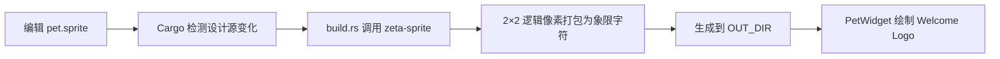

# Zeta Code 终端 Logo 开发

> 状态：Current development contract。
>
> 本文拥有 `zeta code` Welcome 区域终端 Logo 的设计源、尺寸、生成和验收规则。[界面部位词典](LAYOUT.md)拥有 Welcome 的页面位置与高度退化规则，[TUI 样式](styles.md)拥有终端颜色和字符的一般规则，[TUI crate README](../tui/README.md)记录实现入口。

## 快速理解

当前 Logo 的唯一设计源是 [`pet.sprite`](../tui/assets/welcome/pet.sprite)：

- 文件里是 `16×9` 个可独立编辑的逻辑像素；
- 生成时，每组 `2×2` 逻辑像素由一个 Unicode 象限字符表示；
- 最终占用 `8×5` 个终端字符格，第五行字符格只使用源网格第九行。

因此，`2×2` 是编码方式，不是把四个逻辑像素合成一个粗像素。耳朵可以画成 4 个逻辑像素高，脚可以画成 3 个逻辑像素高；脚的最后一个像素会由半格或象限字符表达，不会补成 4 个实心像素。

| 想做什么 | 应该怎么做 |
| --- | --- |
| 调整 Logo | 只编辑 `pet.sprite`，正常编译会自动应用 |
| 快速看最终字符 | 运行 `just pet`，查看 `8×5` 彩色终端预览 |
| 验收源和界面 | 运行 `just test zeta-sprite` 和 `just test zeta-tui welcome` |
| 从 SVG 产生初稿 | 用 `zeta-sprite` 指定终端列数和行数，再人工修正网格 |



## 1. 设计原则

### 1.1 逻辑像素负责细节，终端字符格负责占用

编辑器里的每个 `B`、`K` 或 `.` 都是一个独立逻辑像素。一个终端字符格内部仍有左上、右上、左下、右下四个位置，所以奇数高度不会被取整。以占满一格宽的竖条为例：

```text
4 像素高：█ + █
3 像素高：█ + ▀
```

这里的字符只是竖向示意；实际生成器会根据四个位置选择 `▘▝▀▖▌▞▛▗▚▐▜▄▙▟█` 中的字符。

当前设计明确使用：

- 耳朵：源网格第 1–4 行，共 4 个逻辑像素高；
- 脚：源网格第 7–9 行，共 3 个逻辑像素高；
- 输出：固定为 8 列、5 行终端字符格。

### 1.2 先保住身份，再保住面积

小尺寸 Logo 按以下顺序判断：

1. 外轮廓在不看颜色时仍可辨认；
2. 两只眼睛的位置和间距明确；
3. 耳朵与脚能和身体分开；
4. 左右重量平衡；
5. 最后才追求与 SVG 的覆盖面积接近。

自动缩放只理解颜色覆盖，不理解哪些像素承担 Logo 身份，所以 SVG 转换结果只能作为初稿。

### 1.3 按终端字格设计

常见等宽终端字符的高度约为宽度的两倍。象限字符把一格划成 `2×2` 后，每个逻辑像素在视觉上接近方形。`16×9` 源网格因此会占用 8 列和 4.5 格视觉高度；存储时需要 5 行字符格，最后半行保持透明。

最终效果仍受终端字体影响，应以 `just pet` 和真实运行效果为准。

## 2. 设计源格式

当前源文件内容：

```text
B=#4085AC
K=#000000
---
...B........B...
...BB......BB...
....BB....BB....
...BBBBBBBBBB...
..BBBKBBBBKBBB..
.BBBBBBBBBBBBBB.
..BBB......BBB..
...BB......BB...
...B........B...
```

格式规则：

- `---` 之前是调色板，每行使用 `字符=#RRGGBB`；
- `.` 固定表示透明；
- `---` 之后所有行必须等宽；
- 当前网格固定为 `16×9`，生成结果为 `8×5`；
- 同一个 `2×2` 区域如果含透明像素，只能再含一种不透明颜色；
- 同一个 `2×2` 区域可以含两种不透明颜色，但四个位置必须全部不透明。

最后两条来自终端字符的前景色、背景色表达能力。违反后，构建会直接报出具体字符格坐标，不会悄悄降级。

## 3. 修改和预览

日常调整只需要：

1. 编辑 `zeta-code/tui/assets/welcome/pet.sprite`；
2. 运行 `just pet` 看最终的 8×5 象限字符；
3. 运行 TUI 或相关测试确认 Welcome 中的组合效果。

普通 Cargo 编译会由 [`build.rs`](../tui/build.rs) 自动读取设计源，将生成结果写入 Cargo `OUT_DIR` 并嵌入二进制。仓库不保存第二份生成资源，程序运行时也不会从磁盘读取 `pet.sprite`。

从方形 SVG 产生 8×4 初稿：

```bash
python3 -B scripts/cargo.py run --quiet -p zeta-sprite -- path/to/logo.svg --columns 8 --rows 4
```

修改当前 `16×9` 网格时不需要运行生成命令写文件；`just pet` 只是预览。

## 4. 实现责任

| 对象 | 当前责任 |
| --- | --- |
| [`tui/assets/welcome/pet.sprite`](../tui/assets/welcome/pet.sprite) | 唯一可编辑设计源，拥有颜色和逻辑像素 |
| [`zeta-sprite::compile_sprite_grid`](../sprite/src/grid.rs) | 校验网格并将每组 2×2 逻辑像素打包为象限字符 |
| [`tui/build.rs`](../tui/build.rs) | 监控设计源，将生成代码写入 Cargo `OUT_DIR` |
| [`app/welcome/pet.rs`](../tui/src/app/welcome/pet.rs) | 编译时嵌入静态结果并绘制到 Ratatui buffer |
| [`app/welcome.rs`](../tui/src/app/welcome.rs) | 决定 Logo 与 Welcome 文字的排布和窄窗口退化 |

Logo 当前占 8×5 个终端字符格，右侧身份信息占三行。Logo 放不下时只隐藏图形，产品名、模型和目录仍保留。

## 5. 验收

每次修改执行：

```bash
just pet
just test zeta-sprite
just test zeta-tui welcome
```

验收时确认：

1. 预览确实报告 `16x9 source -> 16x9 logical pixels -> 8x5 terminal cells`；
2. 耳朵连续占 4 行源像素，脚连续占 3 行源像素；
3. 脚的第三行在最终预览中表现为半格细节，不变成第四个逻辑像素；
4. 蓝色轮廓、黑色眼睛和左右平衡在真实终端中清楚；
5. Welcome 宽屏显示图形和文字，窄屏隐藏图形但保留文字；
6. 只审查本次变化对应的 `insta` 快照，不手工编辑或批量接受无关快照。

## 6. 长期不变量

- 终端 Logo 只有一个可编辑设计源，派生代码只进入 Cargo `OUT_DIR`；
- `pet.sprite` 保留逐逻辑像素编辑能力，终端输出使用 2×2 象限字符压缩占用；
- 奇数宽高由透明的缺失象限表达，不能为凑偶数而改变轮廓；
- 自动转换只产生初稿，最终小尺寸 Logo 以辨识度为验收目标；
- 窄窗口中的文字替代和键盘行为不能依赖 Logo 是否显示；
- 文本快照用于发现字符布局变化，不能代替真实终端预览。
