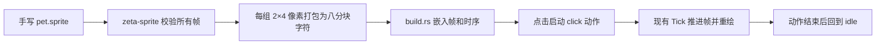

# Zeta Code Pet Sprite 与点击动作

> 状态：Sprite 格式、命名帧、动作时序、构建嵌入和预览已实现；Welcome 点击播放尚未实现。
>
> 本文拥有 `zeta code` Welcome 宠物的手写网格格式、动作语义和验收规则。[界面部位词典](LAYOUT.md)拥有 Welcome 的页面位置与空间不足时的隐藏规则，[TUI 样式](styles.md)拥有一般颜色规则，[TUI crate README](../tui/README.md)记录当前实现入口。

## 快速理解

Pet 应使用一个手写的 `pet.sprite` 作为唯一设计源。文件保存调色板、命名帧和命名动作；设计空间是 `8×8`，手绘精度是 `16×16` 个源像素，每个终端字符格读取 `2×4` 个源像素，Pet 实际输出为 `8×4` 个终端字符格。Welcome 仍固定预留 `8×5` 的 Pet viewport，因此提高精度不会把 Welcome 撑高。

SVG 适合画初稿，但不适合作为最终动作源。小尺寸动作需要逐帧控制耳朵、眼睛、身体和脚实际使用哪个终端块字符，不能让图片缩放过程替作者决定轮廓。

| 想做什么 | 按什么规则做 |
| --- | --- |
| 调整静止造型 | 修改 `idle` 帧的 `16×16` 网格 |
| 新增一个动作 | 增加命名帧，再在命名动作中按顺序引用这些帧 |
| 画实心格、半格或四分之一格 | 按本文的 `2×4` 源网格填写颜色符号和 `.` |
| 在 Welcome 中触发动作 | 计划由单击 Pet 播放一次 `click` 动作；当前可用 `just pet click` 预览 |
| 空间不足 | Pet 和它的点击区域一起隐藏，Welcome 文字继续显示 |



## 1. 网格与终端字符

### 1.1 两层尺寸

一个常见终端字符格的高度约为宽度的两倍。Pet 的设计空间先按两个方向各放大两倍成为 `16×16` 源网格；一个终端字符格再读取 `2×4` 个源像素，因此源像素在屏幕上接近正方形。

```text
8×8 设计空间
  → 每个设计单位变成 2×2 源像素
  → 16×16 源网格
  → 横向每 2 个、纵向每 4 个合为一个终端字符
  → 8×4 Pet 终端字符格
  → Welcome 预留 8×5 viewport
```

`pet.sprite` 的 `size 16 16` 指源网格，不是终端显示尺寸。Welcome 布局中的“宽、高”指终端字符格；所有动作帧必须保持 `16×16` 源网格，动作不能推动右侧文字或改变 Welcome 高度。

### 1.2 `2×4` 网格与字符编码

下面用 `B` 表示同一种颜色，`.` 表示透明。一个终端字符的源网格布局固定为下面这样，位编号按从左到右、从上到下排列：

```text
bit 0  bit 1
bit 2  bit 3
bit 4  bit 5
bit 6  bit 7
```

因此，一个 `2×4` 源块直接写成四行、每行两个字符，例如：

```text
BB  # 上半个 terminal cell，等价于一个设计单位的 1×1 实心块的上半部分
BB
..
..
```

常用形状如下：

| 源网格 | 含义 |
| --- | --- |
| `../.. / ../.. / ../.. / ../..` | 全透明 |
| `BB / BB / .. / ..` | terminal cell 上半部分 |
| `.. / .. / BB / BB` | terminal cell 下半部分 |
| `BB / BB / BB / BB` | 一个 terminal cell 的实心块 |
| `BB / BB` | 一个设计空间中的 `1×1` 实心块，源网格尺寸为 `2×2` |
| `BB` | 一个设计空间中的 `1×0.5` 实心块，源网格尺寸为 `2×1` |

编译器把这 8 个位编码成 [Unicode Block Octant 字符](https://www.unicode.org/charts/nameslist/n_1CC00.html)；已有的 `▀`、`▄`、`█` 等字符会在形状正好对应时复用，其余形状使用八分块字符。作者只需要填写源网格，不需要手写 Unicode 字符。

颜色符号不限于 `B`。例如下面的 `2×4` 源块会显示为上半蓝、下半黑：

```text
BB
BB
KK
KK
```

一个 `2×4` 小块必须满足下面一种情况：

- 透明加一种不透明颜色；
- 完全不透明，使用一种或两种颜色。

“透明加两种颜色”无法由一个终端字符同时表达，构建必须报出具体帧名和终端字符格坐标，不能自动改色或丢像素。

### 1.3 静止帧源码

`idle`、`press`、`rise`、`land` 都必须是 `16` 行、每行 `16` 个符号。`B` 是身体，`K` 是眼睛，`.` 是透明；具体轮廓以 [`pet.sprite`](../tui/assets/welcome/pet.sprite) 为准，修改后用 `just pet frames` 查看编译结果。

例如一条宽 `1`、高 `1.5` 的腿，在 `16×16` 源网格中就是 `2` 列、`3` 行；它会落在一个 `2×4` terminal cell 和下一个 cell 的上半部分中，不需要把腿补成两个完整实心格高。

## 2. `pet.sprite` 文件定义

### 2.1 文件结构

当前使用下面的单文件格式。它是 Pet 的设计文件，不是通用图片格式。

```text
version 1
size 16 16
color B #4085AC
color K #000000

frame idle
<16 行，每行 16 个符号>
end

frame press
<16 行，每行 16 个符号>
end

frame rise
<16 行，每行 16 个符号>
end

frame land
<16 行，每行 16 个符号>
end

action click
press 75
rise 100
land 100
end
```

### 2.2 语法规则

- 第一行固定为 `version 1`；不认识的版本直接拒绝。
- `size` 对 Pet 固定为 `16 16`；所有帧共享这个尺寸。
- `color` 使用一个非空白 ASCII 字符和 `#RRGGBB`；`.` 永远表示透明，不能进入调色板。
- `frame` 和 `action` 名称使用小写 kebab-case，并且不能重复。
- `idle` 帧必须存在；没有动作播放时只绘制它。
- 每个 `frame` 必须恰好包含 16 行，每行恰好包含 16 个已定义符号。
- `action` 的每一行使用“帧名 + 持续毫秒数”；持续时间必须是 25 毫秒的倍数，范围为 25–250 毫秒。
- 一个动作包含 1–8 个步骤，总时长不超过 600 毫秒；动作结束后自动回到 `idle`，动作表中不重复写 `idle`。
- 当前产品只要求 `click` 动作，格式允许以后增加其他明确触发的动作，但不允许无人操作时循环播放。
- 未定义颜色、未知帧、重复名称、错误尺寸、无法编码的颜色组合和越界时长都使构建失败。

文件顺序只影响人阅读，不决定播放顺序。真正的顺序只由 `action` 中的步骤决定，因此修改动作时可以在不移动已有帧的情况下增加或重排步骤。

## 3. 动作设计规则

Pet 的动作是在用户主动碰它时给出回应，不是持续抢占 Welcome 注意力的装饰。每个动作必须满足：

- **短**：一次动作控制在 600 毫秒内，推荐 3–5 个动作帧；
- **稳**：所有帧使用同一个 `16×16` 画布，身体中心和脚底基线默认不漂移；
- **能停**：任何一帧之后都能直接回到 `idle`，退出或切换页面不需要补播；
- **能辨认**：优先改变眼睛、耳朵和一格以内的身体轮廓，不靠增加画布或新文字表现动作；
- **安静**：没有点击时不自动眨眼、不循环、不额外重绘。

当前 `click` 动作使用“压低一点 → 抬起一点 → 落回去”的 `press`、`rise`、`land` 三帧结构；动作结束后回到 `idle`。

## 4. 点击行为

Pet 仍然是装饰图形，动作不改变 Session、Thread、模型或输入状态。计划中的触发入口只有鼠标左键：在 Pet 区域按下并在同一区域松开，而且中间没有拖动时播放 `click`。关闭鼠标交互时不提供额外命令入口。

鼠标拖动继续属于终端文字选择，不能触发动作。动作播放期间再次触发时，从 `click` 的第一帧重新开始；切换页面、Logo 被隐藏或应用退出时立即回到 `idle`。动作没有功能结果，因此不播放声音、不写 Transcript，也不增加状态提示。

Pet 不获得独立键盘焦点，也不添加常驻边框、按钮文字或悬停底色。它在静止时继续保持安静，点击只是一个不影响主要任务的小彩蛋。

## 5. 责任边界

| 对象 | 责任 |
| --- | --- |
| `tui/assets/welcome/pet.sprite` | 唯一可编辑设计源，保存调色板、所有帧和动作时序 |
| `zeta-sprite` | 解析并校验格式，把每帧的 `2×4` 源像素打包成终端字符；不处理点击和时间推进 |
| `tui/build.rs` | 构建时编译所有帧和动作，将结果写入 Cargo `OUT_DIR` |
| `app/welcome/pet.rs` | 绘制当前帧，不读取磁盘文件 |
| `App` 的 Welcome 状态 | 拥有当前动作、当前步骤和下一次换帧时间 |
| 现有终端事件循环 | 用 `Tick` 推进动作，通过统一命中检测接收点击并请求重绘 |

动作不需要独立线程或第二套计时器。现有终端事件源以 25 毫秒为轮询间隔产生 `Tick`；持续时间限定为 25 毫秒的倍数，可以直接复用同一事件循环，实际换帧以不早于目标时间为准。

## 6. 预览和验收

当前预览入口固定为：

```bash
just pet
just pet frames
just pet click
```

- `just pet` 打印 `idle` 的彩色 `8×4` 结果；
- `just pet frames` 按名称打印所有静态帧，方便逐格比较；
- `just pet click` 按真实时序播放一次动作并回到 `idle`。

每次修改 Pet 动作时执行：

```bash
just pet frames
just pet click
just test zeta-sprite
just test zeta-tui welcome
```

当前 Sprite 格式与构建阶段必须覆盖第 1–3 项；完成 Welcome 点击播放时再同时覆盖第 4–7 项：

1. 所有帧都是 `16×16` 源像素、`8×4` Pet 终端字符格，Welcome 预留 `8×5` viewport；
2. 每个 `2×4` 小块解码后与源网格逐格一致，包括蓝黑双色眼睛；
3. 静态帧快照能发现字符、前景色和背景色变化；
4. 时序测试使用受控时间验证开始、换帧、重复触发和自动回到 `idle`；
5. 点击测试验证按下和松开都命中 Pet 才播放，拖动选择不播放；
6. Logo 隐藏或鼠标交互关闭时，点击不改变其他界面状态；
7. 在真实终端中查看一次动作，确认终端字体下没有比例走样和明显闪烁。

## 7. 当前实现与实施顺序

当前 [`pet.sprite`](../tui/assets/welcome/pet.sprite) 是唯一设计源。`zeta-sprite` 已实现版本、尺寸、颜色、命名帧、命名动作与时序校验；`build.rs` 会把全部帧和动作生成到 Cargo `OUT_DIR`，Welcome 读取其中的 `idle` 帧。`just pet` 的三个预览入口均已实现。

剩余实施只有 Welcome 交互：增加 Pet 点击目标，由现有 `Tick` 推进 `click` 步骤并补齐状态、命中与时序测试。仓库不注册 `/pet` 命令。

## 8. 长期不变量

- Pet 的可编辑内容只有 `pet.sprite`，不能同时维护 SVG、PNG、字符画或生成后的 Rust 数据；
- 每帧固定为 `16×16` 源像素，输出固定为 `8×4` 终端字符格，Welcome viewport 固定为 `8×5`；
- 实心格、半格和四分之一格都由 `2×4` 网格确定，使用 Block Octant，不使用 Braille 点阵；
- `zeta-sprite` 只拥有格式与编译，Welcome 只拥有交互和播放状态；
- 动作只在明确触发后播放一次，不持续循环，不改变 Welcome 布局；
- 产品名、模型、目录和键盘主流程不能依赖 Pet 是否显示或动作是否播放；
- 修改动作时必须编辑设计源并运行预览和测试，不能直接修改构建产物。
