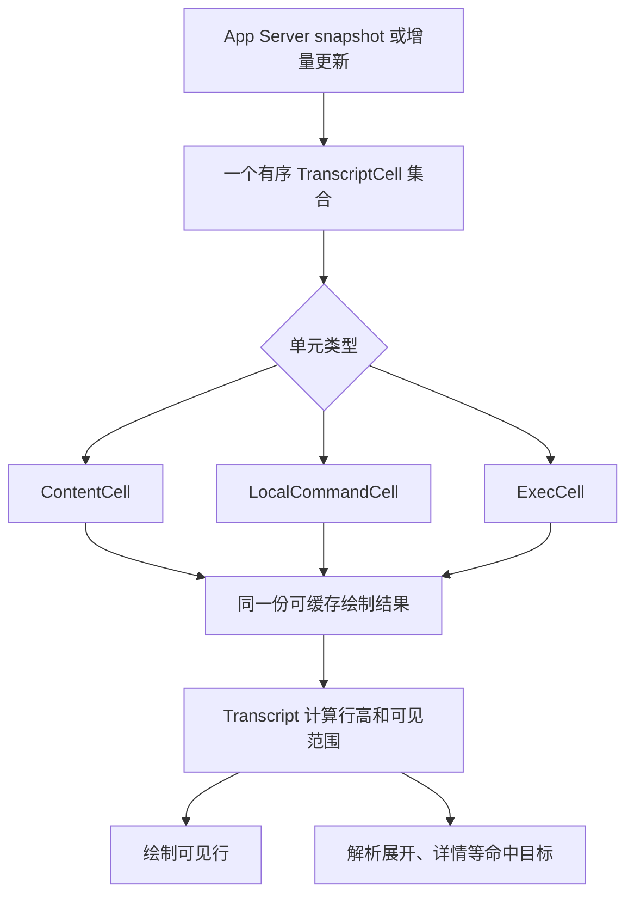

# `zeta code` TUI 架构

> 状态：长期架构基准。它定义目标边界，不代表每条规则都已在当前代码中完成。
>
> 本文拥有 TUI 的长期目录、职责、依赖、状态、事件和资源边界。当前实现入口与产品支持范围见
> [`zeta-code/tui/README.md`](../tui/README.md)，界面部位名称见 [`LAYOUT.md`](LAYOUT.md)，
> 键盘与鼠标规则见 [`tui-interaction.md`](tui-interaction.md)，字符、边线与颜色规则见 [`styles.md`](styles.md)。
>
> 修改 `zeta-code` 时同时遵守 [TUI scoped instruction](../../.github/instructions/tui.instructions.md)。

## 1. 结论

`zeta-tui` 是 App Server 的终端产品界面。它把 App Server 的权威 Session、Thread、Turn 和
ThreadItem 转换为可交互的终端界面，不拥有 Agent 执行、持久化、权限策略或工具执行。

TUI 的长期结构采用以下原则：

> **一级目录按产品能力划分；通用控件和底层能力单独归类；一个用户流程只有一个主要负责人。**

目录不能同时混用“功能、组件、状态、页面、请求”作为一级分类依据。具体规则如下：

1. 用户能直接说出名字的产品能力，进入同名一级目录，例如 `thread/`、`sessions/`、`theme/`。
2. 不理解 Session、Thread、Config 等产品概念的通用控件，进入 `widgets/`。
3. 终端、App Server 通信和本机操作分别进入 `terminal/`、`client/`、`host/`。
4. 通用测量、文本、高亮和颜色映射进入 `render/`。
5. 只有应用启动、页面组装、跨能力协调、事件循环和退出流程可以进入 `app/`。

因此：

- `features/` 不再作为长期目录；它只会把不同产品能力装进一个含义过宽的桶。
- `components/` 不再作为长期目录；真正通用的控件归 `widgets/`，产品相关界面回到自己的能力目录。
- `app/` 不能成为所有功能状态、请求和完成结果的总开关。
- 不建立 `runtime/`、`service/`、`common/` 或 `platform/` 这类无法说明具体负责人的目录。
- 不建立统一的 `Feature` trait、全局服务容器或任意回调总线。

## 2. 产品边界

依赖链固定为：

```text
zeta-cli
  → zeta-tui
    ├─ zeta-ansi-escape
    ├─ zeta-file-search
    └─ zeta-app-server-client
       → App Server dispatcher
       → zeta-core
```

`zeta-tui` 负责：

- 终端生命周期、键盘、鼠标、粘贴、字符选择与 Ratatui 绘制；
- 当前页面、输入草稿、焦点、列表选择、滚动、展开、Overlay 和其他界面状态；
- 把用户输入转换为类型化请求意图；
- 消费 App Server snapshot、notification 和 request completion；
- 在序列或游标缺口后请求权威 snapshot；
- TUI 自己的主题、快捷键、状态行和界面设置。

`zeta-tui` 不负责：

- Session、Thread、Turn、ThreadItem 或 Tool Call 的权威状态机；
- writer lease、持久化、恢复日志和命令收据；
- approval、sandbox 或工具执行策略；
- 模型调用、工具执行、索引和远程调度；
- 从日志、stderr 或人类文本推断产品终态；
- 为 App Server 建立第二套总接口。

进程内连接只是一种传输方式。TUI 仍必须经过 initialize、类型化请求、dispatcher 和 notification
decode，不能直接依赖 Core、Storage、Exec、Sandbox 或 Model Provider。

本地只读能力不必统一经过 App Server。例如当前目录文件补全可以调用 `zeta-file-search`；需要跨进程
一致性、授权或 revision 的信息必须消费事实负责人提供的类型化接口。

## 3. 目标目录

```text
zeta-code/tui/
├── src/
│   ├── lib.rs
│   ├── app.rs / app/
│   │   ├── chat_panel.rs
│   │   ├── command.rs
│   │   ├── completion.rs
│   │   ├── event.rs
│   │   ├── event_loop.rs
│   │   ├── event_pump.rs
│   │   ├── frame.rs
│   │   ├── layout.rs
│   │   ├── command_panel.rs
│   │   ├── recovery.rs
│   │   ├── redraw.rs
│   │   ├── requests.rs
│   │   └── startup.rs
│   ├── thread.rs / thread/
│   │   ├── completion.rs
│   │   ├── state.rs
│   │   ├── subscription.rs
│   │   ├── composer.rs / composer/
│   │   │   ├── catalog.rs
│   │   │   ├── file_search.rs
│   │   │   ├── input.rs / input/
│   │   │   │   ├── editor.rs
│   │   │   │   ├── completion.rs
│   │   │   │   ├── attachments.rs
│   │   │   │   ├── pending_pastes.rs
│   │   │   │   └── vim.rs
│   │   │   ├── steer.rs
│   │   │   ├── submission.rs
│   │   │   └── surface.rs
│   │   ├── transcript.rs / transcript/
│   │   │   ├── cell.rs
│   │   │   ├── exec.rs
│   │   │   ├── markdown.rs
│   │   │   ├── cache.rs
│   │   │   ├── model.rs
│   │   │   ├── state.rs
│   │   │   ├── view.rs
│   │   │   └── batch.rs
│   │   ├── interaction.rs / interaction/
│   │   │   ├── approval.rs
│   │   │   └── query.rs
│   │   ├── queue.rs
│   │   ├── goal.rs
│   │   ├── plan.rs
│   │   ├── rewind.rs
│   │   └── agent_switcher.rs
│   ├── sessions.rs / sessions/     # 包含切换、恢复和完成安装
│   ├── config.rs / config/
│   ├── keymap.rs / keymap/
│   ├── theme.rs / theme/
│   ├── status.rs / status/
│   ├── skills.rs / skills/
│   ├── models.rs / models/
│   ├── connectors.rs / connectors/
│   ├── mcp.rs / mcp/
│   ├── dirs.rs / dirs/
│   ├── widgets.rs / widgets/
│   │   ├── list_selection.rs / list_selection/
│   │   ├── search_box.rs
│   │   ├── tab_list.rs
│   │   ├── text_prompt.rs
│   │   ├── key_capture.rs
│   │   ├── key_hint.rs
│   │   ├── detail_list.rs
│   │   └── overlay.rs
│   ├── render.rs / render/
│   ├── terminal.rs / terminal/
│   ├── client.rs / client/
│   ├── host.rs / host/
│   └── test_support.rs
├── Cargo.toml
└── README.md
```

上图表达负责人和依赖边界，不要求为每个名字机械建立目录。一个文件足以承担完整职责时继续使用
单文件；只有子职责拥有独立状态、生命周期、依赖或足够规模时才建立子目录。模块根使用
`foo.rs` 与 `foo/`，不使用 `mod.rs`。

## 4. 目录判定规则

新增或移动文件时按以下顺序判断：

| 问题 | 是 | 否 |
| --- | --- | --- |
| 用户能否直接说出这是哪个产品能力？ | 进入对应能力目录 | 继续判断 |
| 是否为多个能力复用，并且完全不理解产品概念？ | `widgets/` 或 `render/` | 继续判断 |
| 是否直接接触终端、App Server 或本机系统？ | `terminal/`、`client/` 或 `host/` | 继续判断 |
| 是否只做应用组装、页面切换或跨能力协调？ | `app/` | 重新确认职责是否过宽 |

文件名优先表达行为或拥有的事实：

```text
interrupt.rs
submission.rs
subscription.rs
recovery.rs
pagination.rs
attachments.rs
```

只有文件确实完整拥有一组状态、绘制或请求时才使用 `state.rs`、`view.rs`、`request.rs`。不能把一个
完整行为机械拆成三个同名文件，再交给 `app/` 拼装。

## 5. `app/`：应用组装

`app/` 是 TUI 外壳，不是产品功能总目录。

它负责：

- 启动和关闭一次 TUI 会话；
- 合并 terminal event、client event、request completion 和 termination；
- 保存当前顶层页面、输入位置内容、一个 Overlay、焦点和退出状态；
- 组装完整 frame，分配整页区域；
- 把领域事件路由给对应负责人；
- 调度请求、重绘和连接恢复。

它不负责：

- Thread 输入、Queue、Approval、Query 或正文更新规则；
- Session、Theme、Config 等命令面板的内部流程；
- 解释所有 App Server 响应；
- 保存每个功能的请求 generation；
- 读文件、写配置、访问剪贴板或直接执行 RPC；
- 通过一个覆盖所有功能的巨大 `match` 实现产品行为。

顶层 `AppEvent` 和 `AppCommand` 只做领域路由：

```rust,ignore
enum AppEvent {
    Thread(thread::Event),
    Sessions(sessions::Event),
    Config(config::Event),
    Theme(theme::Event),
    Status(status::Event),
    Host(host::Event),
}

enum AppCommand {
    Thread(thread::Command),
    Sessions(sessions::Command),
    Config(config::Command),
    Theme(theme::Command),
    Host(host::Command),
    Quit,
    Suspend,
}
```

代码不要求逐字使用这些类型名，但必须保持“一种能力一个顶层分支”，具体事件和命令留在对应目录。能力可以直接把自己的 `Event` 转成 `AppEvent`，但不能在顶层重新建立同义的平级 variant。Config、Connectors、Directories、Keymap、MCP、Models、Sessions、Skills、Status、Theme 和 Thread 同时负责解释自己的 `Command`、后台任务名称、请求参数与完成结果；`AppDriver` 持有 client、当前 Session/Thread、订阅和后台任务，按请求通道启动任务。`event_loop` 只决定终端事件、服务端事件、任务完成和绘制的处理顺序。

### 输入位置

`ChatPanel` 是 Session 页面底部聊天交互区的状态与输入负责人。它持有 `ChatComposer`、当前
`CommandPanel`、Approval、Query、输入目标、`TopTip` 和 `StatusLineModel`；固定与临时只表示
这些内容的显示周期，不形成两套抽象。`CommandPanel` 只记录当前打开的命令面板，与普通输入框和
审批面板互斥，但不解释具体面板的内部结果。产品文档统一使用“命令面板”，代码可以根据内部职责
使用 `Picker`、`Editor` 或 `Panel` 等后缀；完整命名规则由[布局与部位名称](LAYOUT.md#输入位置里可能出现什么)定义。Status 面板按内容申请高度；布局在空间不足时压缩它并至少保留 4 行正文，面板在获得的视口内滚动。它属于普通布局而不是浮层。

每个具体界面自己处理按键、粘贴、期望高度、绘制和命中，并产生自己的类型化 outcome。
`ChatPanel` 负责打开、替换、关闭和路由聊天区内容；`App` 只协调页面、Thread 与外部命令。

## 6. `thread/`：当前 Thread 的完整终端能力

`thread/` 是当前 Thread 所有可重建界面状态和交互流程的唯一负责人。它不是第二个
`ThreadController`，也不执行 App Server 已经拥有的领域归约。

它负责：

- 当前 Thread snapshot、subscription sequence 和 transcript revision；
- Turn 的展示阶段、当前等待交互和下一次输入目标；
- 输入草稿、编辑模式、附件、长粘贴和补全；
- Submit、Queue、Steer 与 Interrupt 的界面意图；
- Approval 和 Query 的选择、输入、提交与错误；
- Transcript cell、流式正文、命令输出、展开、详情、滚动和分页；
- Goal、Plan、Queue、Rewind 和 Agent Thread 切换；
- 按 `ThreadId` 保存需要跨切换保留的局部界面状态。

它不负责：

- 权威 Turn 状态机、执行顺序或工具生命周期；
- Session membership、fork lineage 或 writer lease；
- approval policy 或工具执行；
- App Server transport 生命周期；
- 整页页面切换和全局 Overlay 生命周期。

### Thread 状态必须分清三个维度

| 状态 | 例子 | 规则 |
| --- | --- | --- |
| 权威事实的界面副本 | 当前 Turn 状态、Goal、Plan、等待交互 | 只由 snapshot 或有效 notification 更新 |
| 局部交互状态 | 草稿、光标、选择和滚动 | 由 `thread/` 内对应子职责拥有 |
| 局部操作状态 | 主题保存、配置修改、导出结果 | 不得改变 Turn 阶段或 Submit/Queue/Steer 选择 |

`active_turn`、Turn 展示阶段和输入目标不能分别散落在事件循环局部变量与 `App` 中，再依赖多次手工
更新保持一致。Thread snapshot 必须通过一个完整的 `thread::Event` 原子更新 Turn、Plan、等待交互和
批准模式。

`Ctrl+C` 是否产生 Interrupt 必须根据当前可中断 Turn 判断，不能根据普通操作最近是否失败判断。

### Composer

`thread/composer/` 拥有输入到提交的完整流程：

```text
key / paste / pointer
  → editor
  → slash / mention / skill completion
  → text and attachment items
  → Submit / Queue / Steer intent
```

`ChatInput`、`ChatComposer`、附件、文件补全、Vim、Steer 和 Queue 不能分散在 `components/`、
`features/` 与 `app/`。它们共同决定一次 Thread 输入的语义，因此共同归 `thread/`。

底层 `zeta-file-search` 继续拥有目录扫描；`thread/composer/file_search.rs` 只管理当前 mention query、
generation 和结果安装。

### Transcript

`thread/transcript/` 拥有正文从协议输入到可见单元的完整流程：

| 用户看到的内容 | 内部单元 | 更新方式 | 输出责任 |
| --- | --- | --- | --- |
| 用户消息、Agent 回复、思考、Plan、提示和错误 | 内容单元（计划类型 `ContentCell`） | 根据稳定的正文条目标识插入或更新 | 输出角色标记、正文、可选的展开摘要和详情动作 |
| 用户直接提交的本地命令 | 本地命令单元（计划类型 `LocalCommandCell`） | 在提交、运行和完成之间原位更新 | 输出命令、运行状态和结果，并保留“用户输入”身份 |
| Agent 发起的工具或命令执行 | 执行单元 `ExecCell` | 按 Tool Call 标识聚合开始、`stdout`、`stderr` 和结果，运行到完成始终更新同一单元 | 输出执行摘要、状态、有界预览、完整详情和可点击动作 |

Welcome 是正文历史的产品页眉，不是 App Server 消息，也不是 `TranscriptCell`。`app/` 生成页眉格子，`Transcript` 把它放在所有正文单元之前并纳入同一滚动坐标；内容溢出后它自然离开视口，回到绝对顶部时重新出现。



流式 batch、正文单元、命令输出归组、Markdown 转换、滚动、分页和缓存失效必须在同一个负责人内。`app/` 决定正文区获得多少空间并提供产品页眉，但不解释正文内容或实现另一套滚动。

正文单元的输出契约固定为：

- `TranscriptCell` 保留稳定身份、来源关联、内容修订和具体单元类型，但不把所有内容压成一组可选字段。
- `ContentCell` 负责单条文本内容的角色、Markdown、折行、摘要和详情；用户、Agent、思考、Plan、提示和错误是它的明确内容类型，不需要为每种文本内容建立独立文件。
- `LocalCommandCell` 负责用户本地命令的提交、运行、完成状态和结果；它不进入 `ExecCell` 的 Agent 工具分类或聚合规则。
- `ExecCell` 负责一个或一组相关 Tool Call，包括参数、实时输出、完成结果、成功失败、折叠预览和完整详情；完成只改变该单元的状态和内容，不改变它在正文序列中的身份或位置。
- 每个具体单元从宽度、主题、展开状态和交互状态产生同一份可缓存绘制结果；该结果同时提供行高、终端格内容和局部命中区域，测量、绘制和命中不能各自重新解释内容。
- `Transcript` 只按顺序组合这些结果，负责总高度、滚动位置、可见裁剪、缓存上限和顶层命中路由；它不包含执行、Markdown 或本地命令的专属绘制分支。

正文状态只保存一份：一个按正文顺序排列的 `TranscriptCell` 集合。实时内容和已完成内容不分集合；一个已完成的 `ExecCell` 仍然是原位置的同一个 `TranscriptCell`。不建立 `history_cells`、`active_cell` 或 `exec_cells` 这类并行存储，也不建立与 `ExecCell` 并列、专门表示“已完成内容”的 `HistoryCell`。Zeta 使用备用屏幕统一重绘正文，不使用 Codex 为终端回滚历史设计的“活跃单元加已提交历史”两套存储。

每种正文类型、执行阶段、合并方式、截断方式和完整详情的可见输出见 [界面词典的“正文单元会输出什么”](LAYOUT.md#正文单元会输出什么)。

当前实现已有统一的 `TranscriptCell`、独立的 `ExecCell`、有序单元集合、有界缓存、滚动和命中。当前限制是所有具体单元会先转成通用 `Message`，绘制时再根据 `MessageRole`、`ExecutionKind` 和多个可选字段恢复类型语义。计划设计是让 `ContentCell`、`LocalCommandCell` 和 `ExecCell` 直接生成自己的可缓存绘制结果，移除这个通用中间层。

每个缓存必须有明确上限。按 Thread 保存的草稿、附件、Queue、选择和缓存也必须定义总量与淘汰规则，
不能让访问过的 Thread 永久累积。

## 7. `sessions/`：Session 浏览与切换

`sessions/` 负责：

- Session catalog 和当前 Session 页面；
- Session 管理页面的分组、焦点、选择、预览和归档；
- 每个 Session 最后查看的 Thread；
- create、resume、switch、archive 产生的类型化请求意图；
- 安装切换完成后的 Session/Thread 身份。

`sessions/` 不负责 Thread 正文、Turn 状态、输入草稿或 Agent 执行。

Session 或 Thread 切换必须以一个完整结果安装新的 conversation identity、subscription 和 snapshot。
旧 scope 的完成结果不得修改当前界面。

## 8. 独立产品能力

以下能力使用同名一级目录，各自保存状态、页面、请求意图、完成结果解释和测试：

| 目录 | 负责 | 不负责 |
| --- | --- | --- |
| `config/` | `[tui]` 设置读取、校验、编辑和保存 | 通用配置存储、秘密持久化 |
| `keymap/` | 应用按键解析、Chord 状态、快捷键编辑 | Chat editor 的局部文字编辑 |
| `theme/` | TUI 主题文件、选择、预览和设置保存 | 通用绘制流程、图形界面主题 |
| `status/` | StatusLine、`/status` 页签、进程资源聚合与内存历史、宽度降级 | 执行本机采样、猜测工具进程归属、拥有 Turn 状态 |
| `skills/` | Skill catalog 的界面快照、设置和诊断 | 扫描或加载 Skill 正文 |
| `models/` | 模型选择界面和偏好保存 | 模型调用和供应商实现 |
| `connectors/` | Connector 浏览、连接和断开流程 | Connector 后台运行 |
| `mcp/` | MCP server 设置界面和 enablement | MCP transport 与 tool execution |
| `dirs/` | Session 目录授权的选择和展示 | 工作区扫描与权限策略 |

能力之间可以消费对方提供的窄只读值，例如 StatusLine 消费当前 model label，Thread composer 消费
Skill catalog snapshot。一个能力不能直接修改另一个能力的内部状态，依赖不能形成环。

主题中的用户资源与绘制颜色保持清楚边界：`theme/` 读取、校验和选择主题；`render/palette.rs` 保存
已经解析完成、只读的绘制颜色与终端色阶映射。绘制过程不读取主题文件。

## 9. `widgets/`：真正通用的交互控件

`widgets/` 只接收通用文本、稳定 item identity、选择状态和不透明 action。它不能理解 Session、
Thread、Turn、Skill、Model 或 Config。

适合进入 `widgets/` 的内容：

- ListSelection；
- SearchBox；
- TabList；
- TextPrompt；
- KeyCapture；
- DetailList 与只读 Overlay。

不适合进入 `widgets/` 的内容：

- ChatInput、ChatComposer 和 Transcript；
- Approval、Query、Queue 和 Agent Thread 切换器；
- Welcome、TopTip、StatusLine 等产品界面；
- 任何 RPC、文件扫描、配置保存或产品错误映射。

判断一个控件是否通用的标准不是“可能被复用”，而是它当前是否已有多个真实调用者，并且完整契约不含
产品概念。没有真实复用时留在能力目录。

## 10. `render/`：通用 Ratatui 绘制能力

`render/` 负责：

- `Renderable`、`RenderContext` 和测量/绘制契约；
- inset、clip、viewport 和基础区域计算；
- Unicode 宽度、折行、前缀和 owned line helper；
- 有界完整源码和完整新增行高亮；
- 不可变颜色、交互样式和终端色阶映射。

`render/` 不负责：

- 整页布局和页面结构；
- product event、request 或 feature state；
- 主题文件读取；
- Transcript 缓存所有权；
- draw path 中的时间推进或副作用。

绘制只能读取显式状态。禁止在 draw path 中发起 RPC、读取文件、写配置、spawn task、修改
subscription、推进语义状态或查询可能阻塞的接口。

时间驱动变化由 timer event 推进。缓存 key 必须包含稳定 identity、content revision、width、颜色
revision 和其他真实失效条件。

## 11. `terminal/`、`client/` 与 `host/`

### `terminal/`

负责 raw mode、alternate screen、bracketed paste、鼠标捕获、Crossterm 输入、Tick、背景色探针、
suspend/resume 和已完成 frame buffer 的字符选择读取。

终端资源使用 RAII，部分获取失败必须逆序恢复，restore 必须幂等。平台相关 `unsafe` 只能存在于明确、
最小的系统文件中。

### `client/`

负责 notification decode、request task、connection close、protocol failure 分类和窄错误映射。它不保存
UI state，不解释产品能力结果，也不建立覆盖所有 RPC 的第二套 client 枚举。

### `host/`

负责剪贴板、浏览器打开、transcript export、进程资源采样、进程终止信号和其他确有调用者的窄系统操作。采样器没有可见需求时阻塞休眠；状态行实际显示资源项时每 2 秒只刷新所需指标，Processes 页可见时每秒刷新当前 TUI 进程与 CLI 明确登记的本地 App Server PID。远程 App Server 不进入本机采样，没有可靠身份协议的工具进程不通过进程树猜测归属。当前行为与内存诊断边界由[进程资源观测与内存诊断](process-resources.md)统一说明。Host 操作不能直接修改 `App`。可能阻塞的文件、剪贴板和进程操作必须在后台执行，以 completion event 回到单写者循环。

## 12. 状态与单写者

| 类别 | 示例 | 负责人 |
| --- | --- | --- |
| 可重建界面状态 | active Thread snapshot、Turn phase、连接错误 | 对应产品能力 |
| 局部交互状态 | 草稿、光标、选择和滚动 | 对应控件或能力 |
| 运行资源 | terminal handle、client、进程资源采样器、channel、task、clock、cache | event loop、driver 或资源模块 |
| 权威产品状态 | Turn reducer、writer lease、approval policy | TUI 外的事实负责人 |

所有可见状态只有主事件循环写入。后台 task、transport callback、host 操作和 renderer 只能产生 event 或
completion，不能持有并修改共享状态。进程资源事件只保留尚未处理的最新读数，避免终端输入繁忙时累积采样事件；`status/` 聚合 TUI 与本地 App Server 的内存和 CPU，并最多保存 301 个本机内存合计读数，用于计算 1 分钟与 5 分钟变化。

单写者不等于所有工作同步执行。RPC、文件读取、目录搜索、大型正文计算和剪贴板操作必须在后台完成，结果回到事件循环后由负责人判断是否仍然有效。`AppDriver` 统一保存请求通道、待执行命令和刷新需求；`RequestTasks::spawn_presentation` 只把能力完成事件送回单写者。命令分支、请求名称、RPC 顺序和结果转换留在能力目录，不能重新堆回 `event_loop`。

每个状态只能有一个明确负责人。允许 App Server 权威事实与 TUI 可重建副本同时存在，但不允许在
`event_loop`、`App` 和产品能力中保存多份互相驱动的当前 Turn 或当前 Thread 状态。

## 13. 请求调度、身份与取消

TUI 不能通过“全应用同一时刻只运行一个请求”换取正确性。请求按语义分为：

| 通道 | 内容 | 顺序与优先级 |
| --- | --- | --- |
| 控制 | Interrupt、Approval response、Query response、退出 | 高优先级、有界、不能被普通读取阻塞 |
| 领域写入 | Turn start、Session/Thread mutation、设置保存 | 按目标 aggregate 串行 |
| 后台读取 | snapshot refresh、catalog、Git、状态读取 | 可并发；同 scope 最新 generation 生效 |
| 本机操作 | 文件读取、剪贴板、导出、浏览器 | 有界后台任务 |

所有可能乱序完成的工作必须携带 result route、target scope、request identity 或 generation、
cancellation state 和 timeout policy。写操作还必须携带协议要求的 `CommandId` 和 expected sequence。
旧 generation、错误 scope、已取消请求或旧 connection 的完成结果不得改变当前状态。

请求队列和后台任务数量必须有硬上限。连接关闭或 TUI 退出时，旧 connection 的任务必须取消或结束，
不能只丢弃 `JoinHandle` 后继续运行。

## 14. 控制事件与流式数据

用户意图、退出、Interrupt、Approval、Query、写请求结果、committed update、错误和 subscription
lifecycle 属于有序控制事件，必须逐个处理。

token delta、process output 和 tool progress 等高频更新使用按 Session/Thread/stream identity 隔离的有界
数据通道。批处理只允许合并语义等价的最新完整值，不能跨越 committed、Remove、Clear、input 或控制事件。

以下情况必须停止本地推断并请求权威 snapshot：

- durable sequence gap；
- transcript revision gap；
- transient cursor gap；
- stream instance mismatch；
- scope mismatch；
- bounded channel overflow；
- connection generation 改变。

重绘调度只合并 draw request，不合并状态事实。终端输入可以要求立即绘制；连续流式更新共享首个有界
frame deadline，不能不断把 deadline 向后移动。

## 15. 页面、布局与交互

整个界面只有两种顶层页面：Session 页面和 Session 管理页面。具体部位和名称由
[`LAYOUT.md`](LAYOUT.md) 定义。

`app/frame.rs` 只负责根据页面选择顶层内容、分配整页区域、调用各负责人绘制，并最后绘制 Overlay、
Completion 和字符选择。每个能力负责自己的期望高度、内容绘制和 pointer hit test。高度测量和绘制必须
使用同一份派生结果，不能分别实现两套折行或行数算法。

键盘、鼠标和交互状态规则统一由 [`tui-interaction.md`](tui-interaction.md) 定义；可见字符、边线、颜色、高对比度和无颜色终端规则统一由 [`styles.md`](styles.md) 定义。点击和键盘操作必须进入同一个控件动作，鼠标命中不能绕过原有状态机直接执行副作用。

## 16. Public API 与 CLI 所有权

`zeta-tui` 默认所有模块私有，只导出 CLI 启动 TUI 所需的最小接口：`run`、`TuiOptions`、`TuiExit`、
`TuiError`、connection recovery identity 和 initialize capabilities。

CLI 负责参数、工作目录、profile、App Server connection 建立、重连预算、退出码和非交互输出。TUI
负责一次已经初始化连接上的交互生命周期。只有至少两个真实产品消费者需要同一能力，且抽取能减少依赖
时，才评估独立 crate。

## 17. 已完成的目录收敛

以下旧路径已经收敛到唯一负责人。表格保留原路径，方便审查历史差异和排查旧链接：

| 原路径 | 最终归属 |
| --- | --- |
| `features/thread/` | `thread/` |
| `components/chat_input/` | `thread/composer/` |
| `components/chat_composer/` | `thread/composer.rs` 与必要子模块 |
| `components/chat_history/` | `thread/transcript/` |
| `components/steer.rs` | `thread/composer/steer.rs` |
| `features/queue.rs` | `thread/queue.rs` |
| `features/approval.rs` | `thread/interaction/approval.rs` |
| `features/query.rs` | `thread/interaction/query.rs` |
| `features/rewind/` | `thread/rewind.rs` 或 `thread/rewind/` |
| `features/file_search/` | `thread/composer/file_search.rs` |
| `app/transcript_batch.rs` | `thread/transcript/batch.rs` |
| `features/sessions/` | `sessions/` |
| 根 `keymap/` 与 `features/keymap/` | 同一个 `keymap/` |
| `features/theme/` | `theme/` |
| `render/theme.rs` | `render/palette.rs` |
| `features/status/` 与 `features/status_line/` | 同一个 `status/` |
| `features/config/` | `config/` |
| `features/skills/` | `skills/` |
| `features/models/` | `models/` |
| `features/connectors/` | `connectors/` |
| `features/mcp/` | `mcp/` |
| `features/dirs.rs` | `dirs/` |
| 通用 `components/*` | `widgets/` |
| `components/welcome.rs`、`top_tip.rs` | 对应 `app/` 页面职责 |
| `components/key_hint.rs` | `widgets/key_hint.rs`；它只处理通用按键提示数据与绘制 |
| 根 `mouse.rs`、`screen_selection.rs` | `terminal/` |
| 全局 `app/request_completion.rs` | Thread、Session、Skill 完成分别进入同名能力目录；`app/completion.rs` 只协调顶层安装 |

已经完成的迁移必须同时删除旧声明、转发文件和旧文档；尚未完成的部分以
[`zeta-code/tui/README.md`](../tui/README.md) 记录的当前实现为准。后续新增文件直接按第 5 节判断归属，
不得重新建立 `features/` 或 `components/`。

## 18. 测试

测试与行为负责人放在一起：

- `thread/` 测 Submit、Queue、Steer、Interrupt、Approval、Query、snapshot、stream、正文和分页；
- `sessions/` 测 catalog、Manager、resume、switch 和 archive；
- 独立产品能力测试自己的状态、请求身份、完成结果和错误；
- `widgets/` 测局部输入、Unicode、焦点、选择和命中；
- `render/` 测测量、折行、高亮、颜色与缓存 key；
- `terminal/` 测资源获取、逆序恢复、probe、输入和 suspend；
- `app/` 只测页面组装、领域路由、请求优先级、退出和完整事件循环。

优先断言状态、事件、命令、身份、序列、字符输出、时序和生命周期。稳定字符布局可以使用 Ratatui
`TestBackend` 与 `insta`，但 snapshot 不能替代状态、协议、资源和副作用断言。不得使用终端截图或像素
作为主要通过依据。

必须覆盖以下跨能力场景：

- active Turn 期间本地命令成功或失败后，输入仍保持正确的 Queue/Steer 语义；
- 普通后台请求未完成时，Interrupt、Approval 和 Query 不被阻塞；
- 切换 Session/Thread 后，旧 scope completion 被拒绝；
- connection loss 后旧任务结束，新连接只从权威 snapshot 恢复；
- Thread 界面状态、附件、Queue 和缓存遵守总量上限；
- terminal mode 任一步失败后恢复完整；
- 高密度终端输入不会永久饿死 client control event。

Rust 验证使用仓库 `just check <crate>` 与 `just test <crate>`，不直接运行裸 `cargo check` 或
`cargo test`。完整 workspace 验证需要用户明确同意。

## 19. 架构验收

目录重构完成后必须满足：

- 任一用户能力可以从一个同名一级目录进入并沿调用链理解；
- `features/` 与 `components/` 已退场；
- `app/` 只做组装、路由和生命周期，不解释具体能力结果；
- Thread 输入、交互、正文和 Turn 展示状态统一归 `thread/`；
- Session 浏览和切换统一归 `sessions/`；
- Keymap、Theme、Status 等能力不再分散于多个一级目录；
- 通用 widget 不依赖任何产品能力；
- render、terminal、client、host 不反向依赖 `app/`；
- 所有异步结果按 scope、identity 或 generation 校验；
- 控制请求不被普通后台请求阻塞；
- draw path 无副作用；
- 所有队列、缓存、附件和后台任务有硬上限；
- 旧模块声明、旧路径引用和过期文档全部删除；
- 没有 `mod.rs`、转发模块或双重负责人。

最终判断标准不是“目录是否像 Codex”，而是：

> **看到一个行为，就能直接找到唯一负责人；进入负责人目录，就能完整理解状态、输入、请求、完成结果和测试。**
