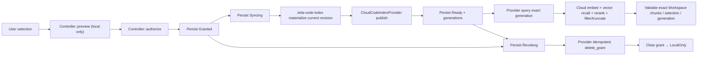

# `zeta-code-index-cloud`

> 本 README 拥有云代码索引的 crate 内部 contract。两种部署选择、隐私边界和产品状态由
> [`docs/code-index.md`](../../docs/code-index.md) canonical 维护；本地扫描、chunk identity 与
> revision verification 见 [`zeta-code-index` README](../code-index/README.md)，候选融合与预算见
> [`zeta-code-retrieval` README](../code-retrieval/README.md)。本地语义编排见
> [`zeta-code-index-semantic` README](../code-index-semantic/README.md)；具体远端语义服务不属于本仓库。

## 快速理解

`zeta-code-index-cloud` 不实现某一家云服务。它在本地 authoritative code index 与 host 注入的
provider adapter 之间建立显式、可持久化、可撤销的数据外发边界。

| 模式 | 外发单位 | 云端负责 | 当前可用性 |
| --- | --- | --- | --- |
| `LocalOnly` | 无 | 无 | ✅ 默认；不需要本 crate 发起 publication |
| `Cloud` | Workspace 已按 revision 复核的 exact chunks | embedding、vector index/recall、rerank、排序/过滤/截断 | contract 已实现；缺 concrete provider |

Workspace 侧索引始终拥有扫描、ignore、读取、切块、root containment、source revision、chunk identity
和容量边界。provider 只管理这些 chunks 的远端语义索引，不得读取完整 source 后重新切块。

## 所有权与依赖方向

当前 crate 负责：

- root-bound `CloudCodeIndexGrant`，包括 provider/tenant/collection、path scope 和最大外发 bytes；
- 无网络、无 consent mutation 的精确 `preview`；
- provider capability 与幂等 grant deletion 保证的 preflight；
- `Granted → Syncing → Ready/Stale/Failed` publication lifecycle 与 exact-generation query gate；
- `Revoking` 先持久化、provider 删除成功后才回到 `LocalOnly` 的撤销 lifecycle；
- 本地 generation 变化后的 stale projection；
- root/schema-bound SQLite consent/deletion recovery state。

当前 crate 不负责：

- 文件扫描、ignore、chunking、revision verification 或本地 lexical retrieval；
- provider credential、HTTP client、proxy/TLS、租户认证、远端 schema 或 retention 实现；
- concrete 云端的 query 准备、embedding/vector recall/rerank 编排与候选排序策略；
- Workspace trust、profile 路径、RPC DTO、UI consent copy 或自动同步调度；
- 把云检索结果注入 Agent context。

依赖方向是 `zeta-code-index-cloud → zeta-code-index`。App Server 组合 controller 与 provider
registry；concrete provider adapter 依赖网络层，但 `zeta-code-index` 不得反向依赖本 crate或网络。

## 关键接口与调用关系

| Symbol | 可见性 | 职责 | 漂移信号 |
| --- | --- | --- | --- |
| `CloudCodeIndexController` | public | serialize preview/authorize/sync/query/revoke/status 并维护 durable phase | 开始拥有 fusion、background thread、Workspace watcher 或 UI state |
| `CloudCodeIndexGrant` | public | 固定一次 consent 的 root/destination/selection/byte ceiling | 允许 sync 时静默扩大 scope 或 destination |
| `CloudCodeIndexProvider` | public trait | provider publication、已排序 exact-generation query 与 grant-level idempotent deletion port | adapter 绕过 request 读取 Workspace 文件，或把模型分数交给客户端决定排序 |
| `CloudCodeIndexProviderRegistry` | public | host composition 冻结 provider identity → adapter | runtime 从客户端输入动态加载任意实现 |
| `CloudStateStore` | private | root/schema binding 与单份 durable state | 保存 credential、源码或 provider response body |
| `preview_manifest` | private | 对当前 local generation 计算 unit/file/chunk/byte 数 | 估算规则与实际 materialization 分叉 |
| `selected_chunks` | private | 应用 path scope 到 Workspace manifest 中的 publication reference | provider adapter 自行解释 path scope或重新切块 |



## Consent 契约

客户端应先调用 `preview` 展示当前 generation 的 `file_count`、`chunk_count`、上传单元数和精确
source-content bytes；该数字不包含 provider serialization 或 transport metadata overhead。
`preview` 不保存授权，也不调用 provider。确认后才构造 grant：

- `id`：一次 durable consent identity；
- `root_id`：必须与 controller 的 local index root 完全相同；
- `destination`：固定 provider、tenant 与 collection；
- `selection`：整个 index 或规范化的 workspace-relative path prefixes；
- `max_egress_bytes`：不可为零，限制 source-content bytes，authorize 和每次 sync 都重新检查。

同一 root 同时只能存在一个 grant。完全相同的 authorize 是幂等读取；任何不同 grant 都返回
`ConsentConflict`，必须先 revoke，避免把“切换租户/范围”伪装成原授权续期。若 source
变化使实际 publication 超过 byte ceiling，sync 返回 `EgressLimitExceeded`，不会自动放宽。

## 供应商契约与删除策略

provider 在 grant 生效前必须声明 `IdempotentGrantDeletion`。实现者必须：

- 把 grant ID 作为所有远端 object 的删除边界；
- 对同一 `(grant ID, local generation)` 的 publication retry 做幂等 upsert/replace；
- publication 只能消费 request 中的 `MaterializedChunk`，不得绕过 controller 读取 Workspace 文件，
  也不得改变 chunk boundary 或 identity；
- query 只读取 request 中的 grant 与 exact remote generation，完成 query 准备、embedding/vector
  recall、可选 rerank、过滤和截断，并按最终相关性顺序返回 exact Workspace `ChunkReference`；
- 可以把 embedding/rerank 模型调用委托给 `zeta-model-provider`，但不得把候选构造、排序或截断决策
  下沉给 model adapter；
- 对重复 `delete_grant` 返回成功，并删除该 grant 创建的 chunks、files、vectors 和 metadata；
- 在 adapter 内绑定 credential、proxy/TLS、tenant isolation、request limit 与日志脱敏；
- 不记录 publication content、credential 或 provider response body 到本地 durable state；
- publication 部分成功后仍保证同一 grant 可以完整删除。

`revoke` 在网络删除前保存 `Revoking`。只有 provider 确认删除成功后才清空 grant；失败时保留
`Revoking`，进程重启后仍可用同一 controller 再次调用 `revoke`。Workspace trust 从 Trusted
降为 Restricted 时，App Server 自动执行同一流程并立即移除 cloud controller；删除失败不会恢复
外发能力，durable state 保持 pending deletion。

## 持久化与失败语义

`CloudStateStore` 的 metadata 保存 root ID、schema version 和序列化 lifecycle state。persistent
database 在 Unix 上拒绝非普通文件并固定为 `0600`；它不保存源码。root 不匹配返回
`StorageRootMismatch`，schema 不兼容返回 `IncompatibleStorage`。

- 进程在 `Syncing` 中断：重开后投影变为 `Failed`，已有 remote generation 时变为 `Stale`；
- local generation 尚未首次发布：preview/authorize/sync 返回 not-ready，不把空 generation 发布为
  ready；
- provider publication 失败：无已知远端 generation 时 `Failed`，否则 `Stale`；
- local generation 变化：`status` 动态返回 `Stale`，不把旧 remote generation 当作 current；
- provider 返回空、过长或含控制字符的 generation：拒绝持久化为 ready；
- query 时 remote generation、root、path scope、result bound 或 exact chunk identity 不合法：拒绝整个 provider result；
- `Revoking` 中断或删除失败：保留 grant，允许幂等重试。

## 验证与修改影响

```bash
cargo test -p zeta-code-index-cloud
cargo clippy -p zeta-code-index-cloud --all-targets --no-deps
bazel test //zeta-rs/code-index-cloud:code-index-cloud-unit-tests
```

测试位于 sibling `cloud_index_tests.rs`，覆盖 chunk-only payload/path scope、byte ceiling、
删除失败持久化与重开重试、local generation stale。修改 grant、phase 或 provider guarantee 时必须
同时检查 App Server RPC tests、generated schema/types 和 [`docs/code-index.md`](../../docs/code-index.md)。

## 当前限制与扩展点

- Current：domain/provider/App Server contract 已实现；默认 local composition 没有 concrete provider，
  所以不会广告 `cloudCodeIndex` capability，也不会创建网络请求。
- Current：sync 是显式同步 operation；尚无后台 debounce、progress、cancellation 或 retry scheduler。
- Current：controller 会把选定 chunks 批量 materialize 到内存后调用 provider；超大 repository 应由
  现有 local scan limits、grant byte ceiling 和未来的 streaming/batch contract 共同约束。
- Current：本 crate 暴露 exact-generation provider query，要求云端返回 final relevance order 并校验返回边界；跨来源 candidate fusion、复核与预算由
  `zeta-code-retrieval` 拥有。
- Current：本仓库不实现或部署远端 embedding/vector database/rerank service；concrete provider 应在
  独立服务或 adapter 项目中完成，再通过本 crate 的 typed port 注入。
- Current limitation：没有 concrete remote search adapter、production vector store、remote retention receipt 或用户可见
  deletion audit record。
- Current limitation：controller 是单 root owner；Workspace switch 不隐式撤销 grant，inactive root
  也没有全局后台 deletion scanner。App Server 会在该 root 下次受限 activation 时重试 pending
  deletion；要求立即删除的产品应先显式 revoke。
- Extension point：新增 provider 时先实现 credential/network policy 与远端 grant-level delete，再注入
  registry；不得用一个通用 HTTP callback 绕过 typed chunk publication payload。
