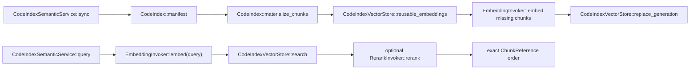

# `zeta-code-index-semantic`

> 本 README 拥有本地语义代码索引的实现契约。跨来源召回见
> [`zeta-code-retrieval`](../code-retrieval/README.md)，本地文件事实与词法索引见
> [`zeta-code-index`](../code-index/README.md)，产品部署与隐私边界见
> [`docs/code-index.md`](../../docs/code-index.md)。

## 快速理解

`zeta-code-index-semantic` 是嵌入 App Server 进程的本地语义管线，不是可部署的云服务。它读取
`zeta-code-index` 已发布并复核的当前 chunk，委托 `zeta-model-provider` 计算 embedding/rerank，
把 embedding 持久化到本地 SQLite，并在本地执行向量召回、分数解释和最终排序。

| 场景 | 行为 | 数据位置 |
| --- | --- | --- |
| 首次同步 | 当前 manifest 的 exact chunks 分批调用 embedding | chunk 会发给所选模型；向量留在本地 |
| 热查询 | 查询 embedding 后在本地做 cosine recall | 本地 SQLite/内存 |
| 配置 rerank | 候选文本调用 rerank，crate 解释分数并排序 | 候选可能外发给模型 |
| lexical generation 变化 | 按稳定 chunk identity 复用未变化向量，只计算新增/变化块，再发布新 generation | 不使用旧 generation 冒充当前索引 |
| 未配置语义模型 | App Server 不构造本服务 | canonical retrieval 继续使用 FTS |

## 所有权与调用关系

| Symbol | 可见性 | 职责 | 漂移信号 |
| --- | --- | --- | --- |
| `CodeIndexSemanticService` | public | 当前 generation 同步、query embedding、召回、可选 rerank 与最终顺序 | 接收任意远程 collection 或拥有网络 endpoint |
| `CodeIndexVectorStore` | public trait | root/model/exact-generation replace、search、delete | 合并 generation 或改变 Workspace chunk identity |
| `SqliteCodeIndexVectorStore` | public | 本地持久化 embedding；小集合精确扫描，大集合 SimHash ANN 候选 + 精确 cosine | 保存 credential、远端任务或租户数据 |
| `InMemoryCodeIndexVectorStore` | public | 测试与临时 composition | 被描述为持久化 production store |
| `CodeIndexEmbeddingModelId` | public | 绑定持久化向量与实际模型/维度语义 | 模型变化后静默复用旧向量 |



## 持久化与失败语义

`SqliteCodeIndexVectorStore` 保存路径、revision、chunk identity、range、content 与 little-endian `f32`
embedding。同步先按 root、模型 ID、相对路径、language 与稳定 chunk key 读取可复用向量，只把缺失
chunks 交给 embedding 模型；随后在 transaction 内完整发布新 generation。metadata 同时绑定 schema
version、root ID、lexical generation 和 embedding model ID。任一查询绑定不一致都显式拒绝。

少于 2,048 chunks 时执行确定性 cosine 全量扫描。更大的 projection 使用 SQLite 中可重建的
`simhash64-v1` signature 选出最多 900 个候选，再按原向量做精确 cosine 排序。ANN metadata 缺失或
不匹配时自动退回全量扫描。两条路径保持同一 exact-generation store contract，并继续让 Workspace
`ChunkReference` 成为唯一候选身份。

持久化文件在 Unix 上要求普通文件并固定为 `0600`。该 projection 可从本地 lexical manifest 与模型
重建，因此损坏或 schema 不兼容不能提升为源码 authority。

## 验证与当前限制

```bash
cargo test -p zeta-code-index-semantic
cargo clippy -p zeta-code-index-semantic --all-targets --no-deps
bazel test //zeta-rs/code-index-semantic:code-index-semantic-unit-tests
```

- Current：内存与 SQLite exact-generation store、chunk 级向量复用、批量 embedding、本地 cosine
  recall、可选 rerank；App Server watcher 在 lexical generation 更新后同步该 projection。
- Current：`zeta-model-provider` 已提供 OpenAI-compatible embedding/rerank 与 OpenAI/Ollama embedding
  runtime；App Server 只有在 durable model selection 与 exact Workspace consent 都有效时才构造本服务。
- Current：App Server semantic job 串行调度同步；支持阶段/计数进度、协作取消、transient retry、逐批
  embedding cache 和 privacy-safe metrics sink。metrics 不包含源码、路径、query、endpoint 或 secret。
- Current limitation：SQLite ANN 是 rebuildable SimHash projection，不是 HNSW；仍需用真实仓库持续
  量化 recall/latency，并保留 exact-generation authority、current-source verification 和全量 fallback。
- Integration obligation：如果 invoker 会把文本发送到远程模型，产品 host 必须先取得独立的源码外发
  同意；普通模型配置或 Workspace 文件权限不能被解释成“允许后台发送整个索引”。App Server 的 durable
  grant 精确绑定 Workspace、模型和 provider config，任一变化都会卸载该 runtime。
- Non-goal：本 crate 不提供 HTTP/gRPC endpoint、PostgreSQL、租户认证或任何云部署实现。
