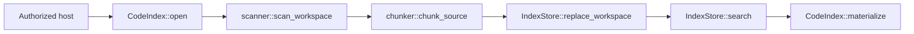

# `zeta-code-index`

> 本 README 拥有工作区代码索引的 crate 内部实现契约。跨 crate 的产品语义、隐私边界和演进决策由
> [`docs/code-index.md`](../../docs/code-index.md) canonical 维护；App Server 的生命周期与 RPC
> 适配见 [`zeta-rs/app-server/README.md`](../app-server/README.md)。显式云外发 grant 与 provider
> lifecycle 由 [`zeta-code-index-cloud` README](../code-index-cloud/README.md) 拥有；本地 semantic
> projection 见 [`zeta-code-index-semantic` README](../code-index-semantic/README.md)，多来源 candidate
> 编排由 [`zeta-code-retrieval` README](../code-retrieval/README.md) 拥有。

## 快速理解

`zeta-code-index` 在一个已经授权的 `WorkspaceRoot` 内扫描 UTF-8 文件，在工作区侧按语法声明或
行边界切块，把可重建投影发布到本地 SQLite，并提供有界的 FTS5 词法检索。crate 不决定工作区
信任、不启动 watcher、不发送网络请求，也不拥有 App Server DTO。

| 维护任务 | 应修改的位置 | 必须同时检查 |
| --- | --- | --- |
| 增加可结构化切块的语言 | `chunker::language_for_path`、`syntax_language` | `zeta-syntax` grammar、chunker version、fixture |
| 修改 chunk identity 或边界 | `chunker` | `CHUNKER_VERSION`、持久化重建、stale materialization 测试 |
| 修改 ignore 或扫描限制 | `scanner` | 增量 reconcile 是否仍等价于全量扫描 |
| 修改 SQLite shape | `store::create_schema` | `SCHEMA_VERSION`、旧投影 reset、reopen 测试 |
| 修改 watcher 策略 | host / App Server | `refresh_observed_paths` 只接收 hint，不把事件当事实 |

## 所有权与依赖方向

当前 crate 负责：

- canonical root 内默认排除 hidden files、ignore-aware、无 symlink 的文件扫描；
- UTF-8/binary/文件数/byte/chunk 数限制；
- `zeta-syntax` declaration facts 优先、行边界 fallback 的本地切块；
- 全文件 revision、chunk content hash 与带 chunker version 的稳定 key；
- SQLite 原子 generation publication、FTS5 检索和 exact-file 更新；
- 命中再次读取时的 root、revision、range 与 hash 校验；
- canonical in-memory dirty document overlay、revision 单调性、同 revision 冲突拒绝与 save handoff；
- 把 Workspace-owned chunk reference 投影为适合上层返回的 revision-bound excerpt reference。
- 把符号等 verified source span 投影为 content-addressed excerpt reference。
- 为受控外发 consumer 提供不含正文的 generation manifest，以及批量复核后的 source/chunk
  materialization。

当前 crate 不负责：

- 工作区 trust、profile 路径、watcher thread 或 RPC lifecycle；
- embedding/rerank 模型调用、本地向量 projection、云端同步、网络权限或数据外发策略；
- Editor snapshot 采集/生命周期、LSP semantic facts、模型 Tool 和 UI result projection。

依赖方向固定为 `zeta-code-index → zeta-workspace + zeta-syntax`。如果本 crate 开始依赖 App
Server protocol、产品 host、HTTP/provider 或 Renderer，说明 backend-neutral ownership 已经漂移。

## 文件与关键内部接口

| 文件 / symbol | 可见性 | 职责 | 不能承担的职责 |
| --- | --- | --- | --- |
| `CodeIndex` | public | 组合 root、limits 与 `IndexStore`，暴露 rebuild/refresh/search/materialize | watcher、RPC、远端同步 |
| `chunker::chunk_source` | private | syntax boundary + byte/line hard split，生成 stable identities | 文件遍历、持久化 |
| `scanner::scan_workspace` | private | ignore-aware deterministic full scan 与资源计数 | 把 walk error 变成网络重试 |
| `scanner::prepare_relative_file` | private | exact-file UTF-8/binary/size validation | 决定新文件是否被 ignore |
| `IndexStore` | private | schema/root binding、transaction publication、FTS query | workspace authority |
| `IndexStore::initialize` | private | root/schema/chunker compatibility gate | 静默复用不兼容投影 |
| `CodeIndex::refresh_observed_paths` | public | 重新读取 hint；只对既有普通文件 exact update，其余 rebuild | 相信 watcher event 的类型或内容 |
| `CodeIndex::materialize` | public | 当前源文件与旧 reference 的一致性证明 | 返回未经复核的 Agent context |
| `CodeIndex::materialize_excerpt` | public | 复核 revision-bound excerpt 的 revision/range/hash | 允许云 provider 用它绕过 canonical chunk identity |
| `CodeIndex::materialize_verified_excerpt` | public | 在当前磁盘或 overlay source 上复核任意有界 span，并生成 content-addressed excerpt | 让调用方绕过 Workspace source identity |
| `CodeIndex::synchronize_overlay` / `close_overlay` | public | 接受 immutable editor snapshot、建立内存 chunks、协调 save handoff | 采集 Editor state 或写入持久 DB |
| `CodeIndex::manifest` | public | 原子读取当前 generation 的 source/chunk references，不返回正文 | consent、network 或 provider routing |
| `CodeIndex::materialize_sources` / `materialize_chunks` | public | 批量重读并复核 manifest references | 扩大 path scope 或跳过 revision gate |



`CodeIndex::open` 只校验 limits、绑定 root identity 并打开投影，不扫描文件。host 必须先注册
watcher，再调用 `rebuild`；这样初始扫描期间的 mutation 仍会进入 watcher queue。Watcher event
只是 invalidation hint：新文件、目录、ignore control file、容量已达上限的 generation 和不确定
路径都触发完整 rebuild；只有数据库中已经存在的普通文件才允许 exact replacement。

## 公共契约

| API | 输入 | 保证 |
| --- | --- | --- |
| `CodeIndex::open` | `WorkspaceRoot`、`CodeIndexStorage`、`CodeIndexLimits` | persistent DB 只能绑定一个 `IndexRootId`；不隐式扫描 |
| `rebuild` | 当前 root | deterministic scan 后在一个 transaction 中替换 generation |
| `refresh_observed_paths` | host-observed paths | containment 后重读事实，返回 no-change/published/rebuilt |
| `snapshot` | 无 | 返回 published generation 与 completeness counters |
| `search` | `CodeIndexQuery` | 对 whitespace terms 做 literal-escaped FTS AND，最多返回 configured limit |
| `materialize` | `ChunkReference` | revision/range/key/hash 任一不符即失败，不返回 stale content |
| `materialize_excerpt` | `SourceExcerptReference` | revision/range/hash 任一不符即失败；这是通用投影 API，不授权云端定义不同 chunk boundary |
| `materialize_verified_excerpt` | `IndexedSourceReference` + `ChunkSpan` | 先验证 current source/overlay，再产生包含 content hash 的 exact excerpt reference |
| overlay synchronize/close | path、language、editor revision、text/hash | dirty path 完全替代同路径磁盘搜索与 materialization；save 只在磁盘 hash 对齐后 handoff |
| `manifest` | 无 | 返回同一 published generation 的 source/chunk metadata，不复制 source content |
| `materialize_sources` / `materialize_chunks` | manifest references | 当前 source revision 或 chunk identity 任一不符即整体失败 |

默认上限是 50,000 个文件、单文件 4 MiB、总源文件 512 MiB、目标 chunk 8 KiB、hard chunk 12
KiB、单文件 2,048 chunks、query 8 KiB、结果 100 条。所有 byte 上限按 UTF-8 bytes 计算。
`truncated_file_count`、`file_limit_hit` 和 `source_bytes_limit_hit` 让不完整 generation 可观察。

## 持久化与失败语义

`IndexStore` 的 metadata 同时保存 root ID、schema version、chunker version 与 generation。root
不匹配返回 `StorageRootMismatch`；schema 或 chunker 不匹配会 drop 并重建投影 schema，generation
回到 0。全量 rebuild 和增量 publication 都使用 transaction，读者只看到旧 generation 或新
generation，不看到半份索引。

SQLite projection 是可删除缓存，不是 source of truth。当前 FTS 与 chunk table 都在本地保存原文
片段；Unix database 固定为 `0600`。App Server 使用 profile 内按 root digest 分隔的数据库，并在
persistent cache 打不开时降级到 memory projection。删除源文件会在 watcher reconcile
后移除 projection，但 profile cache 的主动清理/retention UI 尚未实现。

失败时：

- I/O、SQLite 或 containment 错误返回 `CodeIndexError`，不发布半份 generation；
- stale revision、超出复核 byte limit、非法 range 或 identity mismatch 在 `materialize` 处 fail closed；
- query 为空或超过 byte limit 返回 `InvalidQuery`；
- poisoned store mutex 表示进程内 invariant 已破坏，当前实现直接 panic，不伪装成可恢复 I/O 错误。

Overlay 是进程内可丢弃 projection，不写 SQLite。相同 editor revision 只有在 language、text 与 content
hash 都一致时才视为幂等；同 revision 不同内容会 fail closed。persistent search 命中 dirty path 会被
抑制，`materialize`、`materialize_excerpt` 与 source materialization 都优先验证 overlay。磁盘
generation 出现相同 content hash 后，overlay 才自动交回 persistent projection。

## 验证与修改影响

```bash
cargo test -p zeta-code-index
cargo clippy -p zeta-code-index --all-targets --no-deps
bazel test //zeta-rs/code-index:code-index-unit-tests
```

测试在 sibling `code_index_tests.rs` 中覆盖 structural chunk、ignore/binary/limit、persistent reopen、
并覆盖 exact refresh、stale reference、ignore policy reconcile、bounded query、dirty override、revision conflict、
save handoff 与 verified arbitrary excerpt。修改 schema/chunker/limits 时必须同时检查 App Server status
DTO、schema fixtures 和 [`docs/code-index.md`](../../docs/code-index.md)。

## 当前限制与扩展点

- Current：单个 `WorkspaceRoot`、磁盘 generation + ephemeral dirty overlay、FTS5/overlay lexical 排序；
  不是 semantic/vector search。
- Current：JavaScript/JSX/JSON/JSONC/Rust/Shell/TypeScript/TSX 使用 `zeta-syntax` boundaries；其他
  UTF-8 文件使用 line/byte fallback。
- Current limitation：未实现 multi-root identity、主动 cache cleanup、可取消 full scan/progress；overlay
  只做本地 lexical/chunk projection，不为每次编辑触发 embedding。
- Extension point：`zeta-code-index-semantic` 消费 `manifest` 和复核后的 chunks 做本地 dense recall；
  `zeta-code-index-cloud` 消费相同 authority 做显式远端 grant。本 crate 保持无模型、无网络、无
  consent、无 provider dependency。
