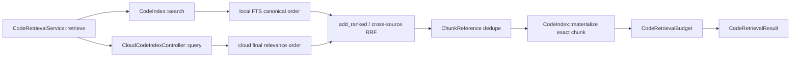

# `zeta-code-retrieval`

> 本 README 拥有代码召回编排的 crate 内部契约。部署模式、数据外发和跨 crate 产品语义由
> [`docs/code-index.md`](../../docs/code-index.md) 统一维护；本地索引实现见
> [`zeta-code-index` README](../code-index/README.md)，云授权与供应商生命周期见
> [`zeta-code-index-cloud` README](../code-index-cloud/README.md)。

## 快速理解

`zeta-code-retrieval` 把本地词法候选与已授权的云端语义候选组合为一份可供 Agent 使用的代码片段。
它负责跨来源 rank 融合、去重、降级和字节预算，但不扫描文件、不发起授权，也不执行或编排
embedding/rerank。云端候选进入本 crate 前已由云端 CodeIndex 服务排好最终顺序。

| 场景 | 行为 | 失败后的结果 |
| --- | --- | --- |
| 仅本地部署 | 只查询本地 FTS，并复核当前源文件 | 本地查询失败则整个调用失败 |
| 已启用云部署 | 合并本地与 exact-generation 云候选 | 云查询失败时保留本地结果并报告降级 |
| 两侧命中同一 chunk | 按 Workspace-owned `ChunkReference` 去重 | 返回一条结果并保留两个来源 |
| 文件已变化或候选越界 | 重读源文件并校验 revision、range、line span 与 hash | 丢弃候选并报告数量 |
| 内容超过预算 | 应用单条和总字节上限 | 丢弃超限候选并报告数量 |

## 所有权

| 能力 | Owner |
| --- | --- |
| 扫描、ignore、切块、FTS、源文件 revision 复核 | `zeta-code-index` |
| 授权、供应商边界、发布、查询和删除生命周期 | `zeta-code-index-cloud` |
| query 准备、embedding、vector recall、rerank、云候选排序/过滤/截断 | `zeta-code-index-service` |
| embedding/rerank 模型 API 适配与调用 | `zeta-model-provider` |
| 已排序来源间的 RRF、去重、回退和上下文字节预算 | `zeta-code-retrieval` |
| Workspace trust、供应商构造、RPC 与 Agent 接入 | App Server |

依赖方向固定为 `zeta-code-retrieval → zeta-code-index-cloud → zeta-code-index`。本 crate 不得反向
依赖 App Server protocol、Core conversation state、产品 UI 或具体网络客户端。

## 关键接口与调用关系

| Symbol | 可见性 | 职责 | 漂移信号 |
| --- | --- | --- | --- |
| `CodeRetrievalService` | public | 绑定同一 root 的本地索引和可选云控制器 | 开始拥有 Workspace watcher、授权状态或网络 credential |
| `CodeRetrievalQuery` | public | 校验非空、8 KiB query 与最多 100 条结果 | 接受未设上限的调用 |
| `CodeRetrievalBudget` | public | 固定单条与总 content bytes 上限 | 把 token 估算或模型调用塞入字节预算 |
| `CodeRetrievalResult` | public | 返回复核后的 hits 与显式 degradations | 隐藏云回退或候选丢弃 |
| `RetrievalDeployment` | private | 区分纯本地与混合部署 | 从查询参数临时扩大到云端 |
| `FusedCandidate` | private | 累积同一 Workspace chunk 的 RRF score 与 origins | 保存或信任 provider 返回的正文 |
| `add_ranked` | private | 保留每个来源已给出的顺序，计算 RRF 并合并来源 | 重新解释云端分数或在客户端重做 rerank |



`CodeRetrievalService::local` 明确构造纯本地部署；`CodeRetrievalService::hybrid` 要求本地索引和
`CloudCodeIndexController` 的 root identity 完全一致。App Server 按当前 durable deployment 选择构造
方式，未授权云模式不会调用 provider，也不会产生伪造的云失败状态。

## 执行与失败语义

一次 `retrieve` 先把请求数量乘以四作为每个来源的候选上限，并再次限制为 100。本地
`CodeIndex::search` 返回 FTS canonical order；云端 `CloudCodeIndexProvider::query` 返回完成语义召回、
rerank、过滤和截断后的 final relevance order。本 crate 不重新排序任一来源，只按两个已排序列表
的位置计算 rank constant 60 的 reciprocal rank fusion（RRF），也不比较 FTS 与模型原始分数。

本地索引是必需来源。`CodeIndex::search` 失败时返回 `CodeRetrievalError::LocalIndex`。混合部署中的
云查询是可降级来源；grant 不可用、remote generation stale、provider 失败或返回越界结果时，调用
保留本地候选并加入 `CodeRetrievalDegradation::CloudQueryFailed`，不会把内部 provider 错误文本暴露
给上层。

融合后的候选正文始终由 `CodeIndex::materialize` 从当前 Workspace 文件重新读取。revision、chunk key、
chunker version、UTF-8 byte range、line span 或 content hash 任一不匹配都会丢弃该候选；成功后才把
reference 投影成上层 DTO。默认单条上限为 32 KiB，
全部结果正文上限为 128 KiB；这两个上限按 UTF-8 bytes 计算。数量和字节预算都在返回前执行。

## 集成义务

- App Server 必须先检查本地 `CodeIndexRuntime` 已存在可查询 generation；本 crate 不拥有该产品状态机。
- 只有 durable deployment 不再是 `LocalOnly` 时，才能构造混合服务并调用云控制器。
- 供应商只能返回已排序且曾由当前 Workspace generation 发布的 exact chunk references，正文仍以
  Workspace 侧复核结果为准。
- Agent context consumer 必须保留结果顺序和预算，不得再次拼接被丢弃的 provider content。
- 云端 CodeIndex 服务可以通过 `zeta-model-provider` 调用 rerank 模型，但候选构造、调用时机、
  排序、过滤和截断规则仍属于云端 CodeIndex，不属于 model provider 或本 crate。

## 测试与修改影响

```bash
cargo test -p zeta-code-retrieval
cargo clippy -p zeta-code-retrieval --all-targets --no-deps
bazel test //zeta-rs/code-retrieval:code-retrieval-unit-tests
```

测试位于 sibling `retrieval_tests.rs`，覆盖纯本地复核、云端顺序保留、跨来源 RRF 去重、云失败回退、stale candidate
丢弃和 content byte budget。修改 query/result limit、RRF 规则、degradation shape 或 excerpt identity 时，
必须同时检查 App Server RPC tests、generated schema/types、`zeta-code-index-cloud` query validation 和
[`docs/code-index.md`](../../docs/code-index.md)。

## 当前限制与扩展点

- Current：同步执行本地与云查询；尚未引入异步并行、取消 checkpoint 或 latency telemetry。
- Current：`zeta-code-index-service` 已实现 provider-neutral semantic pipeline；production model/vector/network
  adapters 尚未接入 `CloudCodeIndexProvider`。
- Current：只处理单个 `WorkspaceRoot` 的磁盘文件；未叠加 Editor 未保存 buffer。
- Extension point：可以增加可观测耗时或批量 materialization；不得把云端查询内部的
  embedding/rerank 编排、provider networking、grant lifecycle 或 Agent Session state 移入本 crate。
