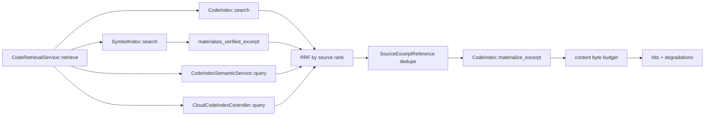

# `zeta-code-retrieval`

> 本 README 拥有代码召回编排的 crate 内部契约。跨 crate 产品语义由
> [`docs/code-index.md`](../../docs/code-index.md) canonical 维护；本地词法索引、本地语义索引和远端
> provider 生命周期分别见 [`zeta-code-index`](../code-index/README.md)、
> [`zeta-code-index-semantic`](../code-index-semantic/README.md) 和
> [`zeta-code-index-cloud`](../code-index-cloud/README.md)。

## 快速理解

`zeta-code-retrieval` 把本地 symbol/FTS、本地 dense recall 和可选远端 provider 已排序候选融合成
一份可供 Agent 消费的代码片段。它不扫描、不生成 embedding、不拥有向量数据库，也不发起外发授权。

| 部署 | 候选来源 | 可降级行为 |
| --- | --- | --- |
| lexical only | 本地 symbol + FTS | FTS 失败则调用失败；symbol 失败时保留 FTS 并报告 `LocalSymbolQueryFailed` |
| local semantic | 本地 symbol + FTS + 本地向量召回 | 语义未同步或模型失败时保留 symbol/FTS，报告 `LocalSemanticQueryFailed` |
| remote provider | 本地 symbol + FTS + 远端已排序候选 | 远端失败时保留本地结果，报告 `CloudQueryFailed` |
| combined | 上述四者 | 三个可选来源独立降级 |

## 所有权

| 能力 | Owner |
| --- | --- |
| scan、ignore、chunk identity、FTS、源 revision 复核 | `zeta-code-index` |
| syntax declaration projection、fuzzy symbol ranking | `zeta-symbol-index` |
| query embedding、本地向量持久化/召回、可选 rerank 与来源内排序 | `zeta-code-index-semantic` |
| 远端 grant、publication、query 与 deletion lifecycle | `zeta-code-index-cloud` + concrete provider |
| embedding/rerank transport adapter | `zeta-model-provider` |
| 多来源 RRF、identity 去重、降级、materialization 与 byte budget | `zeta-code-retrieval` |
| trust、provider/model 注入、watcher、RPC 与 Agent 接入 | App Server |

依赖方向固定为 `zeta-code-retrieval → {zeta-code-index, zeta-symbol-index,
zeta-code-index-semantic, zeta-code-index-cloud}`。本 crate 不得反向依赖 App Server protocol、Core
conversation state、产品 UI 或具体网络客户端。

## 关键接口与调用关系

| Symbol | 可见性 | 职责 | 漂移信号 |
| --- | --- | --- | --- |
| `CodeRetrievalService` | public | 绑定相同 root 的必需 lexical 与可选 symbol/semantic/cloud 来源 | 开始拥有 watcher、credential 或模型调用 |
| `CodeRetrievalQuery` | public | 校验非空、8 KiB query 与最多 100 条结果 | 接受无界输入 |
| `CodeRetrievalBudget` | public | 固定单条与总 content byte 上限 | 拥有模型 token budget |
| `CodeRetrievalResult` | public | 返回已复核 hits 与显式 degradations | 隐藏可选来源失败 |
| `RetrievalDeployment` | private | 固定本次 service 可用来源 | 从请求参数动态扩大到远端 |
| `add_ranked` | private | 按来源内 rank 计算 RRF 并合并相同 `SourceExcerptReference` | 比较不同来源不可比的原始分数 |



`local_semantic`、`hybrid` 和 `local_semantic_with_cloud` 都验证 root identity。App Server 只在
Trusted Workspace 且 host 注入语义模型时安装 local semantic；远端来源还必须有 durable grant。

## 执行与失败语义

一次 `retrieve` 先将请求数量乘以四作为各来源候选上限，并限制为 100。每个来源已经拥有自己的排序：
FTS 由 `zeta-code-index` 排序，本地 dense/rerank 由 `zeta-code-index-semantic` 排序，远端列表由 provider
排序。本 crate 只使用列表位置执行 rank constant 60 的 reciprocal rank fusion，不重新解释模型分数。

本地 FTS 是必需来源；symbol、local semantic 与 cloud 是可降级来源。symbol declaration span 先由
`CodeIndex::materialize_verified_excerpt` 对当前磁盘或 overlay 正文复核并生成 content-addressed
`SourceExcerptReference`。融合后所有正文再由 `CodeIndex::materialize_excerpt` 重读；revision、range、
line span 或 content hash 不匹配即丢弃。默认单条正文最多 32 KiB，总正文最多 128 KiB，均按 UTF-8
bytes 计算。

## 集成义务

- App Server 必须先确认 `CodeIndexRuntime` 有可查询 generation。
- symbol source 只能使用绑定同一个 root 的 `SymbolIndex`；它的 range 必须由 CodeIndex 转成 verified
  excerpt，不能直接把 syntax row 当模型正文。
- semantic projection 必须在 lexical generation 更新后同步；查询旧 generation 会显式失败并降级。
- 远端 provider 只能返回已发布的 exact chunk references；正文仍以 Workspace 重读结果为准。
- Agent context consumer 必须保留结果顺序与预算，不得重新加入已丢弃内容。
- 本 crate 不负责取得 embedding/rerank 文本外发同意；安装 remote model invoker 前必须由产品 host 完成。

## 验证、限制与扩展

```bash
cargo test -p zeta-code-retrieval
cargo clippy -p zeta-code-retrieval --all-targets --no-deps
bazel test //zeta-rs/code-retrieval:code-retrieval-unit-tests
```

测试位于 sibling `retrieval_tests.rs`，覆盖 lexical、exact symbol declaration、本地 semantic、远端顺序、
RRF 去重、可选来源失败回退、stale candidate、dirty overlay 和 byte budget。修改
origin/degradation、limit、RRF 或 excerpt identity 时，必须同步 App Server RPC tests、generated
schema/types 与 [`docs/code-index.md`](../../docs/code-index.md)。

- Current：同步串行查询来源；已在来源边界和 materialization 循环检查取消，并把取消传入本地 semantic
  模型调用。cloud provider query 尚未接受 cancellation，retrieval 层也尚无独立 latency telemetry。
- Current：CodeIndex overlay 是 dirty text authority；dirty path 的磁盘 lexical/semantic/cloud candidate
  被过滤，本地 symbol/lexical 结果从 overlay materialize。
- Extension point：可增加并发和可观测性，但 embedding/rerank 编排留在 semantic/provider owner，grant
  留在 cloud owner，Agent Session state 留在上层 consumer。
