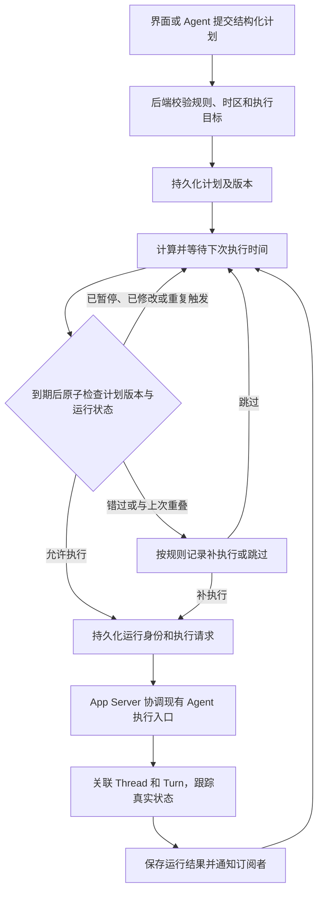

# 自动化任务：时间、调度与执行边界

> 状态：计划设计。职责与时间边界已确认；本文的调度规则是后续实现和验收依据，尚未实现。
> 本文由共享 Rust 后端拥有，面向 automation、App Server 和产品界面的实现者。关联架构见 [Rust 后端架构](../../docs/zeta-rs-architecture.md)、[App Server](../app-server/README.md) 和 [后台宿主](../app-server-daemon/README.md)。

## 快速理解

自动化任务保存“做什么、在哪里做、什么时候做”，由后台宿主在到期后启动 Agent，并留下可追踪的运行记录。Workbench contribution 提供创建和管理入口；关闭某个窗口不取消计划，重新打开窗口可以查看后台结果。

| 用户场景 | 计划行为 | 用户能看到什么 |
| --- | --- | --- |
| 3 小时后执行一次 | 保存明确的执行时刻，重启后仍能恢复 | 计划执行时间、实际开始时间和运行结果 |
| 每天早上 9 点执行 | 按保存的时区与日历规则计算每次执行时刻 | 时区、规则说明和下次执行时间 |
| 关闭所有窗口 | 启用中的计划由后台宿主继续调度 | 再次打开后看到原计划和运行历史 |
| 电脑休眠或关机时错过执行 | 恢复后按错过执行时间的规则处理，不声称离线期间已执行 | 补执行或跳过的记录及原因 |
| 上次任务还没结束 | 默认跳过本次定时触发，保留记录 | 上次运行状态和本次跳过原因 |
| 暂停计划 | 停止后续触发，已经开始的运行继续执行 | 计划已暂停；运行可以单独停止 |
| 立即运行 | 创建独立运行，不改变原计划的下次执行时间 | 一条可单独追踪和停止的运行记录 |

端到端流程见[一次任务如何执行](#一次任务如何执行)，职责见[谁决定谁执行谁保存](#谁决定谁执行谁保存)，当前代码和缺口见[当前实现与接入入口](#当前实现与接入入口)。本机后台运行要求机器可运行且宿主已启动；关机期间不会执行。系统登录启动与后台保活属于宿主接入的一部分。

## 一次任务如何执行

计划与一次运行具有独立身份。编辑提示词、执行目标或规则会生成新的计划版本；已经创建的运行使用创建时保存的版本和执行内容，不受后续编辑影响。到期队列中的旧版本不能启动新任务。

## 谁决定、谁执行、谁保存

以下为目标归属，标注“新增”的路径尚不存在。crate 用于隔离能力和依赖，不按每个内部步骤拆分 crate。

| 位置 | 职责 | 边界 |
| --- | --- | --- |
| `zeta-rs/automation`（新增） | 计划校验、下次执行时间计算、调度、运行记录和恢复；拥有持久化规则 | 日期、时区、调度依赖留在这里；不实现模型调用或工具执行 |
| `zeta-rs/protocol` | automation 跨模块共享的稳定身份、时间戳和领域值对象 | 不引入日期时间库，不保存进程内计时器 |
| `zeta-rs/app-server-protocol` | automation 请求、响应、通知和生成类型 | 协议不暴露日期库类型或内部调度器 |
| `zeta-rs/app-server` | 请求分派、订阅、协调 automation 与 Agent 执行 | 不保存第二份计划状态，不自行计算日历规则 |
| `zeta-rs/core` | 执行 Thread、Turn、模型调用和工具操作 | 不计算“下一次周一几点运行” |
| `zeta-rs/app-server-daemon` | 每个 profile 的后台进程生命周期与保活 | 不解释计划规则；不得因窗口连接清空而丢失调度能力 |
| `zeta-rs/server-host` | 产品无关的后端命令入口和进程装配 | 不依赖 `zeta-code` 的产品入口 |
| `zeta-ts/src/zeta/workbench/contrib/automation/`（新增） | 创建、编辑、暂停、立即运行、运行历史和可访问交互 | 不持久化权威计划，不持有执行计时器 |
| `zeta-ts/src/zeta/workbench/services/automation/`（新增） | 前端领域接口、订阅状态和 App Server adapter | 生成协议类型止于 adapter，不传入普通界面代码 |
| `app`、`zeta-code` 的对应产品界面 | 消费同一后端能力并呈现产品交互 | 不另建调度器或计划存储 |

automation 通过窄的执行请求和结果契约与现有 Agent 能力协作，App Server 完成装配。core 不反向依赖 automation；automation 不导入 App Server 传输实现。没有独立消费者前，不另建通用 scheduler、calendar 或 clock crate。

## 时间分别如何表达

| 时间含义 | 表示 | 使用位置 |
| --- | --- | --- |
| 运行了多久、还允许等待多久 | `Instant`、`Duration`；异步计时器使用对应的单调时钟 | turn 耗时、工具超时、退避、流空闲、运行期间的等待 |
| 某件事发生于何时 | Unix 毫秒 | 创建、更新、计划执行、实际开始和完成时间 |
| 按哪个地区的日期和钟点重复 | 结构化日历规则与 IANA 时区标识 | 例如 `Asia/Shanghai` 的每天 09:00 |
| 日期解析、时区换算和格式化 | 日期库内部类型 | automation 的日期计算和 UI 显示边缘 |

新增 automation 时间字段使用有单位的 `UnixMillis` 值对象，底层沿用现有协议的非负毫秒约定；不在这项工作中批量改造已有时间字段。没有开始或完成时间时使用缺省值，不用 `0` 冒充真实时刻。输入与持久化读取边界验证支持的日期范围、算术溢出及 TypeScript 数字的安全整数范围。

`SystemTime` 用于采样当前墙上时间，再转换为 Unix 毫秒。`Instant` 不写入数据库，也不跨进程传输。运行超时与耗时计算不得通过两个墙上时间相减实现；恢复后需要继续遵守的截止时间必须另外保存为时间戳，并在新进程中重新建立等待。

调度器把“距下次到期还有多久”转换为单调计时器等待，但计时器唤醒只表示需要重新检查。真正创建运行之前必须重新读取墙上时间、计划版本和持久状态。对长等待设置有界复核周期，并在机器恢复、时钟或计划变化后重算等待，避免系统校时后仍睡到旧截止点。该周期必须通过测试和运行指标验证其触发延迟；不能假定各平台的 `Instant` 都以相同方式计入休眠时间。

`chrono` 当前保留在 TUI，用于满 7 天后的本地日期显示；分钟、小时和天的相对时间仍由整数运算完成。根 `Cargo.toml` 的声明统一依赖版本，实际使用它的 crate 才形成依赖。automation 的日期库及所需时区数据库支持在领域内部使用，core、storage 接口和协议不传递 `DateTime`。TUI 的本地日期显示不复用调度规则计算。

## 计划保存什么

下表固定数据含义，具体类型与线上字段在实现协议时确定。

| 数据 | 内容与约束 |
| --- | --- |
| 计划身份与版本 | 稳定计划 ID、revision、启用或暂停状态；修改使用期望版本防止覆盖并发修改 |
| 执行内容 | 提示词、明确的项目与执行环境、模型选择及已有执行策略的引用；不依赖当前窗口 |
| 会话目标 | 明确选择新建会话或继续指定会话；继续会话必须绑定稳定身份，不能使用“当前会话” |
| 时间规则 | 一次性执行时刻、固定间隔或日历重复规则，三种含义明确区分 |
| 日历上下文 | IANA 时区、规则版本，以及夏令时处理规则；不能只保存一个 UTC 偏移 |
| 调度策略 | 错过执行时间与重叠运行的处理规则 |
| 下次执行时间 | 从规则计算并保存的 Unix 毫秒；它不能替代原始规则与时区 |
| 运行记录 | 运行 ID、计划版本、计划触发时刻、触发来源、实际开始与结束、状态及关联 Thread/Turn |

固定间隔使用持久化的起点和间隔计算每次时刻，不从上次完成时间累加。日历重复使用当地日期和钟点，例如“每天 9 点”不能实现成每次增加 24 小时。

自然语言由 Agent 转换为结构化计划，再由后端验证。`chrono` 不承担“明天早上”的自然语言理解。存在歧义时向用户展示或澄清具体日期、时区与重复规则；不得在后台把含糊文本直接当成可执行规则。

## 到期、暂停与失败后如何处理

以下默认行为属于计划设计，必须在创建结果与管理界面中可见。

| 情况 | 处理规则 |
| --- | --- |
| 一次性计划在离线期间到期 | 宿主恢复后补执行一次，记录原定时间和迟到原因 |
| 重复计划在离线期间错过多次 | 默认跳过错过的时刻并记录时间范围与数量，计算下一次；不集中启动大量历史运行 |
| 同一计划已有未结束运行 | 默认跳过定时触发；“立即运行”返回正在运行的明确结果，不偷偷并发启动 |
| 夏令时导致钟点不存在 | 跳过该次日历触发并记录原因 |
| 夏令时导致钟点出现两次 | 只采用较早的一次，运行身份保证不会再次启动 |
| 暂停或修改与触发同时发生 | 由持久化事务中的版本检查决定；暂停提交后不能再创建该计划的新运行 |
| 停止某次运行 | 调用现有执行取消能力，等待真实终态；不能只取消界面等待 |
| 后端响应丢失 | 用原请求或运行身份查询、重试交付，不创建新的运行身份 |
| 执行环境、凭据或策略不可用 | 记录明确失败或需要用户处理的状态，不切换到其他环境或放宽策略 |

“暂停计划”和“停止运行”是两个独立操作。处于等待审批或恢复核对中的运行也占用该计划的执行位置。停止请求已发出不等于运行已停止；执行结果决定最终状态。

创建计划不代表批准它未来执行的所有工具操作。每次运行仍经过现有权限与审批流程；没有前端连接时，需要用户输入的运行保存等待状态，用户重新连接后能够处理，不由调度器自动批准。

## 持久化、重启与唯一执行者

每个 profile 只有一个调度权威，由后台宿主拥有。多个窗口和客户端共享同一份计划与运行存储。客户端连接断开只结束该连接的请求和订阅，不能取消计划或清理运行事实。

持久化实现必须支持事务和唯一约束。定时触发使用计划 ID、计划版本和触发时刻识别同一次运行；立即运行使用调用者的幂等请求身份。创建运行、保存待交付执行请求和推进调度进度必须原子提交，进程崩溃后可以重新交付同一个请求。

跨 automation 与 Agent 执行之间不能假设存在一个共同事务。执行接收方必须能够用同一运行身份找回原 Thread/Turn，并拒绝重复启动。执行已经开始但 automation 尚未收到确认时，恢复流程先查证既有执行；结果暂时不可确认时保留待核对状态，不直接再启动一次。

这保证计划触发和执行交付可以去重，不承诺外部工具副作用恰好发生一次。工具已经执行但响应丢失时，是否能够重试由现有工具执行和恢复契约决定，调度器不能自行重跑整个 Agent。

后台宿主退出条件必须纳入启用中的计划、尚未交付的执行请求和未结束运行。显式停止后台服务仍然有效，状态必须落盘。系统登录启动、异常退出后的重新启动和机器恢复通知由宿主集成负责；只增加一个内存计时器不能完成后台运行能力。

## 当前实现与接入入口

截至本次源码核对，automation 领域 crate、管理 contribution 与计划协议尚未建立。已有工具执行调度器和界面重绘调度器各自服务原有能力，不作为自动化计划的所有者。

| 当前代码 | 已有能力 | automation 接入缺口 |
| --- | --- | --- |
| [Resume 列表](../../zeta-code/tui/src/sessions/picker.rs)与[测试](../../zeta-code/tui/src/sessions/picker_tests.rs) | 未归档会话筛选、整数相对时间、本地绝对日期 | 属于 UI 显示，不承担计划计算 |
| [会话管理事实](../protocol/src/session/manager.rs) | 使用 `status_changed_at_unix_ms: u64` 表示状态变化时刻 | 不等于 automation 的计划或运行模型 |
| [daemon 生命周期](../app-server-daemon/src/daemon.rs) | 没有活动连接和终端时按空闲超时退出 | 退出条件尚未包含 automation；不能直接宣称关闭窗口后定时执行已具备 |
| [产品无关宿主入口](../server-host/src/lib.rs) | 提供后端进程与管理命令入口 | 需要配合调度恢复和后台生命周期，不把入口移到 TUI |
| [工具执行调度](../core/src/turn/tool_scheduler.rs) | 当前 turn 内的工具执行协调 | 保持原职责，不并入日历与周期计划 |

本次只落下架构文档，不新增空 crate、占位协议或 contribution 注册。既有 `chrono` 依赖边界和 Resume 行为保持原样。

## 实现顺序与验收

实现使用最终职责和单一状态所有者，按依赖顺序完成以下闭环，不建立第二套执行或存储路径。

1. **计划与时间规则**：建立领域模型、时间戳边界校验、时区与日历计算，以及固定时钟输入的测试。
2. **存储与调度恢复**：完成事务、唯一运行身份、待交付请求、版本冲突、错过与重叠规则，以及宿主保活和启动恢复。
3. **Agent 执行接入**：打通幂等交付、会话目标、真实运行状态、审批、停止及崩溃后核对。
4. **协议与产品入口**：生成请求、响应和通知类型，完成前端领域接口与 contribution；其他产品消费同一后端能力。

| 验收层 | 必须证明的行为 |
| --- | --- |
| 日期与时间 | 相对时间向下取整；跨日、闰日、时区、夏令时；固定间隔与日历重复具有不同语义 |
| 运行期间计时 | 墙上时间前跳、后跳不改变工具超时的计时依据；调度等待能重新检查到期条件 |
| 持久化与恢复 | 创建运行前后、交付前后、确认前后的崩溃都不丢失运行身份；旧请求不会重复启动 |
| 多客户端与计划修改 | 两个窗口不会产生两个调度器；并发编辑、暂停和到期按版本得到确定结果 |
| 后台生命周期 | 关闭所有窗口后仍能运行；服务重启与机器恢复遵守错过执行时间的规则 |
| 执行与权限 | 等待审批可恢复；停止请求抵达实际执行者；未知执行结果不会被当作失败自动重跑 |
| 产品交互 | 用 Playwright 验证创建、预览下次时间、编辑、暂停、立即运行和历史；断言状态、事件和可访问信息，不以截图作为通过依据 |

运行记录区分计划触发时间、实际开始时间和结束时间，保留跳过、失败和恢复原因。运行期间的延迟与耗时指标使用单调时钟；跨进程只关联持久时间戳与运行身份。通知仅在完成、失败、需要用户输入或其他有意义的变化时发出，状态不变时保持安静。

实现验证从能力所属 package 开始，使用仓库的 `just test <crate>` 和 `just check <crate>`；新建 automation crate 后再采用其实际包名执行。本文记录验收要求，不代表这些测试已经存在或通过。
