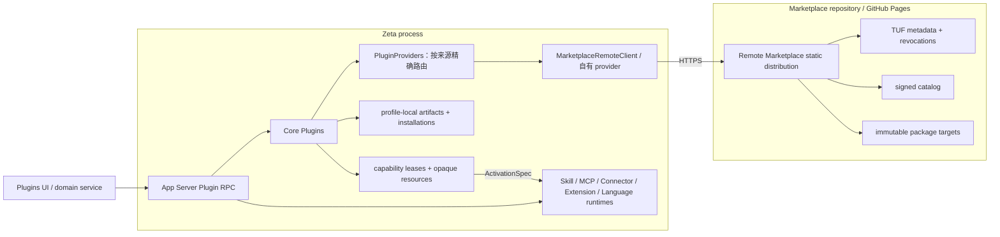

# Core Plugins 架构

> 类型：canonical 跨仓架构文档。
> 当前状态：`zeta-core-plugins` 通过具名 provider 聚合来源，现有 registry adapter 消费
> HTTPS/TUF 静态分发；旧 JSONL compatibility adapter、独立 Core Plugins 进程和 Desktop packaging 已删除。
> App Server package RPC 与 Settings service 已接通。Skill、MCP、Connector、Theme、Language、
> Localization
> 和可选 executable Editor Extension 都从同一个 PluginsManager artifact/installation 入口进入各自领域；
> 旧 Plugin/Language 专用远端分发与安装链路均已删除。
> Embedded/stdio client 的发行配置发现细节见
> [`zeta-app-server-client` README](../app-server-client/README.md)。

## 快速理解

Marketplace 是 Plugin 来源，不是产品主领域。`zeta-core-plugins` 聚合内置、远端和本地来源，
远端签名 registry 只是其中一个 adapter；它们不是 client/server 进程对，也不通过 JSONL 相连。

| 组件 | 位置 | 职责 |
| --- | --- | --- |
| Remote Marketplace | `../../marketplace` + GitHub Pages | catalog、publisher、签名、撤销、TUF metadata 和 package targets |
| Marketplace registry adapter | `zeta-rs/core-plugins/src/registry.rs` | HTTPS/TUF、远端发现和 verified download 的私有适配 |
| Core Plugins | `zeta-rs/core-plugins` | Plugin 来源聚合、本地 artifact、安装、authority、lease 和 opaque resource |
| Plugin definitions | `zeta-rs/plugin` | identity、manifest、path 与 package observation |
| App Server | `zeta-rs/app-server` | 稳定 RPC、connection-owned lease 和 error mapping |
| capability consumers | Skill/MCP/Connector/Theme/Language/Localization/Editor Extension 各领域 | enable/grant、认证、配置、激活、执行、停用 |

Zeta 产品层依赖 Core Plugins，不依赖 Marketplace 的远端存储表现。当前静态分发没有远程业务服务器，
因此这些实现细节由 `zeta-core-plugins::registry` 封装。App Server、Renderer 和 capability runtime 都看不到
catalog manifest、TUF role、ZIP、target URL、cache path 或 extracted path。

## 端到端链路



真实请求链是：

```text
Renderer
→ App Server Plugin RPC
→ zeta-core-plugins
→ zeta-core-plugins::registry
→ HTTPS/TUF Marketplace
→ verified opaque payload
→ PluginsManager-owned local store
→ InstalledPackage / CapabilityRef
```

没有 `marketplace-manager` 子进程，没有 Marketplace 仓库的 Rust path dependency，也没有 Desktop
携带的 compatibility adapter。

## 内部接口

Zeta 内部有两个刻意分开的接口。

### Core Plugins 使用的 package 接口

`PluginPackageService` 由 `PluginsManager` 实现：

```text
search / get / download
install / update / uninstall / listInstalled
acquireCapability / releaseCapability / openResource
```

这些方法服务 Plugin 安装与 capability 消费，不是独立的产品领域。`ArtifactHandle`、
`CapabilityRef`、`ResourceRef` 和 lease 都是 opaque identity，不是路径或 URL。

### 远端注册表接口

`PluginProvider` 由来源实现，`PluginProviders` 负责注册、聚合发现和精确路由：

```text
search / get / download
```

`download` 返回 `PluginPackagePayload`。该对象只允许 `PluginsManager` 把已经验证的内容复制到一个空的
staging directory；没有 source-path getter。远端 Marketplace 不拥有 install、update、
uninstall、lease 或 activation API，因为这些都是本地状态。

## 所有权

| 能力 | Remote Marketplace | Registry adapter | Core Plugins | 产品 runtime |
| --- | --- | --- | --- | --- |
| catalog、publisher、版本发布 | ✅ | consume | ❌ | ❌ |
| TUF、revocation、target download | 发布 | ✅ verify | ❌ | ❌ |
| remote cache / temporary extraction | ❌ | ✅ private | ❌ | ❌ |
| local artifact store / digest recheck | ❌ | handoff | ✅ | ❌ |
| install/update/uninstall/list | ❌ | ❌ | ✅ | ❌ |
| capability ref / lease / resource | ❌ | ❌ | ✅ | consume |
| permission/authentication | ❌ | ❌ | ❌ | ✅ |
| activation/execution/deactivation | ❌ | ❌ | ❌ | ✅ |

Marketplace package lifecycle：

```text
Available → Verified download → Installed → PendingRemoval/Removed
```

Capability lifecycle：

```text
Installed → Acquired → Authorized → Activated → Deactivated → Released
```

`install()` 不授权、不登录、不启动进程。`acquireCapability()` 只返回 lease 和 path-free
`ActivationSpec`，也不等于激活。

## 一个包入口，多个领域消费方

Package 是下载、安装、更新和卸载单位；capability 才是领域发现与激活单位。`packageType=plugin`
只是一个可同时携带 Connector、MCP、Skill 与 executable 的集成 bundle，不是第二个安装器、第二个
Marketplace 或必须常驻的 Plugin runtime。

| Marketplace capability | Zeta consumer | 进入方式 | Core Plugins 不拥有 |
| --- | --- | --- | --- |
| `skill` | `zeta-skills-extension` / Skill catalog | verified exact Skill root | 选择、完整 `SKILL.md` 加载与执行 |
| `mcp` | MCP composition | HTTPS 或 package-relative stdio transport；调用持有 capability lease | OAuth、审批、Tool policy |
| `connector` | Connector authority | 绑定同 digest 内 exact MCP，credential 由 Connector domain 注入 | 登录、SecretStore、连接状态 |
| Theme package 的 `asset` | `zeta-extensions` → Workbench Theme | 规范化为 Theme capability，并把 portable theme manifest 转成 host declarative manifest 后进入共享 Extension catalog | Theme 选择与应用 |
| Language package 的 `asset` + `executable` | `zeta-extensions` + `LspServerProviders` | editor assets 与 LSP route 分别消费同一安装 | 文档路由、LSP lifecycle |
| `localization` | `platform/languagePacks` → `workbench/services/localization` | 读取静态 locale catalog，按 locale 和 catalog contract 应用；选择与 lookup 保持在 client/window | 文案提取、产品 bundle 设计与 UI 重建 |
| `executable` + 可选 `zeta/editor-extensions.json` | Editor Extension source/admission → Host | Zeta consumer sidecar 绑定 exact executable；admission generation/lease 与 PluginsManager lease 同时成立 | enable/grant、目录执行 capability、进程隔离 |

`zeta/editor-extensions.json` 是可选的产品 consumer adapter，并非 Marketplace schema、Plugin package
或通用发布工具的必需结构。没有 sidecar 的 executable 可以继续被 Language 等其他 consumer 使用；
有 sidecar 但没有产品 admission grant 时也不会执行。`zeta-editor-extension-host` 只消费已经规范化并
授权的 deployment，不解析 Marketplace 或 Plugin manifest。

内置内容不需要伪装成已下载 package：它保留 `BuiltIn` provenance，但进入相同的 Skill、声明式
Extension、Language 等领域校验和注册路径。来源统一的是 consumer contract，不是把 product-shipped
bytes 复制进 PluginsManager store。

`Extension` 当前不是第六种 Marketplace package family，也不是安装器名称；它是 Zeta 对
`package.json` 静态 editor assets 的声明式 consumer contract。Theme 与 Language family 先由各自
portable adapter 规范化，再进入该 contract。只有出现真实的跨 Theme/Language 静态贡献发布需求时，
才应新增有明确 schema 的 `editorAssets` capability；不能把通用 `asset` 自动当成 Extension。可执行
Editor Extension 则始终走 sidecar + admission + Host 路径，不能与声明式 catalog 合并。

官方 MCP Registry 是上游发现源，不是 Zeta 的安装信任根。Marketplace publisher 将选中的
Registry record 转换成固定版本 package，经审核后写入 signed catalog；Zeta 只安装经过 TUF 与
digest 验证的 Marketplace target。catalog 中可选的 `upstream` 字段保留精确 Registry record 和
repository 链接用于展示与审计，但不会让 Renderer 绕过 Core Plugins 直接下载或执行上游内容。

## 插件标识与 provider

| 值 | 格式与用途 |
| --- | --- |
| `PluginId` | `name@marketplace`，用于发现、查询、安装和更新；名称不要求发布者前缀 |
| `MarketplaceName` | host 配置中的唯一来源名，绑定一个 provider |
| `PluginPackageId` | 现有 `.zeta-plugin` 包格式中的 `publisher/name`；仅该包格式和对应消费方使用 |
| `PackageRef.id` | 对外返回完整 `PluginId`；客户端原样传回，版本和摘要使用独立字段 |

通用 ID 校验只约束非空、长度和安全字符。插件名允许 ASCII 字母、数字、`_`、`-` 与分隔非空名称段的
`.`；来源名不允许 `.`。禁止路径分隔符、空白和额外的 `@`。字段私有，构造和反序列化使用同一校验。
每段最多 128 字节，完整 ID 最多 160 字节，为各领域的贡献标识留出空间。

现有 TUF registry 在 provider 内将 `publisher/name` 映射为 `publisher.name`，因此完整 ID 可以是
`marketplace.commit@zeta`。转换不修改已签名 manifest、包内容或摘要，也不要求其他 provider 使用
发布者前缀。发布者白名单、签名、撤销和内容校验仍由对应来源负责。

`PluginProvider` 只提供发现、详情和经过来源校验的 `PluginPackagePayload`。payload 保留私有来源资源，
只能复制到 Manager 提供的空 staging 目录。Manager 重新核验摘要和文件统计，统一拥有安装、lease 和
资源读取；接入 provider 不等于安装、授权或执行插件。宿主通过 `LocalAppServerOptions::with_plugin_providers`
注入自有实现，产品配置中的 `marketplaces` 列表则创建多个独立的 HTTPS/TUF provider。

注册时拒绝重复来源名。聚合搜索按完整 ID、版本排序，再应用全局数量限制；任一来源失败时返回错误。
get/install/update 只访问 ID 指定的来源，并核对返回的名称和精确版本。未配置来源、缺少来源名或返回身份
不匹配时直接失败。同名、同版本、同摘要在两个来源中仍有不同的 installation 和 capability identity。
移除来源后，已安装包仍可列出、读取和卸载；更新需要重新配置对应来源。

旧安装状态没有来源名。首次打开时仅在配置了原来的单个来源时写入完整 ID，并重新生成安装和 capability
引用；包内容继续复用。存在旧记录且同时配置多个来源时，打开失败并要求先用原来源完成一次迁移；不会猜测
来源或改写文件。完成迁移后可以添加来源。现有独立 `.zeta-plugin` 配置请求仍使用 `PluginPackageId`。

## 配置与启动

产品资源 `resources/product-services/product-services.json` 按名称分别 pin 远端 registry：
文档版本为 2，`marketplaces` 替代单一 `marketplaceManager` 对象。

```json
{
  "schemaVersion": 2,
  "marketplaces": [{
    "name": "zeta",
    "metadataBaseUrl": "https://chogng.github.io/marketplace/metadata/",
    "targetsBaseUrl": "https://chogng.github.io/marketplace/targets/",
    "trustedRoot": "marketplace-root.json",
    "catalogRefreshIntervalSeconds": 300
  }]
}
```

App Server 启动时：

1. `LocalProductServicesConfig` 读取 HTTPS endpoints 和 product-pinned trusted root；
2. 为每个名称调用 `MarketplaceRemoteClient::new`，延迟访问网络，并注册到 `PluginProviders`；
3. `PluginsManager::open(<profile>/marketplace-manager, providers)` 打开唯一的本地安装状态；
4. App Server 注入 `Arc<dyn PluginPackageService>`；首次 Marketplace 请求才刷新 TUF/catalog。

`catalogRefreshIntervalSeconds` 是产品选择的进程内已验签 catalog snapshot 复用时间，允许范围为
60–86400 秒，默认 300 秒。它只控制何时再次尝试远端刷新，不改变 TUF expiry、rollback、revocation
或签名校验；磁盘 cache 继续由 `MarketplaceRemoteClient` 私有持有，并统一位于
`<profile>/cache/marketplace/<SHA-256(marketplace name)>`，避免不同来源共用目录。Renderer 的 Marketplace service
只保留 path-free、Renderer-ready 的内存展示快照，因此 Settings 重开可以同步绘制；它不保存 catalog
manifest、TUF metadata 或 package bytes。用户显式 Browse/Search 时才要求 service 重新读取目录。

Desktop 只打包 `product-services.json` 和 `marketplace-root.json`，不编译、不复制、不监督任何
Core Plugins 子进程。`zeta-app-server-client` 统一发现该发行资源，但产品宿主仍显式选择
是否注入：Desktop/独立 `zeta-server`、`zeta code`/TUI 和 app 的本地 authority 都注入同一
typed `LocalProductServicesConfig`；远端 app session 由远端 `zeta-server` 注入。各客户端读取
Marketplace 的方式始终是 App Server `marketplace/search`（空 query 即 list）等业务 RPC，而不是读取
cache 文件。因此 PreferencesView 不拥有 cache，也不需要为 TUI/app 维护第二份列表；三个产品的
兼容连接进入同一个 profile-scoped App Server daemon，共享一份 PluginsManager、磁盘 cache 和安装状态；
各前端只维护可丢弃的展示 projection。

install/update/uninstall 成功提交后，profile broker 递增共享 generation，并向该 profile 的所有
Workspace connection 广播 `marketplace/changed { instanceId, generation }`。若卸载因 live lease 延迟，
最后一个 lease 被显式释放或随客户端退出清理、真正完成删除时会再推进一次 generation 并广播。
`marketplace/listInstalled`
同时返回当前 instance/generation；新连接或重连先 list 补读，在线连接把通知只当失效提示，再按需 list，不能把
通知本身当成安装状态。Desktop 已按此规则失效 Browse snapshot；Zeta Code 把 Marketplace/Plugin
source 变化投影为 Skill catalog 与已打开 Connector picker 的刷新。app 当前不缓存 Marketplace
展示状态，可直接使用同一 typed client 方法；它尚无独立 Marketplace 浏览界面。

广播不依赖某个 RPC 调用者“记得通知”。共享 profile runtime 为唯一 PluginsManager 持有一个
committed-change watcher；非共享的 standalone App Server 自己持有 watcher。同一 profile 的变更闸门保证
显式写入先完成 consumer reconcile，再发布通知，内部 Connector/MCP/Editor Extension lease 异步释放造成的
最终删除也由同一 stream 补发。broker 仍按 PluginsManager stream + generation 去重，防止重复观察推进两次对外
generation；同一 profile 也会拒绝绑定第二个 Marketplace authority。

## 安全和失败语义

| 失败 | 稳定结果 | 行为 |
| --- | --- | --- |
| package/version 不存在 | `packageNotFound` / `versionNotFound` | 展示业务错误，可重新查询 |
| trust、expiry、rollback、digest、revocation、archive 失败 | `packageUntrusted` | fail closed，不落盘、不激活 |
| local artifact/state I/O 失败 | `storageUnavailable` | Marketplace 调用失败，不泄露路径 |
| capability 无 path-free handoff | `capabilityUnsupported` | package 可保持 installed，不走路径 fallback |
| installation 有 lease | `installationInUse` 或 `pendingRemoval` | 等待 release 后删除 |
| remote 网络不可用 | `serviceUnavailable` | Marketplace 功能不可用，其他 App Server 能力继续工作 |

PluginsManager 在复制远端 verified payload 后再次计算 `marketplace-package-v1` normalized digest，并核对
签名的 file count/total bytes；复用已有 artifact 时也核对当前 provider 的统计。并发安装相同 digest 时
复用校验通过的同一份内容，并清理未采用的 staging 目录。所有 package resource 读取都受 lease、capability identity、safe
relative path 和 size limits 约束。

## 当前实现与后续迁移

| 项目 | 状态 |
| --- | --- |
| 远端 HTTPS/TUF catalog + verified download | ✅ |
| Zeta 本地 artifact/install/update/uninstall state | ✅ |
| immutable installation、lease、deferred removal | ✅ |
| App Server package RPC 与 connection cleanup | ✅ |
| profile-scoped single writer、`marketplace/changed` fan-out 与重连 instance/generation 补读 | ✅ |
| Desktop 无独立 Core Plugins binary / adapter | ✅ |
| Marketplace Skill | ✅ 安装后进入共享 Skill catalog；完整内容仍按需加载 |
| Marketplace MCP / Connector | ✅ HTTP/packaged stdio materialization、Connector credential binding、热重建与调用 lease |
| Language、Executable activation spec | ✅ opaque manifest/entrypoint resource；本地 adapter 另用 verified host handle |
| Marketplace Language editor assets | ✅ 进入共享 declarative Extension catalog，来源标记为 Marketplace |
| Marketplace Language server | ✅ 按 signed language route 组合 `node`/`direct` provider，并在 install/update/uninstall 后热重建 |
| Marketplace Theme | ✅ Theme activation spec + portable-to-host manifest normalization + 共享 declarative Extension catalog；来源标记为 Marketplace |
| Marketplace Localization | ✅ 独立 `localization` package family、静态 catalog capability、安装生命周期通知、内置 en/zh-CN、核心 Workbench shell 与 Settings locale selector；领域文案仍按 bundle/key 增量迁移 |
| Marketplace executable Editor Extension | ✅ 可选产品 sidecar、独立 admission + 目录执行 capability、PluginsManager lease 与 Host deployment seam；生产 launcher 仍按 Host 文档失败关闭 |
| Plugin bundle 语义 | ✅ `zeta-core-plugins` 聚合来源、统一安装与 activation，再按 capability 分解 |
| 旧 Plugin distribution consumer 迁移 | ✅ 专用 catalog、install/update RPC 与远端 crate 已删除 |
| 旧 Language distribution consumer 迁移 | ✅ 专用 crate、RPC、Desktop service 与 duplicate storage 已删除 |

如果未来 Marketplace 从静态 TUF 分发改成真正的 HTTPS business API，替换
`PluginProvider` 的实现即可；PluginsManager、App Server RPC、Renderer service 和 capability
runtime contract 不应改变。

## 修改影响与验证

| 修改 | 必须联动检查 |
| --- | --- |
| remote catalog/TUF contract | Marketplace build/verify、Zeta client tests、trusted-root rollout |
| public Plugin package DTO/service | App Server protocol/schema、frontend service、PluginsManager tests |
| artifact/install state | digest、atomic persistence、restart、update/uninstall tests |
| ActivationSpec | 对应 runtime、permission/auth policy、无路径泄漏测试 |
| Desktop product services | packaging tests、trusted-root resource、App Server startup |

最低验证集：

```bash
just test zeta-plugin
just test zeta-core-plugins
just test zeta-app-server marketplace
just check zeta-app-server
node --test build/zeta-package/prepareDevPackage.test.ts
node --test build/zeta-package/productServices.test.ts
just test-python release
```
