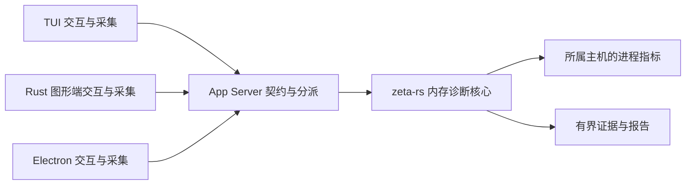

# 三端内存诊断：后端核心与运行时采集

状态：共享核心、正式协议与三端入口已接入。进程、JS/DOM 与 Rust 对象计数已提供采集；GPU 资源句柄和渲染缓存条目已接入；显存字节、缓存字节和深度堆证据未声明支持。实现与验证证据见[本次验收](changes/memory-diagnostics/verification.md)。

内存诊断由 `zeta-rs` 负责，统一服务 TUI、Rust 图形端和 Electron 桌面端。后端拥有诊断会话、进程采样、证据分析和报告；只有必须接触运行时内部对象的采集留在各端。用户应能知道哪个进程、哪类资源在持续增长，以及当前证据能支持什么结论。

## 三端区别

GUI 与 Desktop 都可以指图形应用，不能直接作为运行时分类。本文按仓库实际产品划分：

| 产品 | 位置 | 需要观察的对象 | 各端保留的职责 |
| --- | --- | --- | --- |
| TUI | `zeta-code` | TUI 进程、后端及其工具进程；终端正文、缓存、订阅和任务的存活量 | 终端交互、任务阶段标记、TUI 对象计数及进程内分配证据采集 |
| Rust 图形端 | `app` | 图形进程、后端及其工具进程；窗口、UI 对象、图片与字体缓存、GPU 资源 | `zui` 与各能力的对象计数、缓存与渲染资源统计、产品交互 |
| Electron 桌面端 | `zeta-ts` | Main、各 Renderer、实际存在的 GPU/utility/扩展进程，以及后端进程树 | Main 登记 Electron 进程身份；各运行时提供 JS 堆、DOM、监听器及堆快照证据；Workbench 展示 |

Rust 图形端的纹理、缓冲区和 GPU 分配必须与进程常驻内存分开记录；资源估算量也不能冒充驱动实际占用。Electron 必须区分进程与窗口，不能把所有 Renderer 合并后判断泄漏，也不能假设一个窗口始终对应一个固定 PID。

Rust 本身不保证完全没有内存泄漏，例如强引用环可能使对象无法释放。因此 Rust 图形端和 TUI 同样需要生命周期证据。[Rust 引用环说明](https://doc.rust-lang.org/book/ch15-06-reference-cycles.html)；Electron 的进程指标与堆快照则由其运行时接口提供：[app](https://www.electronjs.org/docs/latest/api/app#getappmetrics)、[process](https://www.electronjs.org/docs/latest/api/process)。具体接口可用性必须按仓库使用的运行时版本和沙箱配置验证后声明。

## 唯一职责归属

| 位置 | 目标职责 | 依赖边界 |
| --- | --- | --- |
| `zeta-rs/memory-diagnostics` | 诊断会话、进程身份、操作系统采样、有界历史、增长分析、证据关联与报告格式 | crate 隔离诊断能力和采样依赖；不依赖 Ratatui、`zui`、Electron 或产品 crate |
| `zeta-rs/app-server-protocol` | 请求、响应、通知、采集请求及生成类型和校验 | 只表达可序列化契约，不传输 UI 对象或运行时句柄 |
| `zeta-rs/app-server` | 校验连接权限、分派请求、关联采集端并管理连接资源 | 调用诊断领域；不另存趋势算法、会话状态或采样循环 |
| `zeta-rs/server-host` | 装配诊断能力，绑定后端进程生命周期 | 不依赖任何产品命令入口 |
| 三端运行时采集器 | 按后端请求读取所属运行时的指标和证据，响应取消与释放 | 不拥有诊断策略、阈值、报告结论或第二套诊断会话 |
| 三端界面 | 选择观察范围、开始/停止、展示证据、导出交互 | 消费领域接口；线上 DTO 止于适配层 |

先用一个诊断 crate 隔离能力与依赖，不为每端、每种指标或每个分析步骤拆 crate。共享 Rust 分配采集实现可以由 Rust 产品装配进目标进程；UI 对象、渲染资源的语义仍由其所属模块提供。后端不能通过一个 PID 直接取得另一个进程中的 Rust 对象或 JS 引用关系。

目标调用关系：

采集命令通过所属连接返回对应运行时。Electron Main 只处理进程登记和明确的宿主采集操作；普通协议仍由既有客户端与传输链路处理，不在 Main 增加诊断业务后端。该能力不改变三端已有的后端启动拓扑。

## 监听与证据规则

日常资源显示和持续诊断使用同一个采样核心、两种独立需求。界面需求由可见性决定；诊断需求由用户明确开始和停止，不受面板隐藏影响。没有任何需求时不采样。多个消费者观察同一进程时合并采样需求，证据和访问权限仍按诊断会话隔离。

持续诊断采用低频进程采样，建议初始参数为每 5 秒一次、观察 10～30 分钟；这是待性能验收的参数，不是判定泄漏的固定阈值。深度分配跟踪、堆快照与强制 GC 属于单独的显式采集操作，必须记录对测量的干扰，不能混入日常低成本监听。

| 证据层次 | 后端可以报告什么 | 不能据此断言什么 |
| --- | --- | --- |
| 进程常驻内存持续增加 | 哪个进程、哪段时间出现持续增长，样本完整度如何 | 单凭曲线确认泄漏或定位对象 |
| 重复操作结束后，稳定基线与存活对象持续增加 | 在相同负载、缓存策略和采集条件下，存在疑似保留 | 把正常历史增长、缓存预热或尚未结束的任务算成泄漏 |
| 分配栈、引用路径、对象释放契约及复现结果 | 将异常保留关联到具体对象或分配来源，并附证据 | 没有引用或生命周期证据时声称已定位根因 |

各指标保留来源、单位、统计口径和能力状态。RSS、JS 堆、分配器保留空间、缓存大小、GPU 资源不能互相替代或直接相加。跨进程常驻内存之和可能重复包含共享页，报告必须标明口径。没有足够空闲阶段、存在采样缺口或不支持某指标时报告“证据不足”或具体不可用原因，不能填零，也不能给出“没有泄漏”的保证。

后端任务阶段由后端产生，窗口/页面/终端操作阶段由对应产品报告。阶段标记携带时间与对象代次；分析只能比较同一进程实例、可比负载和相同指标口径的基线。

## 身份、协议与停止

- 诊断会话独立于聊天会话，持有明确的发起连接、目标范围、采样预算与结束原因。开始请求需要防重复身份；停止是幂等操作；订阅展示与持续采集分开释放。
- 目标身份包含主机、产品实例、进程实例及角色。PID 必须结合启动身份使用，进程重启建立新时间序列。一个进程承担多个角色只采样一次；进程内后端不重复计算。
- 产品宿主登记自身拥有的进程及运行时映射，后端校验登记范围与连接权限；不能接受任意 PID 作为完整的访问授权。窗口到进程的映射变化要记录代次，晚到证据不能写入新实例。
- 远程后端只能采集其所在主机的操作系统指标。本地客户端由本机采集器提供证据，远程与本机分别展示；没有本地采集能力时明确报告缺口，不把本地 PID 交给远程操作系统查询。
- 请求语义包括开始、停止、读取会话、订阅结果、请求运行时证据和导出报告；具体线上方法与字段需在实现时由协议 owner 定义并生成。采集响应必须关联会话、目标、请求身份和代次，校验大小、超时、取消和重复响应。
- 隐藏或关闭诊断面板只释放展示订阅。发起连接断开、所属产品退出、用户停止或预算到期结束该诊断；其他产品和其他连接的诊断不受影响。重新连接不自动续接旧诊断。
- 目标退出只结束该目标的时间序列，其他目标继续；全部目标结束则结束会话。被观察的后端异常退出时，客户端标记诊断中断，不能声称它已正常生成最终报告。
- 正常停止先禁止新采集，取消并等待有时限的在途工作，再释放计时器、订阅和缓存。采集器收到连接关闭必须自行停止；不能依赖已经退出的后端再发停止命令。

历史样本、目标数量、并发会话、事件队列、在途采集、已结束报告和落盘证据都必须有容量及保留期限。达到限制时返回明确原因或记录样本缺口，不静默丢弃后继续给出完整结论。报告导出使用后端定义的版本化格式；普通报告只含指标、时间、角色和必要的技术身份，不包含命令参数、环境变量或对话正文。深度堆证据可能包含业务内容，单独存放并明确标识，不默认混入普通报告。

## 当前代码与验收边界

共享实现位于 [memory-diagnostics](../memory-diagnostics/README.md)，包含[进程采样](../memory-diagnostics/src/process_resources.rs)、[会话与分析](../memory-diagnostics/src/session.rs)及有界导出。TUI 原 `src/host/process_resources.rs` 与对应测试已迁入该 crate，TUI 保留显示需求与[读数呈现](../../zeta-code/tui/src/status/resources.rs)。

协议提供 `memory/start`、`memory/read`、`memory/submit`、`memory/stop`、`memory/export`，能力版本为 `memoryDiagnostics: 1`。导出复用有容量和过期时间的 `resource/read`、`resource/release`。App Server 按连接清理，并阻止断连后在途开始请求重新建立诊断。

| 产品入口 | 当前证据 | 边界 |
| --- | --- | --- |
| TUI：`/memory start`、`read`、`stop`、`export <新文件路径>` | 本机进程与正文单元计数；后端单独采样 | 正文历史的正常增长不能算泄漏；进程内后端的常驻内存只由后端报告 |
| Rust 图形端：键盘快捷键目录中的四项 Memory diagnostics 命令 | 本机进程、窗口、后台任务、保留 UI 片段、GPU 资源句柄和渲染缓存条目计数 | GPU 指标统计应用持有的 wgpu 句柄；缓存统计图片、图标和文字缓冲条目。字节数明确为不支持 |
| Electron：命令面板中的四项 Memory Diagnostics 命令 | Main/Renderer 等进程的常驻内存；Main 与当前 Renderer 的 JS 堆、当前 Renderer 的 DOM/监听器计数 | 调试器已被占用时返回不支持；不会夺取其他调试会话 |
| Web：相同命令面板入口 | 当前页面中仍挂载的 DOM 节点数 | 进程内存、JS 堆及脱离页面的节点不由浏览器接口推断 |

Rust 图形端和 TUI 的本机采集器由共享客户端拥有，窗口/终端提供计数。共享后端持续采样，不依赖界面读取。图形端采集器按需读取已注册窗口的统计，不在每帧查询 GPU 注册表；窗口关闭会释放采集器。TUI 的诊断结果和错误独立呈现，不改变正在运行的对话状态。当前界面按后端给出的周期提交证据、读取结果；尚未提供通知订阅协议、深度堆采集、跨空闲阶段的负载等价验证或根因自动定位。

| 验收项 | 要求 | 实现与验收边界 |
| --- | --- | --- |
| AC-1 三端消费同一核心 | 三端能开始、读取和停止诊断，各端没有独立分析器 | 已接入；产品实测范围见验收记录 |
| AC-2 身份与范围正确 | 多窗口、进程内后端、PID 复用、远程主机、进程退出不串数据或重复统计 | 已有连接隔离、实例代次、来源区分与退出证据；全部产品拓扑仍待实测 |
| AC-3 不误判正常增长 | 区分缓存预热、正常历史增长、负载变化、缺失样本与已知泄漏 | 趋势和缺口分析已实现；只报告增长线索，根因与可比负载判定未实现 |
| AC-4 诊断自身可释放 | 重复开始/停止、断连、在途响应不会保留旧诊断；存储有上限 | 核心与前端生命周期已有测试；具体结果见验收记录 |
| AC-5 各端证据有效 | TUI 重复会话、Rust 窗口/图片释放、Electron 编辑器/Renderer 重载 | 计数采集已接入；GPU 资源释放与窗口采集器释放已有专门验证；完整产品场景范围见验收记录 |
| AC-6 报告与能力缺口准确 | 导出、失败、不可用和后端中断可观察 | 版本化导出、能力缺口和中断已接入；三平台覆盖仍未完成 |

这份状态不表示三端诊断已全部验收。当前审查为自查；具体命令、通过项和未完成项统一记录在[验收记录](changes/memory-diagnostics/verification.md)。
