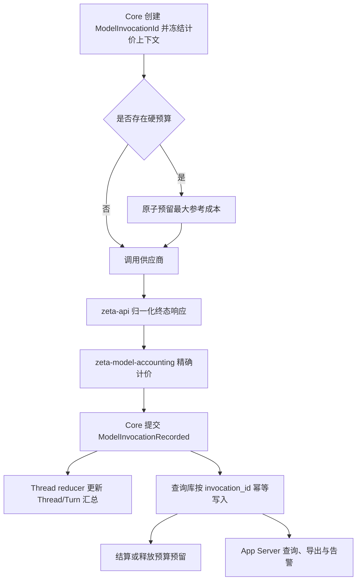

# 模型用量、计价与预算架构

> Owner: `zeta-model-accounting`  
> Status: Implementation in progress；计价核心与成功响应接线已实现，失败调用、持久查询与预算仍为 Proposed  
> Scope: `zeta-rs` 共享后端能力  
> Last reviewed: 2026-09-04

## 快速理解

这项能力已经建立独立的 `zeta-model-accounting` crate。当前已实现版本化价目表、精确金额、规则校验、加速公开价目表、参考成本计算，并已把成功模型响应写成 `ModelInvocationRecorded`；失败调用、跨 Thread 查询、预算和导出仍按本文后续阶段推进。它不接管供应商 HTTP 适配、模型选择或界面。

最终只有一条调用事实链：供应商响应由 `zeta-api` 归一化，Core 为每次真实请求提交一条完整的模型调用事实，Thread reducer 计算当前 Thread/Turn 汇总，`zeta-model-accounting` 从已提交事实建立跨 Thread 查询数据并执行计价和预算。桌面、TUI 与命令行不各算一遍费用。

| 结论 | 设计 |
| --- | --- |
| 是否拆 crate | 是，新增 `zeta-model-accounting` |
| token 事实放哪里 | 稳定类型和 Thread 事件放 `zeta-protocol`，供应商字段归一化留在 `zeta-api` |
| 价格放哪里 | 不放进模型 catalog；使用独立、不可变、可审计的价目表版本 |
| 费用叫什么 | `参考成本`，不冒充供应商账单 |
| 价格无法精确匹配 | 记录用量并标记 `Unpriced`，不猜价格 |
| 跨 Thread 查询 | 由后端持久查询库提供，界面只消费 typed API |
| 硬预算 | 调用前原子预留，调用后按已提交事实结算 |

## 要解决的问题

当前成功模型响应会记录 `ModelInvocationRecorded`，旧 `ModelUsageRecorded` 只用于历史回放。Thread/Turn 继续汇总输入、输出、缓存读取、缓存写入和推理 token；新事件另外保留调用 ID、时间、模型、可验证的计费入口和参考成本。这解决了“这个 Thread 用了多少 token”以及首批公开加速价格的单次计价，但还不能可靠回答：

- 某个供应商、模型、Project 或时间段调用了多少次、用了多少 token、花了多少参考成本；
- 缓存命中率是多少，批处理、服务等级、区域和长上下文如何影响价格；
- 价格更新后，历史记录当时使用的是哪一版价格；
- 多窗口或并发调用下，月度硬预算是否会被同时突破；
- 如何导出可复核的调用行、计价行和未计价原因。

这不是简单的 `tokens × 单价`。截至本文复核日期，供应商公开计价至少已经包含缓存读取与写入、批处理、服务等级、区域、上下文区间和按 UTC 时段变化等维度；同一个模型名也可能是会变化的别名。因此价格必须与一次调用当时的完整计价上下文绑定。

## 非目标

- 不替代供应商账单、税费、余额、充值、合同折扣或发票系统；只有供应商明确返回的账单值才能标记为供应商账单数据。
- 不在运行时抓取供应商价格网页，也不根据模型名相似度选择单价。
- 不把价格塞进 `models-manager`；模型能力 catalog 与商业计价有不同的版本和生命周期。
- 不保存 prompt、模型输出、API key、请求头或包含密钥的 endpoint URL。
- 第一阶段不核算 web search、容器、文件存储等非模型推理费用；数据结构预留明确扩展点，但不会把未知费用算成 token 费用。
- 不把现有 Goal token budget 改成金钱预算。两者是独立约束，可以同时生效。

## 当前状态

| 能力 | 当前状态 | 主要缺口 |
| --- | --- | --- |
| 单次响应用量 | 已具备 | 成功响应写入独立调用 ID、模型、时间、用量和输入估算；失败或取消且没有响应的请求尚未写入调用事实 |
| Thread/Turn token 汇总 | 已具备 | 只覆盖当前 Thread/Turn，不支持跨 Thread 分组查询 |
| 缓存命中统计 | 部分具备 | 有缓存读取 token，但没有完整度明确的产品级命中率语义 |
| 版本化价格 | 部分具备 | crate 已支持不可变 revision、内容摘要、生效区间、规则冲突校验和加速公开价目表；其他公开价格仍需进入数据包 |
| 参考成本 | 部分具备 | 已接入真实成功响应，支持 OpenAI 响应模型与 `service_tier`、Kimi HighSpeed 固定模型身份；响应头等级、更多价目表和失败调用仍待接入 |
| 持久查询与导出 | 尚未完成 | Thread journal 适合回放，不适合按时间、供应商和模型扫描 |
| 金钱预算与告警 | 尚未完成 | 没有跨并发调用的预留和结算机制 |

## 最终所有权

| Owner | 负责 | 不负责 |
| --- | --- | --- |
| `zeta-api` | 解析供应商响应；归一化供应商返回的 token 明细、实际模型和服务等级 | 价格选择、费用汇总、预算、跨 Thread 存储 |
| `models-manager` | 模型能力、可用性、生命周期和元数据来源 | 价目表和历史费用 |
| `zeta-protocol` | 稳定的调用事实、用量、计价结果、预算值对象和 Thread 事件 contract | 存储、查询和业务执行 |
| Core | 为每次真实供应商请求分配调用 ID；冻结计价上下文；调用预算预留；提交终态事实 | 自己维护价格表或跨 Thread 查询库 |
| `thread-store` | 按顺序持久化 Thread 事件并支持回放 | 跨 Thread 费用查询和预算并发控制 |
| `zeta-model-accounting` | 价目表校验与选择、精确计价、查询库、预算预留与结算、汇总和导出 | 供应商 HTTP、模型选择、Thread reducer、UI |
| `app-server-protocol` | typed request、response、notification、resource 与运行时 decoder 的唯一线上 contract | 领域计算和持久状态 |
| `app-server` | 持有领域服务实例；typed dispatch；跨领域编排 | 价格规则、查询 SQL、界面状态 |
| 桌面、TUI、命令行 | 展示、筛选、触发导出和预算配置 | 重算价格、直接写查询库、维护第二份调用事实 |

桌面最终通过前端 `modelAccounting` 领域 service 和 app-server adapter 访问后端。一个应用 Host 只有一个共享 app-server process，每个 renderer 使用自己的 connection，但所有窗口看到同一个后端查询结果。Main 只负责共享进程和透明 relay，不解析或缓存计价数据。

TUI 与桌面运行在 app-server 产品形态时都通过 typed API 访问；独立命令行可以在自己的单进程装配中直接持有同一个 `zeta-model-accounting` 领域服务。任何时刻只有持有数据目录 writer lease 的后端进程可以修改查询库和预算账本，客户端不能绕过它直接写盘。

## 依赖方向

```text
zeta-api ───────→ zeta-protocol
core ───────────→ zeta-protocol
core ───────────→ zeta-model-accounting ─→ zeta-protocol
thread-store ───→ zeta-protocol
app-server ─────→ core + zeta-model-accounting + app-server-protocol
desktop/TUI ────→ app-server-protocol generated client
```

`zeta-model-accounting` 不依赖 `core`、`zeta-api`、`models-manager` 或任一界面 crate，因此不会形成模型调用链的反向依赖。

## 调用事实模型

每次真正发给供应商的请求都有独立 `ModelInvocationId`。重试、上下文压缩和同一 Turn 内的后续模型请求分别产生新的 ID，不能只用 `TurnId` 代替调用身份。

目标事件为 `ThreadEvent::ModelInvocationRecorded`，它在一次供应商请求进入终态后提交一条 `ModelInvocationRecord`。当前 `ModelUsageRecorded` 只保留读取兼容，迁移完成后不再产生新写入。

```rust
pub struct ModelInvocationRecord {
    pub invocation_id: ModelInvocationId,
    pub thread_id: ThreadId,
    pub turn_id: TurnId,
    pub context: ModelBillingContext,
    pub started_at_unix_ms: i64,
    pub completed_at_unix_ms: i64,
    pub outcome: ModelInvocationOutcome,
    pub usage: Option<ModelUsage>,
    pub input_estimate: Option<ModelInputEstimate>,
    pub cost: ModelReferenceCost,
}
```

`ModelBillingContext` 至少包含：

- 供应商、计费平台和不含秘密的账户作用域 ID；
- 请求模型和供应商实际返回的模型；
- API 操作、batch 标记、请求服务等级、实际计费服务等级及其证据来源；
- 数据处理区域、上下文价格区间和调用开始时间；
- 调用开始时冻结的 `RateCardRevision`。

可变化的模型别名必须解析到供应商实际返回的模型或已固定的 snapshot 才能计价。响应没有实际模型、请求又是可变化别名时，结果为 `Unpriced(UnresolvedModelAlias)`。

`ModelInvocationOutcome` 区分成功、失败和取消。供应商即使在失败响应中返回用量，也照常记录并计价；没有返回用量时记录事实，但费用保持未知。

### 用量与完整度

`ModelUsage` 继续承担产品通用汇总，至少包含：总输入、输出、缓存读取、缓存写入和推理 token。为了支持不同缓存写入价格，最终 contract 还需要把缓存写入拆成供应商明确报告的类别，例如 5 分钟与 1 小时写入；总字段仍用于通用 UI。

任何缺失值都保持缺失，不能当成零。聚合值继续同时携带 `reported` 和 `complete`；计价只有在本条价格规则所需的全部用量维度完整时才是完整成本。

归一化后的总输入包含普通输入、缓存读取和缓存写入，计价时普通输入量按 `input_tokens - cached_input_tokens - cache_write_input_tokens` 做 checked subtraction。出现下溢说明供应商 adapter 违反 contract，该调用不能产生完整成本。`reasoning_tokens` 是输出内部的诊断明细，除非供应商明确把它作为独立收费项，否则不能再叠加到输出费用中。

缓存命中率定义为：

```text
cache_hit_rate = cached_input_tokens / input_tokens
```

缓存写入不属于命中。分母为零、任一必要值缺失或聚合不完整时，界面显示“不可用”或“部分数据”，不能显示一个看似精确的百分比。

## 版本化价目表

价目表是独立、不可变的数据包，不是 Rust 分支代码。每个 `RateCardRevision` 包含：

- 稳定 revision、内容摘要、schema version、来源 URL、复核时间和生效区间；
- 精确匹配条件：供应商、计费平台、实际模型、API 操作、实际服务等级、batch、区域、上下文区间和时间规则；
- 输入、缓存读取、各类缓存写入和输出的单位价格；
- 币种、价格单位和展示说明。

加载时必须验证同一匹配空间内的规则不重叠。一次调用只能匹配一条规则：零条为 `Unpriced(MissingRate)`，多条说明价目表无效并拒绝加载。价格更新生成新 revision；已经记录的调用继续引用原 revision，不被后台静默改价。

官方公开价目表作为随产品发布或签名更新的数据包进入仓库。企业合同价通过显式账户作用域的自定义价目表导入，不与公开价目表混合。运行时不访问价格网页。

## 首版价目表基线

下面是计划进入首个公开价目表 revision 的当前基准，复核时间为 2026-09-04。金额均为每 1,000,000 tokens，除非表格另行注明。它们是公开参考价，不包含税、赠金、合同折扣和供应商最终舍入。

价格表必须按 `billing_platform` 区分按量 API 与订阅套餐。Zeta 当前 catalog 中通过 ChatGPT subscription 或 Kimi Code subscription 调用的模型不产生可验证的逐 token 扣费，记录 token 用量但成本为 `Unpriced(SubscriptionPlan)`，不能套用同名 API 价格。

### 当前内置模型覆盖

| Zeta 模型 | 接入方式 | 首版计价状态 |
| --- | --- | --- |
| `openai/gpt-5.6-sol`、`gpt-5.6-terra`、`gpt-5.6-luna`、`gpt-5.5`、`gpt-5.4` | ChatGPT subscription | `Unpriced(SubscriptionPlan)` |
| `openai/gpt-5.6` | OpenAI 按量 API；当前别名指向 `gpt-5.6-sol` | 使用 OpenAI API 表；仍记录实际返回模型 |
| `anthropic/claude-sonnet-4-20250514` | Anthropic API key | 有公开历史价格；供应商当前标记为 retired，新调用需按实际计费平台判断 |
| `google/gemini-3.6-flash` | Gemini 按量 API | 已覆盖 Standard、Batch、Flex、Priority |
| `xai/grok-4.5` | xAI 按量 API | 已覆盖 Standard、Priority |
| `qwen/qwen-plus` | Alibaba Cloud Model Studio 按量 API | 已覆盖默认北京 endpoint；其他区域使用独立规则 |
| `kimi/kimi-k2.6` | Kimi 按量 API | 已覆盖 |
| `kimi/kimi-k2.7-code` | Kimi Code subscription | `Unpriced(SubscriptionPlan)` |
| `deepseek/deepseek-v4-pro` | DeepSeek 按量 API | 已覆盖峰谷 UTC 时段 |
| `zai/glm-5.1` | Z.AI 按量 API | 已覆盖 |
| `minimax/MiniMax-M3` | MiniMax 按量 API | 已覆盖两个上下文档位及 Standard、Priority |
| `mimo/mimo-v2.5-pro` | Xiaomi MiMo 按量 API | 已覆盖国内与海外区域 |

### 加速调用如何进入计价

“更快”不是一个可以跨供应商直接复用的价格开关。首版 contract 同时保存请求值和响应事实，并按下面三种机制选择价格：

| 机制 | 当前模型 | 请求表达 | 结算依据 |
| --- | --- | --- | --- |
| OpenAI 同一模型的服务等级 | GPT-5.6 | 请求 `fast` 或 `priority` | 响应 `service_tier`；`priority` 用 Fast 价，`default` 用 Standard 价 |
| Google 同一模型的服务等级 | Gemini 3.6 Flash | 请求 `priority` | 响应 `x-gemini-service-tier`；被降到 `standard` 时用 Standard 价 |
| xAI 同一模型的服务等级 | Grok 4.5 | 请求 `priority` | 响应 `service_tier`；只有 `priority` 使用 2 倍价格 |
| MiniMax 同一模型的服务等级 | MiniMax M3 | 请求 `priority` | 官方当前未说明自动降级；成功调用按被接受的请求等级计价 |
| 独立高速模型 ID | Kimi K2.7 Code HighSpeed | 请求 `kimi-k2.7-code-highspeed` | 响应实际模型；不能给普通模型追加 Fast 标签 |
| 当前模型不支持加速 | Claude Sonnet 4、Qwen Plus、DeepSeek V4 Pro、GLM-5.1、MiMo V2.5 Pro | 不允许构造不存在的服务等级 | 只匹配这些模型已验证的公开规则 |

产品层可以把这些能力统一展示为“加速”，但调用事实和价目表必须保留供应商原始含义。`requested_service_tier`、`applied_service_tier`、`service_tier_evidence` 和 `resolved_model` 是独立字段，不能只留下一个通用 `Fast` 枚举。证据来源至少区分响应字段、响应头和供应商明确承诺按已接受请求值计费；没有足够证据时不能把请求值当成计费事实。

OpenAI 请求可传 `fast` 或历史名称 `priority`，GPT-5.6 响应都报告 `priority`；流量爬升过快时也可能报告 `default` 并按 Standard 收费。xAI 同样只在响应报告 `priority` 时收 Priority 价格。硬预算按本次请求可能产生的最高价格预留，最终按响应事实结算。若供应商没有返回足以确认实际等级或实际模型的字段，则该调用为 `Unpriced(MissingBillingContext)`。

当前内置的 `claude-sonnet-4-20250514` 没有 Fast mode。Anthropic 目前只对 Claude Opus 5 和 Opus 4.8 的第一方 Claude API 提供 Fast research preview，公开基准为输入 $10、输出 $50，并且不支持 Batch。只有这些模型进入 Zeta catalog 后才加入对应 rate rules，不能把该价格套到 Sonnet 4。[来源：Anthropic Fast mode](https://platform.claude.com/docs/en/build-with-claude/fast-mode)

### OpenAI GPT-5.6 API

币种为 USD。`gpt-5.6` 是 `gpt-5.6-sol` 的别名。短上下文为输入不超过 272K；超过 272K 后，整个请求按长上下文列计价。符合数据驻留条件的区域处理 endpoint 另加 10%。[来源：OpenAI API Pricing](https://developers.openai.com/api/docs/pricing)

| 实际模型 | 服务等级 | 短输入 | 短缓存读 | 短缓存写 | 短输出 | 长输入 | 长缓存读 | 长缓存写 | 长输出 |
| --- | --- | ---: | ---: | ---: | ---: | ---: | ---: | ---: | ---: |
| `gpt-5.6-sol` | Standard | $4.00 | $0.40 | $5.00 | $20.00 | $8.00 | $0.80 | $10.00 | $30.00 |
| `gpt-5.6-sol` | Batch | $2.00 | $0.20 | $2.50 | $10.00 | $4.00 | $0.40 | $5.00 | $15.00 |
| `gpt-5.6-sol` | Flex | $2.00 | $0.20 | $2.50 | $10.00 | $4.00 | $0.40 | $5.00 | $15.00 |
| `gpt-5.6-sol` | Fast | $8.00 | $0.80 | $10.00 | $40.00 | $16.00 | $1.60 | $20.00 | $60.00 |
| `gpt-5.6-terra` | Standard | $2.00 | $0.20 | $2.50 | $12.00 | $4.00 | $0.40 | $5.00 | $18.00 |
| `gpt-5.6-terra` | Batch | $1.00 | $0.10 | $1.25 | $6.00 | $2.00 | $0.20 | $2.50 | $9.00 |
| `gpt-5.6-terra` | Flex | $1.00 | $0.10 | $1.25 | $6.00 | $2.00 | $0.20 | $2.50 | $9.00 |
| `gpt-5.6-terra` | Fast | $4.00 | $0.40 | $5.00 | $24.00 | $8.00 | $0.80 | $10.00 | $36.00 |
| `gpt-5.6-luna` | Standard | $0.20 | $0.02 | $0.25 | $1.20 | $0.40 | $0.04 | $0.50 | $1.80 |
| `gpt-5.6-luna` | Batch | $0.10 | $0.01 | $0.125 | $0.60 | $0.20 | $0.02 | $0.25 | $0.90 |
| `gpt-5.6-luna` | Flex | $0.10 | $0.01 | $0.125 | $0.60 | $0.20 | $0.02 | $0.25 | $0.90 |
| `gpt-5.6-luna` | Fast | $0.40 | $0.04 | $0.50 | $2.40 | $0.80 | $0.08 | $1.00 | $3.60 |

`gpt-5.6-sol` 当前公开价是促销价格，官方说明至少持续到 2026-11-21；价目表必须给该 revision 设置明确复核日期，不能假设永久有效。

### Anthropic Claude Sonnet 4

币种为 USD。官方当前把 Claude Sonnet 4 标记为 retired，只有 Bedrock 和 Google Cloud 仍保留；不同云平台必须使用各自价目表，不能把下面的 Claude API 基准直接用于云平台账单。[来源：Anthropic Claude pricing](https://platform.claude.com/docs/en/about-claude/pricing)

| 模型 | 模式 | 普通输入 | 缓存写 5m | 缓存写 1h | 缓存读 | 输出 |
| --- | --- | ---: | ---: | ---: | ---: | ---: |
| `claude-sonnet-4-20250514` | Standard | $3.00 | $3.75 | $6.00 | $0.30 | $15.00 |
| `claude-sonnet-4-20250514` | Batch | $1.50 | $1.875 | $3.00 | $0.15 | $7.50 |

Batch 基准按官方 50% input/output 折扣及缓存 multiplier 叠加计算。历史 direct API 调用只有在 `billing_platform` 和生效区间可确认时才匹配这条规则。

### Google Gemini 3.6 Flash

币种为 USD，以下为 Paid Tier 的促销价格，有效至 2026-12-31；官方已公布 2027-01-01 起价格翻倍，因此两段时间必须是两个 rate rules。[来源：Gemini Developer API pricing](https://ai.google.dev/gemini-api/docs/pricing)

| 服务等级 | 输入 | 缓存读 | 输出 | 缓存存储/小时 |
| --- | ---: | ---: | ---: | ---: |
| Standard | $0.75 | $0.075 | $3.75 | $0.50 |
| Batch | $0.375 | $0.0375 | $1.875 | $0.50 |
| Flex | $0.375 | $0.0375 | $1.875 | $0.50 |
| Priority | $1.35 | $0.135 | $6.75 | $0.50 |

输出价格已经包含 thinking tokens，不能把 thinking token 再计一次。缓存存储的单位是每 1M tokens 每小时，第一阶段只统计 token 推理费用时必须把它标成未覆盖费用，而不是忽略后仍声称成本完整。

### xAI Grok 4.5

币种为 USD。输入达到 200K 时，整个请求使用高上下文价格；该模型当前不支持 Batch。Priority Processing 是同一模型的服务等级，对输入、缓存读、输出和推理 token 都按 Standard 的 2 倍计价，缓存折扣先应用、再应用 2 倍系数。只有响应返回 `service_tier: "priority"` 才使用 Priority 价格。[来源：xAI Grok 4.5](https://docs.x.ai/developers/models/grok-4.5)、[xAI Priority Processing Pricing](https://docs.x.ai/developers/pricing#priority-processing-pricing)

| 输入区间 | 服务等级 | 输入 | 缓存读 | 输出 |
| --- | --- | ---: | ---: | ---: |
| `< 200K` | Standard | $2.00 | $0.30 | $6.00 |
| `< 200K` | Priority | $4.00 | $0.60 | $12.00 |
| `>= 200K` | Standard | $4.00 | $0.60 | $12.00 |
| `>= 200K` | Priority | $8.00 | $1.20 | $24.00 |

### Qwen Plus

Zeta 默认 endpoint 是中国站 `dashscope.aliyuncs.com`，因此首版使用北京区域原价，币种为 CNY。其他 endpoint 必须通过 billing region 选择独立规则。官方页面注明这些是原价，不包含控制台限时优惠。[来源：Alibaba Cloud Model Studio qwen-plus](https://help.aliyun.com/en/model-studio/qwen-plus)

| 输入区间 | 普通输入 | 隐式缓存读 | 显式缓存写 | 显式缓存读 | 普通输出 | Thinking 输出 |
| --- | ---: | ---: | ---: | ---: | ---: | ---: |
| `<= 128K` | ¥0.80 | ¥0.16 | ¥1.00 | ¥0.08 | ¥2.00 | ¥8.00 |
| `128K < input <= 256K` | ¥2.40 | ¥0.48 | ¥3.00 | ¥0.24 | ¥20.00 | ¥24.00 |
| `256K < input <= 1M` | ¥4.80 | ¥0.96 | ¥6.00 | ¥0.48 | ¥48.00 | ¥64.00 |

Qwen 的 thinking 请求使用不同输出单价，因此 billing context 必须记录 thinking mode；不能仅凭 `reasoning_tokens` 推断模式，也不能把它叠加到总输出 token 上再计一次。

### Kimi K2.6

币种为 USD。[来源：Kimi K2.6 pricing](https://platform.kimi.ai/docs/pricing/chat-k26)

| 缓存命中输入 | 缓存未命中输入 | 输出 |
| ---: | ---: | ---: |
| $0.16 | $0.95 | $4.00 |

`kimi-k2.7-code` 在当前 Zeta catalog 中走 Kimi Code subscription，不使用按量 API 价格。

Kimi API 另有独立的高速模型 ID。下面的价格只用于未来明确采用 Kimi 按量 API 的调用，不能用于当前 subscription 接入。[来源：Kimi K2.7 Code pricing](https://platform.kimi.ai/docs/pricing/chat-k27-code)

| 实际模型 | 缓存命中输入 | 缓存未命中输入 | 输出 |
| --- | ---: | ---: | ---: |
| `kimi-k2.7-code` | $0.19 | $0.95 | $4.00 |
| `kimi-k2.7-code-highspeed` | $0.38 | $1.90 | $8.00 |

`kimi-k2.7-code-highspeed` 约为普通版 2 倍价格，但 rate selector 必须按实际模型 ID 匹配，不能实现成 `service_tier = fast` 的倍率规则。

### DeepSeek V4 Pro

币种为 USD。峰值时段是周一至周五 UTC 01:00–04:00 和 06:00–10:00，其余时间为谷值；时间边界按调用开始时间选择。[来源：DeepSeek Models & Pricing](https://api-docs.deepseek.com/quick_start/pricing/)

| 时段 | 缓存命中输入 | 缓存未命中输入 | 输出 |
| --- | ---: | ---: | ---: |
| Peak | $0.044 | $1.32 | $3.96 |
| Off-peak | $0.022 | $0.66 | $1.98 |

### Z.AI GLM-5.1

币种为 USD。[来源：Z.AI pricing](https://docs.z.ai/guides/overview/pricing)

| 输入 | 缓存读 | 输出 | 缓存存储 |
| ---: | ---: | ---: | --- |
| $1.40 | $0.26 | $4.40 | 限时免费 |

“限时免费”不是零成本永久规则，必须作为带复核期限的 rate rule；期限不明时不能用于硬预算的长期上界。

### MiniMax M3

币种为 USD，表内是官方页面展示的当前永久 50% off 价格。[来源：MiniMax Token Plan / Pay-as-you-go](https://platform.minimax.io/subscribe/token-plan?tab=api-enterprise)

| 输入区间 | 服务等级 | 输入 | 缓存读 | 输出 |
| --- | --- | ---: | ---: | ---: |
| `<= 512K` | Standard | $0.30 | $0.06 | $1.20 |
| `<= 512K` | Priority | $0.45 | $0.09 | $1.80 |
| `512K < input <= 1M` | Standard | $0.60 | $0.12 | $2.40 |
| `512K < input <= 1M` | Priority | $0.90 | $0.18 | $3.60 |

MiniMax M3 的 Priority 档通过 `service_tier = priority` 启用，当前公开价格为 Standard 的 1.5 倍。当前公开表没有给 MiniMax M3 单列缓存写价格，因此存在缓存写 token 时不能把完整成本算成零。

### Xiaomi MiMo V2.5 Pro

官方按计费区域分别给出 CNY 与 USD 价格，缓存写入当前限时免费。[来源：Xiaomi MiMo API 定价](https://mimo.mi.com/docs/zh-CN/price/pay-as-you-go)

| 计费区域 | 币种 | 缓存命中输入 | 缓存未命中输入 | 输出 |
| --- | --- | ---: | ---: | ---: |
| 中国大陆 | CNY | ¥0.025 | ¥3.00 | ¥6.00 |
| 海外 | USD | $0.0036 | $0.435 | $0.87 |

缓存写“限时免费”同样需要有界 revision；无法确认活动仍有效时标记为未知费用。

## 为什么需要这些维度

| 供应商规则示例 | 对 contract 的要求 |
| --- | --- |
| OpenAI 区分标准、Batch、Flex、Fast mode，短/长上下文、缓存读取、缓存写入和区域加价 | 记录实际服务等级、上下文区间、区域和缓存写入 token |
| Anthropic 区分缓存读取、5 分钟与 1 小时缓存写入、Batch、Fast mode 和推理区域 | 缓存写入不能只保留一个合计数 |
| xAI 与 MiniMax 的 Priority 只在响应确认后使用加速价格 | 同时保存请求等级和响应实际等级，按响应事实计价 |
| Kimi HighSpeed 使用独立模型 ID | 服务等级和实际模型必须分开，不能只保存“是否加速” |
| DeepSeek 公开价格区分缓存命中/未命中，并可按 UTC 峰谷时段变化 | 价格选择必须使用调用开始时间和缓存读取量 |

以上表格同时给出首版价目表的复核快照和必须支持的计价维度。运行时使用的数据仍属于具体 `RateCardRevision`，价格更新时由官方 fixture 验证；架构代码本身不写死这些数字。

## 精确计价

所有金额使用整数 `pico_units` 表示币种最小到 `10^-12` 的单位，计算使用 checked integer arithmetic，禁止浮点数。价目表加载器拒绝无法无损表示的单位价格。

```rust
pub struct MoneyAmount {
    pub currency: CurrencyCode,
    pub pico_units: u128,
}

pub enum ModelReferenceCost {
    Complete(RatedCost),
    Partial { known_minimum: RatedCost, reason: IncompleteCostReason },
    Unpriced { reason: UnpricedReason },
}
```

`RatedCost` 保存总额、`RateCardRevision` 和逐项 `CostLineItem`。每个计价行保留维度、数量、单位价格和金额，使导出结果可以复核。只有展示时才格式化和舍入；比较预算、聚合和持久化都使用原始整数。

不同币种不能直接相加。汇总按币种分别返回，金额预算只接受单一币种；需要汇率换算时应建立独立、版本化的汇率能力，不能使用界面当天汇率改写历史结果。

这个金额叫“参考成本”。供应商可能还有合同折扣、赠金、税、账单舍入和未公开费用，所以参考成本不能标成“已扣费”。以后接入供应商账单 API 时，供应商返回金额以独立 `CostBasis::ProviderReported` 保存，不能覆盖本地参考成本。

## 持久化与一致性

Thread journal 中的 `ModelInvocationRecorded` 是该 Thread 调用事实的权威来源。`zeta-model-accounting` 维护一个面向跨 Thread 查询的持久库，其中每行以 `ModelInvocationId` 幂等写入，并保存已经消费到的 Thread event sequence。

写入顺序固定为：



不能先写查询库再提交 Thread 事件。进程在事件提交后、查询库写入前退出时，恢复任务从 event sequence 继续消费，重复写入由 `ModelInvocationId` 去重。查询库损坏时可以从仍存在的 Thread journal 和价目表 revision 重建。

本地查询库不是法定财务账本。删除 Thread 时同步删除其调用明细和派生汇总；需要留存的用户应先导出。查询库不得保存 prompt 或输出，因此导出也只包含身份、时间、用量、计价和状态字段。

## 预算与告警

预算有 token 与金额两类，彼此不替代：

| 预算 | Owner | 语义 |
| --- | --- | --- |
| Goal token budget | Core/Goal | 限制当前 Goal 可使用的 token |
| 金额软预算 | `zeta-model-accounting` | 达到阈值后产生告警，不阻止调用 |
| 金额硬预算 | `zeta-model-accounting` | 调用前必须成功预留，否则拒绝调用 |

金额预算支持 Thread、Project 和供应商账户作用域，以及一次性、每日或每月 UTC 周期。预算判断使用“已结算参考成本 + 活跃预留 + 本次预留”，并按预算作用域原子串行，避免并发调用同时穿透上限。

硬预算的本次预留取输入估算、请求最大输出和完整计价上下文计算出的上界。请求 Fast、Priority 或独立高速模型时，预留使用本次请求可能产生的最高价格；调用完成后按响应实际服务等级或实际模型结算并释放差额。价格、最大输出或必要费用维度无法确定时，硬预算返回结构化 `BudgetCannotBeEvaluated`，不会放行一个无法证明不超额的调用。

调用事实提交后，预留按完整参考成本结算；未发生调用则释放。进程在供应商请求期间退出时，预留进入 `NeedsReview` 并继续占用额度，因为后端无法证明供应商没有计费。以后可通过供应商账单对账或用户明确处理结束该状态。

软预算允许记录 `Partial` 或 `Unpriced` 调用，但告警必须同时说明当前金额不完整，不能只报一个较低的确定金额。

## 查询、导出与界面语义

领域查询至少支持按时间范围、供应商、实际模型、请求服务等级、实际计费服务等级、Project、Thread、结果状态、计价状态和价目表 revision 过滤，并按时间、供应商、模型、实际计费服务等级或 Project 分组。

建议的稳定 App Server contract：

| Method/resource | 语义 |
| --- | --- |
| `modelAccounting/summary/read` | 返回有界时间段内的 token、缓存命中、参考成本和完整度汇总 |
| `modelAccounting/entries/list` | 按 cursor 分页返回调用明细与计价行 |
| `modelAccounting/budgets/list` | 返回预算、已结算、活跃预留和告警状态 |
| `modelAccounting/budget/put` | 以稳定 budget ID 创建或替换预算，按作用域串行 |
| `modelAccounting/budget/remove` | 删除预算定义，不删除历史调用 |
| `modelAccounting/export/start` | 使用 client-generated resource ID 流式导出 CSV 或 JSON |
| `modelAccounting/export/stop` | 停止导出；response 返回后不再发送该 resource 的 notification |
| `modelAccounting/changed` | 携带 revision，通知前端重新读取受影响摘要 |

`summary/read` 返回 snapshot revision；adapter 在 snapshot 建立前先注册 `changed`，确保 snapshot 与 notification 之间没有缺口。不同 renderer 各自保存短生命周期的显示缓存，后端仍是唯一持久状态 owner。

TUI `/status` 保留当前 Thread 的紧凑 token 视图，并增加参考成本和完整度；详细筛选进入独立 usage 视图。桌面建立 `modelAccounting` 前端领域 service，Workbench UI 只依赖这个领域 contract，不导入生成 DTO。命令行的 `usage` 子命令调用同一领域查询并支持 `--format table|json|csv`。

## App Server 与前端文件位置

规划中的文件位置如下，只在对应阶段出现真实调用方时创建：

```text
zeta-rs/model-accounting/
zeta-rs/protocol/src/model/accounting.rs
zeta-rs/app-server-protocol/src/protocol/v2/model_accounting.rs
zeta-rs/app-server/src/request_processors/model_accounting_processor.rs

src/platform/modelAccounting/common/modelAccounting.ts
src/platform/modelAccounting/browser/modelAccountingAppServerAdapter.ts
```

`model_accounting_processor.rs` 只转换 DTO 并调用领域服务。导出是跨 request 存活的资源，才允许在 app-server 增加对应 resource owner；普通查询不能建立 resource manager。生成的 TypeScript method map、DTO 和 decoder 继续由 `app-server-protocol` 生成，不能在前端手写。

前端 service 拥有 UI 可见的筛选、结果、事件和错误语义；adapter 只做机械转换。Main、renderer protocol client 和 Sessions Provider 都不成为 accounting 业务 owner。

## 隐私、删除与兼容

- `account_scope_id` 使用本地稳定 opaque ID；不得保存 API key、Authorization、组织密钥或原始自定义 endpoint URL。
- 调用明细不含 prompt、输出、工具参数和响应正文。
- Thread 删除会删除对应明细；Project 删除只解除分组关系，除非其 Thread 同时被删除。
- 导出默认包含计价所需字段，不包含账户显示名；用户显式选择后才加入可识别标签。
- 旧 `ModelUsageRecorded` 回放时保留 token 汇总，但因为缺少计价上下文，记为 `Unpriced(LegacyMissingContext)`，不能补猜供应商或模型。
- 新版本只写 `ModelInvocationRecorded`；兼容读取在既定 journal 保留期结束后一次性移除，不长期维护两条写入路径。
- 价目表 schema 升级必须继续读取记录所引用的旧 revision；不能因为应用升级改变历史参考成本。

## 交付阶段

这些阶段按最终 contract 递增交付，不引入临时公开类型或第二条写入链。

### 阶段一：调用事实与计价核心

- **已实现**：建立 `zeta-model-accounting` crate、金额值对象、价目表 schema、唯一规则选择器、内容摘要和精确计价器；实现证据见 [`model-accounting/README.md`](../model-accounting/README.md)。
- **已实现**：内置 OpenAI Fast、Gemini Priority、xAI Priority、MiniMax Priority 与 Kimi HighSpeed 的公开价目表 revision，并验证服务等级、模型 ID、长上下文和生效时间边界。
- **已实现**：在 `zeta-protocol` 固定 `ModelInvocationId`、调用事实、精确金额字符串、逐项成本与完整/部分/未计价状态。
- **已实现**：OpenAI Responses、Chat Completions 兼容接口和 Anthropic Messages 保留响应实际模型；响应含 `service_tier` 时一并保留。
- **已实现**：Core 对每个成功模型响应只提交一条 `ModelInvocationRecorded`，旧 `ModelUsageRecorded` 不再用于新写入，原有 Thread/Turn/Goal 汇总从新事件继续计算。
- 待完成：失败、取消和重试请求也提交独立调用事实；接入 Google 等供应商的响应头计费等级；补全账户作用域、batch、区域和更多价目表。

完成条件：给定同一调用事实和同一价目表 revision，所有平台产生逐字节一致的计价结果；未知价格只产生明确 `Unpriced`。

### 阶段二：持久查询与 App Server API

- 建立查询库、event sequence checkpoint、幂等恢复和删除语义。
- 在 `app-server-protocol` 增加 summary、分页 entries、changed notification 和导出 resource。
- App Server 持有唯一领域服务实例；桌面/TUI/CLI 不直接访问存储。

完成条件：进程可在任一写入边界退出并恢复，不丢失、不重复调用明细；多 renderer 查询到一致结果。

### 阶段三：产品界面、导出与软预算

- TUI `/status` 增加参考成本与完整度，新增详细 usage 视图。
- 桌面增加领域 service、adapter 和使用量界面。
- 提供 CSV/JSON 导出、软阈值和去重告警。

完成条件：缓存命中率、token、参考成本和未计价原因在三个入口语义一致。

### 阶段四：硬预算

- 建立预算定义、原子预留、结算、释放和 `NeedsReview` 恢复。
- Core 在供应商请求前执行预算预留，并把拒绝原因作为稳定领域错误返回。
- 增加并发、崩溃和月度边界测试。

完成条件：并发压力下不会超过可计算的硬预算；无法计算上界的请求不会被误放行。

### 后续能力

- 供应商账单 API 对账、合同价导入审批和成本差异报告。
- web search、容器、存储等非 token 计量维度。
- 团队级远程聚合与权限控制。

这些能力使用独立的明确计量维度和成本来源，不改变模型 token 事实的含义。

## 测试与验收

| 层 | 必测内容 |
| --- | --- |
| 供应商 adapter | 缺失字段、缓存读取/写入拆分、实际模型、请求服务等级、实际计费服务等级及证据来源归一化 |
| 价目表 | schema、摘要、来源、生效区间、规则不重叠、零匹配和多匹配 |
| 计价器 | OpenAI Fast 降级、Google/xAI/MiniMax Priority、Kimi HighSpeed 模型、长上下文、区域、Anthropic 缓存 TTL/Batch、DeepSeek 峰谷 UTC 边界 |
| 数值 | checked arithmetic、单位换算、聚合无浮点误差、溢出拒绝 |
| Thread 回放 | 每次请求唯一 ID、重试与压缩独立计数、legacy 事件只保留 token |
| 查询库 | 重复事件幂等、checkpoint 恢复、损坏重建、Thread 删除级联 |
| 预算 | 同作用域并发预留、周期切换、结算竞争、崩溃后的 `NeedsReview` |
| 协议 | method map、运行时 decoder、分页 cursor、snapshot/notification 无缺口、导出停止后无事件 |
| 产品 | 桌面/TUI/CLI 对同一 fixture 展示相同 token、命中率、成本和完整度 |

价目表 fixture 必须记录官方来源和复核日期。CI 不联网抓取价格；价格更新由单独 review 修改数据包并运行全部计价 golden tests。

## 不变量

- 一次真实供应商请求对应一个 `ModelInvocationId`，重试不能复用。
- Thread journal 先提交调用事实，跨 Thread 查询库后消费；查询库不能反过来成为 Thread 回放前提。
- 同一调用只使用一个冻结的价目表 revision，应用升级不能静默改变历史成本。
- 缺失 token、模型、服务等级、区域或价格规则时保留未知，不能写零或猜值。
- 加速请求按有证据的实际计费服务等级或实际模型结算；请求值用于预算预留和诊断，不能覆盖响应字段或响应头。
- 预算计算和费用聚合禁止浮点数。
- 不同币种必须分别汇总，不能隐式换算后相加。
- 硬预算先成功预留再调用供应商；无法计算上界就不调用。
- Core、App Server、桌面、TUI 和命令行不能各自维护价格公式。
- accounting 存储和导出不包含 prompt、输出或凭据。
- 模型 catalog 不拥有价格，`zeta-api` 不拥有预算，UI 不拥有持久调用事实。

## 官方计价依据

本文在 2026-09-04 复核了以下官方页面；“首版价目表基线”中的数字是这些页面在该日期公开的价格快照：

- [OpenAI API Pricing](https://developers.openai.com/api/docs/pricing)
- [OpenAI Fast mode](https://developers.openai.com/api/docs/guides/fast-mode)
- [Anthropic Claude pricing](https://platform.claude.com/docs/en/about-claude/pricing)
- [Anthropic Fast mode](https://platform.claude.com/docs/en/build-with-claude/fast-mode)
- [Google Gemini Developer API pricing](https://ai.google.dev/gemini-api/docs/pricing)
- [Google Gemini Priority inference](https://ai.google.dev/gemini-api/docs/priority-inference)
- [xAI Grok 4.5](https://docs.x.ai/developers/models/grok-4.5)
- [xAI Pricing](https://docs.x.ai/developers/pricing)
- [Alibaba Cloud Model Studio qwen-plus](https://help.aliyun.com/en/model-studio/qwen-plus)
- [Kimi K2.6 pricing](https://platform.kimi.ai/docs/pricing/chat-k26)
- [Kimi K2.7 Code pricing](https://platform.kimi.ai/docs/pricing/chat-k27-code)
- [DeepSeek API pricing](https://api-docs.deepseek.com/quick_start/pricing/)
- [Z.AI pricing](https://docs.z.ai/guides/overview/pricing)
- [MiniMax pay-as-you-go pricing](https://platform.minimax.io/subscribe/token-plan?tab=api-enterprise)
- [Xiaomi MiMo API 定价](https://mimo.mi.com/docs/zh-CN/price/pay-as-you-go)

供应商页面会变化，所以每个价目表 revision 必须保存自己的来源、复核时间和生效区间。
