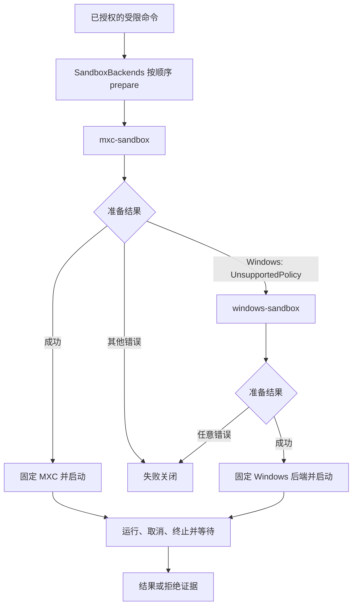

# MXC 主后端与 Windows 回退方案

> 状态：方案已确定，接线已具备，平台验收未完成。  
> Owner：`zeta-rs` 沙箱系统

本文定义 Zeta 如何把 Microsoft MXC 作为跨平台首选沙箱，并在 Windows 的 PSEC 能力不足时使用 Zeta 自己的 Windows 后端。它固定后端选择时机、回退条件、失败关闭语义和验收边界。

## 目标

- Linux 和 macOS 统一通过 `mxc-sandbox` 使用 MXC 的 Bubblewrap 和 Seatbelt 实现。
- Windows 先尝试 MXC 的 ProcessContainer PSEC；只有 PSEC 在执行前确认无法实施完整策略时，才选择 `windows-sandbox`。
- 受限命令始终由一个完整实现执行。回退不能降低文件、网络、隐藏目录或宿主 ACL 的策略强度。
- 后端启动后固定选择结果。启动错误、运行错误和子进程拒绝都不能触发换后端或自动重跑。

## 不在范围内

- 不在 MXC 内启用账户、AppContainer、DACL 或普通进程的弱化路径来替代 PSEC。
- 不把 Linux 或 macOS 的 MXC 能力不足转换成普通进程执行。
- 不把用户授权、审批、重试决定放进后端选择器。
- 不复制 Codex 的账户、服务、管道、GUID、协议或安装身份。
- 不新建只转发现有能力的 crate。

## 责任边界

| Owner | 负责什么 | 不负责什么 |
| --- | --- | --- |
| Core / `action-policy` | 授权、审批和是否允许重新执行 | 选择操作系统沙箱 |
| `tool-executor` | 组装命令、代理、输入输出、超时和取消 | 解释 MXC 内部实现 |
| `sandboxing` | 统一策略、目录范围、候选顺序和失败分类 | 具体系统调用和账户安装 |
| `mxc-sandbox` | 把 Zeta 请求转换成 MXC 请求，适配句柄和错误 | 实现 PSEC、Bubblewrap 或 Seatbelt |
| `windows-sandbox` | Zeta Windows 账户、令牌、ACL、WFP 和进程清理 | 判断用户是否批准动作 |
| App Server 装配 | 注册候选并保持顺序 | 维护平台版本分支或弱化策略 |

两个平台后端都依赖 `zeta-sandboxing` 的统一契约。`sandboxing` 不依赖 MXC；因此 MXC 不能把自己的实现细节传播给 Windows 回退后端。

## 候选顺序

App Server 为受限执行注册以下候选：

| 平台 | 候选顺序 | 结果 |
| --- | --- | --- |
| Linux | `mxc` | MXC 使用 Bubblewrap；不可用时拒绝 |
| macOS | `mxc` | MXC 使用 Seatbelt；不可用时拒绝 |
| Windows，PSEC 可用 | `mxc` | MXC 使用 ProcessContainer PSEC |
| Windows，PSEC 不可用 | `mxc` → `windows` | MXC 在准备阶段声明不支持，随后使用 Zeta Windows 后端 |

`windows` 只在 Windows 构建注册。完全访问且允许网络、没有隔离目录范围的明确请求可以走普通进程，这是权限策略本身选择的执行方式，不属于沙箱回退。

## 执行流程

候选收到同一份已验证的 `SandboxPolicy` 和 `SandboxScope`。选择发生在命令启动之前，且不能改变宿主配置；准备成功后不再重新选择。

## 回退条件

### 允许回退的唯一情况

MXC 的 `request.prepare()` 在 Windows 检查到请求需要 PSEC、但当前系统不能实施完整策略时，返回 `UnsupportedContainment`。`mxc-sandbox` 将它转换成 `SandboxError::UnsupportedPolicy`，`SandboxBackends` 才会继续尝试 `windows-sandbox`。

PSEC 必须按运行时能力检查。Windows 版本号只能作为诊断信息，不能代替能力检查。

### 不允许回退的情况

以下错误直接结束本次命令：

| 阶段 | 示例 | 处理 |
| --- | --- | --- |
| 策略准备 | 路径快照读取失败、请求格式错误、Bubblewrap 缺失 | 返回后端不可用或输入错误 |
| Windows 回退准备 | 账户、令牌、ACL、WFP 或运行文件校验失败 | 直接失败，不再尝试普通进程 |
| 启动 | MXC 或 Windows 后端返回 `StartFailed` | 直接失败，不重选、不重跑 |
| 运行 | 进程被文件或网络限制拒绝 | 返回拒绝证据，标记可能已有副作用 |

子进程输出只能作为诊断，不能证明进程没有启动。`ProcessMayHaveStarted` 和 `BeforeProcessStart` 都不会改变后端选择；前者还必须阻止自动重放。

## MXC 接入要求

`mxc-sandbox` 只做机械转换：

1. 根据 Zeta 策略构造 MXC schema 0.8 请求。
2. 将目录 Grant、隐藏存储、元数据保护、网络代理和宿主 ACL 授权写入同一请求。
3. 在 Windows 受限请求中设置宿主文件范围，使 MXC 在 `prepare` 阶段执行 PSEC 能力门禁。
4. 通过 `mxc_sdk::spawn_sandbox` 启动，保留 MXC 句柄直到进程树终止、输出排空和资源关闭。
5. 只把 `UnsupportedContainment` 映射为 `UnsupportedPolicy`；其他 SDK 错误保持失败语义。

MXC 版本和 Zeta 补丁由 [`vendor/mxc/README.md`](../vendor/mxc/README.md) 维护。适配器不安装账户、不写入持久网络规则，也不自行修改 Windows ACL。

## Windows 后端接入要求

`windows-sandbox` 是独立的 Zeta 后端，只有在 MXC 准备阶段明确声明 PSEC 不支持时才会收到请求。它必须：

- 接收相同的 `SandboxPolicy`、`SandboxScope` 和网络代理作用域；
- 在启动前完成账户、令牌、ACL、WFP、可写目录和运行文件校验；
- 把宿主安装、修复和卸载与单次命令执行分开；
- 将进程树终止、ACL 恢复、代理关闭和输出排空绑定到同一个进程生命周期；
- 对安装状态失效、权限错误和清理错误返回原始失败，不在适配器内静默重试或转弱模式。

这个后端不是 Codex crate 的复制品。Codex 的调用链和身份对象只能作为行为评估材料，Zeta 必须使用自己的安装身份、配置位置和对象清理记录。

## 现有实现状态

| 能力 | 状态 | 代码或证据 |
| --- | --- | --- |
| 统一候选选择，只允许 `UnsupportedPolicy` 继续 | 已实现 | `zeta-rs/sandboxing/src/backends.rs` |
| MXC 优先、Windows 后端次选 | 已接线 | `zeta-rs/app-server/src/local_tools.rs` |
| MXC Windows PSEC 准备门禁 | 已实现 | `vendor/mxc/core/mxc_engine/src/request.rs`、`dispatch.rs` |
| MXC Linux Bubblewrap、macOS Seatbelt 转换 | 已实现 | `zeta-rs/mxc-sandbox` |
| Zeta Windows 账户后端 | 已有实现，待完整验收 | `zeta-rs/windows-sandbox` |
| 受限请求的选择、故障停止和不重跑回归 | 已有单测 | `zeta-rs/sandboxing/src/backends_tests.rs` |
| Linux/macOS 真实隔离与代理验证 | 有平台入口，依赖实机环境 | `zeta-rs/mxc-sandbox/tests` |
| Windows PSEC 成功路径 | 待具备 PSEC 的主机验收 | `zeta-rs/mxc-sandbox/tests/windows.rs` |
| Windows 无 PSEC 时的 MXC → Zeta 回退端到端验证 | 待补 | 需要 Windows 组合测试 |

当前 Windows 23H2 主机不具备完整 PSEC 能力，因此只能验证“MXC 在准备阶段拒绝”，不能把该主机结果当作 PSEC 成功证据。

## 实施与验收顺序

1. 保持 App Server 的候选顺序为 `mxc`、`windows`，禁止平台代码自行选择第二后端。
2. 补 Windows 组合测试：模拟 MXC `UnsupportedPolicy` 时确认只在启动前调用 `windows-sandbox`，并确认命令只启动一次。
3. 补 Windows 失败测试：MXC 准备阶段的其他错误、Windows 准备错误和启动错误都不得触发下一候选或自动重跑。
4. 在具备 PSEC 的 Windows 主机验证完整文件、网络、隐藏目录、ACL、取消、超时和异常退出恢复。
5. 在不具备 PSEC 的 Windows 主机验证回退后端的同一组策略，并确认 MXC 没有修改宿主对象。
6. 保留 Linux、macOS 的 MXC 实机验证，确认没有因为 Windows 回退接线改变代理、目录或普通进程路径。

## 验收标准

- **AC-1**：Linux/macOS 受限请求使用 MXC；MXC 准备失败时命令失败，不进入普通进程。
- **AC-2**：Windows PSEC 可用时只启动 MXC；不调用 Zeta Windows 后端。
- **AC-3**：Windows PSEC 不可用时，MXC 在启动前返回 `UnsupportedPolicy`，随后由 Zeta Windows 后端启动一次。
- **AC-4**：任何准备或启动阶段的非能力不足错误都失败关闭，不换后端、不重跑。
- **AC-5**：受限策略永远不会由 `PreparedCommand::unrestricted` 满足。
- **AC-6**：取消、超时、异常退出均终止并等待进程树，排空输出，恢复本次执行拥有的资源。
- **AC-7**：网络代理只允许当前执行的授权目标；直接连接、未授权入站和跨任务代理复用均被拒绝。

## 为什么不新建 crate

现有边界已经覆盖三个独立职责：`mxc-sandbox` 隔离 MXC 依赖，`windows-sandbox` 隔离 Windows 账户与系统依赖，`sandboxing` 负责统一契约和候选选择。再拆一个“能力探测”或“回退协调” crate 会复制错误分类和平台决定，扩大依赖传播面，也无法增加强制能力。因此本方案只补组合测试、平台验收和必要文档，不增加 crate。

相关长期边界见 [`docs/sandboxing.md`](../../docs/sandboxing.md)，MXC 适配器职责见 [`mxc-sandbox/README.md`](../mxc-sandbox/README.md)，Windows 实机步骤见 [`windows-sandbox-acceptance-runbook.md`](../../docs/windows-sandbox-acceptance-runbook.md)。
