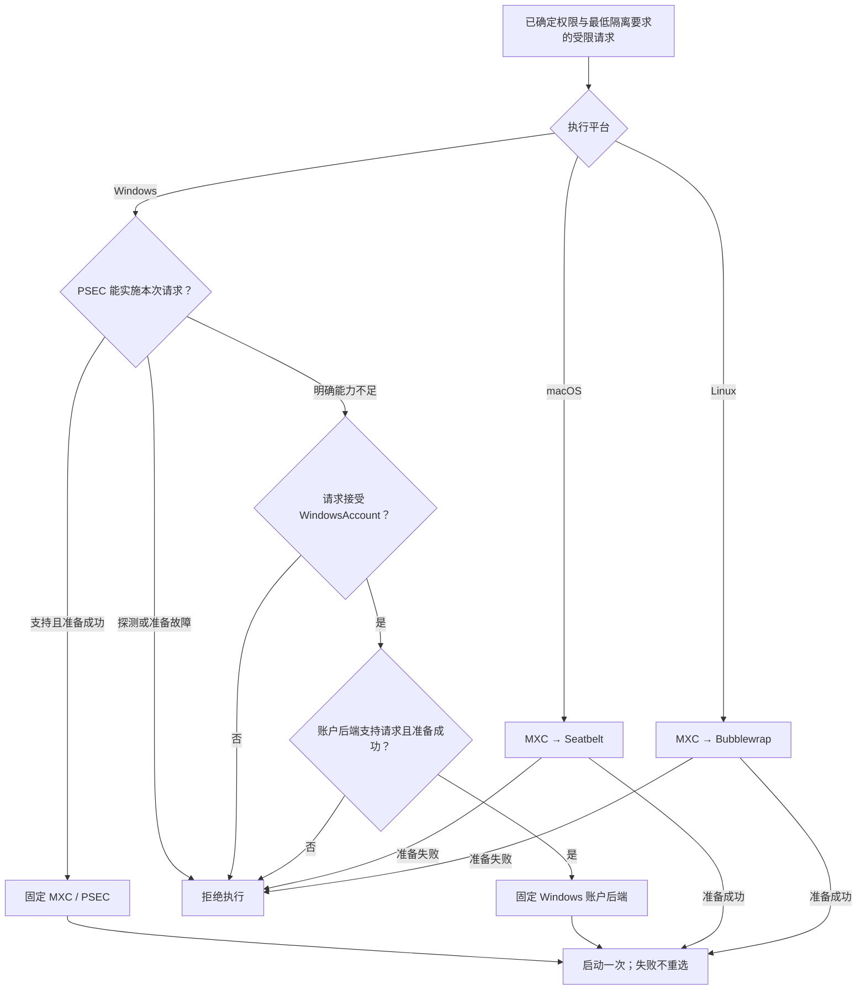

# MXC 与 Windows 账户沙箱：Codex 本地执行对齐方案

Zeta 保留 macOS/Linux 使用 MXC、Windows 按请求能力选择 PSEC 或账户后端的架构，并把 Codex 的路径级权限、交互终端和持续执行会话纳入正式范围。后端必须同时满足权限、输入输出方式及平台能力，任何失败都不能降低要求或自动重跑命令。

> 状态：对齐范围与实现要求已明确；已有普通命令接线，路径策略、代理/UI 接入、PTY、执行会话及完整验收尚未完成。
>
> Owner：`zeta-rs` 沙箱系统。源码核对日期：2026-09-12。

本文维护 Codex 对齐范围、MXC 文档依据、平台选择、接入方式及实施验收。权限类型、宿主 ACL 授权、账户模型及所有权由 [沙箱架构](../../docs/sandboxing.md) 维护；系统操作与历史证据由 [Windows 验收手册](../../docs/windows-sandbox-acceptance-runbook.md) 维护。本文是实现要求，不是功能对齐或安全验收通过声明。

## 设计决定

- `SandboxPolicy` 在后端选择前确定最低隔离模型；每个候选接收相同策略、目录范围和代理要求。
- Linux/macOS 注册 `mxc`；Windows 按 `mxc`、`windows` 顺序注册候选。注册不意味着候选支持所有请求，也不构成发布资格。
- Windows 的 MXC 路径只接受 PSEC；Zeta 的账户实现由 `windows-sandbox` 承担。MXC 内部的 AppContainer/DACL 等其他实现不加入本方案的选择链。
- Windows 本地工具继续采用已明确的 `WindowsAccount` 产品模型；`Strict` 请求只能由满足严格宿主写隔离要求的实现执行。
- 能力不足只能在执行前考虑其他合格候选；准备故障、启动错误及运行错误直接返回，命令不自动重跑。
- 保持现有 crate 边界，不增加版本分流器或只负责转发的 crate。
- 对齐以用户可观察的执行能力和每个平台实际限制为准，不复制 Codex 的协议、安装身份或自动重试；不会用 Windows PSEC 名称代替兼容性证据。

## Codex 能力对齐范围

参考基线为本地 Codex `da20788df913189878ebca7f4963d8a363ee6bf2`，范围限于本地沙箱与命令执行，不包含模型、云端容器或整个 Codex 产品。固定测试基线后比较相同平台、相同权限及相同命令；参考产品拒绝的组合不被误写成普遍可用能力。

| 能力 | Zeta 当前状态 | 本方案的完成要求 |
| --- | --- | --- |
| 普通命令、参数、工作目录、退出码、管道 | 已有实现 | PowerShell/Bash、Git、Python、Node、Cargo 的实际工具链验证 |
| 路径级读/写/拒绝与权限例外 | 主要是目录 Grant、隐藏目录和固定元数据保护 | 单文件规则、目录内只读/拒绝例外、可读基线与拒绝模式 |
| 文件工具与 shell 的权限一致 | 各自有授权入口 | 同一授权结果覆盖读取、搜索、补丁和子进程 |
| 断网、允许网络、受管代理 | 有实现及部分平台证据 | 准确区分出口、入站、宿主回环和代理客户端行为 |
| 本地工具 IPC | macOS 受限网络请求目前全禁 Unix socket | 执行私有 IPC 可用，敏感/跨任务 socket 仍不可访问 |
| 持续运行并返回进程会话标识 | 当前执行器等待命令结束 | 有界等待返回，后续读取/输入/关闭/中断/终止 |
| PTY、REPL、终端尺寸调整 | `utils/pty` 已有底层能力，沙箱链未接齐 | PTY 和管道使用同一权限、进程树和代理生命周期 |
| 取消、超时、输出与异常恢复 | 已有部分实现/证据 | 等待预算与硬超时分开，保留尾部输出及清理错误 |
| 安装、诊断与兼容支持 | 有 Windows 独立安装与历史排错记录 | 验证工具环境、代理身份、UI 设置及发布包，错误可定位 |

Codex 源码依据：[文件权限模型](https://github.com/openai/codex/blob/da20788df913189878ebca7f4963d8a363ee6bf2/codex-rs/protocol/src/permissions.rs)、[Windows 执行会话](https://github.com/openai/codex/blob/da20788df913189878ebca7f4963d8a363ee6bf2/codex-rs/windows-sandbox-rs/src/unified_exec/mod.rs)。账户模型不能满足 Strict 的边界单独记录，不把额外的 Strict 要求当作 Codex 账户方案已经提供的保证。

## MXC 文档复核与接入纠正

核对两个版本：产品固定的 `6cd3d58f05d3447e67109cfb75e042803b843ca4`，以及本地 `../mxc` 的 `567570084f1ebaca539b0a3186aeb68bca77788a`。后者提供补充解释和升级差异，未被写入产品依赖。以下将文档契约、代码证据和待验证推断分开；相似错误不自动归为相同根因。

| 来源与约束 | 对 Zeta 的影响与决定 |
| --- | --- |
| [Rust SDK](https://github.com/microsoft/mxc/blob/6cd3d58f05d3447e67109cfb75e042803b843ca4/src/core/mxc-sdk/README.md)：流式管道可持续交互，普通 `spawn_sandbox` 不分配 PTY | 管道会话复用已有句柄；PTY 需要补 SDK/后端能力，不能给现有函数加一个不存在的选项 |
| [生命周期及实施矩阵](https://github.com/microsoft/mxc/blob/567570084f1ebaca539b0a3186aeb68bca77788a/docs/state-aware-lifecycle/mxc-state-aware-sandbox-api.md)：后端与阶段的支持不同 | 不把 ProcessContainer/Seatbelt/Bubblewrap 当成可 provision/attach 的容器；不为 PTY 改用不支持所需文件/网络策略的 IsolationSession |
| [Windows 网络](https://github.com/microsoft/mxc/blob/6cd3d58f05d3447e67109cfb75e042803b843ca4/docs/process-container/networking.md)：代理需要身份、私有网络能力和准确的入站配置 | 当前回环 IP 允许规则不能证明 PSEC 代理可用；按下文重新设计能力检查和代理部署 |
| [Windows 兼容性](https://github.com/microsoft/mxc/blob/567570084f1ebaca539b0a3186aeb68bca77788a/docs/playground-limitations.md)：PowerShell 需要桌面资源；工具路径 ACL、DNS、Git 所有者也会导致失败 | 明确 UI 和工具环境，分层诊断。文档解释潜在失败机制，不能据此宣布历史所有失败均已定位 |
| [宿主准备](https://github.com/microsoft/mxc/blob/6cd3d58f05d3447e67109cfb75e042803b843ca4/docs/host-prep.md)：AppContainer/DACL 需要系统盘属性权限，NUL 权限还可能每次启动重置 | 这些要求专属于对应后端；不能照搬到 Zeta 账户模型，更不能在普通执行里修改宿主来试错 |
| [Seatbelt](https://github.com/microsoft/mxc/blob/567570084f1ebaca539b0a3186aeb68bca77788a/docs/seatbelt/seatbelt-backend.md)：Unix socket 随文件路径授权，工具链依赖其 IPC | 当前全禁 socket 的补丁会阻止合法工具通信，改为执行私有 IPC 与敏感 socket 拒绝 |
| [Bubblewrap](https://github.com/microsoft/mxc/blob/567570084f1ebaca539b0a3186aeb68bca77788a/docs/bwrap-support/bubblewrap-backend.md)：最小读取基线、网络依赖和路由均有限制 | PATH 不代替文件 Grant；验证 nft/conntrack；IPv6 被阻断不能证明 IPv6 允许可用 |
| [策略 0.8](https://github.com/microsoft/mxc/blob/6cd3d58f05d3447e67109cfb75e042803b843ca4/docs/sandbox-policy/0.8.0/policy.md)：JSON 形状不等于所有 SDK 都已覆盖 | 核对 Rust 类型、生成 Config、解析后的有效策略与后端，不混用顶层 `ui` 和 `processContainer.ui` |
| [能力探测设计](https://github.com/microsoft/mxc/blob/6cd3d58f05d3447e67109cfb75e042803b843ca4/docs/backend-support-probe-api-plan.md)：可用列表不解释全部失败，tier 只是上限 | 诊断列表不直接决定安全选择；需要本次请求的结构化准备结果。设计提案不作为实现完成证据 |
| [诊断与捕获](https://github.com/microsoft/mxc/blob/567570084f1ebaca539b0a3186aeb68bca77788a/docs/diagnostics.md)：block 捕获保留限制，audit/allow 会允许被拒绝操作 | 使用保留拒绝的诊断证明失败原因；宽松审计结果不能计为隔离通过 |

文档存在版本和入口差异。例如 Playground 仍有旧字段 `appContainer.ui`，新 schema 使用 `processContainer.ui`；Bubblewrap 页面开头的 experimental 说明也不能覆盖固定版本的实际 SDK/解析器行为。固定版本的 schema、所用入口源码和真实执行共同决定接入，不能只复制某一页示例。

## 最低隔离要求

`Strict` 与 `WindowsAccount` 的定义见 [权限契约](../../docs/sandboxing.md#权限契约)。后端选择遵守下表：

| 请求 | MXC/PSEC | Windows 账户后端 |
| --- | --- | --- |
| `Strict` 加受限文件权限 | 必须实施授权目录外不可写 | 启动前拒绝 |
| `WindowsAccount` 加受限文件权限 | 完整支持请求时优先选用 | 完整支持请求时可选 |
| `FullAccess` 加 `Denied` 或 `Managed` | 需要支持相应网络策略 | 当前不支持，拒绝 |
| `HostAclChanges::Denied` | 只能采用无需宿主 ACL 改动的实现 | 当前不支持，拒绝 |
| 隐藏目录、只读目录、元数据保护 | 必须逐项实施 | 必须逐项实施，扫描不代替这些限制 |
| `Managed` 网络 | 只开放本次执行代理所需端点 | 只开放本次执行代理所需端点 |

“可选”还要求完成对应发布验收、运行时可用且准备成功；上表不宣布 PSEC 成功路径已验证。账户模型的有预算扫描不承诺整个宿主只读，不用于满足 `Strict`。接受账户模型也不允许放宽隐藏目录、明确的只读目录或网络限制。

产品默认值由 `app-server/src/local_tools.rs::local_isolation()` 在构造授权请求前确定：Windows 为 `WindowsAccount`，Linux/macOS 为 `Strict`；通用 `SandboxPolicy::new()` 仍默认 `Strict`。后端选择不修改默认值，不增加一轮选择后端的用户询问。调用方明确要求 `Strict` 时必须保留它。

明确授权的 `FullAccess + Allowed`、单目录且无隐藏范围请求可以使用普通进程。它是独立的权限路径，不能用于处理任何受限请求失败。

## 平台选择

正式发行版只注册该版本已取得对应发布资格的候选，再执行图中的运行时选择。当前固定注册顺序只证明已接线，发布前必须核对实际注册名单与支持清单一致。Windows 账户后端自行检查隔离模型和全部请求限制；图中的模型判断不要求再新增一个平台选择层。

### Windows 系统版本与能力

Zeta 和本次核对的 Codex 都固定 MXC `6cd3d58f05d3447e67109cfb75e042803b843ca4`。该版本的 [官方支持表](https://github.com/microsoft/mxc/blob/6cd3d58f05d3447e67109cfb75e042803b843ca4/docs/process-container/os-version-support.md) 区分 ProcessContainer 产品支持与 PSEC 能力：

| 系统范围 | 固定 MXC 版本描述 | Zeta 选择依据 |
| --- | --- | --- |
| Windows 11 23H2 | 低于 MXC ProcessContainer 官方支持下限 | 账户模型已有本机证据，不扩大为全版本支持 |
| Windows 11 24H2 / 25H2 | ProcessContainer 支持不代表 PSEC 可用，主要依赖 AppContainer/DACL | 不根据版本号宣称可以使用 PSEC |
| 更高 build 且启用相关系统能力 | 可能具备 PSEC，具体策略仍有能力要求 | 实际探测及本次请求检查 |
| Windows 10、Server、其他架构或 WSL | 本方案未取得对应验收证据 | 不据现有结果作支持承诺 |

版本表用于解释支持范围，不写成 `build >= 某值` 的后端开关。系统更新后也必须按实际能力检查；一个 build 的通过结果不自动覆盖其他 build。

### Linux 与 macOS

- Linux 受管网络需要用户命名空间、足够版本的 Bubblewrap、`slirp4netns`、`unshare`、`nsenter`、iptables/ip6tables 及 restore 工具、已加载的 `nf_conntrack`。普通无代理断网不需要全部网络工具，按请求探测实际依赖。
- Bubblewrap 文档要求至少 0.5.0，并解释 iptables legacy 可能因 `/run/xtables.lock` 权限失败；验收使用可工作的 nft 后端或明确验证的宿主配置，不能通过取消过滤取得成功。产品当前仅携带 Bubblewrap，部署须处理其余依赖。
- 当前 slirp 模式没有 IPv6 路由。IPv6 阻断可以成立，IPv6 直连允许却不能实现；经宿主代理访问 IPv6 目标是另一条路径，需要分别记录。
- macOS 的 Seatbelt 共用宿主网络栈，不能实现任意远端 IP/CIDR 过滤或按来源精确限制入站。`localhost:<port>` 还覆盖本机其他网卡上的同端口；不能承诺只匹配 `127.0.0.1`。代理须独占并保持端口，验证同端口其他地址不可被用来绕过授权。
- Seatbelt 的 `ingress.default` 与 `hostLoopback` 要求一致；禁止宿主回环也会禁止本任务自己的 TCP 回环。Linux 私有命名空间内的 loopback 则可以保留。这项差别纳入开发服务器/测试工具验收，不靠修改相同字段名来假装跨平台等价。
- 管道、PTY、持续会话及合法工具 IPC 均为本方案正式范围，必须完成各自路径的验证。

平台依赖和适配器使用方式见 [MXC 适配器](../mxc-sandbox/README.md)。

## Windows 代理接入

MXC 的正式代理模式是 `runtimeConfig.networkProxy` 加 Windows `allowedProxyPeer`，由调用方先启动代理。仅设置环境变量或 IP 白名单没有代理身份绑定，也不会取得所需的系统回环能力。

当前 [Zeta MXC 补丁](../vendor/mxc/core/mxc_engine/src/policy/network.rs) 的 `managed_proxy()` 在 Windows 生成 `127.0.0.1/32` 的 TCP 允许规则，省略 `runtimeConfig.networkProxy`，并保持 `ingress.default` 与 `hostLoopback` 为 deny。这是直连规则形状，不能按官方 Model 2 的证据解释。[现有测试](../mxc-sandbox/src/sandbox_tests.rs) 还专门断言“runtime proxy 加 deny ingress”被拒绝。没有 PSEC 实机结果时，不能把替换配置形状当成问题已解决。

最终接入要求：

1. 代理仍由 `network-proxy` 实施真实目标授权；Windows 安装/打包提供其 OS 可验证身份。无包身份的发行方式使用安装拥有的独立 AppContainer profile；有包身份的代理使用自己的 Package Family Name。安装清单固定身份、可执行文件与防火墙对象，不能借用 Codex 身份。
2. `tool-executor` 获取已经监听的端点和平台验证后的代理身份，再交给 `mxc-sandbox` 构造 `ProcessContainer.network.allowedProxyPeer` 及 `runtimeConfig.networkProxy`。平台身份不成为模型可填写的授权参数。
3. 官方 Model 2 要求 `ingress.default: allow` 来启用双向的 `privateNetworkClientServer`；即使设置了 peer 且 `hostLoopback: deny`，也不能据此声称一般私网入站被禁止。只有请求明确允许这种入站范围，或另有已验证的机制完整实施原请求时，PSEC 才能接受请求。
4. 当前产品的 Managed 默认要求禁止未授权入站。在现有能力无法表达它时，PSEC 必须在准备阶段返回策略不支持；接受 WindowsAccount 的请求再检查账户后端，Strict 则拒绝。不得在适配器中把 ingress 改成 allow 来使验证通过。
5. 不采用无身份代理所要求的宽泛 `hostLoopback: allow` 部署来满足严格请求。新 MXC 文档还为该设置增加了 PSEC 1.1 能力要求，固定版本不能借用新文档的支持结论。
6. 代理端点、OS peer 身份和每次执行归属都需要验证；包/profile 身份可以属于整个代理安装，不能单独证明请求属于哪个任务。HTTP/CONNECT/SOCKS 路由继续绑定实际客户端执行身份，无匹配身份或路由时拒绝。

这一决定保留长期的平台能力差异：PSEC 可用不等于它能执行本次 Managed 请求，拥有包身份也不消除入站能力耦合。补齐代理身份是必要条件，不能单独作为 PSEC Managed 发布条件。

MXC 只保证允许的代理路径；HTTP/S 客户端还需要正确使用 WinHTTP、显式代理配置或代理环境变量。HTTP/CONNECT 的 DNS 由代理解析；SOCKS 需要验证客户端是否发送域名（例如 socks5h）。不支持代理的原始 socket 客户端应被拒绝，不能将 DNS 失败误判为应开放全部直连。SSH、Git-over-SSH 等另需获准的代理客户端配置，不承诺透明代理任意协议。

## 工具兼容策略

### Windows UI 与启动失败

Zeta 当前 [MXC 请求](../mxc-sandbox/src/policy.rs) 使用 `ui: None`。在固定版本的 Windows 解析与默认策略中，这不表示兼容的桌面配置；`UiPolicy::default()` 仍关闭 Win32k。上游文档还说明，单纯启用 UI 但保留全部桌面句柄/原子限制也可能令 PowerShell 返回 `0xC0000142`。

- 明确构造顶层 UI 意图和 `ProcessContainer.ui`。PowerShell/ConPTY 工作负载的兼容配置需要允许必需的 Win32k/桌面资源；剪贴板、输入注入、桌面切换及系统设置限制分别保持。
- `isolation: desktop` 只改变相关句柄/原子限制，本身不创建独立桌面。必须核查实际进程所在桌面和隔离范围；不能把该字符串当作安全隔离措施。
- 默认 UI 的问题是 PSEC 成功路径的兼容性风险，尚未经本机成功 PSEC 执行证实。历史账户原型已定位的 `NtCreatePrivateNamespace`/Everyone 边界检查是另一问题；更改 PSEC UI 不能被宣称会修复那个错误。
- 只允许由产品明确选定、与授权一致的兼容配置；不在某个命令失败后逐项放开 UI 或修改系统设备 ACL。

### 文件、环境与本地 IPC

文件与 IPC 目标契约见 [权限契约](../../docs/sandboxing.md#权限契约)。MXC 已有路径级读/写/拒绝能力；当前 Zeta 的目录契约、宿主读取基线和全禁 socket 补丁才是部分表达能力与兼容性的限制，不能全部归因于 MXC 不支持。

- 通过现有 Zeta 授权解析得到完整权限集，再转换到 MXC。补充单文件拒绝、工作区内只读子树、最小可读基线和拒绝模式；检查每个平台的交叠、缺失文件和别名语义。
- Seatbelt 的明确拒绝通常最后生效；路径经符号链接解析后还需重新判定优先级。Bubblewrap 文件拒绝通过空内容遮蔽，目录通过独立挂载遮蔽；测试应验证敏感内容不可读取，不强求所有平台都返回相同 errno。
- 为每次执行分配并授权私有临时目录，提供正确的 TMP/TEMP/TMPDIR。只在该目录和明确授权的 IPC 路径允许 Unix socket；阻止 Docker、SSH/GPG agent 和其他任务控制端点。Node 的 tsx、esbuild、测试 worker 需要的 IPC 必须有正向用例。
- 不把 `Denied/Managed` 自动等同于全禁 Unix socket。旧 `deny_seatbelt_unix_sockets()` 及仅验证“全部失败”的测试需要按新 IPC 契约修订，保护目标保持为防止未授权通信。
- PATH、HOME、工具只读目录、运行库、证书和可写缓存分别配置；MXC 清空继承环境，设置 PATH 不使不可见的工具目录变为可访问。最小读取模式不得继续无条件调用 `set_host_filesystem(ReadOnly)`。
- 上游策略发现 helpers 可以收集候选工具/临时目录，但它们不是授权来源。对发现的路径做权限交集；不因为辅助函数列出了用户目录，就把凭据一并授给命令。
- Windows 验证用户安装和系统安装的 Python/Node/PowerShell。AppContainer 的包 SID 权限要求只适用于对应模型；账户模型按自身令牌检查。Git 的 dubious ownership 先核对目录所有者，不采用全局 `safe.directory=*` 绕开。

## 执行会话与 PTY

执行会话表示一个仍在运行的命令及其资源，不是 Agent Session，也不是 MXC 的命名容器。会话归 `tool-executor`，底层 IPC 和 PTY 复用 [utils/pty](../utils/pty/README.md)；`zeta-exec` 是无界面 Agent runner，不承担 shell 进程所有权。

### 管道与会话管理

MXC `spawn_sandbox` 已提供持续双向标准流和终止句柄，足够承接无 PTY 的长命令。主要工作在 Zeta 执行器：

- 开始执行只创建一次进程；短等待后返回已完成结果或稳定、不透明的进程会话标识及输出游标。
- 后续读输出、写输入、关闭输入、中断和终止都操作同一执行记录，校验调用方/Thread/Environment 归属及授权快照。对交互 shell 的授权覆盖会话内输入；不能只批准初始 shell 路径而忽略其后续任意执行能力。
- 等待时间到期只结束本次等待；执行硬超时、显式取消、所属任务销毁和已配置的会话回收条件才终止进程。权限撤销需要终止或拒绝继续操作，不能原地扩大已有进程权限。
- 冻结工作目录、环境、文件规则、网络代理和后端到会话终态。代理和 ACL 生命周期不能随某次工具返回提前结束。
- 输出按通道维护有界缓存、游标和明确的截断/缺口。`utils/pty` 的 broadcast 丢失不能被静默当作完整输出；退出后仍排空尾部数据，阻塞输入写入不能阻碍取消。
- 根命令退出时按本方案回收后代。开发服务器应作为受管理会话的前台命令持续运行，不能靠脱离父进程存活规避资源所有权。宿主重启后不伪造会话恢复或自动重跑。

### PTY 的真实接入点

固定与新核对版本的公开 Rust `spawn_sandbox` 都只有普通管道。`exec_attached` 的终端路径只对 IsolationSession 有验证，要求调用进程自身具有终端；IsolationSession 又拒绝文件策略并要求不受限网络。它不能用于满足本方案的受限交互终端。

- 在同一个 MXC Rust SDK/engine/后端创建链补充显式 PTY 或已准备的标准句柄接入，并把 resize、终止和退出资源暴露给适配器。上游已有 `StdioMode::Inherit` 可作为实现参考，但当前公开 SDK 没有等价调用入口，不能把参考写成现成功能。
- MXC 内部复用自己的平台终端能力，不能依赖 `zeta-*`。Zeta 侧由 `utils/pty::ProcessDriver` 适配已经受限的进程和终端；`mxc-sandbox` 保持机械转换，不另起未受限命令。
- Windows 账户后端在同一受限令牌、Job 和桌面创建流程接入 ConPTY；Linux/macOS 校验 controlling terminal、前台进程组、信号以及后代仍在隔离范围内。
- 用户请求 PTY 时，后端准备必须检查该能力；没有 PTY 不能静默改为管道。PTY 合并 stdout/stderr，管道仍分离；resize 只用于终端，中断与强制终止分别实施并验证。
- Seatbelt 的 `nestedPty` 只是允许子进程自己创建终端，不会为外层 SDK 调用分配 PTY。开启它不能替代上述创建和句柄生命周期工作。

无需为这些命令引入 provision/start/exec/stop/deprovision 五阶段容器。MXC 有状态 API 的范围与用户命令保持运行的需求不同，使用现有进程树模型即可承载后者。

## 能力检查与错误分类

### 要求

PSEC 检查分为宿主能力和本次请求两部分，由现有 MXC 平台实现执行，`mxc-sandbox` 只转换结果：

1. 加载所需 API，实际创建并关闭最小 PSEC 环境，并检查启动所需属性。导出符号存在不能证明系统功能已启用。
2. 按本次请求检查路径规则、隐藏例外、schema 0.8 网络方向与代理身份、UI、IPC 和管道/PTY 能力。`deniedPaths` 需要对应的文件拒绝能力；各维度必须同时支持。
3. 只有请求使用拒绝捕获时，才要求相应 Learning Mode 能力；普通执行不额外要求未使用的可选功能。
4. 检查成功后保留准备结果；启动前复核文件对象身份和所选能力。能力变化导致本次执行失败，不重新选择后端。

准备阶段允许创建并释放临时探测对象，不启动用户命令，不配置账户，不修改持久 ACL/WFP 规则。临时对象清理失败也是故障，不能当作能力不支持。

| 探测或准备结果 | 对外分类 | 是否可考虑下一候选 |
| --- | --- | --- |
| 已确认缺少 API、系统功能未启用或请求能力不存在 | `UnsupportedContainment` → `UnsupportedPolicy` | 可以，但必须满足同一最低隔离要求 |
| 非法请求、路径对象改变、输入格式错误 | 输入或准备错误 | 不可以 |
| API 加载异常、访问被拒绝、资源不足、支持查询失败 | 运行故障，保留操作及系统错误码 | 不可以 |
| 文件读取、helper 校验、安装状态或 ACL/WFP 校验失败 | 后端不可用或准备错误 | 不可以 |
| 已选后端启动失败 | `StartFailed` | 不可以 |
| 用户进程退出或限制拒绝 | 执行结果及拒绝证据 | 不可以 |

只有已识别的系统返回值能证明能力缺失。未知错误一律作为故障返回；不靠错误字符串匹配、不在本次准备中隐式重试，也不把所有 `false` 当作不支持。

### 当前缺口与修复位置

[当前 PSEC 探测](../vendor/mxc/backends/appcontainer/common/src/base_container_runner.rs) 将 API 加载、环境创建和启动属性准备的错误用 `.is_ok()` 压为布尔值，并由 `OnceLock<bool>` 缓存；隐藏路径能力查询也有将错误变成 `false` 的路径。[准备门禁](../vendor/mxc/core/mxc_engine/src/dispatch.rs) 再把 `false` 统一转换成 `UnsupportedContainment`。因此，现有上层选择器虽然只接受 `UnsupportedPolicy` 继续，仍不能保证只有确定的能力不足才会选择账户后端。

必须在现有 MXC 补丁内补充能区分“支持、不支持、故障”的结果，并贯穿 `request.prepare()` 到适配器。保留失败操作和系统错误码，禁止用 `to_string()` 作为唯一分类依据。不将瞬时故障缓存成永久不支持；本次请求的能力判断和启动复核不能由全局可用性布尔值代替。公开布尔探测若有其他消费者可以保留，但不能继续作为 Zeta 安全选择的唯一输入。

这项修复尚未实施，是组合方案发布前的必要工作。单纯调整 `mxc-sandbox` 最外层错误映射无法恢复已经丢失的错误信息。

### 诊断顺序

1. 保存受审查的完整请求、实际入口、固定 SDK/补丁版本、系统能力结果及生成的有效配置；记录解析失败、准备失败、进程创建失败或命令运行失败的阶段。
2. 先用同版本 schema/解析器验证字段，再对照后端能力表。JSON 能表达、Rust SDK 能构造、OS 能实施是三项不同检查。
3. 需要系统拒绝证据时使用保留拒绝的 `captureDenials.mode: block`，并检查相应捕获能力。完成终态 wait 后读取工具实际返回的产物路径；实时控制台观察不等于已经保存了完整捕获文件。
4. `--audit` 或 capture 的 allow 模式只用于独立的策略研究，不能用其成功结果证明沙箱兼容。权限不足、代理路由错误、Git 所有者校验及 UI/CLR 初始化错误分别归类，不再凭 stderr 中的 permission denied 自动归因。
5. 确认诊断入口本身的副作用。固定版本的能力探测设计指出 `wxc-exec --probe` 可能位于恢复遗留 DACL 的流程之后；不能把该 CLI 名称等同于无宿主修改的库探测。普通候选准备继续使用已核查的只读/临时对象入口。

## crate 与依赖边界

| Owner | 职责 |
| --- | --- |
| Core / `action-policy` | 授权、审批、是否允许另一次执行 |
| `sandboxing` | 统一策略、路径规则、最低隔离要求、候选选择及进程输入输出契约 |
| `tool-executor` | 命令/持续会话、输出游标、预算、取消、硬超时和执行专属代理 |
| `utils/pty` | 终端/管道、resize、信号和已有进程驱动，不拥有权限 |
| `network-proxy` | HTTP/CONNECT/SOCKS 目标授权、执行归属与平台代理部署适配 |
| `mxc-sandbox` | 把 Zeta 请求转换到公开 MXC SDK，转换错误和句柄 |
| MXC 固定版本与补丁 | 平台能力检查、PSEC/Bubblewrap/Seatbelt 策略和系统资源管理 |
| `windows-sandbox` | Zeta 账户、令牌、ACL、WFP、Windows 安装对象及账户进程树回收 |
| App Server | 构造产品策略，注册候选，向执行器提供授权结果 |

- `sandboxing` 不依赖 MXC 或 Codex。公开契约不暴露供应商的请求类型。
- `windows-sandbox` 当前直接使用 `wxc_common` 的策略类型、ACL 授权及恢复日志。这是两个后端的共享实现依赖，不是完全独立的故障隔离。
- 共享 MXC 类型限于后端内部。修正或升级 `wxc_common` 时同时检查两个消费者的 ACL 生命周期与恢复测试。
- 保留固定 revision、Cargo/Bazel 同源补丁、来源校验和许可证；MXC 修复尽可能提交上游，升级仍需重新审查差异。
- `file-access` 保留文件对象与授权校验，`terminal` 保留终端语义；命令会话不放进终端绘制或无界面 Agent runner。前端通过 App Server 访问执行记录，不持有后端系统句柄。
- crate 主要用于能力和依赖隔离。现有边界承载策略、会话、PTY 和平台修复，不另拆“能力探测”或“选择协调”crate。

补丁范围与校验入口由 [MXC 依赖说明](../vendor/mxc/README.md) 维护。

## 安装与单次执行

账户模型的权限范围、扫描限制和 Codex 参考差异见 [Windows 候选评估](../../docs/sandboxing.md#windows-候选评估)。执行生命周期必须符合下列要求：

1. 安装、修复和卸载独立于命令执行，使用 Zeta 的安装身份、helper 路径及摘要和对象清单；普通执行不触发提升权限或自动安装。
2. 候选准备只验证支持范围及安装状态；选择成功后才获取本次执行的独占资源。账户或规则失效时返回错误。
3. 在恢复受限用户进程执行前，完成本次账户、限制令牌、文件身份、ACL、Job 和网络路由的检查与配置；所有变更记入该执行拥有的日志。
4. 代理授权绑定执行身份，不能仅凭可访问的端口把连接交给其他任务。目标判断由 `network-proxy` 和上层授权负责。
5. 取消、超时和正常退出均终止并等待后代，排空标准输出，再按所有权释放代理、句柄和本次 ACL 记录；清理错误需要报告。
6. 宿主或 helper 异常退出后，未完成的资源恢复阻止相关账户复用。显式恢复仅处理本安装记录的对象；失败不能用重新安装掩盖。

`ProcessMayHaveStarted` 必须保守处理。子进程输出、退出码和 `BeforeProcessStart` 均不触发后端重选；即使业务命令成功，清理失败仍作为执行故障报告，不得自动重放已有副作用的命令。

## 现有实现与证据

以下状态来自源码核对及仓库已有记录，本次文档修订没有重新运行产品测试。

| 能力 | 状态 | 定位 |
| --- | --- | --- |
| 候选顺序与统一选择器 | 已接线；选择器只接受 `UnsupportedPolicy` 继续 | [选择器](../sandboxing/src/backends.rs)、[App Server](../app-server/src/local_tools.rs) |
| 正式版本候选与支持清单一致 | 待发布验收后核定，当前固定注册不代表取得资格 | App Server 装配与发行验证 |
| Windows 最低模型与 Strict 拒绝 | 已实现，账户后端不改写请求 | [策略类型](../sandboxing/src/model.rs)、[账户准备](../windows-sandbox/src/windows.rs) |
| PSEC 准备门禁 | 部分具备；探测会丢失故障类别 | [MXC 请求](../vendor/mxc/core/mxc_engine/src/request.rs)、[平台探测](../vendor/mxc/backends/appcontainer/common/src/base_container_runner.rs) |
| PSEC Managed 接入 | 未取得成功证据；回环直连补丁不等于官方代理模式 | [网络构造](../vendor/mxc/core/mxc_engine/src/policy/network.rs)、[拒绝组合测试](../mxc-sandbox/src/sandbox_tests.rs) |
| Windows 工具 UI 兼容 | 当前请求未指定兼容策略；需按 PSEC 路径验证 | [请求转换](../mxc-sandbox/src/policy.rs)、[UI 默认值](../vendor/mxc/core/wxc_common/src/models.rs) |
| 路径级规则与最小读取基线 | 目标已定义，现有目录模型需扩展 | [目录范围](../sandboxing/src/scope.rs) |
| 受控 Unix socket | 当前有全禁补丁，目标需支持私有 IPC | [请求转换](../mxc-sandbox/src/policy.rs) |
| PTY 与命令会话 | 有底层 PTY/driver；统一沙箱链和会话层尚未完成 | [进程接口](../sandboxing/src/process.rs)、[执行器](../tool-executor/src/lib.rs)、[PTY](../utils/pty/README.md) |
| 选择器故障停止、启动不重跑 | 已有替身测试；不证明 SDK 错误转换正确 | [选择器测试](../sandboxing/src/backends_tests.rs) |
| 账户模型实机执行 | 23H2 本机记录 21 项单测、9 项完整执行用例通过 | [验收记录](../../docs/windows-sandbox-acceptance-runbook.md#2026-09-11-windowsaccount-模型验收) |
| PSEC 完整成功路径 | 未取得实机通过证据；对应测试标为忽略 | [Windows PSEC 测试](../mxc-sandbox/tests/windows.rs) |
| MXC 与账户后端组合 | 真实组合及故障注入验证待补 | 复用 `sandboxing`、`mxc-sandbox` 和 App Server 测试入口 |
| Linux/macOS 隔离 | 有真实进程测试入口，需目标平台运行证据 | [Linux 测试](../mxc-sandbox/tests/linux.rs)、[macOS 测试](../mxc-sandbox/src/sandbox_tests.rs) |
| 异常恢复 | 已有部分账户日志恢复证据，完整崩溃组合未覆盖 | [验收手册](../../docs/windows-sandbox-acceptance-runbook.md) |

Codex 核对基线为 `da20788df913189878ebca7f4963d8a363ee6bf2`。该提交已有 MXC PSEC 代码，但默认 Windows 选择仍为限制令牌后端，MXC 在选择入口用于可用性记录；不能据此宣称这套组合已在 Codex 默认执行链验收。具体源码与采用边界见 [Windows 候选评估](../../docs/sandboxing.md#windows-候选评估)。

## 实施顺序

| 顺序 | 工作与 owner | 完成依据 |
| --- | --- | --- |
| 1 | `sandboxing` 与调用方补全路径、读取基线、入站/回环、IPC 和输入输出要求 | 对齐场景能准确表达；保持两个最低模型且不丢规则 |
| 2 | MXC 补丁与适配器修复探测、Windows 代理/UI 及 Unix IPC 接入 | 有效配置符合所用 SDK/OS 契约；故障与不支持严格区分 |
| 3 | MXC SDK/平台后端、账户后端接入 PTY，复用 `utils/pty` driver | 同一沙箱路径支持管道/PTY；isatty、resize、中断与回收通过 |
| 4 | `tool-executor` 接入持续会话，App Server/工具层接入后续操作 | 会话归属、等待/硬超时、输出游标与一次创建语义通过 |
| 5 | 各平台后端与真实组合链运行 Codex 对照矩阵 | 下方适用验收项全部运行；记录不支持、失败和跳过，不能删项宣称对齐 |
| 6 | App Server 发布候选、打包、安装及共享 MXC 补丁复核 | 代理身份/工具依赖明确；注册名单与支持清单一致；版本和恢复可验证 |
| 7 | 按发布条件审查每个平台、隔离模型和输入输出方式 | 只登记已有完整证据的支持组合 |

文档修订固定以上实现要求，尚未实现新增功能。具体 API/协议由各 owner 在实现时同步生成和测试；不在本文创建第二份传输协议。达到 Codex 能力范围需要完成所有适用功能及验收，不能只修复探测或跑通一个 shell。

## 验收矩阵

| 编号 | 场景 | 必须观察到的结果 |
| --- | --- | --- |
| AC-1 | Windows PSEC 支持本次请求，分别使用 Strict/WindowsAccount | 只启动 PSEC；账户后端无安装或执行副作用 |
| AC-2 | 明确无 PSEC，WindowsAccount，账户已安装且支持请求 | 经真实候选链只启动账户后端一次，原始策略不变 |
| AC-3 | 明确无 PSEC，Strict | 拒绝；账户后端不创建进程、不配置 ACL/WFP、不安装 |
| AC-4 | PSEC 有基础能力但缺本次隐藏路径或网络能力 | WindowsAccount 可继续检查账户候选；Strict 拒绝；任何候选不得删掉限制 |
| AC-5 | API 加载、创建环境、支持查询、启动属性或清理故障 | 原因和系统错误保留；命令零启动，不考虑其他候选 |
| AC-6 | 选定后端后能力变化、启动失败或用户命令报权限错误 | 不重选、不自动重放；可能已经执行的结果保留该事实 |
| AC-7 | 普通进程候选、FullAccess 加受限网络、宿主 ACL 未授权 | 不支持的组合拒绝；受限请求不能转为普通进程 |
| AC-8 | 多 Grant、隐藏父目录中的授权例外、现有元数据 | 隐藏范围内只开放授权例外；只读和隐藏对象保持限制；ACL 恢复不改变子项继承 |
| AC-9 | 文件替换、重解析路径、跨执行遗留文件 | Strict 验证目录外写入被拒绝；账户模型验证承诺范围并报告扫描局限，不借结果声称 Strict |
| AC-10 | Denied/Managed 的 IPv4、IPv6、TCP、UDP、DNS、回环和入站 | 按请求拒绝直连和未授权入站；Managed 仅允许通过代理访问授权目标 |
| AC-11 | 并发执行、跨任务代理访问、连接身份读取失败 | 代理不串用，无法证明归属时拒绝；ACL 恢复不影响另一执行 |
| AC-12 | 取消、超时、正常退出及 helper/宿主进程被终止 | 后代被回收；日志可恢复；清理失败阻止相关资源复用并报告 |
| AC-13 | Linux 缺命名空间或网络工具；macOS 文件及 IPC 绕行 | 必要能力缺失时拒绝；未授权 socket 不可访问，合法私有 IPC 见 AC-17 |
| AC-14 | 安装失效、helper 被替换、遗留日志或规则异常 | 拒绝执行，不自动修复；显式恢复和卸载只处理本安装对象 |
| AC-15 | 工作区可写、其中 `.env` 拒绝、配置子目录只读、路径/模式交叠 | shell 与文件工具结论一致；别名和后续新文件按明确的匹配契约处理 |
| AC-16 | 最小读取基线、用户/系统工具安装、PATH/HOME/私有缓存、Git 所有者 | 工具可用且未授权凭据不可读；错误能定位到路径、环境或工具自身校验 |
| AC-17 | Node 构建/test worker、执行私有 Unix socket、Docker/SSH/GPG socket | 合法 IPC 成功，敏感端点和跨任务通信被拒绝；IP 断网不被放宽 |
| AC-18 | Windows 正式代理身份、无身份代理、私网入站、SOCKS DNS | 按请求与文档能力选择；不将 ingress 改为 allow 绕过；HTTP 成功不代表任意协议透明代理 |
| AC-19 | PowerShell 5.1/7、cmd、Python、Node、ConPTY 的 UI 配置 | 有效 UI 配置可检查，命令完成；剪贴板/注入等限制保持，历史 CLR 与 UI 问题分别归因 |
| AC-20 | 短等待返回、持续输出、后续输入、EOF 与另一个任务访问会话 | 同一进程保持运行，输出游标正确，跨任务操作拒绝；无重复创建 |
| AC-21 | PTY 下 isatty、REPL、resize、前台中断、管道分离输出 | 终端语义正确且命令仍受隔离；不支持 PTY 时明确拒绝 |
| AC-22 | 等待到期、硬超时、权限撤销、阻塞输入、输出洪泛与退出尾部 | 等待返回不杀进程；真正终止回收资源；输出缺口可见且尾部不被提前丢弃 |
| AC-23 | Linux 私有 loopback、macOS 同任务 TCP、开发服务器及同端口其他网卡 | 按每个平台已声明能力执行；不可表示的监听范围拒绝，不扩大网络授权 |
| AC-24 | 固定 SDK 与升级版本、有效策略对照、block 诊断、完整发行包 | 区分上游契约/本地补丁；诊断不放宽策略；安装、依赖和输入输出支持均有记录 |

AC-1 至 AC-7 既需要可控故障注入，也需要真实 App Server → Executor → 候选后端的组合验证。现有选择器替身测试不能替代 SDK 探测与错误映射测试；真实隔离用例不能因为缺系统能力被跳过后仍计为通过。

Windows 文件系统验收必须分别记录最低模型。普通目录用例通过不代表宿主整体只读，扫描增加样本也不能把账户模型认证为 Strict。

Codex 对齐验收还必须覆盖 AC-15 至 AC-24。为每个案例记录 Codex 固定版本的结果和 Zeta 结果；Windows、Linux、macOS 分别比较，不把一个平台上的能力套到另一个平台。无法实施的关键场景保留为差距，不能只写“平台验收未完成”。

## 发布条件

- 上游固定版本的 [README](https://github.com/microsoft/mxc/blob/6cd3d58f05d3447e67109cfb75e042803b843ca4/README.md) 明确说明：已有生成策略过于宽松的情况，当前 MXC profiles 不能被当作安全边界。Zeta 必须审查所用配置和补丁，并针对所承诺的策略完成独立安全评估；普通功能测试通过不能单独消除这一限制。
- 每个支持组合单独记录操作系统/build、架构、最低隔离模型、路径/IPC/UI 要求、网络模式与代理身份、管道/PTY、MXC revision/补丁摘要、helper 及工具版本、已运行/失败/跳过用例。发布资格不能仅由运行时探测成功推导。
- 当前缺少 PSEC 实机证据，账户模型也只有单机及部分异常恢复证据；尚不能宣布本方案全部具备发布资格。未取得证据的组合不进入支持清单，产品不得将其显示或描述成已经可靠隔离。
- 只开放取得对应资格的实现。若某次受限请求没有合格实现，明确拒绝；不得通过改变隔离模型、忽略策略项或普通进程执行来获得成功。
- 对外区分 Strict 与 WindowsAccount 的保证。后者明确说明有预算扫描及宿主整体只读的缺失，不因同名 ReadOnly/DirectoryWrite 权限而承诺相同安全强度。
- 依赖、系统能力或安全相关补丁变化后，重跑受影响验收并更新记录。关键未解决问题阻止对应组合发布；历史通过结果不能覆盖更新后的实现。
