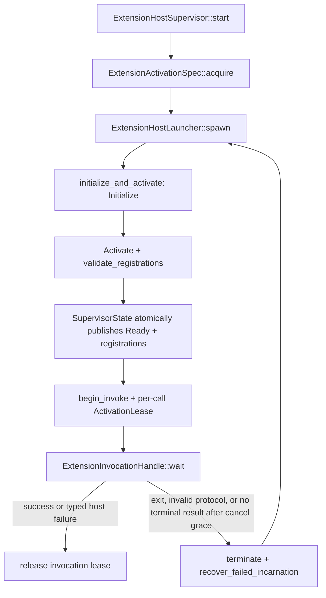

# `zeta-editor-extension-host`

> 本 README 是 Zeta 原生可执行 Editor Extension Host v1 的进程、RPC、授权门禁、取消与故障恢复
> 实现权威文档。跨 Marketplace/legacy Plugin、Workspace、App Server 和 Workbench 的产品语义由
> [`docs/editor-extensions.md`](../../docs/editor-extensions.md) 维护；统一远端 package 身份由
> [`zeta-rs/marketplace-manager/README.md`](../marketplace-manager/README.md) 维护。

`zeta-editor-extension-host` 监管一个已经由上层解析和授权的扩展程序。每个
`ExtensionHostSupervisor` 最多拥有一个扩展的一个活动进程 incarnation，通过有界 JSONL Host RPC v1
完成握手、激活、调用、取消、停用和关闭，并在授权仍有效时按有界策略恢复崩溃进程。它不发现或
安装 package，不选择 activation event，不实现 Workbench provider，也不兼容 VS Code Node Extension
API。

## 1. Crate 边界

| 能力 | 本 crate 的职责 | 上层或平台职责 |
| --- | --- | --- |
| Package binding | 接收并绑定 `package_id`、digest、entrypoint 与 activation generation | source adapter 选择 immutable package/executable 并解析绝对路径 |
| Activation authority | 每次激活和调用前获取 `ActivationLease` | Adapter 同时复核 source artifact/admission lease 与 Workspace trust |
| Process supervision | 每扩展一个进程、incarnation fencing、停用、关闭和有界重启 | 平台 launcher 安装 sandbox、hard limits 和 killable process tree |
| Host RPC v1 | 版本、请求相关性、严格 shape、注册 ceiling 和 byte limits | 扩展程序实现协议；App Server 把注册投影到领域 owner |
| Provider invocation | 路由到精确 registration、deadline、并发取消和结果校验 | Command、Language、Debug、Tasks、Testing 定义 payload 与消费结果 |
| Diagnostics | 返回 typed `ExtensionHostError`，保留有界 stderr | App Server 清洗并映射客户端可见故障，不泄漏主机路径 |

出现以下代码表示 ownership 漂移：本 crate 扫描 Marketplace/Plugin 目录、持久化 enable/grant、解释
`package.json`、注册 Workbench provider、决定工作区信任，或自行把一个普通 Node/WASM 脚本当成
entrypoint 加载。

## 2. 文件与公共契约

| 文件 | 关键公共契约 | 约束 |
| --- | --- | --- |
| `protocol.rs` | `ExtensionHostRequest`、`ExtensionHostResponse`、`RegistrationDescriptor` | Host RPC v1 的唯一 wire shape；严格校验 request/response correlation |
| `authority.rs` | `ActivationAuthority`、`ActivationLease`、`ExtensionActivationSpec` | 授权是 live gate，不是 activation 时的一次布尔判断 |
| `limits.rs` | `ExtensionHostLimits`、`ProcessIsolationPolicy` | 默认要求平台强制隔离；所有 byte/count/deadline limit 必须非零且一致 |
| `process.rs` | `ExtensionHostLauncher`、`ExtensionHostProcess`、`ExtensionLaunchCommand` | launcher 必须在 entrypoint 执行前完成隔离，并清空继承环境 |
| `supervisor.rs` | `ExtensionHostSupervisor`、`ExtensionHostSnapshot` | 一扩展一监管器；注册仅在完整 activation 成功后发布 |
| `supervisor/invocation.rs` | `ExtensionInvocation`、`ExtensionInvocationHandle` | wait 与 cancel 可由不同线程并发调用；lease 持续到 terminal handling |
| `restart.rs` | `RestartPolicy`、`RestartTracker` | 滑动窗口、指数退避和 terminal `CrashLoop` |
| `error.rs` | `ExtensionHostError` | 区分拒绝、配额、协议、退出、超时和 unknown outcome |

`ExtensionHostLauncher` 和 `ActivationAuthority` 是 host adapter 必须实现的两个端口。前者拥有物理
隔离，后者拥有“当前是否仍可运行”的 live decision；不能用一个启动时缓存的 `true` 替代后者。

## 3. 内部接口地图

| Private symbol | 精确职责 | 不能承担 | 修改时同步检查 |
| --- | --- | --- | --- |
| `SupervisorState` | 保存 status、incarnation、live process、原子 registrations、invocation leases 与 restart tracker | Plugin 安装状态或 Workbench registry | supervisor lifecycle/recovery tests、系统文档 |
| `ExtensionHostSupervisor::launch_and_activate` | 取得 activation lease，spawn，递增 incarnation，完成 handshake + activate 后一次发布 registrations | 平台 sandbox、activation-event matching | authority、handshake、capability ceiling、restart tests |
| `ExtensionHostSupervisor::context` | 分配非零且不复用的 request ID，并绑定 incarnation 与 activation generation | 跨进程持久 ID | exhaustion/correlation tests |
| `reserve_pending` | 在写 stdin 前预留 waiter，分别约束普通请求和 control request，并拒绝 request ID 重用 | provider-level scheduling | concurrent cancel、quota、duplicate-ID tests |
| `spawn_stdout_reader` | 有界读取一行、strict decode、按 request ID 找 pending entry、执行 response validation | 接受 unsolicited extension events | malformed/oversized/correlation tests |
| `read_bounded_line` | 在分配增长前执行 frame byte ceiling，并要求 newline-terminated frame | JSON semantic validation | exact-boundary tests |
| `ExtensionInvocationHandle::wait` | 轮询 terminal response，观察 caller/deadline cancellation，执行 grace 后 unknown-outcome recovery | 把超时当成确认失败 | cancel/deadline/indeterminate/restart tests |
| `ExtensionHostSupervisor::recover_locked` | 清除旧注册和 leases、终止旧进程、消费 restart budget、重新握手和激活 | 无限重启或跨授权恢复 | crash-window/backoff/authority-revoked tests |
| `validate_registrations` | 检查注册数量、ID 唯一性、字段限制和 manifest capability ceiling | 实现 provider 业务语义 | protocol capability/duplicate/size tests |

真实调用路径为：



## 4. Host RPC v1

传输是一行一个 UTF-8 JSON frame 的双向 stdio request/response 协议。每个 frame 都携带
`protocolVersion`、`requestId`、`incarnation` 和 `activationGeneration`；任一字段为零、版本不匹配、
response correlation 不完全一致、未知 request ID、错误 response kind 或超过 frame ceiling 都使当前
进程失败关闭。请求 ID 空间耗尽时返回 `RequestIdentityExhausted`，不能环回并复用旧 identity。

生命周期顺序固定为 `Initialize → Activate → Invoke* → Deactivate → Shutdown`。`Activate` 一次返回完整
注册集合，只有整批验证通过才成为 `ExtensionHostSnapshot.registrations`。当前 registration kinds 为
当前注册类型包括命令、语言供应商、调试适配器、任务供应商与测试配置供应商；语言 v1 的 operation
ceiling 包含 completion、Parameter Hints、definition、hover、references、rename、formatting、code
action、code lens、document symbols、folding、document links/colors、semantic tokens、Inlay Hints 与
Linked Editing。

`ActivateParams.activation_events` 是上层已经解析的 activation facts，监管器不会自行观察编辑器事件，
也不会据此决定何时启动。`capabilities` 则是强制 registration ceiling：进程不能通过 activation 响应
注册 manifest 未声明的 provider kind。协议支持的 provider kind 不等于 App Server/Workbench 已有对应
业务适配器。

默认 `ExtensionHostLimits` 为：

| 限制 | 默认值 |
| --- | ---: |
| 单 frame | 1 MiB |
| invocation payload | 512 KiB |
| registrations | 256 |
| ordinary in-flight requests | 32 |
| in-flight control requests | 8 |
| captured stderr | 256 KiB |
| arguments | 128 entries / 32 KiB |
| environment | 64 entries / 32 KiB |
| startup / request / cancellation grace / shutdown | 10 s / 30 s / 2 s / 5 s |
| restart budget | 60 s 内最多 5 次；100 ms 起步、最高 5 s 指数退避 |
| hard resources | 512 MiB memory、300 s CPU、1 process |

这些值按 bytes 或 entries 计数。硬资源值只是一项 launcher obligation；crate 内没有因为字段存在就
宣称 OS 已经实施限制。

## 5. 授权、隔离与生命周期

`ExtensionActivationSpec` 把可序列化 activation params 与不可序列化 `ActivationAuthority` 绑定。启动、
crash recovery 和每次 `begin_invoke` 都重新取得 lease。disable、update、uninstall 或 Workspace trust
撤销后，adapter 的 `authorizes/acquire` 必须立即拒绝新工作，并让既有 invocation drain 或被 host
composition 主动取消；进程中自报的 package identity 不是授权依据。

默认 `ProcessIsolationPolicy::RequirePlatformEnforcement` 要求产品提供的 launcher 在 entrypoint 运行前
同时安装 sandbox、memory/CPU/process hard limit、独立 stdio、空继承环境和可整体终止的 process tree。
任何一项无法保证都必须返回 `IsolationUnavailable`。当前 crate 唯一具体 launcher
`TrustedDevelopmentLauncher` 只接受显式 `TrustedDevelopment` policy，并仅用于可信本地开发；它不是
生产第三方扩展的安全边界。

崩溃后旧 incarnation 的 registrations 立即清除，pending request 和 lease 不得迁移到新进程。恢复会
重新执行 Initialize/Activate，再发布一整批新注册。空闲进程退出由 `reconcile()` 检出，因此 App Server
必须运行 health loop；监管器本身没有常驻 polling thread。超过 restart window 后进入 `CrashLoop`，只
能由上层显式重建或重启失败 runtime，不能无限自旋。

## 6. 取消与失败语义

`begin_invoke` 在发送前取得 invocation lease，并返回可跨线程取消的 handle。绝对 UTC deadline 与
`request_timeout` 取较早者。调用方取消或 deadline 到达时，handle 发送独立 control request；这条
request 不与普通 in-flight quota 竞争。grace 内若仍没有 terminal response，结果为
`OutcomeIndeterminate`：监管器终止该 incarnation 并恢复，而不是声称扩展没有产生副作用。

`Drop` 一个未完成 handle 会尝试取消、终止进程并释放 lease。Host exit、invalid protocol 和 unknown
outcome 都会 fence 当前 incarnation；activation authority 被撤销时恢复失败关闭。`stderr()` 只保留有界
前缀供上层诊断，App Server 对客户端暴露前仍必须清洗主机路径和实现细节。

## 7. 接入义务

App Server 或其他 composition root 必须：

1. 从 source adapter 已规范化的 exact immutable package、digest、executable 与 live authority 构造
   `ExtensionActivationSpec`，并把 Workspace trust 加入同一 live gate；
2. 只把经过 exact process permission 和 regular-file validation 的绝对 executable 交给 launcher；
3. 注入能够实施 `RequirePlatformEnforcement` 的平台 launcher，若不存在则将生产能力标记为不可用；
4. 定期调用 `reconcile()`，把 snapshot 变化原子投影到 provider owners；
5. 使用异步 invocation session 或后台 waiter 暴露调用，使 cancel request 不被一个阻塞 RPC 串行化；
6. connection 断开、authority 撤销和 shutdown 时取消 owned invocations 并调用 `shutdown()`；
7. 只暴露清洗后的 failure code/message，不把 absolute executable、cwd 或原始 stderr 放进 wire DTO。

Zeterm 若接入同一执行语义应依赖本 crate，并提供自己的 composition adapter；不得依赖 Desktop 或把
Host runtime 复制进产品 host。

## 8. 测试与修改影响

仓库 workspace 可加载时运行：

```text
cargo test --manifest-path Cargo.toml -p zeta-editor-extension-host
cargo clippy --manifest-path Cargo.toml -p zeta-editor-extension-host --all-targets --no-deps -- -D warnings
```

当前仓库还提供不加载根 workspace 其他 crate 的离线入口：

```text
powershell -NoProfile -ExecutionPolicy Bypass -File zeta-rs/editor-extension-host/check-standalone.ps1
```

测试分别位于 sibling `*_tests.rs`，覆盖 strict protocol、frame/payload/registration/in-flight limits、
response correlation、request-ID exhaustion、并发 cancel、authority leases、activation atomicity、
deadline/unknown outcome、crash recovery、backoff/crash loop 和 shutdown。修改 registration kind 或 wire
shape 时还必须同步 Plugin manifest ceiling、App Server protocol DTO、Frontend adapter 和跨层文档；修改
launcher obligation 时必须增加各平台 isolation acceptance test，不能只更新 fake launcher 测试。

## 9. 当前限制与扩展点

Current：Host RPC v1、逐扩展进程监管、live activation/invocation lease、原子 registrations、并发取消、
有界 stdio/stderr、incarnation/generation fencing、graceful shutdown 与有界 crash recovery 已实现。

当前限制：

- crate 没有生产平台 launcher；只有显式不安全的可信开发 launcher；
- activation-event matching 和 lazy activation 属于上层 composition，监管器只接收 activation facts；
- 空闲崩溃检测依赖上层 health loop；
- v1 只有 request/response，没有 extension-originated event stream；
- 没有 generic Node/WASM loader、VS Code Extension API、Marketplace compatibility 或多扩展共享进程；
- 没有 publisher signature、revocation feed、跨平台 artifact selector 或 binary ABI 检查；这些属于 package
  supply-chain 与平台 launchability 演进，不应加入协议解析器。

潜在演进必须由真实 consumer 驱动：若增加 extension-originated diagnostics/event、remote host 或新的
provider kind，应先固定 App Server/domain owner、背压与权限语义，再版本化协议；不能用 v1 unknown
field 或未声明 capability 静默协商新行为。
