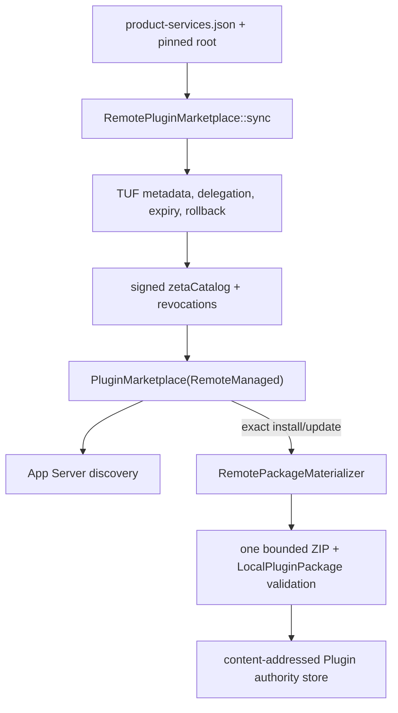

# zeta-plugin-marketplace

`zeta-plugin-marketplace` owns verified remote distribution for product-managed Plugin
Marketplaces. The cross-crate Plugin/Connector/MCP product model is canonical in
[`docs/plugins.md`](../../docs/plugins.md); this README documents the exact implementation
contract of this crate.

## Ownership

`RemotePluginMarketplace` refreshes a TUF repository with a host-pinned root, verifies delegated
publisher targets, projects signed discovery metadata into an immutable `PluginMarketplace`, and
defers bounded package download until an exact install or update requests the bytes.
`RemotePluginMarketplaceConfig` is supplied by the trusted product composition root. Untrusted App
Server clients never supply URLs, roots, target names, archive paths, or cache paths.

The key private owners are:

- `MarketplaceTransport`: adapts the shared bounded HTTP client to TUF and rejects non-HTTPS
  network fetches;
- `metadata::published_plugins`: requires every package target to be signed by its exact
  `publishers/<publisher>` delegated role, preserves the backward-compatible `zetaPlugin` identity,
  and validates optional `zetaCatalog` manifest/statistics metadata;
- `archive::extract`: enforces archive/entry/expanded-size limits and rejects traversal, links,
  encryption, duplicate paths, and unsupported entries;
- `RemotePluginMarketplace::materialize` / `catalog_packages`: verify the revocation feed and build
  package descriptors without reading ZIP targets when signed discovery metadata is present;
- `RemotePackageMaterializer` / `materialize_package`: reopen current TUF authority at install time,
  reject newly revoked targets, download one exact ZIP, validate it through `LocalPluginPackage`, and
  promote it into the digest-keyed package cache;
- `signed_repository_digest`: binds an immutable catalog snapshot to snapshot and targets metadata,
  including delegated role revisions;
- `cache_repository`: retains verified metadata and the revocation target for offline browsing; it
  does not prefetch Plugin archives;
- `replace_directory` / `recover_repository_cache`: keeps the previous complete repository until
  replacement succeeds and restores it after a crash between the two atomic renames.

Call flow:

## Failure and offline semantics

- Signature, threshold, version, expiry, delegation, target hash/length, package digest, and archive
  failures are fail-closed.
- Only a transport failure may fall back to the last complete discovery cache. Cached metadata is
  reopened through TUF with safe expiration enforcement; package directories are never trusted
  without the current signed target and revocation metadata.
- Offline browsing works while cached metadata remains valid. Offline installation works only when
  that exact package was previously materialized; an uncached ZIP requires the distribution.
- A catalog refresh replaces metadata only after signed discovery metadata passes Zeta manifest,
  identity, contribution, and statistics validation. Legacy targets without `zetaCatalog` use a
  compatibility download during refresh until the publisher republishes richer metadata.
- TUF rollback metadata is copied into a staging datastore for each online refresh and committed
  only after discovery validation and repository caching succeed. Install-time refresh commits its
  rollback state only after the selected package passes archive and normalized-digest validation.
- Revocations become durable exact-package tombstones in `zeta-plugins`; absence from a later feed
  does not silently restore activation.

## Extension and drift signals

New distribution protocols belong beside, not inside, `zeta-plugins` authority. Adding raw URL or
filesystem-path install RPCs, trusting a cached catalog without TUF reopen, treating a publisher
role as global revocation authority, or exposing Plugin credentials here would be architectural
drift.

The crate does not own Marketplace search/payment UX, Plugin activation/grants, Connector OAuth,
MCP sessions, secret persistence, download progress UI, package-cache quotas, or garbage collection.
