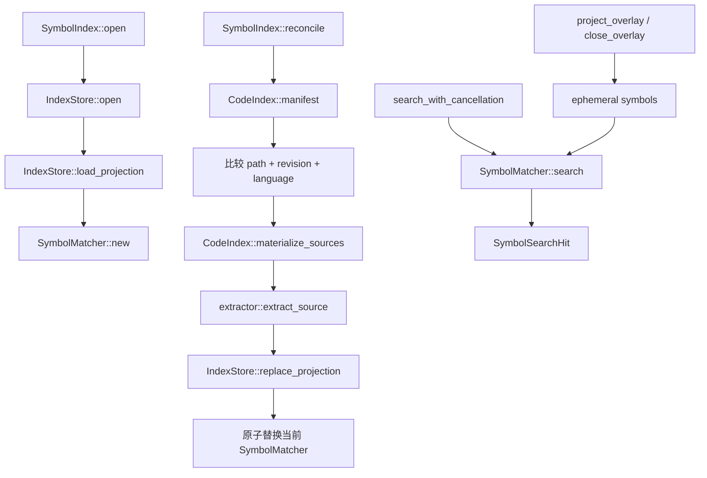

# `zeta-symbol-index`

> 本 README canonical 拥有 `zeta-symbol-index` 的当前实现契约。编辑器语法、Language Server、工作区
> 检索与未来代码图的跨系统边界和阶段计划由
> [`docs/code-intelligence.md`](../../docs/code-intelligence.md) 拥有；Workspace source/chunk authority
> 见 [`zeta-code-index` README](../code-index/README.md)。

`zeta-symbol-index` 把 `zeta-code-index` 已发布并复核的 Workspace sources 投影为 revision-bound
语法声明，在 SQLite 中复用未变化文件的结果，并用 Nucleo 提供本地 fuzzy symbol search。它不扫描
文件系统、不请求 Language Server，也不把语法声明提升为编译器语义。

## 1. 所有权与依赖方向

当前 crate 负责：

- 比较 `CodeIndexManifest` 与已有 symbol projection；
- 只通过 `CodeIndex::materialize_sources` 取得变化文件正文；
- 使用 `zeta-syntax` 提取支持语言的 `DocumentSymbol`；
- 按 source revision 复用未变化文件的 symbols；
- SQLite transaction 发布完整 generation；
- 从已发布 generation 构造只读 Nucleo candidate set；
- exact/prefix boost、fuzzy Top K、matched indices 与 cooperative cancellation；
- 从 CodeIndex canonical overlay 投影 dirty document symbols，并在查询中抑制同路径磁盘 rows；
- query、per-source、total symbol 和 matcher worker limits。

当前 crate 不负责：

- filesystem scan、ignore、symlink、trust 或源码读取策略；
- Editor snapshot 的采集、owner lifecycle 与 save 判定；
- LSP workspace symbol、definition、reference 或 hierarchy；
- stable semantic `SymbolId`、occurrence、edge、SCIP 或跨语言 resolver；
- App Server watcher、RPC、profile placement 或 Desktop provider；
- AI candidate fusion、content materialization 或 token budget。

依赖方向固定为：

```text
zeta-symbol-index → zeta-code-index + zeta-syntax + zeta-async-utils
```

如果本 crate 开始使用 `ignore::WalkBuilder`、直接打开 Workspace source、依赖 LSP/App Server DTO，或
决定跨来源最终排序，说明 ownership 已经漂移。

## 2. 文件与关键接口

| 文件 / symbol | 可见性 | 单一职责 | 不能承担 |
| --- | --- | --- | --- |
| `SymbolIndex` | public | 组合 CodeIndex、store、limits 与当前 matcher，暴露 reconcile/search/overlay projection | watcher、RPC、Editor state |
| `SymbolIndex::reconcile` | public | 对齐当前 CodeIndex source generation，并原子替换 symbol projection | 自主扫描或相信 watcher event 内容 |
| `SymbolIndex::search_with_cancellation` | public | 校验 query limit，在当前 matcher snapshot 查询 | LSP fallback 或 UI query generation |
| `extractor::extract_source` | private | 将一个 `MaterializedSource` 投影为有界 syntax symbols | 文件读取、semantic reference resolution |
| `IndexStore` | private | root/schema/syntax-facts binding 与 SQLite publication | source authority、matcher policy |
| `IndexStore::load_projection` | private | 恢复 source rows 和 symbols，供 revision reuse 与 startup hydrate | 读取源码纠正 stale row |
| `SymbolMatcher` | private | 持有 Nucleo worker/candidates，并生成 scored Top K | persistence、跨 provider fusion |
| `SYNTAX_FACTS_VERSION` | `zeta-syntax` public constant | 使 grammar/tags 语义变化失效持久化 facts | 数据库 schema version |

公共 module 保持 private，由 `lib.rs` named exports 暴露唯一 crate API。第一版 `SymbolReference` 明确
绑定 source revision；它不是 rename/move 后仍稳定的 semantic identity。

## 3. 当前调用路径



`reconcile` 使用独立 operation lock 串行化 projection publication。查询先取得当前 matcher 的 `Arc`，
所以 reconcile 可以在新 matcher 完整建立后一次替换；正在运行的查询继续读取旧的 immutable candidate
set，不会观察半发布 generation。

## 4. 数据与身份

`SymbolReference` 保存：

- `IndexRootId`；
- Workspace-relative path；
- `SourceRevision`；
- `IndexedLanguage`；
- source byte length；
- 文件内 deterministic ordinal；
- declaration 和 selection 的 UTF-8 byte/row/byte-column range。

SQLite projection 使用三个表：

```text
symbol_index_metadata
symbol_index_files
symbol_index_symbols
```

metadata 同时绑定 root ID、schema version、`SYNTAX_FACTS_VERSION`、自身 generation、CodeIndex source
generation 与 total-limit state。root 不匹配会失败；schema 或 syntax-facts identity 不兼容会删除并
重建可再生 projection。

持久化 reconcile 会读取已有 symbol rows，但只对 revision/language 不变且上一 generation 未触发
total limit 的文件复用。上一 generation 命中 total limit 时，下一次 source generation 变化会重新提取
全部 sources，避免删除早期文件后仍永久缺失后来被截断的 symbols。

## 5. 查询与排序

Nucleo candidate set 只匹配 symbol name。当前排序依次使用：

1. exact case-insensitive name boost；
2. case-insensitive prefix boost；
3. Nucleo fuzzy score；
4. name、path、ordinal deterministic tie-break。

matcher 先取得 bounded candidate pool，再应用 boost 和最终 Top K。`matched_indices` 使用 Unicode
character indices，供 UI 高亮，不是 UTF-8 byte offset。空 query 返回 deterministic 的首批 symbols。

当前没有 container/path proximity、recent-use 或跨 provider score normalization；这些属于 Desktop
Workspace Symbol aggregator 或后续有基准的 matcher 演进，不能静默改变为 AI final ranking。

## 6. 失败、取消与资源限制

| 条件 | 当前结果 |
| --- | --- |
| CodeIndex root 与 symbol store root 不同 | `StorageRootMismatch` / `SourceRootMismatch` |
| source revision 在 materialization 前已变化 | 传播 `CodeIndexError`，不发布新 generation |
| syntax grammar/query 无法加载 | 带相对 path 的 `Syntax` error，不替换 last-ready projection |
| query 超过 byte limit | `QueryTooLarge` |
| cancellation 已生效或在 matcher tick 间生效 | `Cancelled`，不返回 partial hits |
| unsupported/plaintext language | 保存 source row但不产生 symbols |
| per-source/total symbol limit | 截断结果并在 source/snapshot 显式标记 |
| persistent path 非普通文件 | 明确 I/O failure |

Persistent SQLite 在 Unix 上强制普通文件和 `0600`。一次 publication 失败时 transaction rollback，旧
generation 和 matcher 继续可用。

## 7. 集成义务

- App Server 必须先让 CodeIndex 发布 canonical source generation，再调度 `reconcile`。
- App Server 必须把 symbol store 放在 root-digest scoped profile path；crate 不选择 profile。
- 查询调用方必须维护自己的 query generation；crate 的 cancellation 不替代 UI stale-result gate。
- 打开搜索结果前，产品必须验证当前 source/selection，不能把旧 range 当作可持久 semantic anchor。
- LSP provider 与本地 symbol provider 的并发、dedupe 和 fallback 属于 Desktop aggregator。
- AI consumer 不能直接把 `SymbolSearchHit` 正文发给模型；必须通过 Workspace authority materialize。
- App Server 当前在 CodeIndex generation 发布后调度 reconcile，并通过
  `workspace/symbolIndex/status|search` 暴露能力；Desktop `ISymbolIndexService` 与 LSP provider 并发查询。
- overlay snapshot 必须先由 CodeIndex 接受，再投影到 SymbolIndex；close 与 save handoff 也必须以
  CodeIndex 的 canonical dirty-path 状态为准。

## 8. 测试与修改影响

```bash
cargo test -p zeta-symbol-index
cargo clippy -p zeta-symbol-index --all-targets --no-deps -- -D warnings
bazel test //zeta-rs/symbol-index:symbol-index-unit-tests
```

测试位于 sibling `src/symbol_index_tests.rs`，当前覆盖 extraction/fuzzy、exact boost、add/change/delete、
persistent reopen/no-op generation、total limit、cancellation、dirty override 和 overlay close。修改以下
内容时必须同步检查：

| 修改 | 同步检查 |
| --- | --- |
| symbol kind mapping | `zeta-syntax` tags、store serde ID、App Server DTO |
| range coordinate | Desktop UTF-16 conversion、accept-time validation |
| schema | `SCHEMA_VERSION`、reset/reopen tests |
| syntax facts | `SYNTAX_FACTS_VERSION`、CodeIndex chunk boundary consumers |
| matcher score | deterministic ranking fixtures 与未来 Desktop fusion |
| reconcile reuse | stale source、limit recovery、watcher generation tests |

## 9. 当前限制与下一步

- Current：只索引 `zeta-syntax` 当前支持的 JavaScript/JSX、TypeScript/TSX、JSON/JSONC、Rust、Shell。
- Current：只保存平面 document symbols；`container_name` 暂为空。
- Current：只匹配 symbol name，不匹配 path/container/signature。
- Current：磁盘 CodeIndex generation 是持久 source，CodeIndex canonical overlay 是唯一 ephemeral source；
  overlay 不写 SQLite，查询时完全抑制同路径磁盘 rows。
- Current：App Server watcher/reconcile、status/search RPC 与 Desktop provider 已接通；Desktop 将本地结果
  与 LSP workspace symbols 分阶段、确定性合并并隔离 provider failure。
- Current limitation：没有 occurrence/reference/edge，也没有跨 edit 稳定 semantic identity。
- Potential：出现真实 compiler/indexer consumer 后增加 semantic symbol/occurrence/edge；不扩张当前
  revision-bound `SymbolReference` 的承诺。
