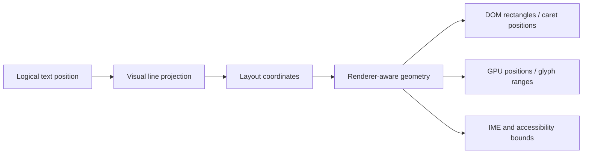

# Text Geometry and Browser Rendering

> This document owns the long-term target contract for text geometry, browser rendering backends, measurement, and input-facing coordinates. The overall line-editor design remains in [`text-engine.md`](./text-engine.md); browser implementation contracts remain in [`browser/README.md`](./browser/README.md). The Chinese companion is [`text-engine-geometry.zh-CN.md`](./text-engine-geometry.zh-CN.md). The English document is the canonical source for this pair; the Chinese document is a synchronized translation.
>
> Status: Current constraints + Proposed target architecture. A section marked Proposed or Potential is not a current implementation guarantee.

## Quick understanding

A general-purpose browser editor should use one logical-to-visual layout model, exact geometry for the visible text that the browser must interact with, and lazy estimates for text that is not currently rendered. DOM, Canvas, and GPU are rendering backends or measurement tools; none of them becomes a second text model or an unbounded synchronous scan.

| Problem | Long-term authority | Default strategy | Observable consequence |
| --- | --- | --- | --- |
| Logical positions and visual lines | Common model and visual layout | DOM-free projection | Commands and navigation do not depend on DOM nodes |
| Visible caret, selection, composition, and hit-test geometry | Renderer-aware geometry provider | Browser geometry for DOM rendering; shared shaping geometry for GPU rendering | Browser-facing rectangles match the rendered text |
| Non-visible line width and scroll extent | Versioned width index | Lazy analytic estimate, then refinement | Construction never synchronously measures the whole document |
| Font, zoom, device-pixel-ratio, and style changes | Font environment revision | Cached metrics with explicit invalidation | Coordinates are never silently reused across font environments |
| Editing, IME, and accessibility | Input/accessibility adapter | Native EditContext when available, textarea or equivalent fallback otherwise | Input surfaces never become document authorities |

Read the decision, ownership, measurement, current-status, and evolution sections before changing a measurement or rendering module.

## Decision summary

- Use a hybrid architecture: exact visible geometry plus lazy offscreen measurement.
- Keep logical text, visual line projection, layout coordinates, and browser rectangles as distinct layers.
- Treat the geometry provider as the single browser-facing coordinate seam used by carets, selections, composition, pointer hit-testing, decorations, and input surfaces.
- Treat width indexes and font metrics as invalidatable caches, not as sources of document truth.
- Keep renderer choice replaceable. A DOM renderer may use browser `Range` geometry; a GPU renderer must use the same shaping and visual-layout data that drives drawing.
- Use VS Code and other mature editors as reference implementations and evidence, not as normative ownership or file-layout specifications.

This target does not require an immediate file move. File names should follow the settled ownership boundaries after the contracts and measurements are verified.

## Scope and non-goals

This architecture targets a browser-based code editor with large files, virtualized rows, syntax presentation, wrapping, selection, IME, accessibility, right-to-left text, ligatures, font fallback, and optional GPU rendering.

It does not require every line to have exact DOM geometry while offscreen, does not require one rendering backend, and does not make a particular browser API the permanent input contract. It also does not propose copying VS Code's private services, historical compatibility layers, or internal type graph.

## Ownership and dependency boundaries

| Component | Owns | Must not own |
| --- | --- | --- |
| Text model | Text, versions, transactions, history, snapshots, and stable logical positions | DOM, CSS, browser input, or rendered widths |
| Visual layout | Logical-to-visual line mapping, wrapping, folding projection, visual columns, and viewport ranges | DOM reads, browser events, or model mutation |
| Geometry provider | Conversion from visual positions/ranges to physical coordinates, with renderer-specific exact and fallback paths | Text transactions, selection state, or feature policy |
| Font environment | Font/style identity, representative metrics, shaping inputs, and invalidation revision | Line ownership, scrolling, or input state |
| Width index | Per-line width observations, maximum-width aggregation, completeness/bound state, and incremental invalidation | The text model, browser DOM lifecycle, or exact caret policy |
| Renderer | Virtual rows, text presentation, retained visual parts, and backend-specific drawing/DOM | Model mutation, selection authority, or global scroll authority |
| Input and accessibility adapters | Native/textarea/EditContext events, browser focus, composition transport, and screen-reader projection | A second document model, history stack, or selection authority |
| Host | Mounting, external size, product composition, and host-owned services | Internal rows, editor transactions, or renderer-owned geometry |

The dependency direction is `model → visual layout → geometry → renderer/input adapters`. A lower layer may provide a contract to a higher layer, but it must not reach upward to discover feature or product state.

## Coordinate and geometry layers

Logical positions identify text in the model. Visual positions identify a rendered line fragment after wrapping, folding, direction handling, and grapheme-boundary policy. Layout coordinates add viewport, padding, line-height, and scroll state. Browser rectangles are physical coordinates used by DOM APIs, input surfaces, accessibility adapters, and pointer events.

Consumers must not derive a visual position from an arbitrary DOM offset or derive a browser rectangle by independently re-measuring a prefix. The geometry provider owns those conversions and exposes the fallback status when exact rendered geometry is unavailable.

## Measurement strategy

### Font environment

Font metrics are keyed by the effective font environment rather than only by a font family. The key may include family, size, weight, style, feature settings, variation settings, letter spacing, tab size, padding, zoom, and device-pixel-ratio. Font loading, style changes, zoom, and device-pixel-ratio changes create a new environment revision and invalidate dependent geometry.

Representative metrics such as space width are useful for fast paths and tabs. They are not sufficient to promise exact caret or selection geometry for shaped, styled, bidirectional, or fallback text.

### Exact visible geometry

The active renderer is authoritative for visible geometry. A DOM renderer reads browser-shaped rectangles through `Range` or an equivalent browser geometry API. A GPU renderer uses the same text shaping, cluster mapping, and visual layout data used to draw the glyphs. Exact visible geometry is required for caret placement, composition bounds, selection rectangles, pointer hit-testing, and decorations whose position must follow styled text.

DOM reads are restricted to rendered and relevant lines. They are scheduled and cached so that a geometry read does not create an accidental whole-viewport layout loop.

### Analytic and offscreen measurement

Canvas metrics, representative glyph widths, or a dedicated text shaper may provide fast measurements for monospace fast paths, wrap candidates, non-visible lines, minimap density, and initial scroll estimates. These values must carry their quality or completeness state and must not silently replace exact visible geometry when the rendered text has complex shaping or style.

### Width aggregation

The width index is lazy and version-bound. It may expose a lower bound, an estimate, or a complete maximum; callers must know which one they received. Visible exact measurements refine the index, edits invalidate only affected ranges when possible, and background work is cancellable. No constructor or input event performs an unbounded synchronous scan of the model.

### Invalidation

Every retained measurement or geometry value is bound to the revisions that can change it: model version, visual-projection revision, layout revision, font-environment revision, and renderer revision where applicable. A stale value is rejected at the boundary rather than patched after it has reached the DOM or input surface.

## Rendering backends and input

### Virtualized DOM rendering

The DOM backend renders only an overscanned row window and uses the browser's shaping, fallback, bidi, and `Range` geometry for visible text. It must not create one DOM node per character, and it must not make DOM layout the model or scroll authority.

### GPU or Canvas rendering

A GPU or Canvas backend may improve throughput for dense text, but it does not provide native text selection, screen-reader semantics, or IME geometry by itself. It therefore consumes the common visual-layout and geometry contracts and exposes an input/accessibility surface separately. If it cannot provide exact cluster geometry for a case, the editor must use a DOM geometry fallback or an explicit degraded state.

### Input and accessibility

The input layer consumes geometry; it does not calculate a second layout. Native EditContext, textarea, and future browser adapters implement one input contract. Composition state, selection state, and history remain in the editor common layer. Screen-reader projections may retain a separate presentation tree, but never a separate document authority.

## Tradeoffs and rejected alternatives

| Alternative | Strength | Boundary that prevents it from being the long-term default |
| --- | --- | --- |
| Full DOM rendering and measurement | Highest browser-native text fidelity | Memory and layout cost grow with document size; full-document DOM is not required for input correctness |
| Canvas/GPU-only rendering and measurement | High throughput and flexible drawing | Native selection, accessibility, bidi clusters, ligatures, and IME geometry need additional authoritative machinery |
| Copying VS Code's current structure | Proven behavior and familiar reference points | Its structure includes historical constraints and does not define this editor's ownership boundaries |
| Synchronous full-document measurement | Simple maximum-width semantics | Blocks startup and input on large files and makes font changes expensive |
| Hybrid visible-exact/offscreen-lazy geometry | Balances fidelity, scale, and backend choice | Requires explicit quality, invalidation, and fallback contracts; this complexity is intentional |

## Current implementation status

The following facts describe the current Zeta implementation; they do not redefine the target contract.

| Area | Status | Current evidence and boundary |
| --- | --- | --- |
| Common measurement contract | Current | `common/viewModel/textMeasurer.ts` exposes text width and padding inputs without importing browser APIs |
| Browser editor geometry configuration | Current | `browser/config/editorConfiguration.ts` resolves font and line-height defaults/validation at the browser composition boundary; it does not aggregate product services or feature state |
| Browser element-size observation | Current | `browser/config/elementSizeObserver.ts` turns ResizeObserver and initial client-area reads into one coalesced dimension event for the viewport |
| DOM font application | Current | `browser/config/domFontInfo.ts` applies the shared editor font vocabulary to viewport and diff surfaces; zoom remains feature-owned and invalidates measurements explicitly |
| Tab-focus state | Current | `browser/config/tabFocus.ts` owns host-injectable state and change events; the `toggleTabFocusMode` contribution owns keybindings, DOM state, and announcements |
| Browser font measurement | Current | `browser/config/fontMeasurements.ts` owns `DomTextMeasurer` and the font-environment snapshot; `browser/config/charWidthReader.ts` owns the Canvas width reader |
| Lazy line-width aggregation | Current | `browser/measurement/lineWidthIndex.ts` performs bounded initial work, cancellable slices, incremental edits, and lower-bound maximum tracking |
| Virtualized visible rows | Current | `browser/viewparts/viewLines/viewLines.ts` owns rendered row DOM and semantic text projection; text-bearing roots use ordinary layout positioning instead of permanent transform promotion |
| Browser-shaped visible geometry | Current, partial | `browser/viewparts/viewportOverlay/domTextGeometry.ts` provides `Range` rectangles, caret positions, and DOM hit-testing where the rendered line is available |
| Unified renderer-aware geometry contract | Proposed | Caret, selection, composition, pointer, decoration, and input consumers should use one explicit provider with exact/fallback state |
| Selectable DOM/WebGPU text renderer | Current, experimental | `browser/gpu` owns device, DPR, glyph rasterization, paged atlas allocation, rectangle buffers, and bounded full-file/viewport strategies; `browser/viewparts/viewLinesGpu` coordinates upload and drawing when `experimentalGpuAcceleration` is `on`. DOM rows remain the geometry and accessibility surface, and rows outside the GPU eligibility contract remain DOM-painted. |

Current behavior must not be described as complete merely because a fallback exists. A fallback is a contract only when its precision, invalidation, and degraded behavior are explicit.

## Evolution sequence

### Proposed: establish the contract before moving files

Define the geometry result shapes, quality states, revision bindings, and invalidation rules. Keep existing modules as adapters while tests cover tabs, font changes, long lines, ligatures, emoji, combining marks, right-to-left text, styled tokens, wrapping, selection, composition, and hit-testing.

### Proposed: make visible geometry authoritative

Use renderer-aware exact geometry for every visible case that affects caret, selection, composition, input, or pointer behavior. Retain analytic fast paths only when their equivalence is validated for the text and style class they serve.

### Proposed: separate font environment, line geometry, and width aggregation

File alignment with mature editor implementations may follow after these responsibilities have stable owners. A filename change must not create duplicate caches or move common geometry into the browser layer.

### Current: harden the WebGPU text backend

Measure startup, scroll, typing, IME, accessibility, and memory behavior on representative files before enabling WebGPU by default. Expand GPU eligibility only when the drawing path and visible geometry agree for the added text class; DOM remains authoritative for browser shaping cases the atlas path does not implement.

## Reference implementation mapping

The following VS Code modules are useful evidence when investigating a behavior. They are not normative for Zeta's ownership, API, or file layout.

| Reference module | Responsibility used as evidence | What must not be inferred |
| --- | --- | --- |
| `vs/editor/browser/config/fontMeasurements.ts` | Cached font environment and representative widths | That representative widths are enough for all caret geometry |
| `vs/editor/browser/config/charWidthReader.ts` | Browser-backed character-width reads | That the same DOM probing strategy must be used everywhere |
| `vs/editor/browser/config/editorConfiguration.ts` | Browser-facing option resolution and invalidation wiring | That Zeta should copy VS Code's service-heavy option aggregator or historical compatibility graph |
| `vs/editor/browser/config/domFontInfo.ts` | Applying resolved font values to DOM roots | That font CSS application should be repeated independently by every widget |
| `vs/editor/browser/config/elementSizeObserver.ts` | Coalesced element-size state for editor layout | That ResizeObserver should become the layout authority or leak into common geometry |
| `vs/editor/browser/config/tabFocus.ts` and `vs/editor/contrib/toggleTabFocusMode/browser/toggleTabFocusMode.ts` | Shared Tab-focus state separated from the toggle action | That state, keybindings, and DOM state must use the same owner |
| `vs/editor/browser/config/migrateOptions.ts` | Legacy VS Code option migration | That Zeta needs a migration layer without a Zeta legacy option contract |
| `vs/editor/browser/config/tabFocus.ts` | Global Tab-focus mode service | That Tab-focus policy belongs in config when Zeta already owns it in `ToggleTabFocusModeController` |
| `vs/editor/browser/viewParts/viewLines/viewLine.ts` | Per-rendered-line width and visible-range geometry | That a virtualized editor needs a global DOM line for every model line |
| `vs/editor/browser/viewParts/viewLines/viewLines.ts` | Visible-line width aggregation and delayed work | That its historical scheduler and cache invalidation are universal |
| `vs/editor/browser/view.ts` and `vs/editor/common/viewLayout/viewLayout.ts` | View facade and content-width propagation | That view host and common layout must share the same class boundaries |
| `vs/editor/browser/gpu/*` and `vs/editor/browser/viewParts/viewLinesGpu/viewLinesGpu.ts` | Device/DPR/atlas ownership, glyph rasterization, line eligibility, and GPU draw scheduling | That Zeta should copy VS Code service dependencies or enable the experimental backend by default |
| `vs/editor/browser/controller/editContext/*` | Input-surface and visible-range integration | That browser input types should leak into common model contracts |

## Long-term invariants

- The text model remains the only synchronous document authority.
- Visual layout is deterministic and DOM-free for the same model, configuration, and revision inputs.
- Browser-facing geometry has one owner and one explicit fallback policy.
- Exact visible geometry and offscreen estimates are distinguishable in types, events, and documentation.
- Font and renderer changes invalidate dependent caches before new coordinates are published.
- Input, accessibility, selection, decoration, and pointer consumers do not create parallel measurement algorithms.
- No renderer backend owns text transactions, selection history, or product lifecycle.
- VS Code compatibility or familiarity may guide navigation, but never overrides ownership or trust boundaries established here.

## Verification and modification impact

Changes to measurement or geometry must update the contract tests for font environment changes, tabs, long lines, wrapping, styled text, Unicode clusters, right-to-left text, selection, composition, pointer hit-testing, and scroll extent. Changes to input-facing geometry must also run the editor browser suite and the architecture checks named by [`text-engine.md`](./text-engine.md). A refactor is incomplete if the implementation changes file ownership without updating this document, the relevant implementation README, and the tests that prove the new boundary.
