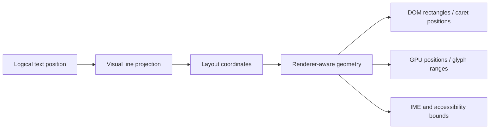

# 文本几何与浏览器渲染

> 本文拥有文本几何、浏览器渲染后端、测量以及面向输入的坐标长期目标契约。行式编辑器总体设计仍由 [`text-engine.md`](./text-engine.md) 拥有，浏览器实现契约仍由 [`browser/README.md`](./browser/README.md) 拥有。英文主文档见 [`text-engine-geometry.md`](./text-engine-geometry.md)。英文文档是这一对文档的 canonical source，本文件是同步中文翻译。
>
> 状态：当前约束 + Proposed 目标架构。标为 Proposed 或 Potential 的章节不是当前实现保证。

## 快速理解

通用浏览器编辑器应当使用一套逻辑到视觉的布局模型，对浏览器当前必须交互的可见文本提供精确几何，对尚未渲染的文本使用惰性估算。DOM、Canvas 和 GPU 都是渲染后端或测量工具，任何一个都不能成为第二套文本模型，也不能触发无界的同步扫描。

| 问题 | 长期权威 | 默认策略 | 可观察结果 |
| --- | --- | --- | --- |
| 逻辑位置和视觉行 | Common model 与视觉布局 | DOM-free 投影 | 命令和导航不依赖 DOM 节点 |
| 可见光标、选区、composition 和命中测试几何 | 与渲染后端对应的几何提供者 | DOM 渲染使用浏览器几何，GPU 渲染使用共享 shaping 几何 | 面向浏览器的矩形与实际文本一致 |
| 非可见行宽度和滚动范围 | 版本绑定的宽度索引 | 惰性分析估算，再逐步修正 | 构造时不会同步测量整个文档 |
| 字体、缩放、设备像素比和样式变化 | 字体环境版本 | 带显式失效的指标缓存 | 不会跨字体环境静默复用坐标 |
| 编辑、IME 和无障碍 | 输入/无障碍适配器 | 优先原生 EditContext，否则 textarea 或等效 fallback | 输入表面不会成为文档权威 |

修改测量或渲染模块前，应先阅读决策、所有权、测量、当前状态和演进章节。

## 决策摘要

- 采用混合架构：可见区域精确几何，非可见区域惰性测量。
- 保持逻辑文本、视觉行投影、布局坐标和浏览器矩形为不同层次。
- 由几何提供者统一承担光标、选区、composition、pointer 命中测试、decorations 和输入表面的浏览器坐标转换。
- 将宽度索引和字体指标视为可失效缓存，而不是文档真相来源。
- 保持渲染后端可替换。DOM 渲染可以使用浏览器 `Range` 几何；GPU 渲染必须使用驱动绘制的同一套 shaping 和视觉布局数据。
- 将 VS Code 和其他成熟编辑器作为参考实现与证据，而不是所有权或文件布局的规范。

这个目标不要求立即移动文件。应当先稳定契约和测量，再让文件名跟随确定的所有权边界。

## 范围与非目标

本文面向支持大文件、虚拟行、语法展示、折行、选区、IME、无障碍、从右到左文本、连字、字体 fallback 和可选 GPU 渲染的浏览器代码编辑器。

本文不要求非可见行拥有精确 DOM 几何，不要求只有一种渲染后端，也不把某个浏览器 API 固定为永久输入契约。本文也不提议复制 VS Code 的私有 service、历史兼容层或内部类型图。

## 所有权与依赖边界

| 组件 | 拥有 | 不得拥有 |
| --- | --- | --- |
| 文本模型 | 文本、版本、事务、历史、snapshot 和稳定逻辑位置 | DOM、CSS、浏览器输入或渲染宽度 |
| 视觉布局 | 逻辑到视觉行映射、折行、折叠投影、视觉列和 viewport 范围 | DOM 读取、浏览器事件或模型变更 |
| 几何提供者 | 视觉位置/范围到物理坐标的转换，以及与渲染后端对应的精确和 fallback 路径 | 文本事务、selection 状态或 feature policy |
| 字体环境 | 字体/样式 identity、代表性指标、shaping 输入和失效版本 | 行所有权、滚动或输入状态 |
| 宽度索引 | 每行宽度观测、最大宽度聚合、完整性/边界状态和增量失效 | 文本模型、浏览器 DOM 生命周期或精确光标策略 |
| 渲染器 | 虚拟行、文本展示、retained visual parts 和后端绘制 | 模型变更、selection 权威或全局滚动权威 |
| 输入与无障碍适配器 | Native/textarea/EditContext 事件、浏览器 focus、composition 传输和屏幕阅读器投影 | 第二套文档模型、history stack 或 selection 权威 |
| 宿主 | 挂载、外部尺寸、产品组合和宿主服务 | 内部行、编辑事务或渲染器几何 |

依赖方向是 `model → visual layout → geometry → renderer/input adapters`。低层可以向高层提供契约，但不能反向发现 feature 或 product state。

## 坐标与几何层

逻辑位置标识模型中的文本。视觉位置标识经过折行、折叠、方向处理和 grapheme boundary policy 后的渲染行片段。布局坐标再加入 viewport、padding、line-height 和 scroll 状态。浏览器矩形是 DOM API、输入表面、无障碍适配器和 pointer 事件使用的物理坐标。

消费者不能从任意 DOM offset 自行推导视觉位置，也不能重新测量文本前缀来生成浏览器矩形。这些转换由几何提供者拥有，并在无法获得可见精确几何时明确暴露 fallback 状态。

## 测量策略

### 字体环境

字体指标必须按有效字体环境缓存，而不能只按 font family 缓存。环境键可以包括 family、size、weight、style、feature settings、variation settings、letter spacing、tab size、padding、zoom 和 device-pixel-ratio。字体加载、样式、缩放和设备像素比变化会产生新的环境版本，并使相关几何失效。

空格宽度等代表性指标适合快速路径和 tab，但不足以为 shaping、styled、双向或 fallback 文本承诺精确光标或选区几何。

### 可见区域精确几何

当前渲染器是可见几何的权威。DOM 渲染器通过 `Range` 或等效浏览器几何 API 读取浏览器实际 shaping 后的矩形。GPU 渲染器使用与 glyph 绘制相同的文本 shaping、cluster mapping 和视觉布局数据。光标、composition 范围、选区矩形、pointer 命中测试以及必须跟随 styled text 的 decoration 都需要可见精确几何。

DOM 读取只针对已经渲染且确实相关的行，并通过调度和缓存控制，避免几何读取意外形成整个 viewport 的布局循环。

### 分析测量与非可见测量

Canvas 指标、代表性 glyph 宽度或专用 text shaper 可以为等宽快速路径、折行候选、非可见行、minimap 密度和初始滚动估算提供快速测量。这些值必须携带质量或完整性状态；当渲染文本具有复杂 shaping 或样式时，不能静默替代可见精确几何。

### 宽度聚合

宽度索引必须惰性且绑定版本。它可以返回 lower bound、estimate 或 complete maximum，调用者必须知道得到的是哪一种。可见精确测量用于修正索引，编辑尽可能只使受影响范围失效，后台工作必须可取消。模型构造和输入事件不能执行无界同步扫描。

### 失效

每个保留的测量或几何值都必须绑定可能改变它的版本：model version、visual-projection revision、layout revision、font-environment revision，以及适用时的 renderer revision。过期值应在边界被拒绝，不能先写入 DOM 或输入表面后再修补。

## 渲染后端与输入

### 虚拟化 DOM 渲染

DOM 后端只渲染带 overscan 的行窗口，并使用浏览器对可见文本执行 shaping、fallback、bidi 和 `Range` 几何。它不能为每个字符创建一个 DOM 节点，也不能让 DOM layout 成为模型或滚动权威。

### GPU 或 Canvas 渲染

GPU 或 Canvas 后端可以提高密集文本的吞吐，但自身不提供原生文本选区、屏幕阅读器语义或 IME 几何。因此它必须消费通用视觉布局和几何契约，并单独提供输入/无障碍表面。如果它不能为某种情况提供精确 cluster 几何，编辑器必须使用 DOM 几何 fallback 或明确的降级状态。

### 输入与无障碍

输入层消费几何，不计算第二套布局。Native EditContext、textarea 和未来浏览器适配器实现同一个输入契约。composition 状态、selection 状态和 history 保留在 editor common 层。屏幕阅读器可以保留独立 presentation tree，但不能保留第二套文档权威。

## 取舍与拒绝的替代方案

| 方案 | 优势 | 不作为长期默认方案的边界 |
| --- | --- | --- |
| 完整 DOM 渲染和测量 | 浏览器原生文本精度最高 | 文档规模会放大内存和 layout 成本；输入正确性不要求整个文档拥有 DOM |
| 纯 Canvas/GPU 渲染和测量 | 吞吐高，绘制自由 | 原生选区、无障碍、bidi cluster、连字和 IME 几何需要额外权威机制 |
| 复制 VS Code 当前结构 | 行为成熟，参考点熟悉 | 其中包含历史约束，不能定义本编辑器的所有权边界 |
| 同步测量整个文档 | 最大宽度语义简单 | 大文件启动和输入会被阻塞，字体变化成本高 |
| 可见精确 + 非可见惰性混合几何 | 平衡精度、规模和后端选择 | 需要明确质量、失效和 fallback 契约；这种复杂度是有意的 |

## 当前实现状态

以下事实描述当前 Zeta 实现，不重新定义目标契约。

| 领域 | 状态 | 当前证据与边界 |
| --- | --- | --- |
| Common 测量契约 | Current / 已实现 | `common/viewModel/textMeasurer.ts` 提供文本宽度和 padding 输入，不导入浏览器 API |
| 浏览器编辑器几何配置 | Current / 已实现 | `browser/config/editorConfiguration.ts` 在 browser composition boundary 解析字体和行高默认值/校验；不聚合产品服务或 feature 状态 |
| 浏览器元素尺寸观察 | Current / 已实现 | `browser/config/elementSizeObserver.ts` 将 ResizeObserver 和初始 client-area 读取统一为 viewport 使用的合并尺寸事件 |
| DOM 字体应用 | Current / 已实现 | `browser/config/domFontInfo.ts` 为 viewport 和 diff surface 应用统一的编辑器字体词汇；zoom 仍由 feature 自己拥有，并显式使测量失效 |
| Tab-focus 状态 | Current / 已实现 | `browser/config/tabFocus.ts` 拥有可由 host 注入的状态和变更事件；`toggleTabFocusMode` contribution 拥有快捷键、DOM 状态和播报 |
| 浏览器字体测量 | Current / 已实现 | `browser/config/fontMeasurements.ts` 拥有 `DomTextMeasurer` 和字体环境快照；`browser/config/charWidthReader.ts` 拥有 Canvas 宽度读取 |
| 惰性行宽聚合 | Current / 已实现 | `browser/measurement/lineWidthIndex.ts` 提供有界初始工作、可取消分片、编辑增量更新和 lower-bound 最大值 |
| 可见行虚拟化 | Current / 已实现 | `browser/viewparts/viewLines/viewLines.ts` 拥有渲染行 DOM 和 semantic text projection；承载文字的根节点使用普通布局定位，不长期提升为 transform 合成层 |
| 浏览器 shaping 后的可见几何 | Current / 部分具备 | `viewLine.ts` 负责单行读取，`CharacterMapping` 把 UTF-16 列映射到子 span，`rangeUtil.ts` 读取并整理浏览器范围，`domReadingContext.ts` 缓存布局基准 |
| 统一的渲染器感知几何契约 | Proposed / 计划设计 | 光标、选区、composition、pointer、decoration 和输入消费者应使用一个显式提供者，并携带精确/fallback 状态 |
| 可选择的 DOM/WebGPU 文本渲染器 | Current / 实验性 | `browser/gpu` 拥有 device、DPR、glyph rasterization、分页 atlas 分配、矩形缓冲区，以及有界的整文件/可见区域策略；`experimentalGpuAcceleration` 为 `on` 时，`browser/viewparts/viewLinesGpu` 协调上传与绘制。DOM 行继续承担几何与无障碍表面，超出 GPU 适用范围的行仍由 DOM 绘制。 |

不能因为存在 fallback 就把当前行为描述为完整。只有当 fallback 的精度、失效和降级行为明确时，它才是有效契约。

## 演进顺序

### Proposed：在移动文件前建立契约

先定义几何结果形状、质量状态、版本绑定和失效规则。现有模块先作为适配器保留，同时覆盖 tab、字体变化、长行、连字、emoji、组合字符、从右到左文本、styled token、折行、选区、composition 和命中测试。

### Proposed：让可见几何成为权威

所有影响光标、选区、composition、输入或 pointer 行为的可见情况，都使用与渲染器对应的精确几何。只有在某个文本和样式类别上验证等价后，才保留分析快速路径。

### Current：完善 WebGPU 文本后端

在代表性文件上测量启动、滚动、输入、IME、无障碍和内存行为后，才能默认启用 WebGPU。只有新增文本类别的绘制结果与可见几何一致时，才扩大 GPU 适用范围；atlas 路径尚未实现的浏览器 shaping 情况仍以 DOM 为权威。

## 参考实现映射

以下 VS Code 模块可用于调查行为，是参考证据，不是 Zeta 所有权、API 或文件布局的规范。

| 参考模块 | 可借鉴的职责 | 不应推导出的结论 |
| --- | --- | --- |
| `vs/editor/browser/config/fontMeasurements.ts` | 字体环境缓存和代表性宽度 | 代表性宽度足以处理所有光标几何 |
| `vs/editor/browser/config/charWidthReader.ts` | 浏览器支持的字符宽度读取 | 所有场景都必须使用相同的 DOM 探测策略 |
| `vs/editor/browser/config/editorConfiguration.ts` | 面向浏览器的选项解析和失效接线 | Zeta 应复制 VS Code 的重服务选项聚合器或历史兼容关系图 |
| `vs/editor/browser/config/domFontInfo.ts` | 将解析后的字体值应用到 DOM 根节点 | 每个 widget 都应该独立重复字体 CSS 应用 |
| `vs/editor/browser/config/elementSizeObserver.ts` | 为编辑器布局合并元素尺寸状态 | ResizeObserver 应成为布局权威，或泄漏到 common 几何层 |
| `vs/editor/browser/config/tabFocus.ts` 与 `vs/editor/contrib/toggleTabFocusMode/browser/toggleTabFocusMode.ts` | 将共享 Tab-focus 状态与切换动作分离 | 状态、快捷键和 DOM 状态必须使用同一个 owner |
| `vs/editor/browser/config/migrateOptions.ts` | VS Code 旧选项迁移 | 没有 Zeta 旧选项契约时也需要迁移层 |
| `vs/editor/browser/config/tabFocus.ts` | 全局 Tab-focus 模式服务 | 当 Zeta 已由 `ToggleTabFocusModeController` 拥有 Tab-focus 策略时，还需要第二个 config 服务 |
| `vs/editor/browser/viewParts/viewLines/viewLine.ts` | 已渲染行宽度和可见范围几何 | 虚拟化编辑器需要为每个模型行保留全局 DOM 行 |
| `vs/editor/browser/viewParts/viewLines/viewLines.ts` | 可见行宽度聚合和延迟工作 | 它的历史 scheduler 和缓存失效规则普遍适用 |
| `vs/editor/browser/view.ts` 与 `vs/editor/common/viewLayout/viewLayout.ts` | View facade 和 content-width 传递 | View host 和 common layout 必须拥有相同的类边界 |
| `vs/editor/browser/gpu/*` 与 `vs/editor/browser/viewParts/viewLinesGpu/viewLinesGpu.ts` | device/DPR/atlas 所有权、glyph rasterization、行适用性和 GPU 绘制调度 | Zeta 应复制 VS Code 的 service 依赖，或默认启用实验性后端 |
| `vs/editor/browser/controller/editContext/*` | 输入表面与可见范围集成 | 浏览器输入类型应该泄漏到 common model 契约 |

## 长期不变量

- 文本模型仍然是唯一同步文档权威。
- 对同一组模型、配置和版本输入，视觉布局必须是确定的，并且不依赖 DOM。
- 面向浏览器的几何只有一个 owner 和一个明确 fallback 策略。
- 可见精确几何和非可见估算在类型、事件和文档中必须可区分。
- 字体和渲染器变化必须在发布新坐标前使相关缓存失效。
- 输入、无障碍、selection、decoration 和 pointer 消费者不能创建并行测量算法。
- 任何渲染后端都不能拥有文本事务、selection history 或产品生命周期。
- VS Code 的兼容性或熟悉度可以帮助导航，但不能覆盖本文确定的所有权和信任边界。

## 验证与修改影响

修改测量或几何时，必须更新字体环境变化、tab、长行、折行、styled text、Unicode cluster、从右到左文本、选区、composition、pointer 命中测试和滚动范围的契约测试。修改面向输入的几何时，还必须运行 [`text-engine.md`](./text-engine.md) 指定的 editor browser suite 和 architecture checks。如果实现改变了文件所有权却没有同步更新本文、相关实现 README 和证明新边界的测试，则重构尚未完成。
