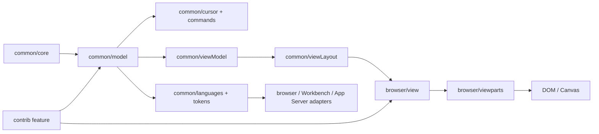
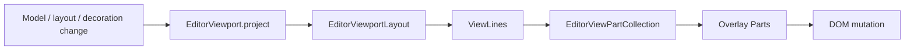

# Stanza Text Engine

> 本文是行式文本编辑器的 canonical 设计规范，拥有同步文本内核、视图架构、输入边界、Contribution 规则、当前状态和修改契约。Editor 总体目录与模式装配见 [`README.md`](./README.md)，文本几何与浏览器渲染后端的长期目标见 [`text-engine-geometry.md`](./text-engine-geometry.md)（中文翻译见 [`text-engine-geometry.zh-CN.md`](./text-engine-geometry.zh-CN.md)），跨 Workbench、文件、语言服务与 App Server 的系统边界见 [`docs/editor-architecture.md`](../../../../docs/editor-architecture.md)，浏览器实现细节见 [`browser/README.md`](./browser/README.md)。
>
> 状态：Current + Proposed。未明确标为 Proposed 的内容都描述当前实现。

## 快速理解

Stanza Text Engine 是 Zeta 唯一的行式文本编辑权威。文本、版本、事务、历史和 tracked range 在 Renderer 内同步完成；浏览器层只投影模型；语言、diff、文件和搜索等异步能力通过 editor-owned contract 接入，不能进入按键或 IME 热路径。

| 场景 | Canonical owner | 关键保证 |
| --- | --- | --- |
| 输入、删除、undo/redo | `TextModel` + `EditorSelectionController` | 一个同步事务，不等待 IPC |
| 换行、折叠、可见行和滚动 | `common/viewModel` + `common/viewLayout` | DOM-free、版本绑定 |
| DOM、光标、选区和 decoration | `browser/view` + `browser/viewparts` | 只投影，不创建第二套模型或滚动权威 |
| token、诊断、补全和 syntax facts | `common/languages` + frontend service | 异步结果必须通过 model identity 与 version gate |
| 打开、保存、冲突和恢复 | Editor model service + Workbench adapter | 文件传输不拥有 live model |
| 可选编辑能力 | `contrib/<feature>` | 移除 feature 不破坏基础模型正确性 |

## 设计不变量

- `TextModel` 是文本、版本、事务、文档历史、snapshot 和 tracked range 的唯一同步 mutation authority。
- 文本位置使用 0-based line、UTF-16 column；range 有序且 end-exclusive；进入模型的换行统一为 LF。
- `EditorSelectionController` 拥有一个 editor instance 的 selection、composition 和 cursor history，不把 selection 写入共享 `TextModel`。
- model、view model、layout 和 browser projection 依赖单向流动；`common` 不依赖 DOM、Workbench、Electron 或 generated DTO。
- 输入热路径不等待 Worker、Rust、App Server、文件系统或语言服务。
- 异步结果必须绑定准确的 model identity、model version 和 request identity；过期结果不得映射到当前文档。
- Part 只拥有自己的 retained presentation；它不能成为第二个 model、selection、layout、scroll 或 feature-state owner。
- Feature state 留在 feature owner。共享 context 不能演变成 service locator。

## 分层与依赖方向



| 层 | 拥有 | 不得拥有 |
| --- | --- | --- |
| `common/core` | position、range、selection value、纯 edit/range/text 算法 | model state、DOM、provider、产品逻辑 |
| `common/model` | `TextModel`、`TextBuffer`、history、snapshot、search、tracked range、decoration identity；PieceTree 是当前私有 buffer 实现 | CSS、selection instance、文件传输、语言 runtime |
| `common/cursor`、`common/commands` | editor-local selection 和 DOM-free edit intent | 键盘监听、DOM、Workbench command registry |
| `common/viewModel` | logical line → visual line、geometry、hit-test 所需纯投影 | DOM 测量、CSS、feature controller |
| `common/viewLayout` | viewport size、content extent、scroll clamp、visible/render ranges | DOM scroll node、model mutation |
| `common/languages`、`common/tokens` | provider contract、request freshness、versioned result、token index | parser transport、DOM presentation、Workbench service |
| `browser` | DOM、测量、输入适配、view host、view parts、runtime adapter | 文本权威、文件生命周期、产品 pane |
| `contrib/<feature>` | 可移除 feature 的 command、state、controller 和 presentation | 第二套 model、产品 ID、隐式宿主依赖 |
| Workbench | pane/input、文件和 working-copy、产品组合、transport adapter | 文本事务、selection、viewport |

依赖保持 `Workbench → editor/contrib → editor/browser → editor/common → base`。Stanza 可以借鉴 VS Code 的目录和职责名称，但不复制其历史依赖、全局 service singleton 或与当前调用者无关的文件。

## 同步文本内核

### Model、事务和历史

`TextModel` 在一次提交前验证所有 range 和 edit，拒绝重叠或越界输入，然后通过一个 mutation boundary 更新 TextBuffer、tracked ranges、history、version 和同步事件。Exact replacement 是 no-op，不增加版本，也不产生 history。当前 TextBuffer 由 `PieceTreeTextBufferBuilder` 构建的红黑 PieceTree 实现，但调用方不能依赖该具体类型。

`TextModel.createSnapshot` 捕获不可变 source segments。Snapshot 在后续 edit 或 model disposal 后仍可读取。文档 history 有 transaction 与 UTF-16 text-unit 双重预算；typing、Backspace 和 Delete 只有在光标连续性可证明时才合并。

`TextModel.reset` 用于 reload/revert，不建立普通 undo entry。文件行尾约定由 model reference 保存，模型内部仍保持 LF。

### Selection、command 和 composition

一个 `TextModel` 可以被多个 `EditorSelectionController` 投影。Controller 通过 `EditorEditCommand` 提交有序 edit 和明确的 post-selection；undo/redo 使用稳定 transaction identity 恢复各自的 selection，而不把 selection history 放入共享模型。

IME composition 使用受保护的 history revision。Provisional updates 可以产生可观察 model version，但 commit 只保留一个 undo step，cancel 必须无损恢复初始文本和 selection。Composition 活跃时，普通 edit、selection change 和 history command 不能绕过该边界。

### Decoration 与语言结果

`TextDecorationCollection<TMetadata>` 只拥有稳定 identity、opaque metadata 和 tracked range。CSS class、severity、hover、overview marker 和 geometry 由 browser/feature owner 解释。

语言请求从 immutable model snapshot 开始。`LanguageRequestCoordinator`、`VersionedLanguageResultStore` 和对应 token/diagnostic index 共同执行 latest-wins、cancellation、cross-model rejection 和 stale-result rejection。Worker 或 Rust adapter 可以生产事实，但不能成为 token store、selection 或 model owner。

## 视图架构

VS Code 的可读性来自五个明确边界：长期依赖、帧快照、失效、DOM 装配和 Part 内部渲染。Stanza 采用这些边界，并让 `FastDomNode` 只缓存 retained node 的样式与 class 写入，包括 geometry、font、transform、display、color、contain 和 shadow。文本、子树、`hidden`、tab order 与 ARIA 由具体组件直接写入；临时重建的 projection DOM 也保持原生写入。

### Current：现有渲染链路



- `ViewLayout` 是 DOM-free layout owner，生成不可变 `EditorViewportLayout`；`LinesLayout`、`LineHeightsManager` 分别负责行集合与行高。
- `EditorViewport` 同时承担当前 view host、同步 scheduler、measurement 组合、hit test 和 DOM scroll 同步。
- `EditorViewPartCollection` 按注册顺序同步 render；`ViewLines` 先建立当前 rendered lines，后续 overlay Parts 再消费它们。
- `EditorViewContext` 当前集中 layout 读取、overlay snapshot 创建和 version validation，减少重复 callback；它仍是过渡结构。
- 当前每次 `project` 会调用全部 Parts，Part 通过自己的 retained state 避免不必要的重建。
- `EditorViewport` 先创建并注册全部 Part，再在一个显式装配阶段挂载各 Part 根节点并固定层叠顺序；Part 不接收仅用于自行挂载的容器。

### Proposed：目标 View contract

目标不是增加更多层，而是让每种状态只存在于一个层：

| Contract | 生命周期 | 内容 | 明确不包含 |
| --- | --- | --- | --- |
| `EditorViewContext` | 一个 editor view | view model、view layout、measurement、scheduler/invalidation 等稳定共享依赖 | feature state、一次渲染的 visible range |
| `EditorRenderingContext` | 一次 render pass | layout、viewport、visual projection、rendered lines、坐标查询和 version-bound overlay snapshot | listener、可变 model、宿主服务 |
| `EditorViewPart` | 一个 retained visual part | 本地 DOM/cache、失效状态、render 实现 | DOM 挂载位置、全局 render 顺序 |
| View host | 一个 editor view | Part 创建与 disposal、根 DOM 挂载、层叠顺序、frame scheduling | feature edit semantics |

每个 render pass 只创建一个 frame context，再交给所有 Parts：

```ts
// Proposed shape; not the current public API.
const context = this.createRenderingContext(layout);
this.viewParts.render(context);
```

目标渲染顺序：

1. 收集 model、configuration、scroll 和 feature change，并标记受影响的 Parts。
2. View host 在一个 frame 中创建一致的 `EditorRenderingContext`。
3. `ViewLines` 更新 virtualized line DOM。
4. 只有确实需要 DOM measurement 的 Part 执行 `prepareRender` 读取阶段。
5. 失效的 Parts 在 render 阶段写入自己的 DOM。
6. frame 完成后清除本次失效状态。

### DOM 与 Part 边界

- Part 创建稳定根节点并拥有其内部节点、listener 和 disposal。
- View host 决定根节点挂载位置和 sibling 顺序。Part 不接收 container 只是为了在构造函数中自行 append。
- Part 可以公开 `domNode` 给 host，但 host 不操作 Part 内部 children。
- Feature-owned Part 直接接收 feature owner，例如 decoration Part 直接依赖 `DecorationsPart`；不通过共享 context 查找 feature。
- Render 使用 guard clause 拒绝 stale frame。Model version validation 在 frame/context boundary 只做一次。
- 短而完整的 reconcile 算法保留在一个方法中；只有共享语义、独立生命周期或独立失效条件才提取 helper。

### `update()`、缓存和失效

`update()` 只有在 Part 把 configuration 或 layout state 投影为 retained local state 时才有意义。它通常比较新旧值、更新缓存并返回是否需要 render。仅把连续赋值搬进 `update()` 不会改善架构。

添加缓存前必须同时回答：

- 哪个事件使缓存失效；
- 缓存与哪个 model/configuration revision 绑定；
- stale value 如何被拒绝；
- 缓存是否减少了可测量的工作。

没有这些条件时，直接使用 frame context 中的当前值。

`FastDomNode` 的通用 retained DOM 所有权遵守 [Renderer UI 样式所有权规范](../../../../docs/ui-styling-ownership.md)。Editor 只把它用于跨 render 保留、且同步 scheduler 会重复写入相同样式的节点。`ViewLine` 只对文字行根节点使用 wrapper；line number、diagnostic marker、indent guide、decoration、selection、cursor 和 composition 由各自 Part 通过 `ViewPartRows` 拥有独立 DOM。`SplitView`、`ContextView` 和 `Resizable` 保留直接 DOM 写入及各自已有的 size/layout guard；临时创建后立即替换的 projection DOM 不使用这一缓存，ARIA live 文本也保留原生写入以维持重复播报语义。

## 输入与 Controller

Browser controller 的职责是把一个 DOM event 解析成一个 editor intent，然后调用 common command 或 selection transition。它不得重新实现事务、range mapping 或 model history。

- `EditContext`：browser input contract；`NativeEditContext` 使用浏览器原生 EditContext，`TextAreaEditContext` 是 textarea fallback；两个适配器通过现有 `EditContext` 边界把 beforeinput/textupdate/keydown 路由到 `ViewController`，`ViewController` 执行 common command，`CompositionController` 拥有 IME 事务，`SuggestController` 作为独立 contribution 拥有 completion 请求与 widget，textarea accessibility 仍由 `TextAreaAccessibilityController` 负责；language-aware typing 通过显式 `EditorLanguageEditingAdapter` 注入。
- `CompositionController`：浏览器 composition sequence 与 common composition session 的适配。
- `KeyboardNavigationController`：平台 chord 到 DOM-free navigation command。
- `PointerHandler`：pointer dispatch、drag session 和 native capture 的 browser adapter。
- `MouseHandler`：把 mouse/pointer hit target 转换为 selection intent；`DragScrolling` 保持拖选期间的边缘滚动，纯 multi-cursor policy 位于 `common/cursor/pointerMultiCursor.ts`。
- Clipboard/drop controller：浏览器 MIME 与异步读取；提交前再次检查 model version 和 selection snapshot。

Controller 遇到未知、已处理、AltGraph 或不属于自身的事件时应返回，不抢占其他 owner。

## Contribution 结构

```text
contrib/<feature>/
  common/                   # state、contract、edit/query algorithm
  browser/                  # controller、widget、presentation
  test/common/
  test/browser/
  browser/media/            # feature-owned CSS
  <feature>.contribution.ts # 仅复杂装配需要
```

规则：

- `common` 不读取 DOM、Workbench service 或 transport DTO。
- 简单 feature 在 browser 主文件中注册；只有 configure phase、能力注入或多对象编排才使用独立 `.contribution.ts`。
- Contribution 通过窄 capability 或 host callback 请求外部能力，不能 import 模式 bundle。
- Provider contract 与 DOM presentation 分离；没有 browser UI 时，common contract 仍应可独立测试。
- 不创建空目录、barrel 或 placeholder controller 来表示尚未实现的能力。

当前 feature 分为 editing、language UX、view/navigation 三组。逐文件 owner 由目录和对应 README/测试表达，不再维护一份会过期的全量 feature ledger。

## 服务、持久化与宿主

| 能力 | Editor owner | Host/adapter owner |
| --- | --- | --- |
| Live text model reference、dirty、baseline、conflict | `ITextModelService` / `BrowserTextModelService` | Workbench 提供 resource store 与 working-copy registration |
| 原始资源读写和 expected revision | editor-owned `ITextResourceStore` contract | Workbench/file service/App Server adapter |
| Language provider registry 和 version gate | `ILanguageFeaturesService` 与 editor common stores | TextMate、Worker、Rust 或 LSP adapter |
| Diff request/result 和 `DiffModel` | `common/diff` | `RustDiffComputationService` |
| Pane、tab、save command、notification | 无 | Workbench |

Editor contract 使用领域类型；generated DTO 和 transport error 在 runtime adapter 内终止。强制能力缺失时显式失败，不添加行为不同的 production fallback。

## 失败与生命周期

- Invalid position、reversed range、overlapping edit 和 invalid post-selection 在 mutation 前失败。
- Model transaction 成功后只发布一个 immutable change；reentrant listener 不能让 stale post-selection 覆盖已更新的 selection。
- Disposal 只释放当前 owner 创建的 listener、DOM、tracked handle、worker 或 reference；不得顺带 dispose caller-owned model、selection controller 或 feature source。
- View projection 发现 layout、visual projection 与 model version 不一致时停止本次投影，不尝试猜测或修补。
- Async language、clipboard、diff 和 file result 在 apply 前再次检查 identity/version/revision。
- Save 使用 resolve 时的 opaque revision 作为写入 guard；watcher 事件只是较早的冲突提示。

## 当前状态与演进

| Area | Status | Boundary |
| --- | --- | --- |
| TextModel、TextBuffer、history、snapshot、tracked range | ✅ Current | Renderer 内同步权威；PieceTree 仅为私有实现 |
| Multi-selection、IME、clipboard、pointer/keyboard input | ✅ Current | Browser adapter 调用 common command |
| Virtualized lines、wrapping、folding、selection、decorations、minimap | ✅ Current | `EditorViewport` 同步调度 |
| Token、diagnostic、completion、TextMate 和 Rust syntax facts | ✅ Current | version-bound async provider path |
| Diff editor 与 Rust diff | ✅ Current | Rust 计算，Stanza 投影 |
| Stable view context 与 single frame context | 部分具备 | `EditorViewContext` 已存在；frame context 尚未独立 |
| Host-owned Part DOM mounting | ✅ Current | `EditorViewport` 显式挂载 Part 根节点并固定 sibling 顺序 |
| Per-Part invalidation 与 coordinated frame scheduler | Proposed | 当前 `project` 同步 render 全部 Parts |
| `prepareRender` read/write separation | Potential | 只有出现真实 DOM read/write phase 需求时引入 |
| Incremental compaction 和更广 parser-grade language coverage | Potential | 由可复现性能与产品需求驱动 |

## 关键实现入口

| Symbol/file | Responsibility | 修改时同步检查 |
| --- | --- | --- |
| `common/model/textModel.ts` | transaction、version、history、snapshot | cursor、tracked range、language invalidation、model tests |
| `common/cursor/editorSelectionController.ts` | editor-local selection 和 command execution | input、undo/redo、composition tests |
| `common/viewLayout/viewLayout.ts`、`linesLayout.ts`、`lineHeights.ts` | viewport/scroll/layout snapshot、行集合与行高 | wrapping、folding、hit test、viewport tests |
| `common/viewModel/modelLineProjection.ts` | immutable logical → visual line projection data | folding、selection geometry、navigation |
| `common/viewModel/viewModelLines.ts` | wrapping、visibility 和 model-versioned visual-line collection | folding、viewport、line-count changes |
| `browser/view/domLineBreaksComputer.ts` | browser font measurement for logical-line breaks | DOM measurement、grapheme boundaries |
| `browser/view.ts` | 当前 view host 和 scheduler | Part order、DOM topology、scroll |
| `browser/viewparts/viewPart.ts` | view context、Part contract 和 collection | 全部 View Parts 与 render tests |
| `browser/widget/codeEditor/codeEditorWidget.ts` | canonical browser editing surface | input、accessibility、contribution integration |
| `browser/editorExtensions.ts` | feature-neutral registry/capability seam | `editor.*.all.ts` 与 contribution order |

## 验证与修改影响

- 修改 model、cursor、history 或 composition：运行 `corepack pnpm --dir zeta-ts run test:editor:unit`。
- 修改 viewport、Part、DOM、input 或 accessibility：运行 unit suite 和 `corepack pnpm --dir zeta-ts run test:editor:browser`。
- 修改依赖方向或 product composition：运行 editor architecture tests、Renderer typecheck 和 stale-reference scan。
- 所有改动运行 `git diff --check`。

修改 model 时检查 transaction、version、history、tracked range 和 async result invalidation；修改 view model 时检查 wrapping、folding、geometry、hit test 和 navigation；修改 Part 时检查 DOM ownership、render order、version gate、disposal 和 browser tests；修改 Contribution 时检查 common contract、controller、registration、CSS owner 和对应测试。
