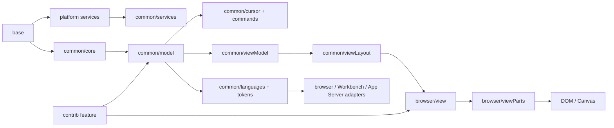
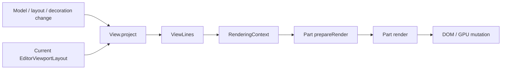

# Stanza Text Engine

> 本文是行式文本编辑器的 canonical 设计规范，拥有同步文本内核、视图架构、输入边界、Contribution 规则、当前状态和修改契约。Editor 总体目录与模式装配见 [`README.md`](./README.md)，文本几何与浏览器渲染后端的长期目标见 [`text-engine-geometry.md`](./text-engine-geometry.md)（中文翻译见 [`text-engine-geometry.zh-CN.md`](./text-engine-geometry.zh-CN.md)），跨 Workbench、文件、语言服务与 App Server 的系统边界见 [`docs/editor-architecture.md`](../../../../docs/editor-architecture.md)，浏览器实现细节见 [`browser/README.md`](./browser/README.md)。
>
> 状态：Current + Proposed。未明确标为 Proposed 的内容都描述当前实现。

## 快速理解

Stanza Text Engine 是 Zeta 唯一的行式文本编辑权威。文本、版本、事务、历史和 tracked range 在 Renderer 内同步完成；浏览器层只投影模型；语言、diff、文件和搜索等异步能力通过 editor-owned contract 接入，不能进入按键或 IME 热路径。

| 场景 | Canonical owner | 关键保证 |
| --- | --- | --- |
| 输入、删除、undo/redo | `TextModel` + `CursorsController` | 一个同步事务，不等待 IPC |
| 换行、折叠、可见行和滚动 | `common/viewModel` + `common/viewLayout` | DOM-free、版本绑定 |
| DOM、光标、选区和 decoration | `browser/view` + `browser/viewParts` | 只投影，不创建第二套模型或滚动权威 |
| token、诊断、补全、折叠、符号和结构选择 | `common/languages`、通用 provider contract 与 frontend service | 异步结果必须通过 model identity 与 version gate；App Server provider 由 Workbench 注册 |
| 打开、保存、冲突和恢复 | Editor model service + Workbench adapter | 文件传输不拥有 live model |
| 可选编辑能力 | `contrib/<feature>` | 移除 feature 不破坏基础模型正确性 |

## 设计不变量

- `TextModel` 是文本、版本、事务、文档历史、snapshot 和 tracked range 的唯一同步 mutation authority。
- 对外 `Position` / `Range` 使用 1-based line、1-based UTF-16 column；内部 visual-line、buffer offset 和局部投影可以使用 0-based 索引，但必须在 owner 边界转换一次。range 有序且 end-exclusive；进入模型的换行统一为当前 `ITextBuffer` 的 EOL。
- `CursorsController` 拥有一个 editor instance 的 selection、composition 和 cursor history，不把 selection 写入共享 `TextModel`。
- model、view model、layout 和 browser projection 依赖单向流动；`common` 不依赖 DOM、Workbench、Electron 或 generated DTO。
- 输入热路径不等待 Worker、Rust、App Server、文件系统或语言服务。
- 异步结果必须绑定准确的 model identity、model version 和 request identity；过期结果不得映射到当前文档。
- Part 只拥有自己的 retained presentation；它不能成为第二个 model、selection、layout、scroll 或 feature-state owner。
- Feature state 留在 feature owner。共享 context 不能演变成 service locator。

## 分层与依赖方向



| 层 | 拥有 | 不得拥有 |
| --- | --- | --- |
| `common/core` | position、range、selection value、纯 edit/range/text 算法 | model state、DOM、provider、产品逻辑 |
| `common/model` | `TextModel`、`ITextBuffer`、history、snapshot、search、tracked range、decoration identity；PieceTree 是当前私有 buffer 实现 | CSS、selection instance、文件传输、语言 runtime |
| `common/cursor`、`common/commands` | editor-local selection 和 DOM-free edit intent | 键盘监听、DOM、Workbench command registry |
| `common/viewModel` | logical line → visual line、geometry、hit-test 所需纯投影 | DOM 测量、CSS、feature controller |
| `common/viewLayout` | viewport size、content extent、scroll clamp、visible/render ranges | DOM scroll node、model mutation |
| `common/languages`、`common/tokens` | provider contract、request freshness、versioned result、token index | parser transport、DOM presentation、Workbench service |
| `browser` | DOM、测量、输入适配、view host、view parts、runtime adapter | 文本权威、文件生命周期、产品 pane |
| `contrib/<feature>` | 可移除 feature 的 command、state、controller 和 presentation | 第二套 model、产品 ID、隐式宿主依赖 |
| Workbench | pane/input、文件和 working-copy、产品组合、transport adapter | 文本事务、selection、viewport |

顶层依赖保持 `workbench → editor → platform → base`；Editor 内部保持 `contrib/browser → common`，其中 editor 的各层都可以按运行环境依赖更低层的 base/platform owner。Stanza 可以借鉴 VS Code 的目录和职责名称，但不复制其历史依赖、全局 service singleton 或与当前调用者无关的文件。

## 同步文本内核

### Model、事务和历史

`TextModel` 在一次提交前验证所有 range 和 edit，拒绝重叠或越界输入，然后通过一个 mutation boundary 更新 TextBuffer、tracked ranges、history、version 和同步事件。内容变化统一从 `onDidChangeContent` 发布；普通状态对象仍可使用自己的 `onDidChange`，因此调试时可以直接按 VS Code 的模型事件名追调用链。Exact replacement 是 no-op，不增加版本，也不产生 history。当前 TextBuffer 由 `PieceTreeTextBufferBuilder` 构建的红黑 PieceTree 实现，但调用方不能依赖该具体类型。

`TextModel.createSnapshot` 遵循 editor 公共契约，返回顺序消费的 `ITextSnapshot.read()`；它用于模型服务、独立入口和其他只需要读取文本的调用方。语言请求、Worker 同步与 diff 需要额外的 model version、长度和随机区间读取，因此使用独立的 `createVersionedSnapshot`。两种快照都在后续 edit 或 model disposal 后保持可读，但不再由一个同名 API 混合两套职责。文档 history 有 transaction 与 UTF-16 text-unit 双重预算；typing、Backspace 和 Delete 只有在光标连续性可证明时才合并。

`TextModel.reset` 用于 reload/revert，不建立普通 undo entry。`ModelService.updateModel` 会先按目标 buffer 更新 EOL，再提交最小文本 edit；模型、snapshot、undo/redo 和 worker mirror 始终使用同一个 `ITextBuffer` EOL。

`ModelService` 通过 `platform/configuration` 读取模型创建选项，通过 `ITextResourcePropertiesService` 决定资源 EOL。语言、资源或相关配置变化会清空 creation-options cache 并更新已打开模型；关闭文件的 undo/redo 只有在 URI 策略允许、内容 SHA-1 一致且内存预算允许时才恢复。

### Selection、command 和 composition

一个 `TextModel` 可以由多个编辑器共享，但 selection、cursor 和 composition 状态属于各自的 `ViewModelImpl`。目标生产链固定为 `ViewModelImpl → CursorsController → CursorCollection → CommandExecutor`；模型只保存文本、装饰和 undo/redo 数据，不保存某个编辑器的 cursor 状态。

当前实现尚未达到这条链。`CodeEditorWidget` 仍直接创建 `CursorsController`，生产调用仍依赖 `SelectionSet + SelectionSetTracker + EditorEditCommand`；同路径的 `CursorCollection`、`CursorContext` 和 `Cursor` 尚未完整接入生产。`cursorNavigation.ts`、`selectionSetDeleteOperations.ts`、`selectionSetWordOperations.ts`、`languageEnter.ts`、`languagePairEditing.ts` 与 `languageAutoClosingTracker.ts` 又分别占用了 `CursorMoveCommands`、`DeleteOperations`、`WordOperations`、`TypeOperations` 和 `CursorsController` 的职责。它们都是待迁移并删除的重复 owner，不是长期扩展点。

`common/cursor` 的目标文件集合与 VS Code 保持一致：12 个同路径文件，不保留额外的 SelectionSet、导航或语言输入 owner。当前 12 个同路径文件中有 8 个正文一致，但除 `ColumnSelection` 外，多数仍缺生产调用闭环；文件内容一致不代表完成。完成状态以 [`api-alignment-status.md`](./api-alignment-status.md) 的调用者与生命周期证据为准。

IME composition 使用受保护的 history revision。Provisional updates 可以产生可观察 model version，但 commit 只保留一个 undo step，cancel 必须无损恢复初始文本和 selection。Composition 活跃时，普通 edit、selection change 和 history command 不能绕过该边界。

### Decoration 与语言结果

`TextDecorationCollection<TMetadata>` 只拥有稳定 identity、opaque metadata 和 tracked range。CSS class、severity、hover、overview marker 和 geometry 由 browser/feature owner 解释。

语言请求从 immutable model snapshot 开始。`LanguageRequestCoordinator`、`VersionedLanguageResultStore` 和对应 token/diagnostic index 共同执行 latest-wins、cancellation、cross-model rejection 和 stale-result rejection。Worker 或 Rust adapter 可以生产事实，但不能成为 token store、selection 或 model owner。

语义 token 的 provider 生命周期由 `SemanticTokensStylingService` 按 provider identity 缓存 `SemanticTokensProviderStyling`；单 provider owner 把当前 `LanguageToken` 映射为展示属性，`ResolvedSemanticTokensService` 只负责 source/overlay 的结果转换。浏览器 contribution 实际经过这两个 owner，不把 provider cache 合并进 DOM 展示服务。当前本地 provider 直接返回结构化 `LanguageToken`，尚未采用 VS Code legend 的数字 metadata 表示。

## 视图架构

VS Code 的可读性来自五个明确边界：长期依赖、帧快照、失效、DOM 装配和 Part 内部渲染。Stanza 采用这些边界，并让 `FastDomNode` 只缓存 retained node 的样式与 class 写入，包括 geometry、font、transform、display、color、contain 和 shadow。文本、子树、`hidden`、tab order 与 ARIA 由具体组件直接写入；临时重建的 projection DOM 也保持原生写入。

### Current：现有渲染链路



- `ViewContext` 统一注册和移除事件处理器，`ViewPart` 接收配置、滚动、行映射和装饰事件，`View` 只负责组装、同步渲染阶段与 DOM 层级。
- `ContentViewOverlays` 和 `MarginViewOverlays` 分别持有一份可见行 DOM；`DynamicViewOverlay` 只准备数据并按行返回内容。
- 光标与块装饰持有跨行稳定 DOM，因此作为独立 `ViewPart`；旧的 `EditorViewPartCollection` 和各覆盖层独立行容器已经移除。

### 渲染上下文与输入 Part

`RestrictedRenderingContext` 只发布一次渲染所需的滚动、视口、纵向坐标与装饰查询；`RenderingContext` 在此基础上合并 DOM/GPU `IViewLines` 几何。特性状态由各 Part 显式接收，不再通过共享元数据容器查找。剩余工作是让两个输入实现进入同一 `ViewPart` 渲染阶段。

### DOM 与 Part 边界

- Part 创建稳定根节点并拥有其内部节点、listener 和 disposal。
- View host 决定根节点挂载位置和 sibling 顺序。Part 不接收 container 只是为了在构造函数中自行 append。
- Part 可以公开 `domNode` 给 host，但 host 不操作 Part 内部 children。
- Feature-owned ViewPart 直接接收 feature owner，例如 glyph margin 直接依赖 `EditorDecorationsOverlay`；不通过共享 context 查找 feature。
- Render 使用 guard clause 拒绝 stale frame。Model version validation 在 frame/context boundary 只做一次。
- 短而完整的 reconcile 算法保留在一个方法中；只有共享语义、独立生命周期或独立失效条件才提取 helper。

### `update()`、缓存和失效

`update()` 只有在 Part 把 configuration 或 layout state 投影为 retained local state 时才有意义。它通常比较新旧值、更新缓存并返回是否需要 render。仅把连续赋值搬进 `update()` 不会改善架构。

添加缓存前必须同时回答：

- 哪个事件使缓存失效；
- 缓存与哪个 model/configuration revision 绑定；
- stale value 如何被拒绝；
- 缓存是否减少了可测量的工作。

没有这些条件时，直接使用 frame context 中的当前值。

`FastDomNode` 的通用 retained DOM 所有权遵守 [Renderer UI 样式所有权规范](../../../../docs/ui-styling-ownership.md)。Editor 只把它用于跨 render 保留、且同步 scheduler 会重复写入相同样式的节点。`ViewLine` 只对文字行根节点使用 wrapper；line number、diagnostic marker、indent guide、decoration、selection、cursor 和 composition 由各自 Part 通过 `ViewPartRows` 拥有独立 DOM。`SplitView`、`ContextView` 和 `Resizable` 保留直接 DOM 写入及各自已有的 size/layout guard；临时创建后立即替换的 projection DOM 不使用这一缓存，ARIA live 文本也保留原生写入以维持重复播报语义。

## 输入与 Controller

Browser controller 的职责是把一个 DOM event 解析成一个 editor intent，然后调用 common command 或 selection transition。它不得重新实现事务、range mapping 或 model history。

- `EditorInputContext`：browser input contract；`BrowserEditContext` 使用浏览器 EditContext，`EditorTextAreaInputContext` 是 textarea 实现；每个具体 edit context 拥有自己的 DOM、focus/ARIA、screen-reader support、`CompositionController` 和 browser event 路由，`ViewController` 选择并暴露这份契约、执行 common command，suggest widget 通过 `ViewController.setAriaOptions` 管理 completion 的 active descendant；language-aware typing 通过显式 `EditorLanguageEditingAdapter` 注入。
- `CompositionController`：浏览器 composition sequence 与 common composition session 的适配。
- `KeyboardNavigationController`：平台 chord 到 DOM-free navigation command。
- `PointerEventRouter`：pointer dispatch、drag session 和浏览器 capture 的 browser adapter。
- `EditorPointerSelectionHandler`：当前把 mouse/pointer hit target 转换为 selection intent；拖选滚动仍由仅本地 `BidirectionalDragScrolling` 承担。目标 owner 是 `DragScrolling` 及其上下、左右两个 operation，必须随 `ViewContext`、`MouseTargetFactory`、render/hit-test 和 `dispatchMouse` 同批迁移，之后删除本地文件。多光标移动命令的目标 owner 是 `common/cursor/cursorMoveCommands.ts`。
- Clipboard/drop controller：浏览器 MIME 与异步读取；提交前再次检查 model version 和 selection snapshot。

Controller 遇到未知、已处理、AltGraph 或不属于自身的事件时应返回，不抢占其他 owner。

## Contribution 结构

```text
contrib/<feature>/
  common/                   # state、contract、edit/query algorithm
  browser/                  # controller、widget、presentation
  test/common/
  test/browser/
  browser/media/            # feature-owned CSS
  <feature>.contribution.ts # 仅复杂装配需要
```

规则：

- `common` 不读取 DOM、Workbench service 或 transport DTO。
- 简单 feature 在 browser 主文件中注册；只有 configure phase、能力注入或多对象编排才使用独立 `.contribution.ts`。
- Contribution 通过窄 capability 或 host callback 请求外部能力，不能 import 模式 bundle。
- Provider contract 与 DOM presentation 分离；没有 browser UI 时，common contract 仍应可独立测试。
- 不创建空目录、barrel 或 placeholder controller 来表示尚未实现的能力。

当前 feature 分为 editing、language UX、view/navigation 三组。逐文件 owner 由目录和对应 README/测试表达，不再维护一份会过期的全量 feature ledger。

## 服务、持久化与宿主

| 能力 | Editor owner | Host/adapter owner |
| --- | --- | --- |
| Live text model reference、dirty、baseline、conflict | Editor `ITextModelService` contract / Workbench `BrowserTextModelService` | Workbench 提供 resource store 与 working-copy registration |
| 原始资源读写和 expected revision | editor-owned `ITextResourceStore` contract | Workbench/file service/App Server adapter |
| Language provider registry 和 version gate | `IEditorLanguageFeaturesService` 与 editor common stores | TextMate、Worker、Rust 或 LSP adapter |
| Diff request/result 和 `DiffModel` | `common/diff` | Workbench `IDiffService` / `AppServerDiffComputationService` |
| Pane、tab、save command、notification | 无 | Workbench |

Editor contract 使用领域类型；generated DTO 和 transport error 在 runtime adapter 内终止。强制能力缺失时显式失败，不添加行为不同的 production fallback。

## 失败与生命周期

- Invalid position、reversed range、overlapping edit 和 invalid post-selection 在 mutation 前失败。
- Model transaction 成功后只发布一个 immutable change；reentrant listener 不能让 stale post-selection 覆盖已更新的 selection。
- Disposal 只释放当前 owner 创建的 listener、DOM、tracked handle、worker 或 reference；不得顺带 dispose caller-owned model、selection controller 或 feature source。
- View projection 发现 layout、visual projection 与 model version 不一致时停止本次投影，不尝试猜测或修补。
- Async language、clipboard、diff 和 file result 在 apply 前再次检查 identity/version/revision。
- Save 使用 resolve 时的 opaque revision 作为写入 guard；watcher 事件只是较早的冲突提示。

## 当前状态与演进

| Area | Status | Boundary |
| --- | --- | --- |
| TextModel、ITextBuffer、history、snapshot、tracked range | 部分具备 | 行为可用；`ITextModel`、PieceTree 与 ModelService 契约仍在待处理账目 |
| Multi-selection、IME、clipboard、pointer/keyboard input | 部分具备 | 本地链可用；cursor 与 edit-context owner 尚未对齐 |
| Virtualized lines、wrapping、folding、selection、decorations、minimap | 部分具备 | ViewPart 生命周期、统一覆盖层、标准渲染上下文和 DOM/GPU `IViewLines` 几何已接通；GPU 初始化 owner 仍待收敛 |
| Token、diagnostic、completion、TextMate 和 App Server parser provider | 部分具备 | 异步版本边界存在；language service 与 tokenization owner 尚未对齐 |
| Diff editor 与 App Server diff | 部分具备 | 本地 review widget 可用；canonical DiffEditorWidget/MultiDiffEditorWidget 契约尚未完成 |
| `ViewContext → ViewPart → View` | 部分具备 | 事件、渲染阶段和释放已统一；两个输入实现仍待进入同一 Part 生命周期 |
| `ViewModelImpl → CursorsController` | 部分具备 | ViewModel 已持有 controller；输入与 contribution 仍需移除内部执行器入口 |
| Incremental compaction 和更广 parser-grade language coverage | Potential | 由可复现性能与产品需求驱动 |

## 关键实现入口

| Symbol/file | Responsibility | 修改时同步检查 |
| --- | --- | --- |
| `common/model/textModel.ts` | transaction、version、history、snapshot | cursor、tracked range、language invalidation、model tests |
| `common/cursor/cursor.ts` | 目标：由 `ViewModelImpl` 持有 selection、command 和 composition | CursorCollection、ViewModel events、input、undo/redo、composition tests |
| `common/viewLayout/viewLayout.ts`、`linesLayout.ts`、`lineHeights.ts` | viewport/scroll/layout snapshot、行集合与行高 | wrapping、folding、hit test、viewport tests |
| `common/viewModel/modelLineProjection.ts` | immutable logical → visual line projection data | folding、selection geometry、navigation |
| `common/viewModel/viewModelLines.ts` | wrapping、visibility 和 model-versioned visual-line collection | folding、viewport、line-count changes |
| `browser/view/domLineBreaksComputer.ts` | browser font measurement for logical-line breaks | DOM measurement、grapheme boundaries |
| `browser/view.ts` | 当前 view host 和 scheduler | Part order、DOM topology、scroll |
| `browser/view/renderingContext.ts` | 单次 render pass 的标准视口字段、纵向坐标、装饰与行几何查询 | 全部 View Parts 与 rendering-context tests |
| `browser/viewParts/viewPart.ts` | view context、Part contract 和 collection | 全部 View Parts 与 render tests |
| `browser/widget/codeEditor/codeEditorWidget.ts` | canonical browser editing surface | input、accessibility、contribution integration |
| `browser/editorExtensions.ts` | feature-neutral registry/capability seam | `editor.*.all.ts` 与 contribution order |

## 验证与修改影响

- 修改 model、cursor、history 或 composition：运行 `corepack pnpm --dir zeta-ts run test:editor:unit`。
- 修改 viewport、Part、DOM、input 或 accessibility：运行 unit suite 和 `corepack pnpm --dir zeta-ts run test:editor:browser`。
- 修改依赖方向或 product composition：运行 editor architecture tests、Renderer typecheck 和 stale-reference scan。
- 所有改动运行 `git diff --check`。

修改 model 时检查 transaction、version、history、tracked range 和 async result invalidation；修改 view model 时检查 wrapping、folding、geometry、hit test 和 navigation；修改 Part 时检查 DOM ownership、render order、version gate、disposal 和 browser tests；修改 Contribution 时检查 common contract、controller、registration、CSS owner 和对应测试。
