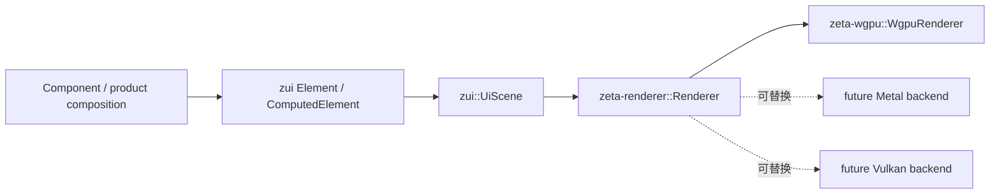

# UI 渲染架构

> 状态：当前实现。
> 本文拥有组件到图形后端之间的跨 crate 边界与替换规则。具体接口和实现细节分别见
> [`zui`](../zui/README.md)、[`zeta-ui`](../ui/README.md)、
> [`zeta-renderer`](../renderer/README.md) 与
> [`zeta-wgpu`](../wgpu/README.md)。

## 快速理解

组件声明“如何布局、画什么”，统一渲染接口决定“由哪个后端执行”，具体 GPU crate 才知道“如何提交”。
因此布局、组件检查器和产品交互不会因为 wgpu、Metal 或 Vulkan 实现替换而变化。

| 常见问题 | 当前行为 | 替换后端时是否改组件 |
| --- | --- | --- |
| 组件如何绘制矩形、文字、图标和图片？ | 向 `UiScene` 写入后端无关 primitive | ❌ |
| 谁执行一帧？ | product host 调用 `dyn Renderer` | ❌ |
| 谁接触 device、queue、shader 和 surface？ | 仅具体 backend crate | 不适用 |
| 当前后端是什么？ | `zeta-wgpu::WgpuRenderer` | 不适用 |
| 可以增加 raw Metal/Vulkan backend 吗？ | ✅，实现 `Renderer` 并替换 composition-root factory | ❌ |

## 边界与所有权

| 层 | 决定什么 | 明确禁止 |
| --- | --- | --- |
| Component / product | 状态、声明式 Element、primitive 顺序、clip 与 overlay | GPU handle、shader、backend feature、手写检查元数据 |
| `zui` | Element layout、immutable scene contract、logical coordinates、paint semantics、inspection 与有序 `SceneBatch` | 具体组件、`wgpu::*` 或其他图形 API |
| `zeta-ui` | 基于 `zui` 的 Button、ActionBar、TabList、ContextView 等可复用组件 | scene/backend ownership、产品状态 |
| `zeta-renderer` | target size、frame outcome、统一 backend error 与执行接口 | surface、window、pipeline、atlas |
| backend crate | physical conversion、batch execution、resource cache、shader、submit、present | 产品状态、组件 layout、输入路由 |
| product composition root | 选择并初始化 backend，实现类型擦除 | 把 backend 类型传播回组件或 scene |

布局检查器消费 `UiScene` 同步生成的 `InspectionFrame`。所有 `Component` 和产品 composition
surface 都先声明 zui Element；computed layout 自动生成尺寸、resolved padding、gap、radius、实际
gap regions、authored style 与声明位置。采集位于 backend 之前，所以切换 GPU API 不会改变结果。

`ShellPresentation` 由 `zui::UiFrame<InteractionFrame>` 作为单一 frame owner，再保存
accessibility projection；只有从该 frame 投影出的 `UiScene` 交给 `Renderer`。命中、焦点、cursor、
command dispatch 和 accessibility 不属于 GPU 协议，也不会因更换 backend 而重新实现。旧 Native split
host boundary 已删除；剩余 retained cleanup 和发布边界见
[`native-deprecation-plan.md`](native-deprecation-plan.md)。

## 当前执行流程

1. Component 通过 `UiScene::draw_component` 组合子组件；入口把必需的 `Component::element` 解析成
   一次 `ComputedElement`，同步用于自动 inspection 与 `paint_element`。拥有 content closure 的
   composition surface 使用 `UiScene::with_element` 进入同一管线。
2. `UiScene` 按 composition layer 与 primitive 插入顺序产生连续的 `SceneBatch`；不同 primitive
   类型之间的覆盖顺序不会被 backend 重排。
3. `ShellPresentation` 保存单一 frame owner 派生的 scene、inspection、interaction 与 accessibility
   snapshot，不获得任何 GPU 对象。
4. Host 只把 scene 传给 `Box<dyn Renderer>::render_scene`。
5. 当前 `renderer_backend::create` 选择 `WgpuRenderer`；只有该 adapter 知道具体类型。
6. `zeta-wgpu` 把 batch 对应的 logical primitive range 转为 physical instances/glyph buffers，按
   scene 顺序切换 pipeline、提交并 present。

当前 wgpu 在 macOS、Linux 和 Windows 上本身可以选择 Metal、Vulkan 或 DX12 backend；本文边界
解决的是更进一步的实现替换，例如绕过 wgpu 编写专用 Metal/Vulkan renderer。

## 长期不变量

- `zui` 不直接依赖或引用任何组件 crate、窗口系统或具体 GPU API；
- `zeta-ui` 只依赖 `zui`，不拥有 scene/backend contract；
- Component 只能产生 scene primitive，不接受 backend context；
- backend 不重新解释产品布局、组件身份或交互状态；
- primitive 的 back-to-front 顺序由 scene contract 决定，backend 不得按自身 pipeline 偏好重排；
- interaction/accessibility frame 不进入 `Renderer` 或具体 GPU crate；
- host 只依赖 `Renderer`，具体 backend 类型只出现在 composition root；
- backend-specific 优化不能污染 scene API，除非该能力对所有后端都有稳定语义。

`component_composition_tests::zui_contract_does_not_depend_on_a_gpu_backend_or_component_crate`
会扫描 `zui` manifest 和源码，阻止重新引入 `wgpu` 或反向依赖 `zeta-ui`；
`component_renderer_and_dispatch_crates_depend_on_zui_in_the_forward_direction` 固定依赖方向；
`gpu_backend_does_not_own_interaction_or_accessibility_frames` 阻止
input/accessibility ownership 漂入 backend。Rust 类型系统则保证 Native 的 renderer 字段只暴露 trait。

## 当前状态与演进

当前已完成 scene/backend 分离、ordered scene batching、presentation/interaction 与 GPU execution
分离、`Renderer` trait、wgpu adapter、Native trait-object ownership，以及 rect/image/icon/text
pipeline 从 `zui` 向 `zeta-wgpu` 的迁移。`zeta-ui` 当前兼容 re-export `zui` API，便于产品组件
逐步迁移 import；renderer、dispatch 与 backend 已直接依赖 `zui`。尚未实现 backend capability
negotiation、运行时热切换、raw Metal/Vulkan backend 或跨 backend golden-image 一致性测试。

新增 backend 时，应建立独立 crate、实现 `Renderer`、在 product composition root 替换 factory，
并针对 primitive、色彩空间、clip、layer、字体 fallback 与 surface recovery 建立一致性测试。
