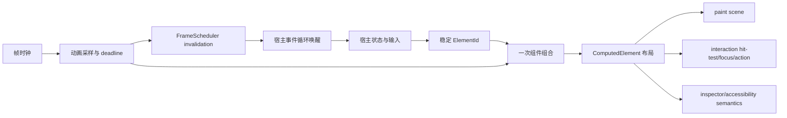

# ZUI 组件组合迁移

本文是 `zui` 组件组合迁移的系统级计划。`zui` 的实现契约见 [`zeterm/zui/README.md`](../zui/README.md)，Files/SCM 的产品组件见 [`zeterm/agent-sidebar`](../agent-sidebar)。app 宿主的渐进式弃用边界见 [`docs/native-deprecation-plan.md`](native-deprecation-plan.md)。本文拥有跨 crate 的边界、阶段和长期不变量；具体类型细节以源码和 crate README 为准。

## 快速理解

迁移的结果是：一个组件只组合一次，框架从这次组合同时得到布局、绘制、交互和 inspector 语义；动画由稳定组件身份和帧时钟驱动，不能再由组件各自安装定时器或维护第二套几何树。

| 常见问题 | 当前迁移结果 | 长期规则 |
| --- | --- | --- |
| inspector 为什么能深入到树项内部？ | Files 已经把 `FilesTreeItem`、Disclosure、Icon、Label 作为真实子组件组合 | inspector 跟随组件组合，不从绘制 primitive 反推节点 |
| 交互节点如何和 inspector 对上？ | 两者通过同一个 `ElementId` 对齐，边界来自同一个 `ComputedElement` | 组件身份不能用可变数组下标替代 |
| hover/selected 如何进入绘制？ | 组件读取宿主投影的当前状态，绘制与交互节点在同一次 frame 组合中生成 | 状态由产品模型拥有，样式由组件拥有，平台事件由宿主适配 |
| 滚动和虚拟化如何处理？ | `TreeView/ListView/ScrollView` 提供 frame 组合入口；绘制可保留 overscan，交互只注册可见项 | 可见范围、裁剪和 hit-test 必须共享同一份布局 |
| 动画如何工作？ | `AnimationRegistry` 按 `ElementId + property` 保留 track，`ComponentContext` 携带当前单调时钟 | 动画是跨帧状态层，聚合 deadline 后向帧调度器请求失效，不创建平台 timer |
| 迁移期间旧代码怎么办？ | 旧 split scene/interaction 宿主边界已删除 | 新组件走 `UiFrame::draw_component`；不保留组件级 `register_interactions` 或平行输出字段 |

一次组件帧的逻辑顺序是：



## 设计范围与非目标

迁移范围是 retained native UI 的组件组合边界：组件身份、布局、绘制、交互、语义、动画采样以及它们与宿主帧调度的连接。

以下内容不迁入 `zui` 的产品组件层：

- 文件系统、Git、会话、编辑器文档等权威业务状态；
- 平台事件、窗口事件循环、timer 安装和命令副作用；
- 产品特有的颜色、文案、业务 action 和数据加载；
- 通过 paint primitive 数量推断组件身份的 inspector 实现。

## 长期组件契约

“组件有五个输出面”仍然成立，但不是完整运行时模型。完整模型分成输出面、时间层和宿主生命周期三类：

| 层 | 解决的问题 | 所有者 | 是否生成独立树 |
| --- | --- | --- | --- |
| identity/tree | 这是谁、父子关系是什么、跨帧如何复用 | `zui` 契约，产品组件分配稳定 ID | 否，作为所有输出的共同骨架 |
| layout | 当前帧的边界、间距、可见范围 | `zui` 与通用 UI 组件 | 否 |
| paint | 当前帧画什么 primitive | 组件与 `UiScene` | 否 |
| interaction | hover、focus、hit-test、action、失效级别 | `zui` 交互节点与宿主分派 | 否 |
| semantics | inspector、accessibility role、label、selection、expansion | 组件声明，`zui` 收集 | 否 |
| animation/time | 状态如何随时间过渡、何时请求下一帧 | `zui` 动画原语；宿主唤醒 | 否，是跨帧输入层 |
| lifecycle/retention | mount、update、unmount、fragment 保留和退出动画 | 宿主与 `zui` retained runtime | 否，是帧之间的协调层 |

动画的关键约束：

- 动画键必须是稳定 `ElementId` 加属性身份，例如“某个 tree item 的 opacity”，不能使用本次可见数组中的 index；
- 组件只读取当前采样值并声明目标状态，不能创建线程、timer 或直接唤醒平台；
- `ScalarAnimation::next_deadline` 与 `FrameScheduler` 连接，动画变化通常请求 `Render`、`Fragment` 或 `Rebuild` 中最小的失效范围；
- 如果动画改变尺寸或位置，采样值必须先进入 layout，再由同一份 `ComputedElement` 驱动 paint、hit-test 和 semantics；只改变颜色或透明度时可以保持布局并走较小失效范围；
- 组件卸载时的 exit animation 属于 lifecycle/retention，不得让 inspector 保留一个已经不在当前语义树中的幽灵节点。

## 所有权与调用路径

| 对象 | 决定什么 | 执行什么 | 保存什么 |
| --- | --- | --- | --- |
| 产品模型/宿主 | 选择、展开、搜索、滚动、业务 action 和目标状态 | 将输入事件映射为模型更新 | 权威业务状态与 retained viewport |
| `Component` | 根元素、语义身份、交互节点和子组件组合 | 声明状态投影并调用子组件 | 不保存平台 timer；可读取宿主传入的 retained state |
| `ComponentContext`/`UiFrame` | 当前父链、frame clock 和共享输出边界 | 一次组合同时注册 inspection 与 interaction、写入 scene | 当前 frame 的临时输出 |
| `UiScene` | primitive 顺序、layer、clip 和 inspection 树 | 记录绘制与布局检查数据 | 当前 scene 及 retained fragment 边界 |
| `InteractionFrame` | 当前交互节点、祖先链和 focus scope | hit-test、focus、accessibility snapshot | 当前 frame 的交互节点 |
| `FrameScheduler` | 下一帧需要的最强失效级别 | 合并动画、输入和模型变化 | pending invalidation 与 fragment IDs |

典型调用路径如下：

1. 宿主把平台 pointer/key 事件投影到产品状态或 `UiDispatch`。
2. 宿主提供 retained animation binding 和显式时钟；组件以稳定 key 声明目标，runtime 返回当前采样值和下一次 deadline。
3. 组件以稳定 `ElementId` 创建 `ComponentElement`，通过 `ComponentContext::draw_component` 或
   `ComponentContext::with_component` 组合子组件与自定义 paint。
4. `ComputedElement` 只计算一次；同一个边界进入 scene paint、interaction node 和 inspection node。
5. 宿主从 `FrameScheduler` 获取失效等级，按 deadline 请求下一次平台 redraw。

## 当前实现状态

当前实现、迁移中内容和未来方向明确分开：

| 能力 | 当前状态 | 代码证据 |
| --- | --- | --- |
| Element identity | 已具备 | `ComponentElement::with_identity`、`ComputedElement::identity`、`InspectionNode::element_id` |
| 共享组件组合 | 已具备 | `ComponentContext`、`UiFrame::draw_component`；split adapter 仅用于迁移 |
| Files tree 深层 inspector | 已迁移 | `FilesTreeView`、`FilesTreeItem`、`FilesTreeDisclosure`、`FilesTreeIcon`、`FilesTreeLabel` |
| Files tree 与 toolbar 交互 | 已迁移 | `FilesPane`、`FilesToolbar`、`FilesTreeItem::interaction_node` |
| SCM 根与深层组件树 | 已迁移 | `EditorPane::interaction_node`、`MultiDiffEditor`、`MultiDiffSection`、`DiffEditor` 与 `CodeEditor` |
| 通用列表/树的 frame 组合 | 已具备 | `ScrollView::draw_components`、`ListView::draw_components`、`TreeView::draw_components` |
| 浮层与 modal 组件组合 | 已具备 | `ContextView/ContextMenu/Dropdown::*draw_components*`、`ComponentContext::set_modal_root` |
| Native overlay 迁移 | 已完成 | Session menu、workspace path picker、Git branch menu、keyboard shortcuts、settings page |
| Native file editor 迁移 | 已完成 | `FileEditorPane` 与独立 `file_editor_pane_interaction`；TabList、SearchBar、Notice、Document、CodeEditor 均进入组合 inspector |
| 标量动画与稳定 track | 已具备 | `ScalarAnimation`、`AnimationKey`、`AnimationRegistry`、`AnimationAdvanceReport` |
| 宿主 deadline 聚合 | 已具备 | `FrameDeadlineSet`；Native 的 `about_to_wait` 只负责投影到事件循环 |
| 动画自动绑定组件属性 | 当前产品接入已完成 | `AnimationBinding`、`ComponentContext::bind_scalar` 和 `AnimationRegistry` 已连通；Language Server switch 与 SCM fold height 都由 retained runtime 持有 track |
| 全 Native 迁移 | 主路径已完成，产品边界持续收敛 | 组件级 `register_interactions` 与 split host 已清零；Shell 宿主组合使用 `UiFrame`/`ComponentContext::with_component`，后续只允许新增产品语义，不得回写 framework runtime |
| Native split host 边界 | ✅ 已完成 | `ShellPresentation` 独占 `UiFrame<InteractionFrame>`；旧 split API 已删除 |
| Retained fragment lifecycle | 当前产品路径已闭合 | `RetainedRuntime` 聚合 `RetainedFragmentRegistry` 与 `AnimationRegistry`；NativeApp 已登记 Shell fragment、消费 removed IDs 并恢复 scene/interaction checkpoint；现有产品 fragment 明确采用即时 unmount，未来若需要退出视觉必须显式声明 exit spec |

## 分阶段迁移

### 阶段一：共享契约与兼容入口

目标是让新组件可以一次组合产生共享输出，同时不要求整个 Native shell 一次性重写。

- [x] 为 `ComponentElement` 和 `InspectionNode` 增加稳定身份连接；
- [x] 增加 `Component::interaction_node` 和 `Component::compose` 默认契约；
- [x] 增加 `ComponentContext`、`UiFrame` 和统一 frame composition 入口；
- [x] 清零 split scene/interaction 调用并删除旧兼容入口；
- [x] 将当前帧时钟传入组合上下文，保持动画原语不依赖平台 timer；
- [x] 为 animation property key、deadline 聚合和组件失效范围补充通用契约测试。

### 阶段二：Files 纵向切片

- [x] `FilesPane` 根节点通过同一 `ElementId` 对齐 inspector 与 interaction；
- [x] Tree row 使用真实组件组合，深入到 disclosure、icon、label；
- [x] `TreeView/ListView/ScrollView` 支持 context 组合，并保留裁剪和 scrollbar paint；
- [x] overscan 只服务 paint，交互节点限制在可见范围；
- [x] 用测试验证身份、边界、label、祖先链和可见行数。
- [x] Files toolbar 与 sidebar navigation 通过共享组合生成 root、action bar 和按钮节点。

### 阶段三：SCM 纵向切片

- [x] `EditorPane` 拥有自身 interaction root；
- [x] `MultiDiffEditor` 的 section、file header、fold control、scrollbar 改成真实子组件，并通过 `ComponentContext::draw_component` 生成共享 inspector/interaction 树；
- [x] `DiffEditor` 继续组合真实 `CodeEditor` 子组件，SCM 不再手工拼接 `UiNode` 子节点；
- [x] 将当前保留旧 fold 行为的 index-based identity 替换为 host-provided stable file identity，并为 diff section 的折叠动画定义 property key。

当前 SCM slice 已完成“结构迁移”与“跨列表重排的稳定身份”：`EditorPaneState` 按 changed-file path
分配 `MultiDiffEditorItemIdentity`，并在快照重排时复用对应的 `DiffEditorState`。section、header、diff body
和 fold control 都从同一 identity 派生；`fold_animation_key` 使用 section 的
`AnimationProperty::Height`。`MultiDiffEditor::fold_element_id` 仍保留原有 item/region 编码，供未迁移的
standalone caller 兼容，但产品 SCM 路径不再使用它。SCM host 已将目标 section height 通过
`ComponentContext::bind_scalar` 接入 retained `AnimationBinding`；由于高度会重新定位后续 section，动画使用
`FrameInvalidation::Rebuild`，而不是伪装成 fragment-local paint 更新。animation track 随 stable section identity
自动清理，不由 editor 组件保存动画对象。

### 阶段四：宿主收敛

- [x] Native `ShellPresentation` 以 `UiFrame` 作为内部唯一 frame owner；
- [x] 将剩余 `register_interactions` 调用迁移到 `interaction_node`/`compose`；
- [x] 删除组件级重复注册路径和 `draw_component_with_interaction` split host 兼容边界；
- [x] 将动画 deadline 聚合与 `FrameScheduler` 的最小失效等级接通，并提供 `ComponentContext::bind_scalar`；产品属性按 vertical slice 逐步声明绑定。

### 阶段五：生命周期与动画完善

- [x] 为 retained fragment 的 mount/update/unmount 固定 state owner、exit deadline 和 cleanup 时机；
- [x] 支持稳定 identity 下的标量属性动画、反向 retarget 和取消，并通过 `AnimationBinding` 让组件声明目标属性；
- [x] 固定 terminal fragment 移除、interaction checkpoint 恢复和 inspector ghost node 禁止规则；Shell 已接入 `removed_ids` cleanup，当前无退出视觉规格的产品 fragment 明确直接 unmount；
- [x] 为 lifecycle deadline 和 animation advance 增加 deterministic clock 测试，并覆盖 Shell/Files/SCM/overlay 的一帧结构回归。

## 验收不变量

后续任何组件迁移都必须满足：

- 一个可交互组件的 `UiNode.id` 与其 `ComputedElement.identity` 相同；
- interaction bounds、inspection bounds 和 paint 使用同一个 computed geometry，不复制计算公式；
- inspector 只出现当前组合树中的节点；overscan、缓存和退出动画不能制造可交互幽灵节点；
- 父链由组件组合上下文生成；跨宿主边界才允许组件显式指定 parent；
- 动画推进不直接调用平台 API；deadline 由宿主调度，采样值由组件消费；
- 产品状态、平台事件和副作用不进入 `zui` base/presentation 的通用契约；
- 迁移期间兼容入口不得与新组合路径同时注册同一 `ElementId`。

## 测试与发布

每个 vertical slice 至少包含三类测试：

- **结构契约**：检查 inspector 与 interaction 的 identity、bounds、label 和祖先链；
- **可见性契约**：检查虚拟化、clip、overscan 不改变可交互范围；
- **状态/时间契约**：检查 selected/hovered/focus 和动画在显式时钟下的采样、失效和完成状态。

当前阶段的最小验证入口：

```text
cargo test -p zui --lib
cargo test -p zeta-ui --lib
cargo test -p zeta-keybinding --lib
cargo test -p zeta-settings --lib
cargo test -p zeta-agent-sidebar --lib
cargo test --manifest-path Cargo.toml -p zeterm layout_inspector
cargo test --manifest-path Cargo.toml -p zeterm file_editor_pane
cargo test --manifest-path Cargo.toml -p zeterm shell_scene
```

Native 后续统一 `UiFrame` 前，先保持各 vertical slice 的 targeted tests 通过；任何一条路径产生重复 `ElementId`、不同 bounds 或不同 parent，都视为迁移阻断问题。
