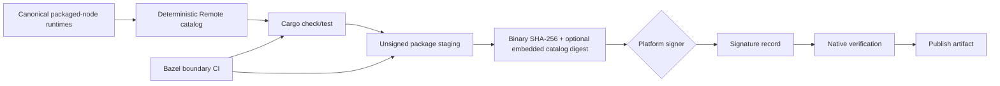

# `zeterm` 发布图与产品边界

本文拥有 `zeterm` 的 package staging、签名顺序和 CI contract；源码 owner 与 workspace 迁移见
[`zeterm-app-migration-plan.md`](zeterm-app-migration-plan.md)，zeterm crate 的实现 owner 见
[`zeterm/README.md`](../README.md)。

## 快速理解

根 `Cargo.toml` 是唯一 canonical Cargo build graph；`zeterm/Cargo.toml` 仍是 `zeterm` 产品 package
和发布边界。Bazel 只读取同一个 root `Cargo.toml/Cargo.lock`，通过单一 `@crates` hub 生成 zeterm
owned crates、shared backend crates 和 `zeterm` 的 target graph，不再需要跨 workspace metadata
patch 或重复 product hub。

`zeterm/` 与 `zeta-rs/` 仍保持物理目录和依赖 ownership 分离：zeterm 可以依赖 shared backend，shared
backend 不得依赖 zeterm/UI。workspace 是统一构建图，不替代产品架构边界；boundary script 和 CI
继续验证反向依赖不会出现。

| 层 | 当前 owner | 入口 | 状态 |
| --- | --- | --- | --- |
| Rust compile/test | Root Cargo workspace / zeterm package | `cargo check/test --manifest-path Cargo.toml -p zeterm` | ✅ |
| Source/manifest input graph | Bazel zeterm package | `//zeterm:zeterm_sources` | ✅ |
| Zeterm Rust target graph analysis | Bazel + patched `rules_rs` | `//zeterm:zeterm` | ✅ |
| Package/signing input contract | `zeterm/packaging/*.json` | `//zeterm:zeterm_release_inputs` | ✅ |
| Unsigned package staging | `scripts/build_zeterm_package.py` | `just zeterm-package` | ✅ |
| Workspace boundary CI | Bazel | `bazel test //zeterm:zeterm_ci` | ✅ |
| Platform signing and verification | `scripts/release_zeterm_package.sh` | policy file中的 native tool | ✅ 已接入 provider-neutral job |
| Hermetic Bazel Rust compile graph | `rules_rs` + single `@crates` hub | `//zeterm:zeterm` | ✅ 完整 zeterm binary build 已通过 |

### 根级 Bazel 基础设施

当前根级 Bazel 层只拥有仓库通用的构建边界，不拥有具体产品的业务组合：

- [`MODULE.bazel`](../../MODULE.bazel) 固定 `rules_rs`、LLVM Rust toolchain、hermetic macOS SDK 和系统 Framework；
- [`.bazelrc`](../../.bazelrc) 禁止探测本机 Xcode，并按宿主系统选择 Linux/Windows 的 platform constraint；
- [`BUILD.bazel`](../../BUILD.bazel) 提供 `//:zeta` 产品入口、`disable_xcode` 和宿主 platform 定义；
- `zeterm/BUILD.bazel`、`zeta-code/BUILD.bazel` 和各 crate 的 `BUILD.bazel` 继续拥有各自产品/ crate target。

当前不引入 Codex 专属的 RBE、Wine 或 workspace-root test launcher。RBE 需要真实的远程执行/缓存后端和 CI 凭证；
Wine 只有在 Linux 主机交叉运行 Windows 测试时才有价值；专用 launcher 只有在测试需要 Codex 式 workspace-root、runfiles
环境或特殊变量时才应增加。它们属于后续 CI 能力，不是本地 hermetic 构建的前置条件。

## 阶段顺序



### 1. Build

所有 zeterm-owned crate 和 shared backend 通过根 `Cargo.toml` 解析。Bazel 的 `//zeterm:zeterm` 使用同一份
Cargo metadata-derived dependency graph；package builder 只接受 Cargo 生成的 `zeterm` binary 或
从 zeterm package 构建它，它不从 `zeta-rs` 的旧 Native target 取 binary。

### 2. Stage

```bash
just zeterm-package \
  --package-dir /absolute/path/to/zeterm-package \
  --zeterm-bin /absolute/path/to/zeterm
```

不需要 standalone Remote 自动安装时输出最小目录：

```text
zeterm-package/
├── bin/zeterm
├── zeterm-package.json
└── zeterm-signing-policy.json
```

`zeterm-package.json` 固定 product、target、profile、binary path 和 SHA-256；staging 拒绝覆盖已有
目录，并把状态标成 `unsigned`。这一步不取得密钥、不签名，也不宣称 artifact 可发布。

需要支持只安装 zeterm 的用户时，先运行 `scripts/build_remote_runtime_bundle.py`，输入一个或多个
canonical packaged-node Zeta package directory，再给 staging 追加
`--remote-runtime-bundle <bundle>`。builder 将 catalog SHA-256 通过
`ZETERM_REMOTE_RUNTIME_CATALOG_SHA256` 编译进 zeterm，并输出：

```text
zeterm-package/
├── bin/zeterm
├── zeta-remote-runtimes/
│   ├── catalog.json
│   └── artifacts/zeta-<target>.tar.gz
├── zeterm-package.json
└── zeterm-signing-policy.json
```

staging 拒绝未包含 catalog digest 的 binary；sign/verify 再验证 binding，signature record 记录同一
catalog digest。由此平台签名认证 binary，binary 认证 catalog，catalog 认证每个 runtime archive。

也可以生成不携带 runtime archive 的网络包：

```bash
just zeterm-package \
  --package-dir /absolute/path/to/zeterm-package \
  --remote-runtime-catalog-url https://releases.example/zeta/<version>/catalog.json \
  --remote-runtime-catalog-sha256 <catalog-digest>
```

此时 builder 把 URL 和摘要同时编译进 binary，`zeterm-package.json` 记录
`url + sha256 + compiledIntoSignedBinary`，sign/verify 检查两者都存在于签名 artifact。package 不含
`zeta-remote-runtimes/`；运行时由本机 updater 下载并完整验证，远端主机仍不联网取包。

### 3. Sign 与 verify

`zeterm/packaging/zeterm-signing-policy.json` 是 release job 的输入，不是开发机默认行为：

- macOS 使用 `codesign` 和 `ZETERM_MACOS_SIGNING_IDENTITY`，验证后再打包/公证；
- Linux 使用 `cosign sign-blob`，签名文件和 binary digest 一起进入 provenance artifact；
- Windows 使用 `signtool` 和 `ZETERM_WINDOWS_CERTIFICATE`，验证 Authenticode chain；
- 签名 job 只能读取 staging 输出，不能重建 binary；verify job 必须重新计算 digest，并检查与
  `zeterm-package.json`、signature record 一致；
- 声明本地 Remote bundle 时，sign/verify 必须重新验证 catalog、archive 和 binary 内嵌 digest；
- 声明网络 Remote catalog 时，sign/verify 必须验证无凭据 HTTPS URL、catalog digest 以及 binary 内嵌
  的 URL/digest；
- 本地 unsigned package 只用于开发和测试，release job 必须拒绝 `signing.status != verified`。

密钥、证书和 token 不进入仓库，不由 Bazel rule 参数传递；CI secret store 和平台 signer 是发布
系统 owner。签名证明来源和完整性，不替代运行时安全审查。

provider-neutral job 入口是：

```bash
ZETERM_PACKAGE_DIR=/absolute/path/to/zeterm-package \
ZETERM_PLATFORM=darwin \
ZETERM_REMOTE_RUNTIME_BUNDLE=/absolute/path/to/remote-runtimes \
ZETERM_MACOS_SIGNING_IDENTITY="Developer ID Application: ..." \
scripts/release_zeterm_package.sh
```

网络包改用 `ZETERM_REMOTE_RUNTIME_CATALOG_URL` 与
`ZETERM_REMOTE_RUNTIME_CATALOG_SHA256`，两者必须同时存在。

Linux 使用 `ZETERM_COSIGN_IDENTITY` 指向 cosign key，Windows 使用
`ZETERM_WINDOWS_CERTIFICATE` 指向 CI 证书文件或证书存储标识。脚本只把 identity 传给 native signer，
不写入 metadata 或 signature record；CI provider
负责把这些变量绑定到 secret store。脚本完成后，`zeterm-package.json` 和
`zeterm-signature.json` 都必须是 `verified` 状态，才允许进入 publish step。

## CI 契约

当前已经可以在没有平台签名环境的机器上验证结构：

```bash
bazel test //zeterm:zeterm_ci
```

`//zeterm:zeterm_ci` 同时运行 workspace boundary、package staging、release contract 和 signing state
transition tests。

具体 CI provider 只需要把上面的 Build → Stage → Sign → Verify → Publish 节点接入 secret store；
不要把密钥逻辑写入 `zeterm/src`、`zui` 或通用 Bazel Rust macro。
